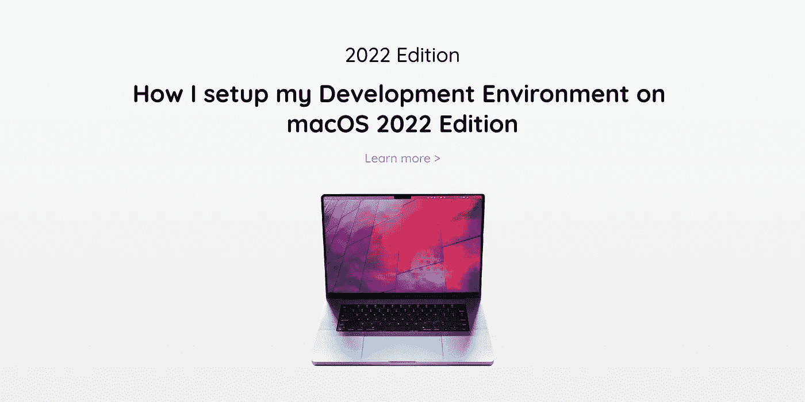

# 我如何在 macOS 2022 Edition 上设置开发环境

> 原文：<https://javascript.plainenglish.io/how-i-setup-my-development-environment-on-macos-2022-edition-e8a045b6a1d0?source=collection_archive---------2----------------------->

## 我的开发设置在 macOS 2022 上。



## **当前软件开发商技术堆栈 2022**

前端:HTML，CSS，JavaScript，TypeScript，React，React Native，Redux

后端:Python，NodeJS，C#，SQL，NoSQL，Docker

# 传输文件

安装新电脑时，我总是喜欢全新安装。使用云备份解决方案来恢复数据，或者使用外部存储设备将文件传输到新计算机。

# 安装 Web 浏览器

*   [勇敢](https://brave.com/)
*   [谷歌浏览器](https://www.google.com/intl/en_uk/chrome/)
*   [谷歌 Chrome 金丝雀](https://www.google.com/intl/en_uk/chrome/canary/)
*   [火狐](https://www.mozilla.org/en-GB/firefox/new/)
*   [火狐开发者版](https://www.mozilla.org/en-GB/firefox/developer/)
*   [火狐每夜](https://www.mozilla.org/en-GB/firefox/channel/desktop/)
*   [微软 Edge](https://www.microsoft.com/en-us/edge)
*   [Safari 技术预览](https://developer.apple.com/safari/technology-preview/)
*   [Tor 浏览器](https://www.torproject.org/download/)

# 安装网络浏览器扩展(chromium)

*   比特监狱长
*   [ColorZilla](https://chrome.google.com/webstore/detail/colorzilla/bhlhnicpbhignbdhedgjhgdocnmhomnp)
*   [daily.dev](https://chrome.google.com/webstore/detail/dailydev-the-homepage-dev/jlmpjdjjbgclbocgajdjefcidcncaied)
*   [JSON 查看器](https://chrome.google.com/webstore/detail/json-viewer/gbmdgpbipfallnflgajpaliibnhdgobh)
*   [灯塔](https://chrome.google.com/webstore/detail/lighthouse/blipmdconlkpinefehnmjammfjpmpbjk)
*   [气势](https://chrome.google.com/webstore/detail/momentum/laookkfknpbbblfpciffpaejjkokdgca)
*   [React 开发者工具](https://chrome.google.com/webstore/detail/react-developer-tools/fmkadmapgofadopljbjfkapdkoienihi)
*   [Redux 开发工具](https://chrome.google.com/webstore/detail/redux-devtools/lmhkpmbekcpmknklioeibfkpmmfibljd)
*   [口袋](https://chrome.google.com/webstore/detail/save-to-pocket/niloccemoadcdkdjlinkgdfekeahmflj)
*   [uBlock 原点](https://chrome.google.com/webstore/detail/ublock-origin/cjpalhdlnbpafiamejdnhcphjbkeiagm)
*   [视频下载助手](https://chrome.google.com/webstore/detail/video-downloadhelper/lmjnegcaeklhafolokijcfjliaokphfk)
*   [Wappalyzer](https://chrome.google.com/webstore/detail/wappalyzer-technology-pro/gppongmhjkpfnbhagpmjfkannfbllamg)
*   [网络开发者](https://chrome.google.com/webstore/detail/web-developer/bfbameneiokkgbdmiekhjnmfkcnldhhm)

# 安装软件

我会安装我使用的所有应用程序，包括个人和开发者相关的应用程序。我将只包括开发者应用程序，因为它们在本指南中更相关。

*   [Adobe CC](https://www.adobe.com/uk/)
*   [安卓工作室](https://developer.android.com/studio?gclid=CjwKCAiA6Y2QBhAtEiwAGHybPTTF6mpurPpUq-hlu7vquMnAkoaWuUX4w51Anb19wMDuxkItdThqlBoCQr8QAvD_BwE&gclsrc=aw.ds)
*   [比特狱长](https://bitwarden.com/)
*   [居中](https://www.centered.app/)
*   [柏树](https://www.cypress.io/)
*   [不和](https://discord.com/)
*   [码头工人](https://www.docker.com/)
*   图玛
*   [Hyper](https://hyper.is/)
*   [项目 2](https://iterm2.com/)
*   [微软 Office](https://www.microsoft.com/en-gb/microsoft-365/microsoft-office)
*   [微软团队](https://www.microsoft.com/en-gb/microsoft-teams/group-chat-software)
*   [MongoDB 罗盘](https://www.mongodb.com/products/compass)
*   [观念](https://www.notion.so/)
*   [黑曜石](https://obsidian.md/)
*   [皮查姆](https://www.jetbrains.com/pycharm/)
*   [懈怠](https://slack.com/intl/en-gb/)
*   [Todoist](https://todoist.com/home)
*   [特雷罗](https://trello.com/en-GB)
*   [瓦伦蒂娜工作室](https://www.valentina-db.com/en/)
*   [Visual Studio](https://visualstudio.microsoft.com/)
*   [Visual Studio 代码](https://code.visualstudio.com/)
*   [Xcode](https://apps.apple.com/gb/app/xcode/id497799835?mt=12)
*   [缩放](https://zoom.us/)

# 安装软件包管理器

*   Hombrew
*   npm
*   点

# Hombrew

[https://brew.sh/](https://brew.sh/)

**M1 苹果电脑**
在安装家酿之前，你需要为新的 ARM 芯片(M1 芯片)安装 Rosetta2 仿真器。使用终端安装 Rosetta2:

```
/usr/sbin/softwareupdate --install-rosetta --agree-to-license
```

使用上面的代码安装 Rosetta2 后，您可以使用 Homebrew cmd 并安装 ARM M1 芯片的 Homebrew。

```
arch -x86_64 /bin/bash -c "$(curl -fsSL https://raw.githubusercontent.com/Homebrew/install/master/install.sh)"
```

一旦安装了适用于 M1 ARM 的 Homebrew，请使用此 Homebrew 命令来安装软件包:

```
arch -x86_64 brew install <package>
```

## 安装软件包

*   Hombrew 会自动为您安装指向自制 Python 3 的 Pip。

使用 brew 安装以下软件包

```
brew install tree (It allows you to view all files in a tree view)
brew install ruby
brew install git
brew install python
brew install kotlin
brew install postgresql
brew install yarn --without-node
brew tap heroku/brew && brew install heroku
brew install deno
brew install watchman
```

**安装 oh-my-zsh**

ZSH 已经预装在最新版本的 macOS 中。我还安装了[https://ohmyz.sh/](https://ohmyz.sh/)，因为它允许更多的配置，并且在某些情况下是必需的。

```
sh -c "$(curl -fsSL https://raw.github.com/ohmyzsh/ohmyzsh/master/tools/install.sh)"
```

使用命令行显示所有隐藏的文件，因为默认情况下，您正在搜索的文件将被隐藏。

```
defaults write com.apple.Finder AppleShowAllFiles true
killall Finder
```

安装下面的我的 Zsh 插件

```
brew install zsh-autosuggestions
brew install zsh-syntax-highlighting
```

要激活插件，请在您的。zshrc:

```
source /usr/local/share/zsh-autosuggestions/zsh-autosuggestions.zsh
source /usr/local/share/zsh-syntax-highlighting/zsh-syntax-highlighting.zsh
```

您还需要强制重新加载您的。zshrc:

```
source ~/.zshrc
```

如果您收到“找不到荧光笔目录”错误消息，您可能需要将以下内容添加到您的。zshenv:

```
export ZSH_HIGHLIGHT_HIGHLIGHTERS_DIR=/usr/local/share/zsh-syntax-highlighting/highlighters
```

**MongoDB 安装和设置**

[https://stack overflow . com/questions/57856809/installing-MongoDB-with-home brew](https://stackoverflow.com/questions/57856809/installing-mongodb-with-homebrew)

1)安装 Xcode 命令行工具和来自[https://brew.sh/#install](https://brew.sh/#install)的自制工具

```
xcode-select --install
```

2)点击 MongoDB 自制软件点击:

```
brew tap mongodb/brew
```

3)在 macOS 终端中验证安装先决条件:

```
brew tap | grep mongodb
```

4)安装 MongoDB

```
brew install mongodb-community@4.4
```

5)最后，要将 MongoDB(即 mongod 进程)作为 macOS 服务运行，发出以下命令

```
brew services start mongodb-community@4.4
```

6)下载并安装 MongoDB 指南针[https://www.mongodb.com/try/download/compass](https://www.mongodb.com/try/download/compass)

使用命令`brew list`查看所有已安装的软件包。

# npm

通过 nvm 安装 node，因为`nvm`允许您通过命令行快速安装和使用不同版本的 node。

[https://github.com/nvm-sh/nvm](https://github.com/nvm-sh/nvm)

## 全局安装软件包

```
npm i -g @aws-amplify/cli
npm i -g @sanity/cli
npm i -g babel-cli
npm i -g eslint
npm i -g expo-cli
npm i -g firebase-tools
npm i -g gatsby-cli
npm i -g jest
npm i -g lighthouse
npm i -g netlify-cli
npm i -g newman
npm i -g node-sass
npm i -g parcel-bundler
npm i -g pm2
npm i -g prettier
npm i -g serve
npm i -g spaceship-prompt
npm i -g surge
npm i -g typescript
npm i -g update
npm i -g vercel
npm i -g yarn
```

使用命令`npm list -g --depth 0`查看所有已安装的软件包。

# 点

## 安装软件包

根据您的系统使用命令`pip`或`pip3`进行安装。

```
pip3 install astroid
pip3 install autopep8
pip3 install certifi
pip3 install chardet2
pip3 install click
pip3 install Flask
pip3 install Flask-Cors
pip3 install harperdb
pip3 install idna
pip3 install isort
pip3 install itsdangerous
pip3 install Jinja
pip3 install lazy-object-proxy
pip3 install MarkupSafe
pip3 install mccabe
pip3 install psycopg2
pip3 install psycopg2-binary
pip3 install pycodestyle
pip3 install pylint
pip3 install python-dotenv
pip3 install requests
pip3 install setuptools
pip3 install six
pip3 install toml
pip3 install urllib3
pip3 install Werkzeug
pip3 install wrapt
```

使用命令`pip3 list`或`pip list`查看所有已安装的软件包

## 更新 Python 包

Pip 可用于升级所有软件包:

1)将已安装软件包的列表输出到需求文件(requirements.txt)中:

```
pip freeze > requirements.txt
```

2)编辑 requirements.txt，并使用编辑器中的“全部替换”命令将所有`==`替换为`>=`。
3)升级所有过时的软件包:

```
pip install -r requirements.txt --upgrade
```

# 反应本机设置

[https://expo.io/](https://expo.io/)

# 设置 BASH 应用程序、代码编辑器和 IDE

我目前在 Visual Studio 代码、Visual Studio、Android Studio、PyCharm 以及 Hyper 和 iTerm 2 中使用 [dracula](https://draculatheme.com/) 主题。

# 字体

对于字体，我用的是 Jebrains Mono。

[https://www.jetbrains.com/lp/mono/](https://www.jetbrains.com/lp/mono/)

# 超级终端

**安装插件，定制**

```
hyper i hypercwd
hyper i hyper-snazzy
hyper i hyper-dracula// default font size in pixels for all tabs
    fontSize: 16,// font family with optional fallbacks
    fontFamily: 'JetBrains Mono, Menlo, "DejaVu Sans Mono", Consolas, "Lucida Console", monospace',
```

# 可视化工作室

下载并安装最新版本的 [NET，包括 ASP.NET 核心](https://dotnet.microsoft.com/en-us/download)。

# Visual Studio 代码

如果这是你第一次使用 Visual Studio 代码，那么做一个全新的安装，并按照你的意愿进行配置。否则，使用内置的[设置同步](https://code.visualstudio.com/docs/editor/settings-sync)功能来同步先前设置的设置。

## 我使用的 Visual Studio 代码扩展

我目前安装了 41 个扩展。

[美化 css/sass/scss/less](https://marketplace.visualstudio.com/items?itemName=michelemelluso.code-beautifier)
[更好评论](https://marketplace.visualstudio.com/items?itemName=aaron-bond.better-comments)
[C#](https://marketplace.visualstudio.com/items?itemName=ms-dotnettools.csharp)
[着色](https://marketplace.visualstudio.com/items?itemName=kamikillerto.vscode-colorize)
[数据工作区](https://marketplace.visualstudio.com/items?itemName=ms-mssql.data-workspace-vscode)
[Docker](https://marketplace.visualstudio.com/items?itemName=ms-azuretools.vscode-docker)
[DotENV](https://marketplace.visualstudio.com/items?itemName=mikestead.dotenv)
[Dracula 官方](https://marketplace.visualstudio.com/items?itemName=dracula-theme.theme-dracula)
[EJS 语言支持](https://marketplace.visualstudio.com/items?itemName=DigitalBrainstem.javascript-ejs-support)
[ES7+React/Redux/React-Native 片段](https://marketplace.visualstudio.com/items?itemName=dsznajder.es7-react-js-snippets)
[ESLint](https://marketplace.visualstudio.com/items?itemName=dbaeumer.vscode-eslint)
[Excel Viewer](https://marketplace.visualstudio.com/items?itemName=GrapeCity.gc-excelviewer)

[Jupyter 笔记本渲染器](https://marketplace.visualstudio.com/items?itemName=ms-toolsai.jupyter-renderers)
[Live 服务器](https://marketplace.visualstudio.com/items?itemName=ritwickdey.LiveServer)
[markdownlint](https://marketplace.visualstudio.com/items?itemName=DavidAnson.vscode-markdownlint)
[材质图标主题](https://marketplace.visualstudio.com/items?itemName=PKief.material-icon-theme)
[MDX](https://marketplace.visualstudio.com/items?itemName=silvenon.mdx)
[MongoDB for VS 代码](https://marketplace.visualstudio.com/items?itemName=mongodb.mongodb-vscode)
[NPM](https://marketplace.visualstudio.com/items?itemName=eg2.vscode-npm-script)
[NPM 智能感知【T77 紫色的](https://marketplace.visualstudio.com/items?itemName=christian-kohler.npm-intellisense)
[SQL 数据库项目](https://marketplace.visualstudio.com/items?itemName=ms-mssql.sql-database-projects-vscode)
[SQL Server(MSSQL)](https://marketplace.visualstudio.com/items?itemName=ms-mssql.mssql)
[SVG](https://marketplace.visualstudio.com/items?itemName=jock.svg)
[迅雷客户端](https://marketplace.visualstudio.com/items?itemName=rangav.vscode-thunder-client)
[ts lint](https://marketplace.visualstudio.com/items?itemName=ms-vscode.vscode-typescript-tslint-plugin)
[vs code-styled-components](https://marketplace.visualstudio.com/items?itemName=styled-components.vscode-styled-components)

现在你知道了。感谢您的阅读。

*更多内容请看*[***plain English . io***](http://plainenglish.io/)*。报名参加我们的**[***免费周报***](http://newsletter.plainenglish.io/) *。在我们的* [***社区获得独家访问写作机会和建议***](https://discord.gg/GtDtUAvyhW) *。**