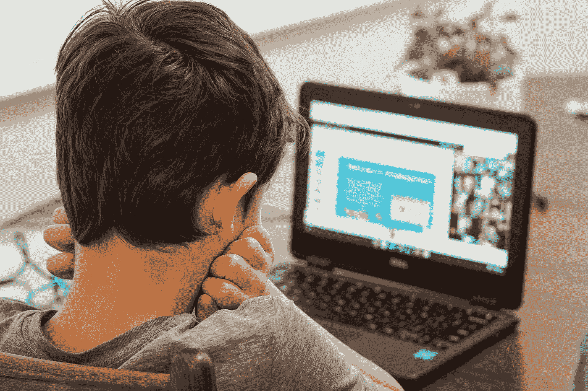

# 我将如何在我儿子很小的时候教他编程

> 原文：<https://javascript.plainenglish.io/how-i-would-teach-my-son-to-program-at-a-very-young-age-a41155c296e6?source=collection_archive---------9----------------------->

## 我会教他看到模式和抽象。

Photo by [Thomas Park](https://unsplash.com/@thomascpark?utm_source=medium&utm_medium=referral) on [Unsplash](https://unsplash.com?utm_source=medium&utm_medium=referral)

我的儿子还太小，学不了比简单的单词更复杂的东西，但我已经有了一个计划，主要是基于我自己的经验——我有什么让我成为程序员，我没有什么，以及什么可以让我成为更好的开发人员。当然，正如一些人之前提到的，没有什么是力量！但是你需要尽早开始。

# **1。我会教他看模式和抽象**

当然，我不是在说让孩子明白它是如何工作的，代理模式是如何构建的，而是简单的依赖关系，例如

*   将物体(狗、树、椅子、小猫、老鼠)与不同的组(动物、植物、家具)相匹配

这种对抽象的感知极大地发展了分析思维，此外，它几乎不需要任何道具或准备，分组的方法只受我们创造力的限制。一个额外的优势是，我们大多数人都不知不觉地与孩子进行这些练习。

# **2。我会给他买几套乐高积木**

这些砖块的优点我就不做过多阐述了，我就关注一下拼装乐高套装的一个方面。为此，你不需要有创造力或者特别聪明。只要一步一步地按照手册上的内容做就行了。

一个重要的因素是**根据说明组装积木教会你像机器一样思考**。当然，创造性是成为程序员的一个重要因素，但如果不了解机器是如何工作的，我们就很难走得更远，我们的创造力也不会有太大帮助。

当我们处于创造力阶段时——有时把说明书放在一边，和你的孩子一起做一些很酷的东西。当你一起创造一个教育，这是一个项目。

# **3。我会用数字驯服他**

当然，我不会从积分甚至乘法表开始。

首先，学习每个数字叫什么(一，二，三)，这样你就可以在这方面进行交流。类似地，你可以通过给出一些参考点来教授这些数字的含义(狗有四只脚，围栏里有三只羊，瓢虫有七个斑点)。

*   下一步是教你的孩子数字之间的关系——哪个更重要，哪个更不重要。
*   稍后你可以继续做加法和减法。
*   提出零和负数的概念。
*   小数字的乘法。

这一切都是为了在孩子上学之初，只是一次重复，而不是一次碰壁。当谈到为学龄前儿童做准备时，那就是了。但不止于此。注意到目前为止我们连电脑都没碰过(嗯，可能是为了订砖)。

# **4。我会确保我的孩子在学校没有数学问题**

如果在教育的任何阶段出现数学问题，它很可能会导致更多的数学问题和几乎所有科学学科的问题。

当一个孩子认定自己是‘人文主义者’(也就是用今天的理解，一个不懂数学的人)时，所有迄今为止的努力都将付之东流，他将成为社会学家而不是程序员)

说真的，继续关注。也许数学问题不会取消程序员的职业生涯，但是没有这些问题肯定会有助于更容易地获得进一步的知识。

如果你在数学上没有问题——在课上和你的孩子坐下来，看看他是否有任何不足；也许有些东西需要更详细地解释。然而，如果你有问题——考虑请一位家庭教师。

# **5。我会教他数学逻辑**

是的，我知道数理逻辑是高中的材料，但在其基本形式上，这是一个足够简单的部分，一个更男性化的 10 岁孩子可以轻松处理它。

说明真假的想法(严格，不主观)。说明有些句子的逻辑值可能是不可确定的。

介绍否定、选择、连接、蕴涵、等价运算符和一些简单的定律。和孩子一起练习确定重复复合句的逻辑值。

一旦现有的材料不复杂了，就继续——重言式、逻辑函数、量词——尽管我会把这些材料留到以后，可能是在小学结束的时候。

# **6。我会教他一些简单的编程语言**

所以我们终于进入正题了！对我来说，第一语言是 Logo。这是一种简单的语言，通过编程控制海龟来绘制简单的形状。有编辑和翻译的课程可以在海龟学院找到。

你也可以为乐高积木投资电子产品，虽然我不知道这个乐高编程是怎么回事。酷毙了。

# **7。我会向他展示更复杂的工具和语言**

首先，我建议给你的孩子看 Python。PyCharm 是一个非常酷的免费 Python 工具。网上有很多可用的课程，但我的注意力被吸引到了《面向儿童的 Python》——这是一门从零开始到创建一个工作游戏的课程。我为我的未婚妻买了这本书，但由于时间不够，这本书最终被放在了书架的最深处，里面有一些值得一读的东西。

# **8。下一步是什么？**

理论上，懂 Python，孩子就已经可以编程了。然而，如果他想将自己的未来与编程联系起来，那么学习一门语言(毕竟 Python 只是通往 Java 的一步)、良好的实践(这里我推荐 Clean Code book——每个程序员的必备)、设计模式都是值得的。在这里，其实都取决于你想往哪个方向发展。

如果他毕业后想上大学，值得暗示的是，他必须开始从事程序员的工作。一个学生在学术城市找这个专业的工作应该没问题。

一开始，钱并不是最好的——有时从财务上来说，在建筑工地或酒吧开始财务工作会更好，但在这个阶段，获得职业经验才是最重要的。

同样值得研究的是，哪些公司在开发项目中提供工作，并非常重视良好的实践，这些实践是对过时技术的混乱修补。后者应该避免，至少在最初，以免学到不好的技术。

*更多内容请看*[***plain English . io***](https://plainenglish.io/)*。报名参加我们的* [***免费周报***](http://newsletter.plainenglish.io/) *。关注我们关于*[***Twitter***](https://twitter.com/inPlainEngHQ)*和*[***LinkedIn***](https://www.linkedin.com/company/inplainenglish/)*。查看我们的* [***社区不和谐***](https://discord.gg/GtDtUAvyhW) *加入我们的* [***人才集体***](https://inplainenglish.pallet.com/talent/welcome) *。*