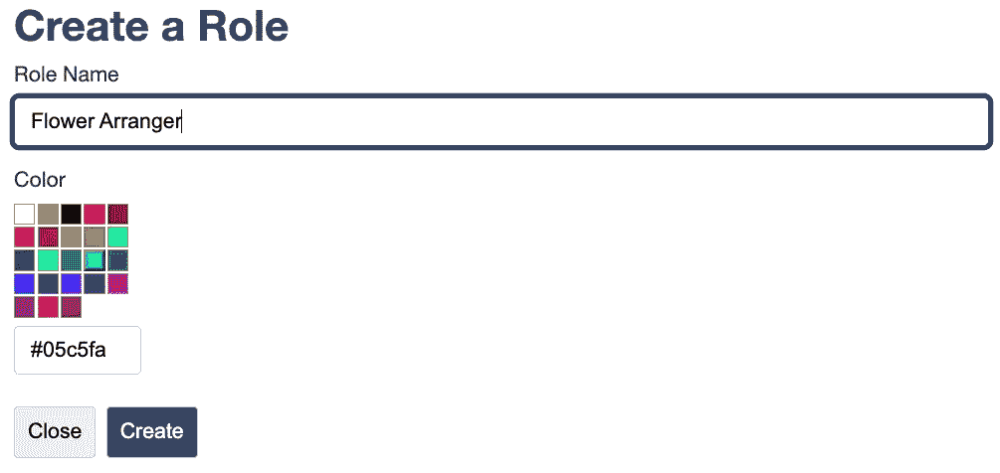

# 我如何用普通的 JavaScript 和 CSS 编写一个颜色选择器

> 原文：<https://javascript.plainenglish.io/how-i-wrote-a-color-picker-in-vanilla-javascript-and-css-7a6afd7618fd?source=collection_archive---------9----------------------->

## 下面是我如何只用普通的 JavaScript 和 CSS 构建一个颜色选择器，而没有使用任何 JavaScript 框架。

今天，我在为一个 web 应用程序中的管理用户构建一个表单来定义用户角色。在该表单上，用户可以输入角色的名称，并选择与角色相关联的颜色。我一直在用老式的 JavaScript 和 CSS 构建这个应用程序。看，妈妈！没有 JavaScript 框架！

Screenshot of the admin screen I was working on

在这个截图中，你可以看到我写的颜色选择器。它很简单，并没有任何真正的铃铛或哨子，但它的工作，它可以与我的表格一起提交。哦，我提到过它是用普通的 JavaScript 和 CSS 构建的吗？😀

让我们来看看如何构建它。首先，我们将确定我们的特征。

1.  将其构建为一个 [Web 组件](https://developer.mozilla.org/en-US/docs/Web/Web_Components)
2.  显示用户可以选择的颜色网格。选择后，附加的文本框将填充十六进制颜色代码
3.  允许组件用户提供他们的颜色列表，但也有一组缺省值，以防没有提供颜色
4.  允许组件用户提供名称，以便可以在表单中使用颜色选择器
5.  允许组件用户提供预先选择的颜色

考虑到这些需求，让我们从组件外壳开始，并获得基本的属性。

在上面的代码中，我们已经建立了启动新的颜色选择器 web 组件的框架。第一个变量`this._color,` 将检索一个名为**颜色**的属性。如果不存在，默认为空。这可以由调用者设置，因此颜色选择器将预先选择一种颜色。第二个变量将从名为 **colors** 的属性中获取值，或者如果为空，将填充一组默认颜色(以逗号分隔)。后来，在第 9 行，我们把它们分成一个数组。我们还有`this._name`，如果没有提供名称属性，它默认为“color”。

现在让我们创建一些函数，这些函数将用于构造构成颜色选择器的元素。为此，我们将从外部容器开始。在这个容器中将是另一个用于颜色网格的容器，然后是一个输入元素。

上述代码具有以下功能:

*   创建一个外部容器来存放我们的项目
*   创建一个网格容器来保存颜色样本
*   创建单个颜色样本项目
*   创建输入元素

现在在我们的构造函数中，我们可以调用这些方法来组装元素并将它们添加到 DOM 中。

第 10–16 行要看的新东西。我们首先调用函数来创建元素。在第 14 行和第 15 行，我们向外部容器添加了颜色网格和输入元素。然后在第 16 行，我们将整个容器添加到自定义 web 组件中。

这很棒，但我们还不能与之互动。当用户单击色样时，它应该用颜色代码填充输入元素。它还应该添加一个 CSS 类来表明它已经被选中。让我们看看这段代码。

这里发生了一些事情。首先，您看到 click 事件处理函数调用了`this.clearGridSelectedClasses()`。该函数简单地选择所有的颜色网格项，并从中删除 CSS 类 **grid-item-selected** 。这将删除所有表明它们已被选中的可视指示器。

接下来发生的事情是检索`data-color`属性。这有十六进制颜色代码。我们获取该值，并首先将其放入输入元素。然后，我们调度一个名为*颜色选择*的定制事件，它包含了这个十六进制代码。如果您不熟悉自定义事件，请查看[这篇文章。](https://developer.mozilla.org/en-US/docs/Web/Events/Creating_and_triggering_events)

准备好之后，我们需要将 click 事件处理程序附加到颜色网格项上。下面是修改后的`createColorItem()`函数。唯一的变化出现在第 11 行，我们添加了 click 事件监听器。

把这个放到页面上很容易。确保包含您的 JavaScript 文件，并在您的 HTML 中添加一行:`<color-picker id="colorPicker" name="color"></color-picker>`。如果你运行你的页面，你可能会发现你什么也没看到！我们需要设计这个！

我们首先需要设计的是主容器。我们希望颜色样本网格位于输入元素的顶部。为此，我们将这个容器设置为使用方向设置为`column`的 flex-box。我们还会给它一个宽度，使它保持较小。如果您还记得，分配给我们外部容器的类是`color-picker`。

这太容易了！下一个元素是外部容器的直接后代，即色样网格。它的类是`grid`。我们希望这些项目按行布局，当它们到达外部容器的边缘时进行包装。为此，我们将再次使用 flex-box，告诉项目要包装。我们还将在网格中的每个项目之间提供一点空间。

每个颜色样本项目都需要一个尺寸。我们还将在每个项目上放置一个小边框，并将指针设置为一个光标(手)，这样当用户在视觉上悬停在它上面时，我们就会看到它。

最后，让我们设置一个类，当每个项目被选中时，它会使每个项目周围的边框变得更粗。我们还将为 input 元素添加一个边距，这样它就不会碰到色板网格。

Tada！正如你所看到的，这并没有花费太多的努力，现在我们有了一个基本的颜色选择器。下面是一个使用它的小代码示例。

这里是 JS 和 CSS 文件的完整源代码。

编码快乐！

*更多内容请看*[***plain English . io***](https://plainenglish.io/)*。报名参加我们的* [***免费周报***](http://newsletter.plainenglish.io/) *。关注我们关于*[***Twitter***](https://twitter.com/inPlainEngHQ)[***LinkedIn***](https://www.linkedin.com/company/inplainenglish/)*[***YouTube***](https://www.youtube.com/channel/UCtipWUghju290NWcn8jhyAw)*[***不和***](https://discord.gg/GtDtUAvyhW) *。对增长黑客感兴趣？检查* [***电路***](https://circuit.ooo/) *。***