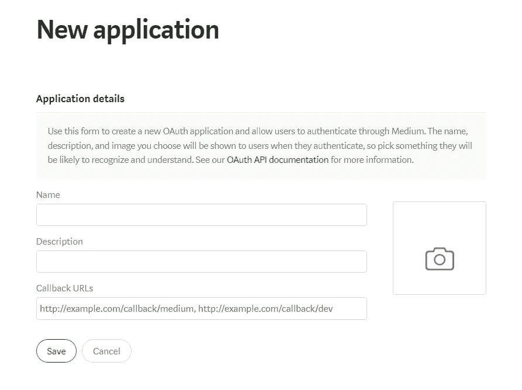
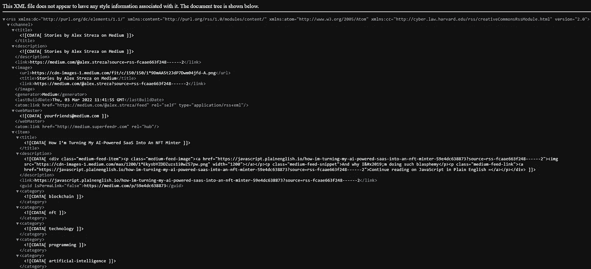
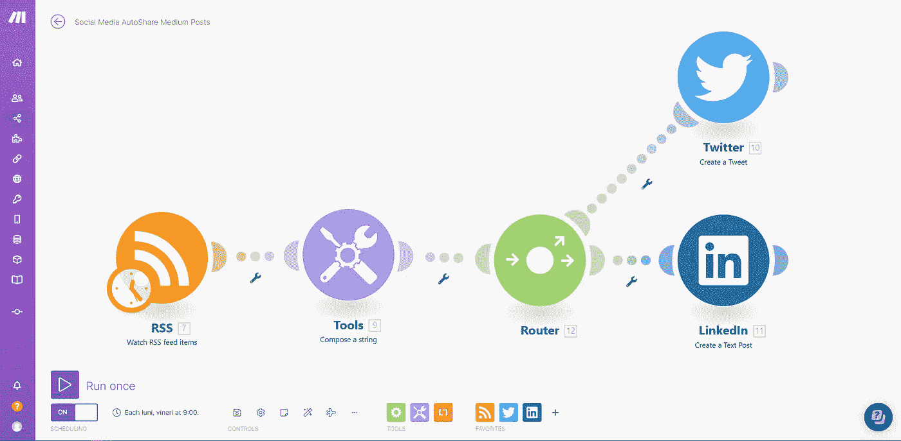
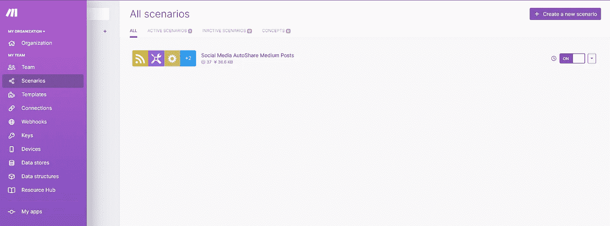
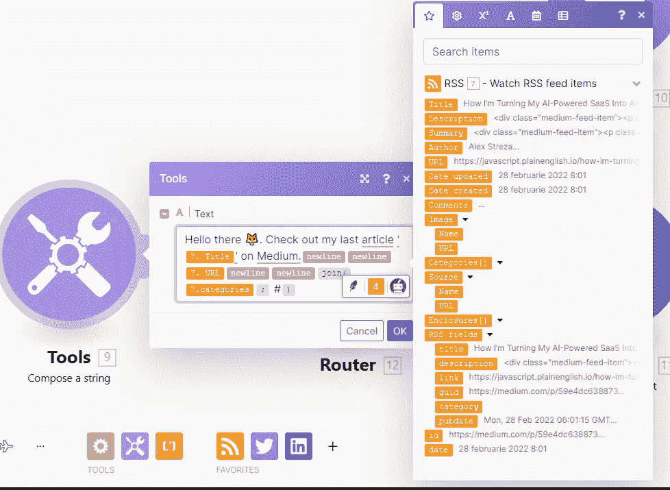

# 在几分钟内自动在多个社交媒体上分享文章

> 原文：<https://javascript.plainenglish.io/how-im-automating-sharing-articles-across-multiple-social-media-b9f20b804186?source=collection_archive---------12----------------------->

## 自动化>手工劳动

写作很有趣，也很有回报，但是在你所有的社交媒体账户上分享你的文章却恰恰相反，所以我开始了一段通过自动化来修复它的旅程，哦，这是一段怎样的旅程。


Developers Being Developers

# 任务

*叭叭。启动共享自动化。*

我远不是一台写作机器，也不是一份每周能交出几十篇文章的成熟出版物，所以我对自动化工作流程的渴望只不过是一种**怪癖**。

但我是一名开发人员，这意味着我总是更喜欢花 5 个小时编写代码来解决一项我可以在 5 分钟内轻松完成的任务。


Robot Revolution Generated With AI

我一周只发布 2-3 次，而且每周一和周五(有时也是周三)的时间表都很紧，所以脚本应该在这几天检查 Medium API 的新文章。

几天前，我决定建立某种自动管道来监听中型文章的帖子，以便在我的 Twitter(全新的)和 LinkedIn 上分享。

它应该执行以下操作:

*   按计划运行
*   从文章中提取标题、描述、URL 和标签
*   将数据格式化为类似于推文/帖子
*   发布到 Twitter
*   发布到 LinkedIn

# **中等 API**

很好，但还不够。

像大多数平台一样，Medium 提供了一个简单而高效的 [API](https://github.com/Medium/medium-api-docs#31-users) ，可以通过开发者:管理应用程序设置通过第三方服务访问。



Add OAuth Application Form

您可以通过简单的 NodeJS 服务器向这里记录的端点发送 HTTP 请求来使用 API。

这一切都很好，所以让我们不要阅读记录的端点，直接写代码。(明显的**错误**

过了一会儿，我发现无法通过官方 API 获得某个用户的帖子，因为它只允许以下内容:

*   证明
*   当前用户数据
*   获取出版物
*   **创建**帖子
*   上传图像

没有端点来请求用户的最新帖子…所以很多工作都是徒劳的，老实说，在流量这么低的情况下自动化这样的任务也是过时的。

看到 Medium API 没有呈现出这样的东西让我失去了希望，我几乎要放弃了。

幸运的是，我遇到了这个不可思议的知识库 [Medium Posts API](https://github.com/david-fernando/medium-posts-api) ，它返回 JSON 格式的数据以及我正在寻找的确切字段(除了标签)

它甚至不需要身份验证，您只需发出一个 GET 请求并获取 post 数据:

```
[https://mediumpostapi.herokuapp.com/?usermedium={{username}}](https://mediumpostapi.herokuapp.com/?usermedium={{yourmediumusername}})
```

不幸的是，由于某些原因，我不能让它为我的用户名工作😢所以我不得不**转向**另一种被遗忘的方式。

# RSS 来拯救

不是苏联的变位词。

## 那不是布玛儿科技吗？

RSS 代表“丰富的站点摘要”或“简单的联合”，这取决于你问的是谁。RSS 的核心是指包含必要的最新信息的简单文本文件——新闻故事、文章等等。

这些精简后的内容被发送到 feed reader，一个将 RSS 文本文件翻译成来自网络的最新新闻流的界面。

随着互联网内容变得越来越复杂，RSS 文件也变得越来越复杂，迅速采用图像、视频等，但仍然采用精简格式，以便更轻松地加载并兼容所有提要阅读器。



Medium RSS Feed API Sample

## 为什么是 RSS？

由于 RSS 简而言之是一种以 XML 格式访问站点信息的方式，并且 Medium 为 profiles 提供了一个 feed API[](https://help.medium.com/hc/en-us/articles/214874118-Using-RSS-feeds-of-profiles-publications-and-topics)**，我们可以解析数据并选择用户的最新帖子。**

```
[https://medium.com/feed/@alex.streza](https://medium.com/feed/@alex.streza)
```

**我们现在需要做的就是编写一些代码来获取数组中的第一篇文章，并选择标题、描述、URL 和类别(标签)。嗯，如果我们不写代码呢？**

# **没有代码自动化**

**多曲折啊。**

**在说“选择无代码而不是代码是一种亵渎行为，应该受到惩罚”之前，请听我说完。**

**我喜欢编码和创建软件，但是尝试不同的工具来提高生产力和降低复杂性是我所支持的。**

**几天前 [Integromat](https://www.integromat.com/en) 更名为 [Make](https://www.make.com/en) 。如果你没有听说过它，它很受欢迎，因为它使链接应用程序和自动化工作流程变得非常简单。as 可以轻松地在应用程序之间移动数据，让您可以专注于业务发展。**

**这听起来有点夸张，但实际上他们是对的，我从未见过有这么多第三方集成的工具( **~1095** )和一个基于节点的编辑器，可以在基于网络的同时提供如此高性能的工作流。**

****

**Social Media Auto Share Flow**

## ****指南****

**转到 [Make](https://www.make.com/en/register) 并创建一个免费帐户，请记住，有些节点仅适用于付费计划，如 Twitter 集成。**

**登录并跳转到场景并创建一个新的，你可以按照教程模式或玩一会儿。**

****

**现在，在场景编辑器中，您可以单击任意位置来添加模块(用于集成或处理)。搜索 RSS 源并选择观看 RSS 源项目，然后添加与您的用户名匹配的中等源 URL。**

**要格式化文章的文本，您可以使用一个工具转换器节点，并使用 UI 来选择字段并根据您的需要格式化它们。**

****

**用路由器节点分割输出，并将其发送到 LinkedIn & Twitter 或任何其他你想要的社交媒体。您必须为每个帐户创建一个连接，并传递状态文本(对于 Twitter)和内容文本(对于 LinkedIn)。**

**我不确定如何在不触发 API 的情况下调试工作流，以查看文本格式是否正确，所以小心不要在玩的时候多贴。**

**希望你喜欢这个“自动化”的故事，它遵循了用 Make 创建一个**无代码自动化场景**的步骤。不要忘了**关注**和**鼓掌**，每周两次获得更多精彩的软件相关故事🚀。**

***更多内容看* [***说白了就是 io***](https://plainenglish.io/) *。报名参加我们的* [***免费周报***](http://newsletter.plainenglish.io/) *。关注我们关于**[***Twitter***](https://twitter.com/inPlainEngHQ)*和*[***LinkedIn***](https://www.linkedin.com/company/inplainenglish/)*。加入我们的* [***社区不和谐***](https://discord.gg/GtDtUAvyhW) *。****