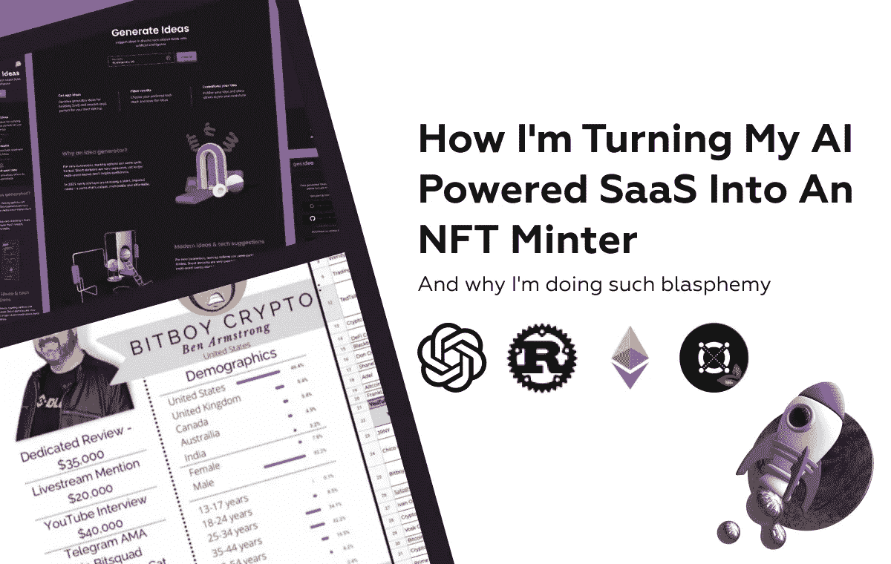
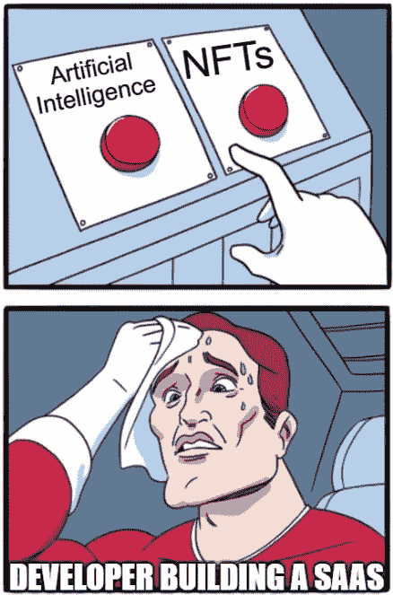
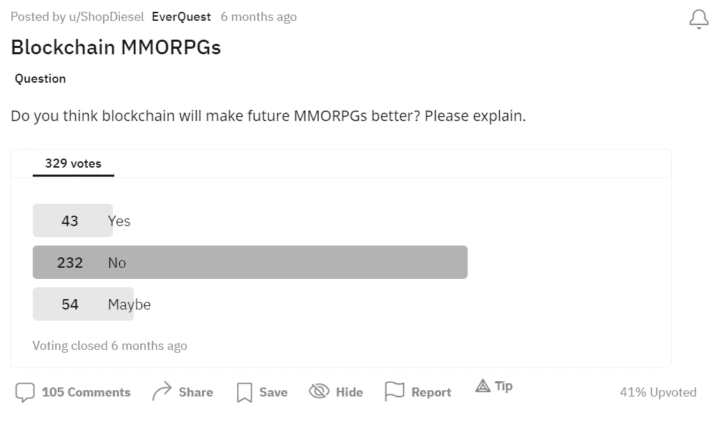
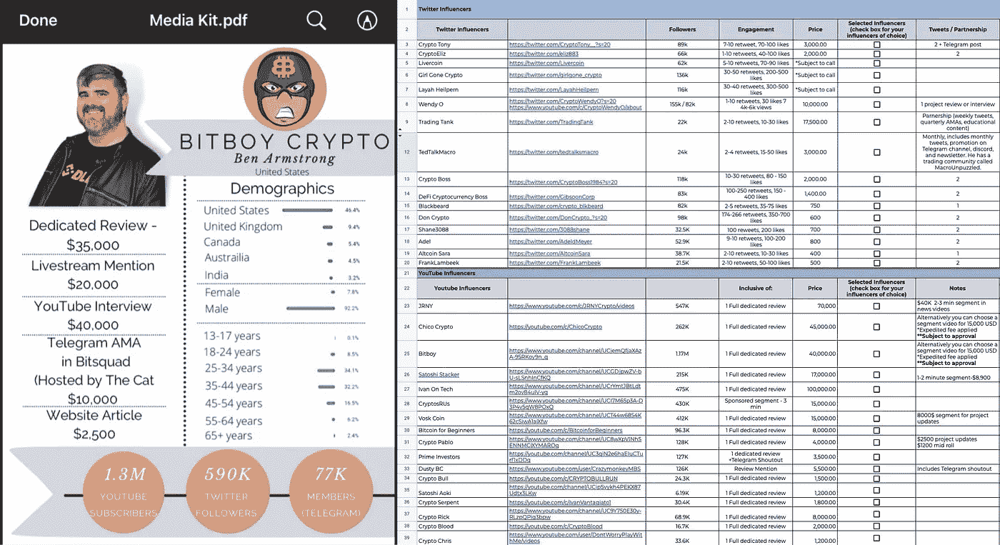
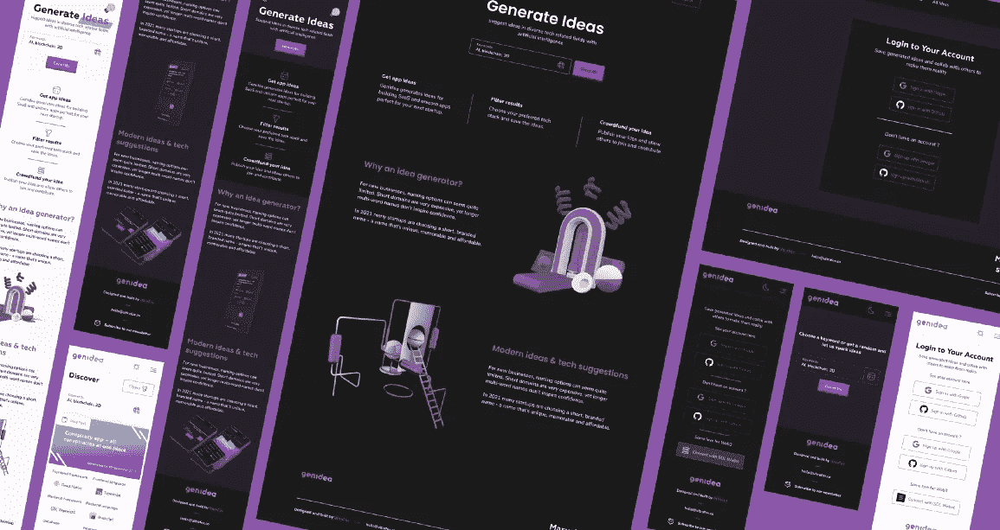
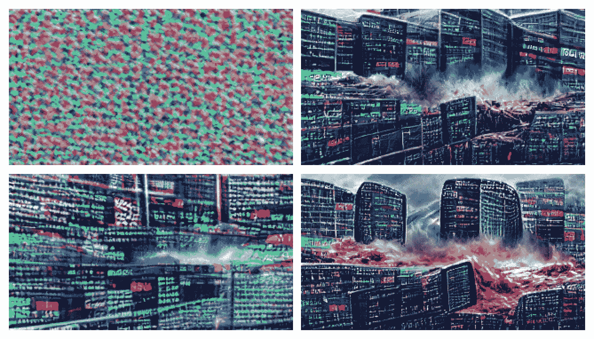
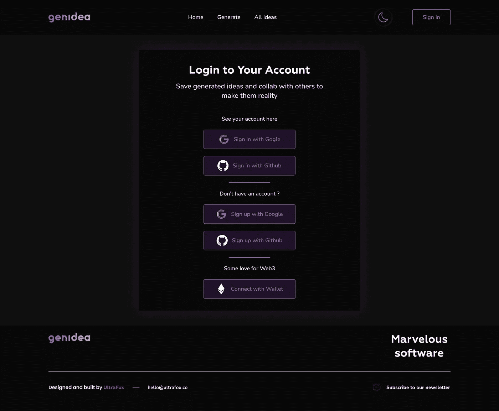

# 我是如何把我的人工智能 SaaS 变成 NFT 铸币机的

> 原文：<https://javascript.plainenglish.io/how-im-turning-my-ai-powered-saas-into-an-nft-minter-59e4dc638873?source=collection_archive---------9----------------------->

## 为什么我会做出如此亵渎神明的事

有两件事我很讨厌，睡眠不足和 T2 的秘密骗局，不，今年我两样都不做。2022 年，每个人都梦想推出自己的应用程序&产品，但没有多少人最终建立了自己的想法，而那些建立了想法的人，有太多过早地退出，而不是不断地加入新功能和开发更多的受众。

# 为什么大家都在宣传 NFTs？

## 小狗钱 lolz

由于最近**的大肆宣传**，在你的产品描述中插入像 crypto/区块链/NFT 这样的流行语会导致印象和追随者的巨大增加，但是有一个小问题。

比方说，你正在开发一款游戏，这需要大量的资金和资源用于开发和基础设施，而你甚至连启动资金都没有。

你决定**利用**蓬勃发展的加密市场，实现 NFTs 来吸引注意力，并通过 [Kickstarter](https://www.kickstarter.com/) 这样的平台众筹游戏资金。

Players [Don’t Want NFTs](https://www.reddit.com/r/MMORPG/comments/p7k077/blockchain_mmorpgs/) in Games

这一切都很美好，直到你发现你已经吸引了一大群投资者，他们对玩这个游戏不感兴趣，而是从他们的初始投资中获利。

> NFT 游戏和应用吸引的是投资者，而不是那些真正喜欢你的软件所提供的体验或效用的人。

人们喜欢推广密码相关项目的另一个原因是金钱激励，像 8192 个 NFT 中每个 600 美元的[HAPE beast](https://opensea.io/collection/hapeprime)这样的项目，在[OpenSea](https://opensea.io/collection/hapeprime?tab=activity)上达到 9.1 ETH 底价的顶峰，是营销专家的金矿。

在当时，这意味着该项目的大致价值为 9.1 * 8192 * 2600 美元(2 月 3 日的 ETH 价格)= **$193.822.720** 。我知道没有多少(或任何)其他 NFT 项目有像 Hape 这样高的营销预算，但仍然，近 2 亿美元的 3D apes 是深不可测的。

影响者可以通过简单的推文获得数千美元，不久前这张图片出现在 Reddit 上，展示了 Twitter 和 YouTube 上一些顶级加密影响者收取的费用。

Crypto Influencers Promotion Fees

# 我为什么要实施 NFTs？

## 奇妙的教育经历

我并不热衷于当前的 NFTs 实现，因为大多数实现并没有带来任何简单数据库无法实现的功能，并且经常在诈骗中被用作简单的抢钱手段。

也就是说，我将它们添加到我的 SaaS 中可能听起来自相矛盾，有些人可能会认为我试图从加密热潮中获利，而没有为用户添加任何真正的服务。

几个月前我有了一个想法，这正是缺乏一个想法，所以我建立了一个名为 GenIdea 的人工智能应用想法生成 SaaS，现在我正在添加 NFTs。

GenIdea | Generate Ideas For Your Tech Startup

问题是，我这样做是为了让**更多地了解区块链的发展，并将学到的知识用于撰写我的硕士学位论文。如果我要用真金白银在一个公共网络上创业，除了支付网络费用和网站维护成本之外，我没有收集巨额财富的意图。**

希望随着更多法规的出台和区块链科技的真正应用，骗局将会停止。尽管我投资于加密货币，而且这篇文章绝不是金融建议，但如果这意味着加密空间变得更安全，我会承担责任。

# 我如何策划一部 NFT 的电影？

## 以太坊。索拉纳。埃尔隆德。这么多选择…

## 概念

要理解向应用程序添加 NFTs 的概念，您需要理解对这种功能和当前特性的需求(可能不存在)。

[GenIdea](https://www.genidea.app/) 是一个平台，在这里你可以产生**应用创意**并为从区块链&人工智能到健身和教育等领域提出技术建议。目前，我还没有发布带有用户认证、订阅和新想法生成的完整版本，但这将在适当的时候到来。

一旦用户对一个想法感到满意，他们可以保存它，并使之成为自己的想法，我知道想法不能获得**的专利和保护，除非平台起飞，否则使其成为 NFT 不会有效。**

**假设测试版每月可以支持多达 10 万个新想法，我估计其中 33%要么是可笑的愚蠢，要么是纯粹的废话，因为人工智能远非完美无缺。**

**我也在用一个人工智能生成博客图片，这个名为“区块链启示录”，展示了人工智能获得最终图片的几个步骤(右下角)，但我会在以后的文章中介绍这一点，所以请继续关注**💌。****

****

**Blockchain Apocalypse**

## **履行**

**最受 NFT 欢迎的区块链是以太坊和索拉纳，在我的爱国主义观点中，[埃尔隆德](https://elrond.com/)是一个势均力敌的竞争者。我讨厌以太坊高昂的煤气费，当网络拥挤时，这可能比造币厂的价格还要高，但我也不喜欢索拉纳频繁的停机时间和不完全分散的架构。**

**现在你认为我会支持埃尔隆德，但我一直在想，如果我能找到一个桥梁，或者通过支持多个链来使事情变得过于复杂，那会怎么样。既然我将同时允许通过像 [MetaMask](https://metamask.io/) 这样的钱包和 Google & GitHub 的普通 OAuth 进行认证，那么将以太坊&埃尔隆德集成到同一个应用程序中会有多难呢？**

****

**Authentication Screen Design**

**从技术角度来看，我熟悉为以太坊智能合约开发的语言 [Solidity](https://docs.soliditylang.org/en/v0.8.12/) ，但我不熟悉区块链开发中常用的类似 C 的高性能语言 [Rust](https://www.rust-lang.org/) 。**

**因此，我想在后续更新中介绍的主要功能如下:**

1.  **用户认证([GitHub](https://docs.github.com/en/developers/apps/building-oauth-apps/authorizing-oauth-apps)&[Google](https://developers.google.com/identity/protocols/oauth2)OAuth 和 Wallet 认证)**
2.  **在您的帐户中保存您喜欢的想法**
3.  **创造一个想法，这样就没人能把它带到平台上**
4.  **查看其他用户的想法(如果共享)**
5.  **排名系统和徽章**

**如果事情进展顺利，我设法掌握了以太坊和爱尔龙的秘密，我会确保带来更多面向技术的教程和实践代码，因为它们比我大喊大叫我想做什么有用得多，🥴.**

**希望你喜欢这篇“**开发日志**”按照步骤将 NFT 添加到 SaaS，我会确保在编写代码时保持更频繁的更新🚀。不要忘记关注并为更多精彩的文章鼓掌，甚至[订阅 Medium](https://medium.com/@alex.streza/membership) 以获得无尽的阅读💜。**

***更多内容请看*[***plain English . io***](https://plainenglish.io/)*。报名参加我们的* [***免费周报***](http://newsletter.plainenglish.io/) *。关注我们关于*[***Twitter***](https://twitter.com/inPlainEngHQ)*和*[***LinkedIn***](https://www.linkedin.com/company/inplainenglish/)*。加入我们的* [***社区不和谐***](https://discord.gg/GtDtUAvyhW) *。***