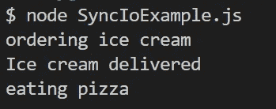
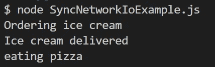
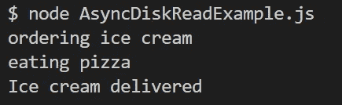
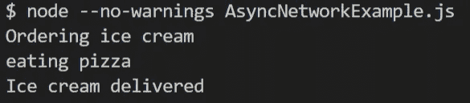

# JavaScript 如何使用异步等待、回调和事件循环实现非阻塞 I/O

> 原文：<https://javascript.plainenglish.io/how-javascript-implements-non-blocking-i-o-using-async-await-callbacks-and-the-event-loop-e7c3a244b555?source=collection_archive---------3----------------------->

本文讨论 JavaScript 如何在等待 I/O 事件发生时不阻塞线程。这是我上一篇文章的延续:[为什么仅仅使用 async-await 和 Promises 并不能使你的代码异步(JavaScript)](https://medium.com/@akshaydagar98/why-just-using-async-await-and-promises-doesnt-make-your-code-asynchronous-javascript-e8ee9014d92e) 这解释了什么是线程阻塞及其不同的类型。

让我们先来看一个阻塞 I/O 的例子，从/向硬盘的读/写都是 I/O 操作。

我创建了一个文件“ice.txt ”,其内容为“冰激凌已送达”。我们调用了两个方法: *OrderIceCream()* ，它将读取 ice.txt 并记录其内容(单词“冰激凌已交付”)。从磁盘中读取数据需要时间，尤其是在处理大量数据时。因此，我希望在读 I/O 操作发生的同时做其他重要的工作。也就是说，我要点冰淇淋，一边等冰淇淋送来，一边吃披萨。你认为实际的伐木顺序会是怎样的？

所以，我们点了一些冰淇淋，只有在冰淇淋送到后，我们才能吃披萨，现在披萨可能已经凉了。很多人可能已经猜到了，这是因为我们使用 *fs.readFileSync()同步读取文件。*这意味着 JavaScript 主线程将被阻塞，直到从磁盘中读取数据，即直到 I/O 操作完成。在那之前，你不能做任何其他事情。

下面是一个更常见的例子，网络请求(网络请求是 I/O 操作，因为它们涉及通过网络接口卡向套接字写入数据和从套接字读取数据):

我正在运行一个服务器，它监听 localhost:5000，并在 5 秒钟后以“冰激凌已送达”作为响应。在等待回复的时候，我想做其他重要的工作，包括“吃披萨”。你认为这次原木的顺序会是怎样的？

又一次，我们点了冰淇淋，我们不得不等待它被送到，然后才能吃比萨饼。这绝对不是我们想要的。我们想一边吃披萨，一边等冰激凌来。

和上一个一样，这个网络 I/O 操作也是同步的。该线程将被阻塞，直到我们得到网络响应，在此之前我们不能做任何事情。这意味着如果这是一个客户端应用程序，我们的 UI 也会被阻止。

好了，这是我们的线程在等待 I/O 时被阻塞的两个例子，但是我们如何防止这种情况呢？

克服 I/O 绑定线程阻塞的传统方法是将工作重新分配给另一个线程。然后，另一个线程将被阻塞等待 I/O，而你的主线程将有空去做其他重要的事情。有些人可能会说这是不可能的，因为 JavaScript 是单线程的。确实是这样，但是 JavaScript 运行在浏览器上或者使用 NodeJs。浏览器和节点都有自己的工作线程可以使用。但是这种方法有一些缺点。

首先，一根线贵。它需要大约 1 MB 的内存。虽然这看起来不多，但是如果您必须执行数千个网络操作，那么您可能会由于等待队列中线程的数量而耗尽 RAM。而且，这是一种非常违反直觉的方法。在这里，你不是等着冰淇淋送来然后吃披萨，而是让你的朋友(一个工人线程)在你吃披萨的时候等着冰淇淋。

这就是 JavaScript 使用异步编程的原因，它允许主线程是自由的，不需要等待 I/O 操作完成就可以继续做其他重要的工作。

JavaScript 说，为什么不使用主内存(RAM)来存储执行状态，直到 I/O 操作开始，并让线程自由处理其他事件。然后，当 I/O 完成时，只需从内存中读取状态，并运行取决于 I/O 操作结果的其余代码。

我们如何知道 I/O 操作何时完成？执行该操作的设备将产生一个中断来表示它的完成。

现在让我们看看如何使用异步 JavaScript (async-await、promises 和 callbacks)解决上面两个例子中出现的问题。我还将解释这些是如何工作的。

这一次，我们将使用 *fs.readFile()* 方法，该方法允许异步读取数据，并在数据被读取时调度回调( *AcceptDelivery)* 。你认为这次的伐木顺序会是什么？

我们点冰淇淋，然后我们吃比萨饼，然后冰淇淋被送到。这正是我们想要的，我们甚至不需要让我们的朋友——工人线程——代表我们等待！！！这是如何工作的？

作为 *fs.readFile()* 方法的第三个参数，我们已经指定了回调函数( *AcceptDelivery()* )，一旦磁盘读取操作完成并且我们获得了文件的内容，就应该执行该函数。

当 *fs.readFile()* 函数被执行时(注意，这个函数和任何其他库函数一样，它本身将在主线程上执行)，它将把关于其回调的信息存储在主内存中。然后，该函数将要求操作系统联系磁盘(使用硬盘的设备驱动程序)并执行实际的读取。当读取发生时，JavaScript 主线程可以自由处理其他事件，比如执行 *EatPizza()* 函数。一旦磁盘读取完成，硬盘将引发一个中断(你的计算机系统中的所有设备都有自己的用于此目的的微型处理器)。设备驱动程序将处理这个中断，最终回调 *AcceptDelivery()* 将被推入回调队列(如果您不熟悉 JS 事件循环和回调队列，请观看[这个视频](https://www.youtube.com/watch?v=8aGhZQkoFbQ))。每当线程空闲时(调用堆栈为空)，JavaScript 事件循环将从回调队列中挑选一个方法，并将其分配给主线程执行。

现在，让我们通过使用 async-await 和 promises 解决第二个问题(网络操作)来更详细地再次查看这个过程:

这一次，我使用了带有 async-await 的 fetch API。运行这个命令时，控制台的结果就是我们想要的:

线程将开始顺序执行这段代码，首先执行 *OrderIceCream()* 函数。“订购冰淇淋”将被记录到控制台。现在控制到达 *await fetch()* 。这个 *fetch()* 库方法将被执行，它将告诉操作系统要求网卡开始一个网络写 I/O 操作(发送 HTTP 请求)，然后是一个网络读操作(从套接字读取响应)。当来自操作系统的请求到达设备(网卡)时，它将立即返回“待定”状态。操作系统会将此信息传回线程，并且 *fetch()* 方法会返回一个状态为“待定”的承诺。

现在真正的魔法来了。await 关键字和编译器一起将当前的执行状态(比如我们在代码中的哪一行和局部变量的值)存储在主内存中，并立即从异步函数(*OrderIceCream()*)*返回一个待定的承诺(您可以选择等待这个承诺或使用“*安排一个回调)。然后()"*但是在这里我们两者都不做)。*

*主线程现在可以自由执行其他代码，这里是 *EatPizza()* 。当两个网络 I/O 操作都完成时，网卡将中断 CPU，其设备驱动程序将数据发送给操作系统，告诉它 I/O 操作已经完成。操作系统会将这一点传达给你的应用程序，在应用程序中，一个工作线程(来自 NodeJs 或浏览器)会查看内存以获取我们之前存储的执行状态，然后在回调队列上的 await fetch(*console . log(RES . text())*)之后，将其余的代码排队。主线程一空闲，事件循环就会将这段代码添加到调用堆栈中(在执行完 *EatPizza()* 函数之后)。*

*这类似于在一张纸上写下“接受冰淇淋送货并吃冰淇淋”，然后吃比萨饼。当送货员按你的门铃时(提出打断)，你会看着你写下的东西，然后接受送货，吃冰淇淋！*

*总而言之，JavaScript 使用单线程来运行应用程序的所有代码。当执行 I/O 操作时，该线程不会被阻塞，而是将执行状态存储在 RAM 中，让线程自由执行不依赖于 I/O 操作结果的其他代码。*

*当 I/O 操作完成时，执行该操作的设备会产生一个中断。为了将这种完成传输到您的应用程序，需要暂时借用几个线程。在应用程序级别，一个工作线程(browser 或 NodeJs)处理 I/O 完成响应，查看它之前存储的执行状态(在 RAM 中),并将依赖于 I/O 响应的其余代码排队，以便由事件循环拾取，并在主线程空闲时添加到调用堆栈中。*

*感谢您的阅读😃，这里有一些关于非阻塞 I/O、异步和事件循环主题的有趣读物:*

1.  *[没有线程(stephencleary.com)](https://blog.stephencleary.com/2013/11/there-is-no-thread.html)*

*[2。非阻塞 IO 如何在引擎盖下工作？|作者 Hielke de Vries | ING 博客| Medium](https://medium.com/ing-blog/how-does-non-blocking-io-work-under-the-hood-6299d2953c74)*

*[3。事件循环到底是什么？|菲利普·罗伯茨| JSConf EU — YouTube](https://www.youtube.com/watch?v=8aGhZQkoFbQ)*

*[4。c#——如果 async-await 不创建任何额外的线程，那么它如何让应用程序做出响应呢？—堆栈溢出](https://stackoverflow.com/questions/37419572/if-async-await-doesnt-create-any-additional-threads-then-how-does-it-make-appl)*

*[5。Mads Torgersen: Inside C# Async |深入|第九频道(archive.org)](https://web.archive.org/web/20151120235256/https://channel9.msdn.com/Shows/Going+Deep/Mads-Torgersen-Inside-C-Async)*

**更多内容看* [***说白了。报名参加我们的***](https://plainenglish.io/) **[***免费周报***](http://newsletter.plainenglish.io/) *。关注我们关于* [***推特***](https://twitter.com/inPlainEngHQ)[***LinkedIn***](https://www.linkedin.com/company/inplainenglish/)*[***YouTube***](https://www.youtube.com/channel/UCtipWUghju290NWcn8jhyAw)*[***不和***](https://discord.gg/GtDtUAvyhW) ***。********

*****对缩放您的软件启动感兴趣*** *？检查* [***电路***](https://circuit.ooo/?utm=publication-post-cta) *。***