# JavaScript 如何工作:用简单的术语向初学者解释

> 原文：<https://javascript.plainenglish.io/how-javascript-works-explained-in-simple-terms-for-beginner-developers-7d0c2ecf3583?source=collection_archive---------17----------------------->

## 和任何其他编程语言

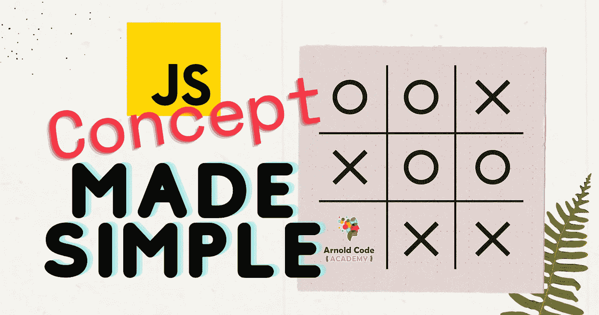

JavaScript Concept Made Simple ([Arnold Code Academy](http://arnoldcode.com))

JavaScript 是 web 的编程语言。

大多数现代网站都使用它。所有的网络浏览器都包括 JavaScript 解释器。台式机、笔记本电脑、游戏机、平板电脑和智能手机。他们都有一个带 JavaScript 解释器的浏览器。

**作为你的第一门编程语言，这是一门伟大的语言。**

*如果你认为这可能是错误的语言，不要担心。你不能。*

# 使用 JavaScript 创建

*   [网站](https://www.lighthouselabs.ca/en/blog/10-popular-websites-built-using-javascript)
*   [网络应用](https://finlinup.firebaseapp.com/#/lifestyles?ids=0557ce12-dd98-4961-bc1f-a31345165706~e3553af1-553b-4171-8654-003146fc440a)
*   [使用 Node.js 的服务器端应用](https://www.g2i.co/blog/what-is-node-js-server-side-javascript)

但是 JavaScript 并不局限于这些技术。

# 您还可以创建:

*   [使用 React Native 等工具的移动应用](https://insights.daffodilsw.com/blog/5-popular-javascript-frameworks-for-mobile-app-development)
*   [微控制器程序](https://www.espruino.com/)
*   [物联网](https://iotjs.net/) ( [物联网](https://mit-online.getsmarter.com/presentations/lp/mit-internet-of-things-online-short-course/?ef_id=c:469586593572_d:c_n:g_ti:kwd-391316783_p:_k:iot_m:e_a:117156351104&gclid=CjwKCAiAgvKQBhBbEiwAaPQw3EFJF6Slq22tr01tV3BX7JnHapayY8e3mkHAWASJYoiA34URis27jBoCzIcQAvD_BwE&gclsrc=aw.ds))
*   [智能手表应用](https://www.hackster.io/news/the-bangle-js-an-open-sourced-javascript-powered-smart-watch-6359962646c2)

# 两句话的概念&外卖

任何 JavaScript 程序的一般方法都是获取一些输入数据(从用户、程序本身或服务器)并对输入数据进行逻辑操作或修改。

最后，返回一个新的结果(给用户、程序本身或服务器)。

# 通过一个应用实例理解概念

让我们来看看*狄德趾的纲领性帷幕背后。*

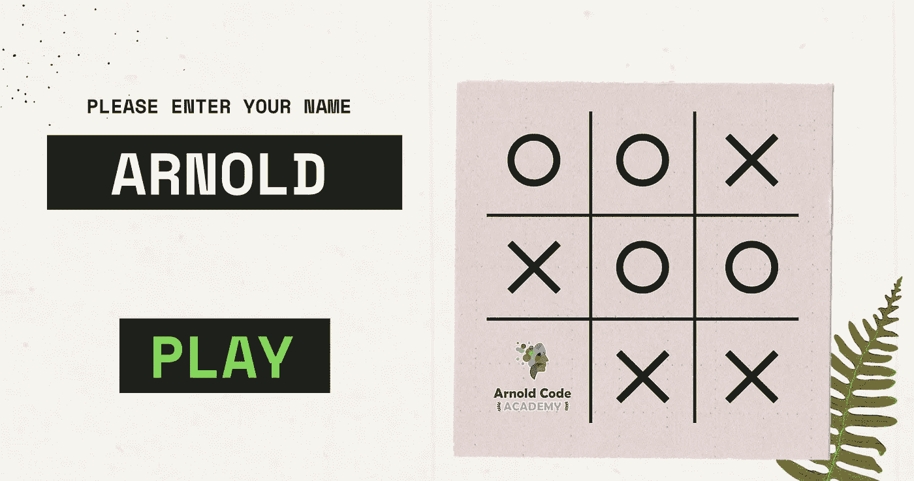

Enter Your Name Screen ([Arnold Code Academy](http://arnoldcode.com))

## 得到名字

首先，我们要求玩家输入他的名字。他们输入名字并点击播放。

但是名字存储在哪里呢？

你在变量中存储有意义的数据。这个名字可以存储在一个名为 *playerName* 的变量中。

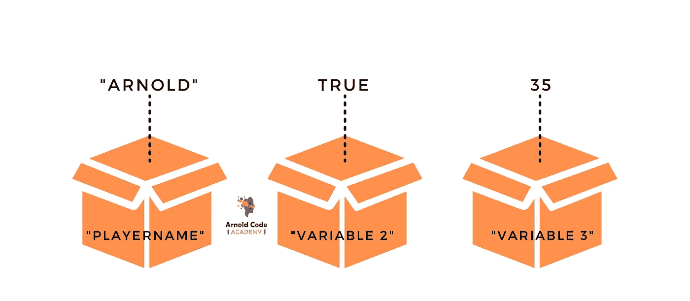

Concept of Variables ([Arnold Code Academy](http://arnoldcode.com))

*玩家点击***播放**

## 游戏将在…后开始

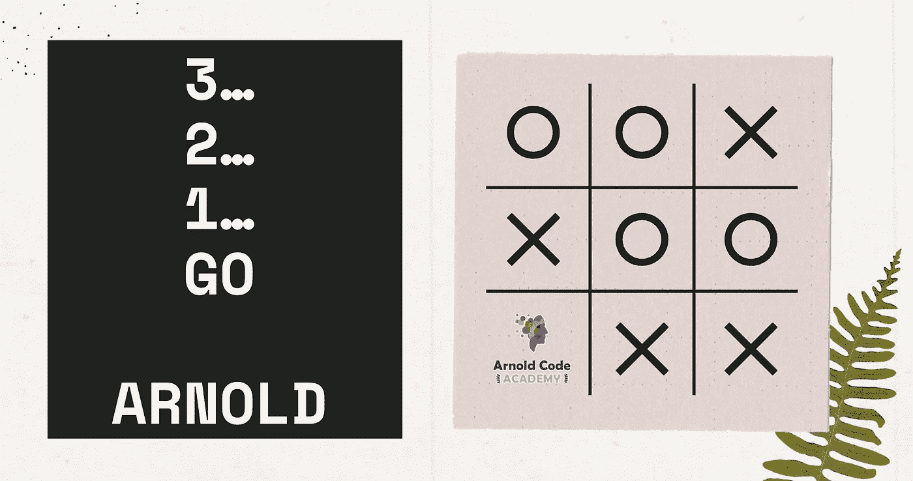

Ready — Set- Go! — Screen ([Arnold Code Academy](http://arnoldcode.com))

现在您想通知他游戏将在 3…2…1 Go playerName 开始。”

您必须取得玩家输入的姓名，并将其打印到网页上，同时加上: *3…2…1 Go。*

对文本片段(称为“字符串”)的这种操作非常普遍。

**退一步想:** *你的程序是怎么得到输入的玩家名字的？*

## 对用户/玩家做出反应

当玩家在输入栏中输入他的名字时，他一定是通过点击“ **PLAY** ”按钮来发送的。

[*“播放”按钮必须在 HTML*](/8-memorable-html-secrets-that-let-you-turn-tables-at-your-job-interview-f405743e2c0e) *中制作。*

您可以使用这样的事件来检测按钮是否被单击。这是您的代码运行的触发器，并显示从前面的项目符号开始的短语。

任何编程语言和 JavaScript 的总体概念都是**输入- >处理- >输出。**

# **输入- >过程- >输出**

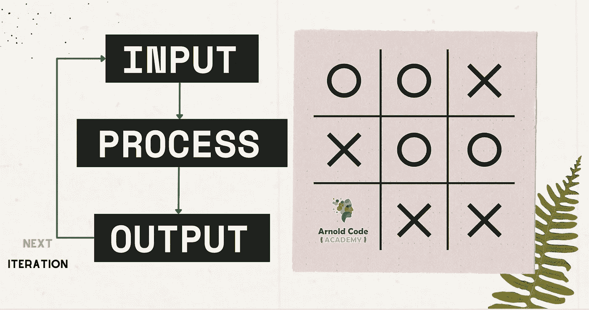

Overall Pattern of Any Program Input | Process | Output ([Arnold Code Academy](http://arnoldcode.com))

## 投入

将有意义的数据——对您的应用程序有意义的数据——存储到变量中，也称为容器，以备后用。您可以通过查看容器或者直接从用 HTML 创建的[用户界面获取数据。](/8-memorable-html-secrets-that-let-you-turn-tables-at-your-job-interview-f405743e2c0e)

只要在检索内容之前已经向其中写入了内容。

*总结一下*:检索要显示的数据或…

## 过程

…进行处理以获得更有意义的数据。

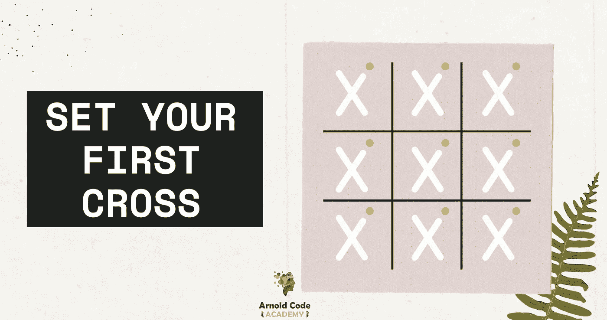

Player’s Turn ([Arnold Code Academy](http://arnoldcode.com))

对于 Tik Tak Toe 示例，处理数据以了解何时轮到玩家。之后，你需要找出十字架被设定在哪里。

对手设置第一个圆圈也是如此:

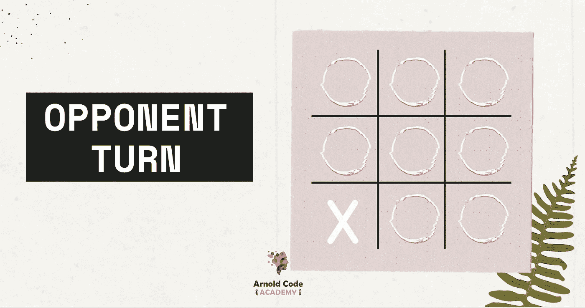

Opponent’s Turn ([Arnold Code Academy](http://arnoldcode.com))

最后，您需要处理一些有意义的数据，以便:

*   知道哪些领域还是免费的。
*   谁赢了这一轮。
*   没人能赢的时候。
*   当游戏因为第 22 条军规而被迫结束时。

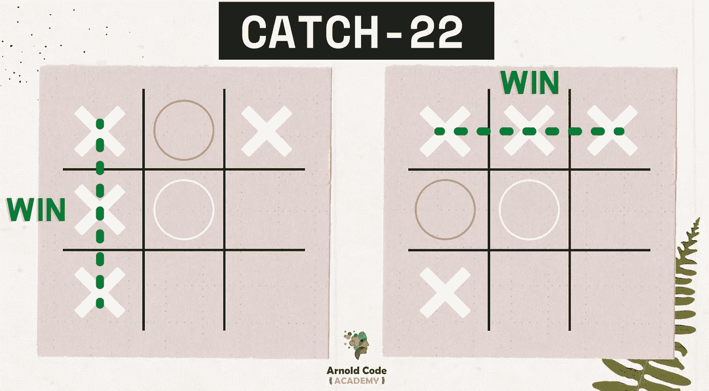

Catch-22 Examples ([Arnold Code Academy](http://arnoldcode.com))

# 输出

随着游戏的继续，您需要将数据的输出存储到变量中，以便进入下一轮循环(*输入—流程—输出*)。

这将导致一个循环，一直持续下去，直到你或程序决定停止。对于狄德趾:

*   如果有人赢了。
*   没有人会赢，也不可能赢。
*   出现了第二十二条军规。

产出可能意味着两种不同的东西。要么是向用户显示数据(用户界面)，要么是处理代码片段的输出(称为函数)。

# 有人赢了这场比赛

Winning Screen ([Arnold Code Academy](http://arnoldcode.com))

同样，这里应用了相同的概念。

**输入:**你的程序读出内部变量并进行处理。

**流程:**然后你要决定是否有人赢了。

**输出:**将决定存入变量并显示获胜画面。

为了以这种风格显示游戏的用户界面，你需要了解 [HTML](/8-memorable-html-secrets-that-let-you-turn-tables-at-your-job-interview-f405743e2c0e) 和 [CSS](/10-exclusive-css-facts-you-should-know-to-confidently-land-a-junior-developer-job-33581198375b) ，包括[响应式网页设计](https://levelup.gitconnected.com/responsive-web-design-in-a-nutshell-for-web-developer-beginners-281927de35fc)。

# 一般和非一般执行顺序

通常，JavaScript 程序从顶部**到底部**执行。

使用高级结构，如*条件语句*，您可以跳转到代码中的特定位置。

使用*循环语句*，你可以重复代码片段，使用*异步语句*，你甚至可以创建一个保存点，并在其他事情发生时继续。

# 条件语句的概念

使用它们来比较一个或多个变量值。

关于你的 **Tik Tak Toe** 程序，比较有多少空白字段与有标记的字段。如果金额相同，游戏必须结束。

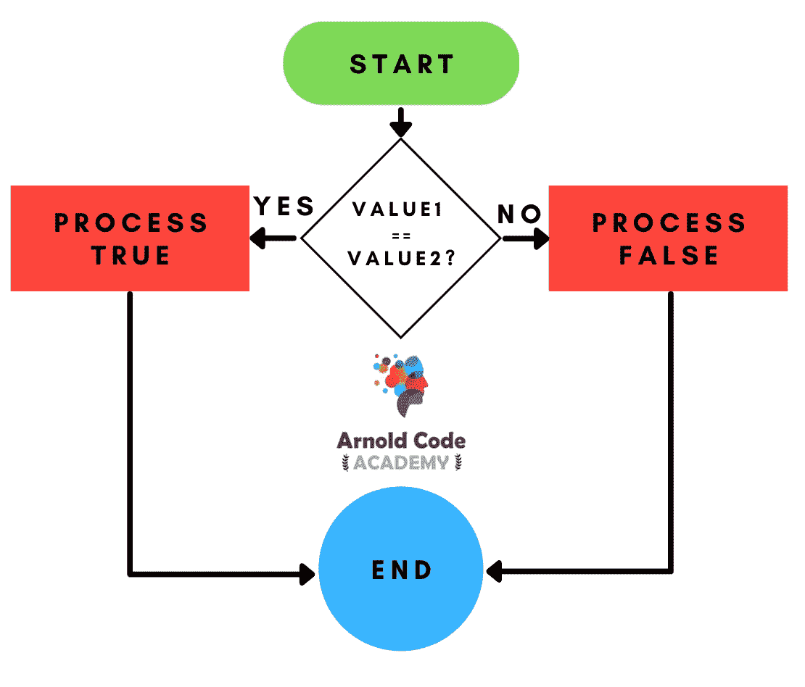

Concept of Conditional Statements (If-Else / Switch-Case) ([Arnold Code Academy](http://arnoldcode.com))

# 循环语句的概念

使用它们来比较一个或多个变量值，并决定循环是否进入下一轮:循环路易😉

进行与条件语句相同的比较。将剩余的自由字段与标记的字段进行比较。如果数量**不同于****相同，游戏可能仍在进行。例外的情况是第 22 条军规，没有人能再赢了。**

**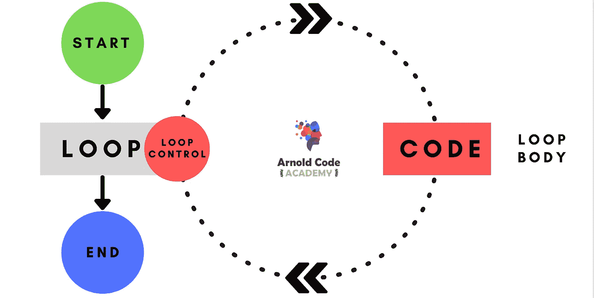**

**Concept of Loops ([Arnold Code Academy](http://arnoldcode.com))**

# **异步语句的概念**

**当你有一个球员名人堂时，这个概念可以被使用，只是一个胜利的高分表。**

**然后，您将向服务器发送一个请求，以保存玩家获得的新的高分。这个请求被称为 API 请求。服务器需要一些时间来保存这个表，并对这个调用的成功或失败做出响应。在此之前，请求保持“待定”状态**

**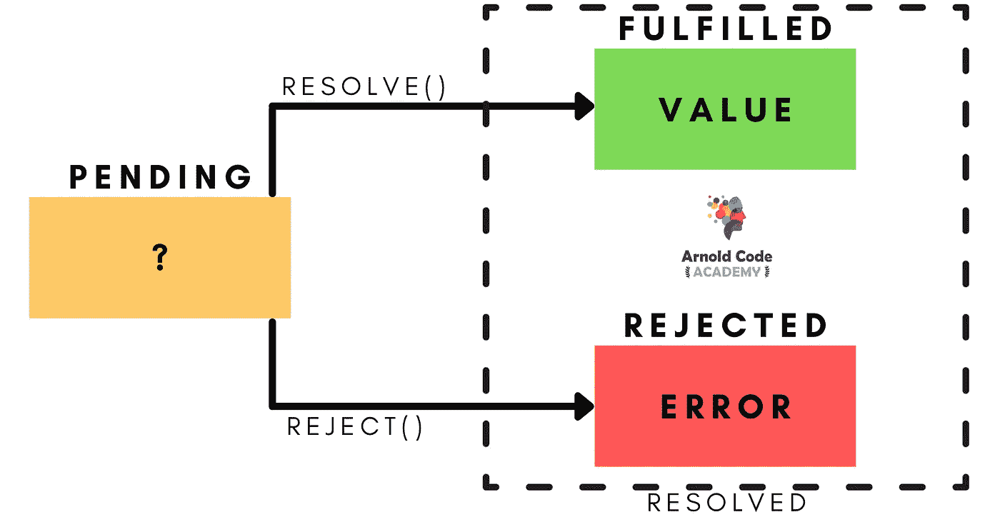**

**Concept of Promises / Async-Await or Asynchronous Code ([Arnold Code Academy](http://arnoldcode.com))**

**当服务器响应时，您有两种选择:**

****应验:**服务器说:“O *凯，新高分保存。然后你继续你的程序的预期行为。例如，向用户显示更新的高分表。***

**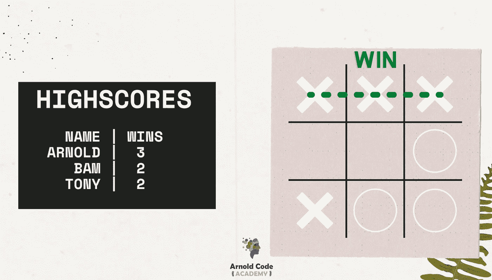**

**Success Case of Uploading High Score ([Arnold Code Academy](http://arnoldcode.com))**

****拒绝:**服务器回复“*哎呀，出问题了。这不是我的错。*“或者根本没回答(超时)。那么您必须捕获这个错误情况，并继续使用替代代码。例如，显示器出现问题时提供一个“**再试一次**”按钮。**

**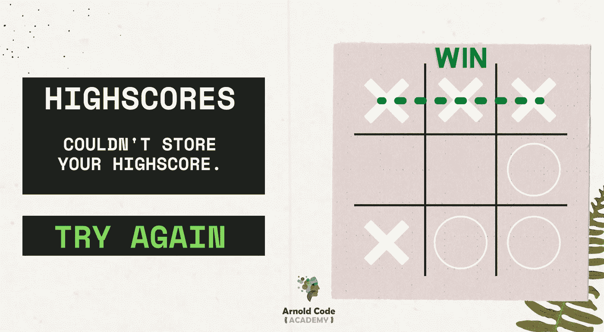**

**Error Case of Uploading High Score ([Arnold Code Academy](http://arnoldcode.com))**

**否则，你的程序可能会崩溃，留给你的是不满意的客户，这会让你的老板生气😅**

# **JavaScript 的无限循环**

**您的整个 Javascript 程序由一个无限循环组成，该循环监听诸如键盘输入、页面上的鼠标点击或导航到 web 上的其他地方之类的事件。**

**当你的代码从上到下执行时，这些“事件循环”甚至会运行。**

# **但是 JavaScript 可以做得更多！**

*   **JavaScript 使您能够处理数字、文本、数组、日期**
*   **用户输入和输出**
*   **网络、存储和显卡等更复杂的功能**

**一般来说，你需要知道 JavaScript 有两个部分。区别取决于应用领域:**

1.  ****“客户端 JavaScript”——浏览器****
2.  ****“服务器端 JavaScript”——服务器****

**JavaScript 的两个方面是另一个故事的主题。你已经理解了任何编程语言背后的概念。打开自己喜欢的 IDE 开始编码怎么样？运用你今天学到的东西😉**

**[***获取网站开发者备忘单，只研究你第一份工作真正需要的东西！***](https://arnoldcodeacademy.ck.page/26-web-dev-cheat-sheets)**

****

**[***26 Web Dev Cheatsheets by Arnold Code Academy***](http://arnoldcode.com)**

***更多内容看* [***说白了。报名参加我们的***](https://plainenglish.io/) **[***免费每周简讯***](http://newsletter.plainenglish.io/) *。关注我们关于*[***Twitter***](https://twitter.com/inPlainEngHQ)*和**[***LinkedIn***](https://www.linkedin.com/company/inplainenglish/)*。加入我们的* [***社区不和谐***](https://discord.gg/GtDtUAvyhW) *。******