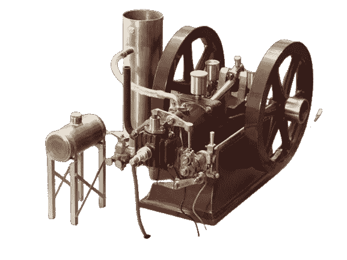
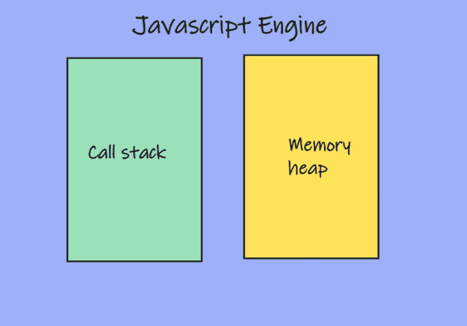
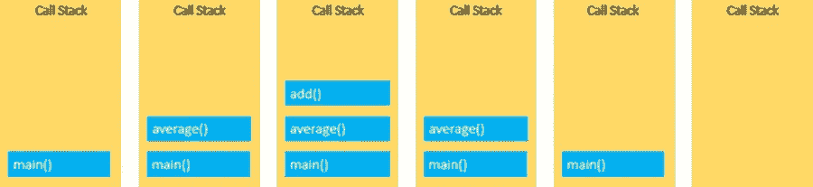
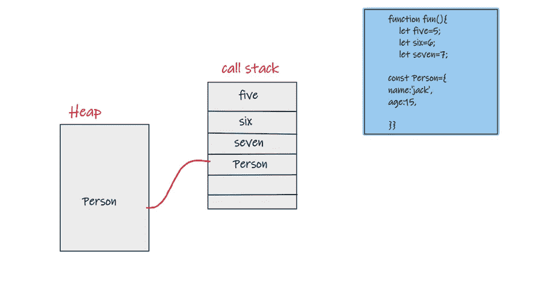
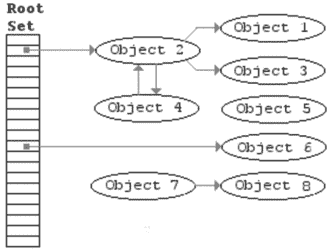
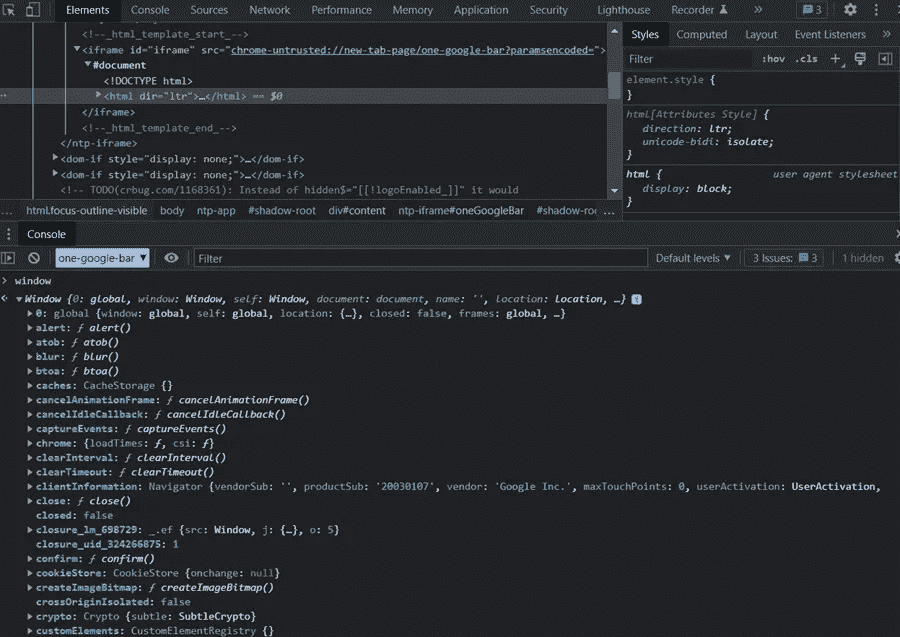
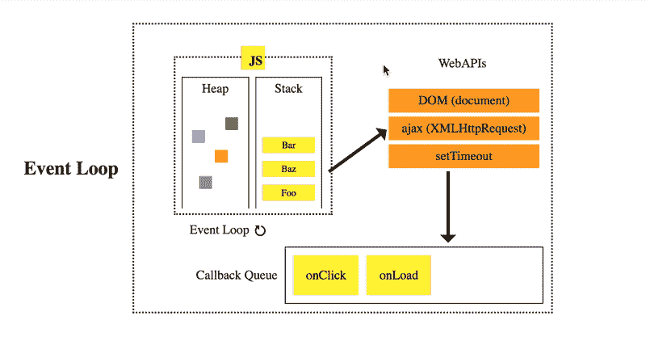

# JavaScript 如何在幕后工作，为傻瓜解释

> 原文：<https://javascript.plainenglish.io/how-javascript-works-under-the-hood-explained-for-dummies-216ce155183c?source=collection_archive---------3----------------------->

## 通过理解 JavaScript 如何工作来编写更好的代码。

Wyvern | Model Engineer

当你每天写 JavaScript 时，你可能知道它是如何工作的，但是你有没有想过浏览器如何读取你写的代码，以及在幕后真正发生了什么，你在你的文本编辑器中写代码，但是它将如何变成零和一。作为开发人员，如果您熟悉 JavaScript 中的一些主题，可能会帮助您编写更好的代码。

JavaScript 引擎做了很多工作，但最重要的是读取和执行我们的代码，为此我们需要一个存储和写入数据的地方，以及一个运行和跟踪逐行发生的事情的地方。

内存管理是 JavaScript 自己处理的事情之一，不需要你为函数和变量分配内存。这同样适用于了解堆、栈和调用栈是如何工作的。然而，了解它们以及它们是如何工作的，可以帮助你理解 JavaScript 是如何工作的，从而写出更好的代码。

## **调用堆栈**

JavaScript 是一种单线程编程语言，这意味着它一次只能做一件事，并且只有一个遵循先入后出(FILO)的调用堆栈，这意味着第一个调用堆栈是最后一个弹出的调用堆栈，这是一种帮助 JavaScript 解释器跟踪脚本调用的函数的机制，其代码执行是同步的。

JavaScript call stack

## **内存堆**

它是 JavaScript 存储变量、对象和函数的空间或区域，在运行时是已知的。我们应该注意到，JavaScript 将对象和函数存储在堆中，变量存储在堆栈中。

## **堆栈溢出**

在这种情况下，一个函数递归地调用自己，浏览器将有一个最大的调用堆栈而没有出口点，在大多数情况下，这是因为递归而发生的。

## **垃圾收集**

JavaScript 是一种垃圾收集语言，这意味着从已经声明但当前在应用程序的任何部分都没有使用的对象中取回并释放内存。

与通过库实现垃圾收集的低级语言相比，大多数高级语言都有自己的垃圾收集器。垃圾收集为我们提供了一些安全问题，因为我们不需要担心内存管理。

在低级语言中，你控制内存的一部分，这在某些方面是危险的，但它是可以优化的，这就是为什么像 C 语言这样的语言速度极快，内存效率高。JavaScript 中的垃圾收集是通过一种叫做**标记和清除**的算法来控制的，在这种算法中，所有没有引用的对象都会从内存中删除。

Mark and Sweep algorithm

**1。标记:**标记仍有引用的对象。

**2。Sweep:** 扫描内存中的所有对象，并删除所有未标记的对象。

## **内存泄露**

当系统无法管理其内存分配时，这被称为内存泄漏，它被视为导致性能下降和故障的错误，并且它是一种没有返回到操作系统或空闲内存池的内存。垃圾收集语言中内存泄漏的主要原因是**不需要的引用**。最常见的内存泄漏类型可以分为:

**1。全局变量** : JavaScript 全局变量没有被垃圾收集，因为它们被根节点引用，所以只要应用程序运行，就会占用应用程序。

**2。事件监听器**:当大量对象引用被保存在回调函数中而没有正确处理时，事件监听器会导致内存泄漏，这在单页应用程序中更常见。

**3。setIntervals** :每次你调用一个函数，setInterval 可以在指定的时间内执行，一个新的堆栈帧被添加到堆中，因为 setIntervals 会一直运行，除非你停止，否则会导致内存泄漏。

## **JavaScript 运行时**

正如我们已经提到的，JavaScript 是一种单线程语言，它只有堆栈和堆，因此，如果另一个程序想要执行，它必须等待前一个程序完成其执行，这导致工作缓慢，这就是 JavaScript 运行时的用武之地。当同步 JavaScript 代码运行时，web 浏览器在后台工作，web 浏览器使用称为 web APIs 的东西与 JS 引擎通信。

浏览器使用低级语言如 **C/C++** 在后台执行操作，这些 API 被称为**web API**。它们就是我们所说的异步，这意味着我们可以指示它们在后台做一些事情，并在完成后返回数据。

window is an object from Browser not JavaScript that works as an API.

## **回叫队列**

它是一种 FIFO 数据结构，异步代码被推入其中并等待执行。

## **事件循环**

它持续运行，查看调用堆栈和回调队列，如果调用堆栈为空，它将回调队列的第一个回调函数推送到调用堆栈。

> 我是一名自由职业的全栈 web 开发人员和技术作家，请随时联系我🤓

在 GitHub 上关注我:

 [## Ali11Mustafa -存储库

### 此时您不能执行该操作。您已使用另一个标签页或窗口登录。您已在另一个选项卡中注销，或者…

github.com](https://github.com/Ali11Mustafa?tab=repositories) 

在 LinkedIn 上关注我:

 [## 阿里·穆斯塔法-网络开发者-自由职业者| LinkedIn

### 查看阿里穆斯塔法在全球最大的职业社区 LinkedIn 上的个人资料。阿里有 4 个工作列在他们的…

www.linkedin.com](https://www.linkedin.com/in/ali-mustafa-195a321a0/) 

*更多内容请看*[***plain English . io***](https://plainenglish.io/)*。报名参加我们的* [***免费周报***](http://newsletter.plainenglish.io/) *。关注我们关于*[***Twitter***](https://twitter.com/inPlainEngHQ)*和*[***LinkedIn***](https://www.linkedin.com/company/inplainenglish/)*。查看我们的* [***社区不和谐***](https://discord.gg/GtDtUAvyhW) *加入我们的* [***人才集体***](https://inplainenglish.pallet.com/talent/welcome) *。*