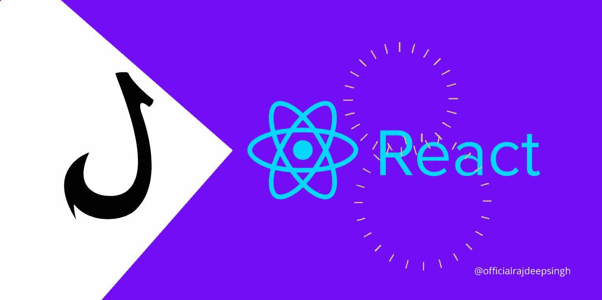

# React 中有多少个钩子？

> 原文：<https://javascript.plainenglish.io/how-many-hooks-are-present-in-react-c97f0200a26a?source=collection_archive---------0----------------------->

## 反应堆

## 挂钩是在 React 中编写更少、更简洁代码的一种方式。



Hooks in react.js

React 是 JavaScript 世界中广泛使用的库。JavaScript 中还有很多其他的库。但是大多数公司和开发者更喜欢 React 进行网站开发。React 有三个好处，对每个人都很好，不管你是初学者还是专业人士。

1.  简单的学习过程
2.  定义明确的文档
3.  大型开发者社区

我知道 React 还有其他好处，比如可重用组件等。我涵盖了初学者开始或进入 React 世界时最重要的好处。

2022 年，React hooks 将会吸引更多的开发者。我最近在 React 中观察到一种模式——如此多的开发人员将钩子用于功能组件，而不是类组件。

当我们在 React 中使用类组件时，我们知道 JavaScript 中的类的概念。如果不理解类的概念，你就无法在 React 中写出更好更简洁的代码。但是功能组件比类组件容易得多。您不需要在 React 中编写额外的一行代码。钩子有助于减少 React 中的编码功能。

React 版本 18 为开发者提供了 15 个钩子。有了 15 个钩子，你可以实现与基于类的组件相似的功能。

1.  **使用回调**
2.  **使用上下文**
3.  **useDebugValue**
4.  **使用默认值**
5.  **使用效果**
6.  **useId**
7.  **使用命令句柄**
8.  **使用插入效果**
9.  **useLayoutEffect**
10.  **使用备忘录**
11.  用户证书
12.  **useRef**
13.  **使用状态**
14.  **useSyncExternalStore**
15.  **使用过渡**

所有的钩子都是由 React 团队提供的。最常见的挂钩是 useState，其他挂钩的使用基于 app 需求。

还可以用 JavaScript 中的 console.log 方法检查 React 中的所有挂钩。

```
import react from "react";export default function Hooks() { ** console.log(react);** **return <h1> Check all Hooks lisiting in reactjs </h1>;**}
```

## 为什么我们需要钩子？

钩子为开发者解决了两个问题。

1.  干净的代码
2.  用更少的代码实现类似的基于类的功能。

## 我应该选择学什么？功能组件还是类组件？

我建议你学习函数组件和类组件。因为当你去找工作时，你的公司网站有很多功能和组件，我 100%确定旧的组件也使用基于类的组件。

所以很多公司开发者队友对组件乱七八糟是因为一个人对类库组件很在行，另一个人对函数组件很在行。为了更好地开发，我建议您学习这两个组件。

## 2022 一个初学开发的人应该学习函数式还是基于类的组件？

对于初学者和新开发人员，从功能组件开始。React 的现代时代是基于功能组件的。很多 YouTubers 和 React 团队都在推广功能组件。新的 React 文档也是基于功能组件的。

我建议你对类组件有一个基本的了解。在你了解了组件的基础之后，再转向基于类的组件。这样你就可以在工作时很容易地理解类组件，也许之后，你可以将类组件转换成功能组件。

# 以前的文章

[](/how-to-check-the-version-in-react-5780fd2ced4b) [## 如何在 React 中检查版本？

### 在 React 中用 import 语句、package.json 和 npm 或 yarn 检查版本。

javascript.plainenglish.io](/how-to-check-the-version-in-react-5780fd2ced4b) [](https://medium.com/nextjs/the-script-component-in-next-js-ee6ee6cd705a) [## Next.js 中的脚本组件？

### nextjs 脚本组件有助于优化和提高 web 应用程序加载性能。本文是…的一部分

medium.com](https://medium.com/nextjs/the-script-component-in-next-js-ee6ee6cd705a) [](https://medium.com/nextjs/how-to-use-bootstrap-5-with-cdn-in-nextjs-e9b9c8fd35cd) [## 如何在 Nextjs 中使用带有 CDN 的 Bootstrap 5？

### Bootstrap 5 是领先的 CSS 框架。您用复制粘贴代码在 nextjs 中添加 Bootstrap 5。

medium.com](https://medium.com/nextjs/how-to-use-bootstrap-5-with-cdn-in-nextjs-e9b9c8fd35cd) 

## 结论

这是一篇简洁的文章，我在这里介绍了钩子的概念。在接下来的 15 篇文章中，我会用简单的例子给你适当的指导。

钩子是 React 世界中的一个主要问题。新开发人员有时会被钩子弄糊涂。当我开始学习 React 时，React 中没有钩子。所以我决定学习并深入研究基于类的组件。

后来，React 引入了钩子。当 hooks 被 YouTube 频道和同事重点推荐后，我决定学习 hooks。现在，React hooks 已经改变了我的生活。我不再关心`this`的反应。

如果您有任何疑问或需要我的帮助，请随时联系我，officialrajdeepsingh@gmail.com。你要迁移 React 到 Next.js 吗？也可以联系我，关注 [*Next.js 发布*](https://medium.com/nextjs) *。*

如果你喜欢我的文章，请随意喜欢并与他人分享我的文章。你还在推特上标签 [*官方 _ R _ 深度*](https://twitter.com/official_R_deep) *。*

[](https://officialrajdeepsingh.dev/) [## 拉吉迪普·辛格

### 我创建的这个网站是为了让初学者了解编程的基本概念。大多覆盖一个话题。

officialrajdeepsingh.dev。](https://officialrajdeepsingh.dev/) 

*更多内容请看*[***plain English . io***](http://plainenglish.io/)*。报名参加我们的* [***免费周报***](http://newsletter.plainenglish.io/) *。在我们的* [***社区***](https://discord.gg/GtDtUAvyhW) *获得独家获得写作机会和建议。*