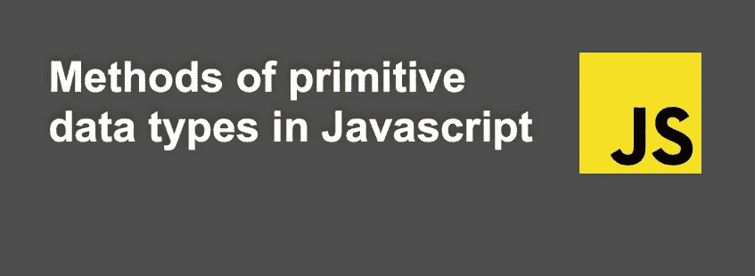

# JavaScript 中基本数据类型的方法是如何工作的

> 原文：<https://javascript.plainenglish.io/how-methods-of-primitive-data-types-work-in-javascript-ac9e5f61ec69?source=collection_archive---------9----------------------->



JavaScript 允许我们使用原语。在本文中，我们将试图理解方法是如何出现在原始值上的。

有 7 种原语类型 **null、undefined、number、string、boolean、symbol、bigInt** 。

当对原始数据类型调用方法时会发生什么，例如:

如您所知，与对象不同，原语没有自己的*方法*，但是有包装原语类型的值并允许您对其执行各种转换的对象副本:

*   `String`为**字符串**原语。
*   `Number`为**号**原始人。
*   `BigInt`为 **bigInt** 原语。
*   `Boolean`为**布尔**原语。
*   `Symbol`为**符号**原始人。

每个构造函数都有自己的方法和将被继承的原型。

如果我们调用`String.prototype`，我们将看到以下内容:

```
String {
  anchor: anchor()
  at: at()
  big: big()
  blink: blink()
  bold: bold()
  charAt: charAt()
  ...
  toUpperCase: toUpperCase();
  ...
  length: 5
  [[Prototype]]: Object
}
```

下面是在`name.toUpperCase()`中实际发生的事情:

1.  字符串`name`是一个原语。因此在访问它的属性时，一个特殊的对象`new String(name)` 被创建，它知道字符串`[GetValue(V)](https://tc39.es/ecma262/#sec-getvalue)`的值，并拥有来自原型的有用方法，如`toUpperCase()`。
2.  该方法运行并返回一个新字符串。
3.  特殊对象被销毁，只剩下原始对象。

因此，它可以写成这样的形式:

这两个条目将是等同的

但是创建的字符串返回的*“object”*的 **typeof** 与我们预期的不太一样，所以最好不要用构造函数来创建原语。

如果打开 Chrome 开发者工具栏，或者你使用的任何调试工具，你会看到如下内容:

```
String:
  0: "R"
  1: "o"
  2: "m"
  3: "a"
  4: "n"
  length: 5
  [[Prototype]]: String
  [[PrimitiveValue]]: "Roman"
```

另一方面，使用**字符串/数字/布尔**函数而不使用**新的**操作符是聪明且有用的。它们将值转换为原始类型:字符串、数字、布尔值。例如，以下是有效的:

解开包装对象的一般方法是方法`.valueOf()`:

特殊原语`null`和`undefined`是例外。它们没有相应的“包装对象”，也不提供任何方法。从某种意义上说，他们是“*最原始的*”。

希望对你有用！

感谢阅读！回头见。😊

*更多内容请看*[***plain English . io***](https://plainenglish.io/)*。报名参加我们的* [***免费周报***](http://newsletter.plainenglish.io/) *。关注我们上*[***Twitter***](https://twitter.com/inPlainEngHQ)**[***LinkedIn***](https://www.linkedin.com/company/inplainenglish/)*[***YouTube***](https://www.youtube.com/channel/UCtipWUghju290NWcn8jhyAw)**和* [对增长黑客感兴趣？检查出](https://discord.gg/GtDtUAvyhW) [***电路***](https://circuit.ooo/) *。*****