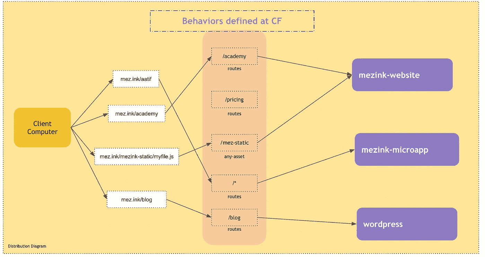
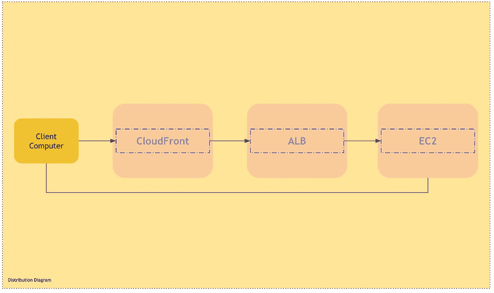
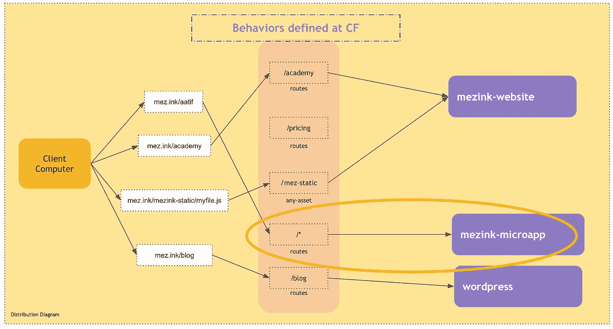
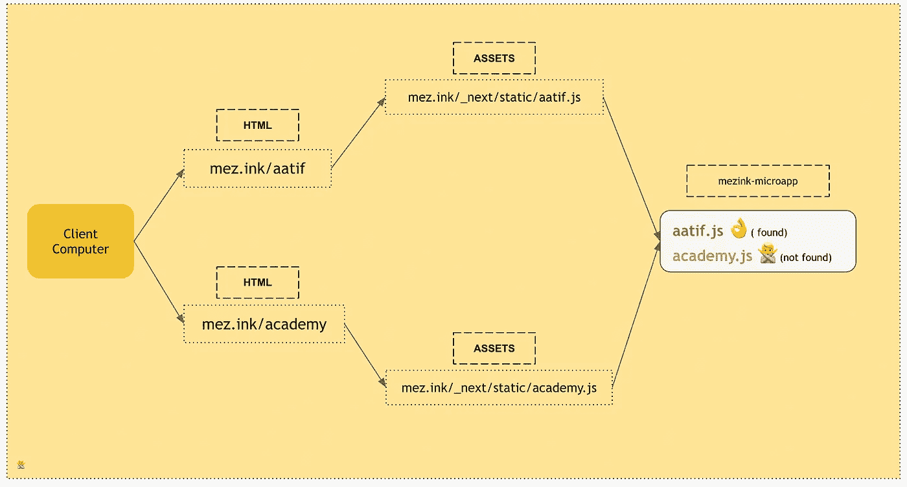
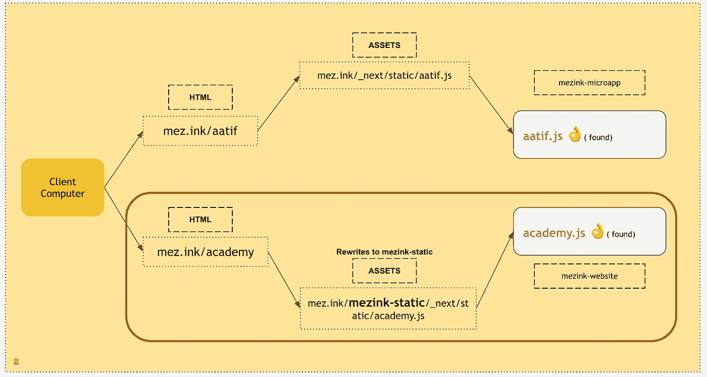

# Mezink 如何使用 Cloudfront 和 Next.js 在一个域中服务两个不同的存储库

> 原文：<https://javascript.plainenglish.io/how-mezink-serves-two-different-repositories-within-a-single-domain-using-cloudfront-and-nextjs-175adb682866?source=collection_archive---------8----------------------->

> 你创造了你的 Mezink 吗？如果没有下载我们的 [app](https://mezink.onelink.me/I54r/app) 或[报名](http://mez.ink/sign-in)

在 [Mezink](http://mez.ink) 我们的网站有两个主要的入口。
一个是静态网站，有[主页](http://mez.ink)、[学院](http://mez.ink/academy)、[定价](http://mez.ink/pricing)等几个。

另一个是我们为用户提供微型网站和网络应用。我们的用户使用我们的应用程序或网络创建微型网站例如[mez.ink/aati](http://mez.ink/aatif)f 是我拥有的微型网站之一。

我们目前有大约 100 万个微型网站，迄今为止，我们每月的流量超过 2000 万。

我们的微型网站有复杂的逻辑，后端集成，分析等，所以我们想把它放在一个不同的代码库，从静态网站分开。

> 注意:我们的代码库都在使用 [NextJs](https://nextjs.org)

我们的两个代码库都使用同一个域`mez.ink`
，但是有不同的路径。
在我直接进入问题之前，让我们看看我们是如何处理这两个存储库的流量分流的。

# 亚马逊 Web 服务~ CloudFront 的作用

我们使用亚马逊网络服务作为我们的主机提供商。

> 注意:我不会讨论我们如何创建实例、桶、ALB 等。但将分享我们使用的分发机制的简介。

如上所述，我们有两个不同的存储库，服务于不同的目的。对于一些特定的路线，我们在 [Cloudfront](https://www.amazonaws.cn/en/cloudfront/) 分布上创建了不同的行为。如果你不了解 Cloudfront 的分布，它只是一个简单的交付网络，不如说是基于区域服务流量的 CDN。

在分布层，我们定义了一些路由的行为。
然后，路由被映射到各自的负载平衡器，负载平衡器被映射到它们自己的 ec2。

我已经用图表解释了流程。

> 注意:EC2 只是一个服务器，你可以在这里查看更多细节

正如你可以在上面的图表中看到的，像学术和定价这样的路线被重定向到 mezink-website，博客被重定向到 WordPress，除了这些(/*)之外的任何东西都被重定向到 mezink microapp。

请求首先到达 CloudFront，基于定义的行为，CloudFront 然后将流量重定向到它自己的负载平衡器，它在内部指向相应的 EC2 服务器

这就是我们如何使用 Cloudfront 分发将流量分流到不同的 EC2

# NextJs ~前缀的作用

AWS 部分已经完成，但在前端仍有一些事情需要解决。
我们将 NextJs 用于两种代码库。如果您知道 NextJs 构建过程，它将所有资产保存在`host/_next/`文件夹下，因此对于构建期间生成的任何资产，路径应该是这样的

【https://mez.ink/_next/static/abc.js】T2
https://mez.ink/_next/static/image.png

# 问题陈述

如前所述，我们有类似于*[*academy*](http://mez.ink/academy)*和[*aatif*](http://mez.ink/aatif)*的页面，它们托管在不同的代码基上。当用户点击任何 URL 时，发送请求以在浏览器上下载 HTML，并且从 HTML 向服务器发出资产或资源请求以下载 JS、CSS 等。这些页面所必需的。
通过使用下一个构建系统，对资产的请求将类似于 https://mez.ink/_next/static/someRandom.js 的**。* 和 thi *s* 给我们造成了一个问题，如何？****

****

**您可以在图像中看到，圆圈部分表示任何路径未在行为中提及的请求(*)都将被重定向到 mezink-microapp (ALB)。**

**这意味着当我们试图为 [academy](http://mez.ink/academy) 页面下载资源时，请求会被重定向到 mezink-microapp，为什么？因为资产路径会是***it*会抛出 404 作为文件 *academy-component.js* 在 *mezink-mircroapp* 服务器*上不存在。*它存在于另一个服务器上，即 *mezink-website。* 查图了解流程******

****

**您在浏览器中点击`mez.ink/academy`，HTML 被下载，对`academy.js`的请求被创建以下载 JS，请求根据 CloudFront 定义的行为到达`mezink-microapp`服务器，最终抛出 404 错误**

# **出路**

**[NextJs](http://nextjs.org) 带有一个叫做 [assetPrefix](https://nextjs.org/docs/api-reference/next.config.js/cdn-support-with-asset-prefix) 和[重写](https://nextjs.org/docs/api-reference/next.config.js/rewrites)的超级概念，这是我们的出路。
如果你阅读下一个 js 文档，它说`assetPrefix`你可以设置一个前缀，并配置你的 CDN 的源，以解析到 Next.js 所在的域。**

**在继续之前，让我向您展示我们在下一个配置中所做的更改**

**next.config.js**

**我们添加了`assetPrefix`,将其命名为`*mez-static*`,用于构建期间生成的所有资产。资产前缀将在我们的所有资产前附加`mez-static`。当 HTML 在构建期间生成时，要下载的资产或资源将具有类似`mez.ink/mez-static/_next/:path*`的结构**

**我们还添加了一个`rewrite`规则，在这里我们定义了一个源和目的地。如果有任何请求传到`mez-static/_next/:path`会将其重写到`_next/:path`。查看图表，更好地理解流程**

****

**Rewrite 实际上是一个 URL 代理，它从前缀为`mez-static`的`_next/:path*`中获取资产。它屏蔽了目标路径，让用户看起来没有改变他们的位置。**

**终于，松了一口气，我们面临的从一个域服务不同资产的问题被这些小而有效的黑客解决了，**但是事情并没有就此停止。****

## **静态站点生成的页面与 SSR 页面**

**实际上，只有当你有静态的站点生成(SSG)页面时，所有这些改变才能很好地工作，但是如果你创建的是动态页面，这些改变就会被打断。**

**静态站点生成的页面意味着你的页面不是动态的，也不依赖于任何 API 或数据。这种页面是在构建时生成的。**

**另一方面，服务器端呈现的页面通常是动态的，它们可能需要一些 API 集成，并且不是在构建时生成的。**

**为了更好地理解这一点，你需要理解 SSG 的概念[这里](https://nextjs.org/docs/basic-features/pages#static-generation)**

**在我们的例子中，从`mezink-website` (ALB)获得的一些页面是动态的，我们的上述解决方案不适用于动态页面。**

> **但是不要担心，孩子，每个问题都会有一个解决方案**

## **但是，等一会儿**

**这篇文章已经涵盖了很多东西，*我将发表一篇关于我们如何为 SSR* 解决资产下载问题的新文章，以及一些关于 SSG 和 SSR 页面的额外细节。**

**在那之前，你可以鼓掌👏 👏，如果你喜欢它或者学到了新的东西，也不要忘记与你的朋友分享。😀 😄**

> **一定要看看我们的[网站](http://mez.ink)我们最近推出了一些很酷的免费东西，如[二维码生成器](https://mez.ink/qr-code-generator)、[参与度计算器](https://mez.ink/tools/instagram-engagement-calculator)并在 [twitter](https://twitter.com/aatifbandey) 上关注我**

***更多内容请看* [***说白了。报名参加我们的***](https://plainenglish.io/) **[***免费周报***](http://newsletter.plainenglish.io/) *。关注我们*[***Twitter***](https://twitter.com/inPlainEngHQ)*和*[***LinkedIn***](https://www.linkedin.com/company/inplainenglish/)*。查看我们的* [***社区不和谐***](https://discord.gg/GtDtUAvyhW) *加入我们的* [***人才集体***](https://inplainenglish.pallet.com/talent/welcome) *。*****