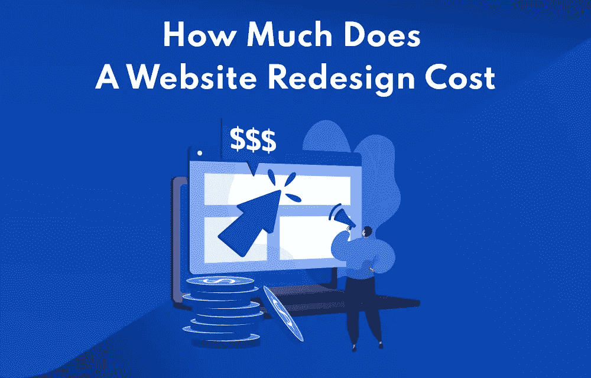
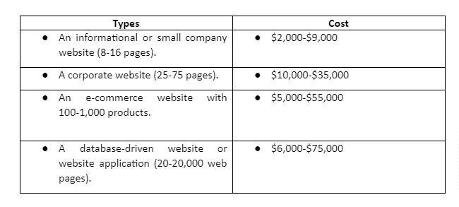
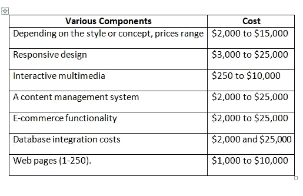

# 2022 年一个网站改版要多少钱？

> 原文：<https://javascript.plainenglish.io/how-much-does-a-website-redesign-cost-in-2022-760c47736fa7?source=collection_archive---------13----------------------->

## 一个指南告诉你 2022 年一个完整的网站改造要花多少钱。

假设你的初创企业或商业网站没有得到足够的关注，或者你的竞争对手在各方面都超过了你。在这种情况下，你有几个问题要解决:技术 SEO 缺陷，单调的设计，或者糟糕的文案。您可以同时处理一个或所有这些问题。因此，这些广泛的问题需要对网站进行全面改造。

因为你要同时处理许多问题，你很可能很快就没钱了。正是这篇文章派上用场的时候。本指南将向你展示 2022 年一个完整的网站改造要花多少钱。

# 一个网站重新设计的意义是什么？

重新设计或建立一个公司网站有很多原因。

*   客户期待，这是最重要的原因之一。我们可以深入本质，将注意力转移到统计游戏上。
*   然而，一个基本的论点足以将争论扼杀在萌芽状态。
*   此外，网站重新设计的成本对项目的绩效有重大影响。
*   当你重做你的网站时，你要么改变现有的功能，要么重新开始。例如建立新主页、整合社交网络订阅源或更改品牌和域名。
*   这取决于你的营销人员对它的看法以及你的新访客的最初印象。
*   当重新设计一个网站的成本超过创建一个新网站的成本时，后者就是这种情况。

# 网站重新设计的类型

我们不能将整个过程限制在网站重新设计成本**范围内的单一方法。**设计过程复杂，即便如此，也要比一个新网站的开发过程多花一半的时间。网站重新设计的项目也可能根据基本要求而改变。所以，基于这个因素，有四种不同形式的网站设计，每种都有额外的平均成本。

# **重新装修**

*   重新设计网站需要对在线设计和布局进行适度到显著的改变。
*   从调整徽标的颜色到添加照片、滑块、旋转木马和电影，您可以做很多事情。
*   如果你还没有考虑融入色彩心理学的概念。

# **重新布线**

*   现在我们来讨论一下重新设计一个网站要花多少钱。
*   后端服务必须更新，作为重新布线的一部分。
*   它使用最新的技术来确保您的网站的性能始终是一流的。
*   将系统切换到云以获得更好的可访问性和安全性就是一个基本的例子。或者，您可以升级到功能更丰富的内容管理系统。

# **改造**

*   重新布线和重新装修结合在一起改造。
*   在这里，您应该努力改进后端系统的整体功能、美观和功能。
*   这类活动将需要额外的时间和资源。
*   然而，即使需要更长的时间，你也可以希望在结束时实现未实现的目标。
*   无论是增加流量，增加 CTR，还是其他。
*   改造需要创造力和技术诀窍。
*   因此，你应该与网页设计师、后端开发者和技术专家交流。这些人不仅会帮助你解决问题，还会回答你经常提出的问题。

# **重建**

*   除了一个部分(可选)，一切都是从零开始。
*   这就好像你和一个新的人结婚了，但是仍然希望在新的人身上看到你前任伴侣的某些特征。
*   当你经历品牌重塑过程时，你需要做这样的事情。

这是四种不同类型的网站改造练习要注意的。

然而，这还不够。这将有助于回答另一个问题，以改造您的网站，并确定实际成本。重新设计的理由是什么？

# **几个因素影响网站设计的成本。**

你想为你的公司创建一个网站，但不知道从哪里开始？一个设计良好的网站可以显著改变你的业务，提高盈利能力。与你的网页设计公司讨论你的营销计划将有助于他们更好地掌握你的设计和内容偏好。

一个体面的网站设计不需要昂贵。同时，如果你检查了几个会影响网站开发成本的因素，会有所帮助。在这篇文章中，我们将看看影响网站设计价格的一些方面。

*   ***内容管理系统* :** 如果你使用一个好的内容管理系统(CMS)，人们可以用你的网站图像、文本和页面给你的客户留下好印象。大多数常见的 CMS 平台都是开源的，这意味着它们可以免费使用。尽管如此，你还是要付钱给你的网站设计师来配置和定制它们，以满足你的业务需求。
*   ***导航和可用性*** *:* 如果你的网站的页面需要很多链接，而你又需要大量的链接标签，那么构建网站的成本就上升了。此外，在向公众发布网站之前，网站设计者必须对其进行测试。另一件要注意的事情是花在尝试网站上的时间。
*   ***静态 vs .电子商务*** :虽然目前静态网站相对较少，但一些企业主更喜欢动态性明显较低的网站。相反，他们会留下联系信息，并要求潜在客户通过电子邮件或电话联系他们。假设你正在寻找一个电子商务网站。在这种情况下，你需要考虑支付网关和其他商业因素，如银行账户整合。你应该在网站上提供购物车和愿望清单。自然，一个电子商务网站会比一本小册子网站更贵。
*   ***文案*** *:* 为你的网站生成内容的成本因你需要多少页面而异。网站设计价格由必要的研究量、产生新内容的频率以及网站的搜索引擎优化或 SEO 决定。
*   ***搜索引擎优化*** :你不能因为有一个好的网站，就指望能排在 Google 的第一页。你需要正确的内容，以及人们搜索的正确关键词，然后你需要针对这些关键词优化你的网站。当你定期需要 SEO 的新材料时，成本就会上升。

# 你需要什么类型的网站？

总而言之，自己重新设计一个网站的成本可能在 0-300 美元之间。与自由职业者合作的费用从 500 美元到 5000 美元不等，雇佣一家网站设计公司的费用从 3000 美元到 10 万美元不等。

了解各种网站的网页设计前期成本也很有帮助。考虑下面的例子:

**Type of website & Their Cost to build**

你的网站开发成本可能在这些数字之间。如果你正在寻找一个实质性的改变，你可能会看到可比较的统计数据。如果你只是想改变一些小细节。

# 各种组件的成本

现在是时候计算各种重新设计组件的成本了。组成你的网站的一些功能可能需要重新设计。

您应该为以下前期成本做好预算:

**Costs of various components**

我们已经讨论过在你的网站上加入互动媒体的成本。如前所述，这种耗费时间和资源的过程可能是昂贵的。尽管如此，它也可以产生巨大的收益，增加持续点击、互动和潜在购买你的产品的访问者数量。

# 结论

说到网站改造，请记住这一点。这些网站元素中的任何一个都可以被重新设计以改进功能，使客户更容易发现他们需要的信息并增加销售。重新设计这些元素也可以帮助你的网站吸引你所追求的客户类型。

网站重新设计是一项复杂的任务，涉及广泛的业务增长知识、UX/用户界面设计和营销。各种因素也决定了重新设计网站的成本。另一方面, **, Groovy Web** 是你将与之合作的网站。

了解如何通过应用程序开发流程开发自己的移动应用程序:

 [## 通过应用程序开发流程学习开发自己的移动应用程序

### 预计到 2021 年，应用商店和应用内广告及促销将为移动应用带来 6930 亿美元的收入…

www.groovyweb.co](https://www.groovyweb.co/blog/learn-to-develop-your-own-mobile-app-with-app-development-process/) 

*更多内容看* [***说白了。报名参加我们的***](http://plainenglish.io/)***[***免费周报***](http://newsletter.plainenglish.io/) *。在我们的* [***社区获得独家访问写作机会和建议***](https://discord.gg/GtDtUAvyhW) *。****