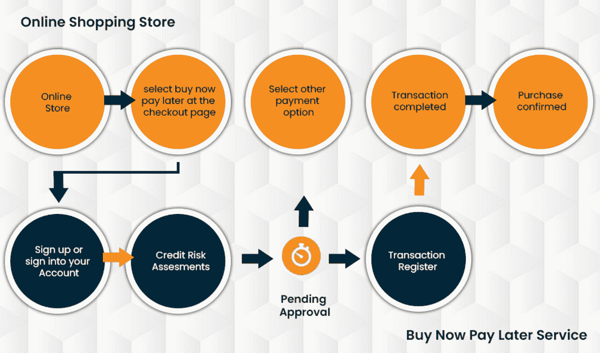
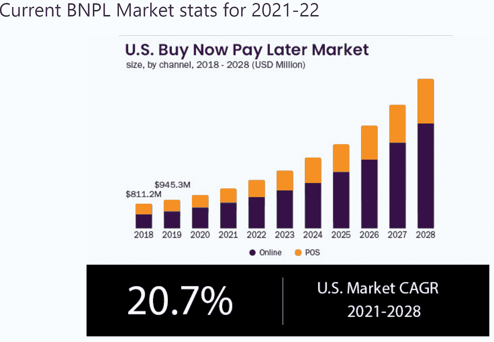
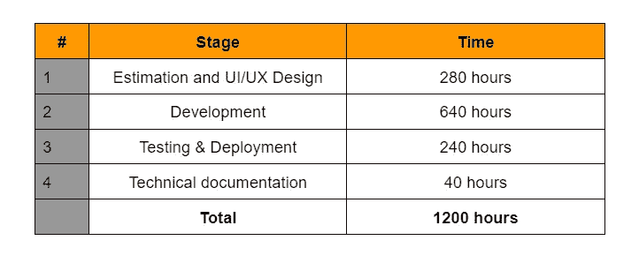

# 开发一个“先买后付”的应用程序需要多少钱

> 原文：<https://javascript.plainenglish.io/how-much-does-it-cost-to-build-a-buy-now-pay-later-app-73ba69bd6cf3?source=collection_archive---------12----------------------->

## 创建一个“现在购买，以后支付”的应用程序:它的成本、功能、商业模式等。

[Image Source](https://www.google.com/imgres?imgurl=https%3A%2F%2Fwww.e-commerce-magazin.de%2Fwp-content%2Fuploads%2Fshutterstock-1937369947-920x550.jpeg&imgrefurl=https%3A%2F%2Fwww.e-commerce-magazin.de%2Fwie-bei-einem-farbenhaendler-buy-now-pay-later-zum-erfolgsturbo-wurde%2F&tbnid=kjwl1_p_cqQ-MM&vet=12ahUKEwjvm_S5xp34AhWFg2oFHYsdDWgQMyglegUIARDbAQ..i&docid=R_rzklxzdGWdfM&w=920&h=550&itg=1&q=buy%20now%20pay%20later%20apps&hl=en&ved=2ahUKEwjvm_S5xp34AhWFg2oFHYsdDWgQMyglegUIARDbAQ)

当你缺钱的时候，很难抑制住想买你一直关注的东西的冲动。但是如果你想避免负债，赊购物品可能会带来灾难性的后果。幸运的是，现在有几个“*立即购买稍后支付应用*”可以让你在网上购买商品，而不用给他们你的信用卡号码，然后一旦你的支付周期到来，就把商品记入你的账户。

这些应用程序使你无需预先支付全价就能购物，在某些情况下甚至无需支付任何费用！然而，关键问题总是它要花多少钱？

在这篇文章中，我们将根据你使用的信贷或金融机构以及你决定花费的金额，详细分析*立即购买稍后支付应用*的确切费用。请继续阅读，进一步了解“立即购买，稍后支付”应用程序的成本，看看它是否是您投资的正确选择！

*   **先买后付应用的商业模式是什么？**

先买后付的应用有一个清晰的商业模式。他们只是为商家和买家之间的交易提供便利。商家向买方提供信用，但从保理公司获得信用作为抵押。

这些应用大多会通过提供 0%的利息或返现交易来试图让客户购买更多，尽管他们也通过收取每笔交易的少量费用来赚钱，通常是 1%至 3%。这不是一个过于复杂的商业模式，所以成本相当低。

没有理由任何大容量的应用程序需要为使用他们的服务收取很高的费用。

你可以把这些应用看作是制造商和消费者之间的中间人，在两端提供服务。他们能够以几种不同的方式赚钱，但他们都是围绕着他们最重要的收入来源，即他们在资产负债表上收取的利息。

消费者根据他们的购买习惯按固定利率收取利息，而零售商在销售后收到付款时支付利息。

*   **现在购买以后支付的热门应用将帮助您节省开支**

“先买后付”应用程序市场在过去几年里已经真正起飞，现在有许多选项可以帮助你以后支付，而不会增加更多的信用卡债务。

虽然它们被称为“现在购买，以后支付”应用程序，但它们也有其他好处，如返现奖励或其他激励措施，也可以为您的购买节省资金。

*如果你想省钱，这五大“现在购买，以后支付”应用将为你提供实现这一目标所需的所有工具。*

**1)确认**

Affirm 是一家为网上购物者提供分期贷款的公司。Affirm 的独特之处在于，它与亚马逊、戴尔和家得宝等 2000 多家电子商务零售商合作，提供店内融资选项。

这让购物者比市场上的另一个 buy now pay later 应用程序更加灵活，允许他们在传统的实体零售商那里购买商品，而不仅仅是在线购买。

此外，Affirm 接受通过 PayPal 和 Venmo(或直接从您的银行账户)付款，这对于那些不经常想将自己的信用卡信息添加到另一个网站的人来说非常方便。

2)克拉纳

Klarna 是一家著名的瑞典支付处理公司，在欧洲特别受欢迎。Klarna 为用户提供现在购买，以后支付的选项，以 0%至 29.9%的利率购买商品并在一段时间内支付。

Klarna 对需要更灵活还款计划的用户尤其有吸引力。此外，它为电子商务企业提供了一种无需使用昂贵的传统信用卡处理方式即可接受支付的方式。

**3)贝宝支付 4**

Pay in 4 是 PayPal 新的数字钱包应用程序的一部分。该公司还提供一个类似的项目，名为 PayPal Credit，让你可以分期付款购买产品和服务。

这有助于用户避免这些产品的利息费用，方法是将付款分散到不同的时间，并对选定的项目收取 20%或更低的利率。例如，你可以用 PayPal 信用卡以 6.65%的年利率支付 4 个月的费用。

这是一个购买大件商品的好方法，否则就不得不赊账或以更高的利率从其他地方融资。

**4)停薪留职**

Afterpay 为购物者提供了一种灵活的购买方式，否则他们将负担不起。Afterpay 允许你在几个月内付款，而不是一次付清，这是一个有吸引力的选择，可以帮助最小化消费者债务，并坚持预算纪律。

虽然 Afterpay 不完全是传统的“现在购买，以后支付”应用程序，但它确实提供了类似的功能:通过三个简单的步骤，Afterpay 允许客户在线购买商品，然后设置自动支付(包括延期支付选项)，这样消费者就不会感到匆忙地一次性付款。

开始

Sezzle 是一种在线支付服务，允许消费者在一段时间内分期付款，没有利息。它作为一个商业现金预付程序，帮助企业从那些如果有不同选择就会用信用卡支付的顾客身上赚钱。

Sezzle 还帮助那些正在与不良信用作斗争或无法获得信用卡的人在网上和商店购物。用户可以使用他们的脸书账户申请加入 Sezzle，不需要任何现有的信用额度。

# **立即购买稍后支付移动应用的主要功能**

随着 BNPL 移动应用程序的日益成功，越来越多的企业家寻求现在购买以后支付的移动应用程序开发也就不足为奇了。

以下是“现在购买，以后支付”移动应用的 10 个功能，它们可以真正帮助你的企业从竞争中脱颖而出，当你 [**雇佣移动应用开发者**](https://www.appsdevpro.com/hire-developers/hire-mobile-app-developers.html) 时，你应该要求他们添加所有这些功能。

**1)即时注册流程**

“先买后付”移动应用程序提供即时注册流程。一旦你下载了你最喜欢的应用程序并填写了你的个人信息，你就可以立即开始，而无需输入信用卡信息或等待代表回复电子邮件请求。

**2)快捷支付方式**

快速付款方式允许您在没有信用卡的情况下购物，然后在一段时间内以小额增量付款。这些金额会添加到您的手机账单中，或者从您的银行账户中扣除。

有些模式还允许你在几个月内分期付款。如果你想立即得到满足，但又不想在信用卡上有太多余额，那么购买“现在支付，以后支付”应用是一个很好的选择。

**3)透明低成本定价模式**

大多数 buy now 支付后来的移动应用程序，以拥有一个透明和低成本的定价模式。这些公司最突出的一点是他们非常实惠的利率，这使他们从传统的信用卡处理商中脱颖而出。

**4)贷款条款**

贷款条款规定了你必须偿还贷款的时间，以及你的余额需要支付多少利息。

**5)付款的 QR 扫描**

如今，大多数智能手机都内置了二维码扫描仪。这对于“现在购买，以后支付”的应用程序尤其重要，因为它允许用户即时读取他们的信用记录。当你 [**为你的应用雇佣安卓应用开发者**](https://www.appsdevpro.com/hire-developers/hire-android-developers.html) 时，你应该要求他们把这个功能放进去。如果他们是贷款系统的新手，这些功能对建立信任和确保整体的积极体验大有帮助。

付款重新安排和延期

“先买后付”移动应用的最大好处之一就是重新安排时间。如果用户需要更多的时间来付款，他们可以简单地重新安排他们的付款日期。

这给了他们更大的灵活性来管理他们的钱，并可以帮助他们避免滞纳金或费用，如果他们正在努力偿还特定的购买。

**7)退款**

如果你对你的购买不满意或者你改变了主意，现在购买，以后再支付应用程序，让你返回你的订单获得全额退款。您将在申请后几分钟内获得全额报销。

**8)在线文档**

许多人现在购买，以后再购买移动应用程序，以获得在线 KYC 文档功能，从而节省您的时间和金钱。通过使您能够通过移动设备提交这些详细信息，您可以摆脱纸质表格或对其服务收费的第三方公司。

**9)通知&提醒**

*现在购买稍后支付应用*允许用户在付款时收到通知和提醒。当你知道离付款期限还有多长时间时，就更容易为下个月的分期付款做预算。这有助于避免透支费用和你的帐户被拒绝。

**10)账户管理**

无论你的买家是在实体店还是网上购物，都有一个账户管理平台可以帮助他们管理债务。

我们精选的最佳*立即购买稍后支付应用*具有用户友好的账户管理和多种支付选项可供选择。

# **开发自己的立即购买稍后支付应用程序的六个步骤**

“先买后付”应用市场可能竞争激烈、拥挤不堪，但你可以用一款符合用户需求、超出他们预期的令人惊叹的应用来打破这种喧嚣。苹果的 App Store 和 Google Play 上有超过 300 万个应用程序，如果你按照这六个步骤 [**开发你自己的成功的“立即购买，稍后支付”应用程序**](https://www.appsdevpro.com/hire-developers.html) ，你的“立即购买，稍后支付”应用程序可能会成为下一个大事件！

**1)调查和评估你的听众**

在开发你的应用之前，调查和评估你的受众是非常重要的。有许多不同类型的应用程序可以满足非常特殊的兴趣和生活方式。在开始开发之前，确保你的想法有需求是很重要的，这样你就不会浪费时间或金钱在没有人会有兴趣下载的东西上。

2)准备项目范围

在开始开发之前，您需要准备一个项目范围，包括项目中将包含哪些功能。为了让使用你的应用的用户对它有一个概念，最重要的特性应该被指定。

例如，如果您的应用程序是一个电子商务网站，那么所有用户都想知道他们的钱在交易过程中有多安全，或者他们是否能收到退款。如果你的应用是一个众筹平台，那么用户应该知道自己的捐款是如何使用的，并在捐款前看到项目。

**3)找一家好的手机 app 开发公司**

人们总是寻找一个好的移动应用程序开发公司，以便他们可以开发出一个好的应用程序。如果你是他们中的一员，那么你有责任确保你选择了一个好的移动应用程序开发公司来为你开发一个令人惊叹的移动应用程序。

要找到这样一家公司，首先，对你所在地区的不同移动应用开发公司进行研究，确保他们的服务符合标准。其次，查看现有客户对这些公司的评论。

**4)为您的应用选择合适的技术组合**

在开发应用程序时，最重要的决定之一就是使用哪种技术。有各种各样的选择，我们强烈建议查看我们关于为您的应用选择正确的技术堆栈的帖子，了解有关每个选项以及何时可能是一个好选择的详细信息。

**5)检查法规符合性**

一旦你有了商业计划，下一步就是确认你开始开发应用程序是合法的。这里你应该做的最重要的事情是检查联邦和州一级的规章制度。

你可能会发现对某些应用程序的限制或禁止，这将决定你是否可以合法地开发你的应用程序。虽然涉及使用信用卡的应用程序可能会被完全禁止，但其他应用程序——如发薪日贷款——可能会被允许。

**6)测试您的应用并部署**

在彻底测试和调试之前，你不能部署你的应用程序，尤其是如果你打算对你的产品收费的话。和你销售的任何其他服务或产品一样，彻底的测试是至关重要的。

除了检查漏洞，你还应该看看你的应用程序处理交易的速度，并确定它是否需要客户的授权才能继续。确保您的代码符合任何必要的行业标准，以便潜在的业务合作伙伴会考虑与之集成。

## **开发一个定制的立即购买稍后支付应用程序需要多少成本？**

开发一个定制的“现在购买，以后支付”应用程序的成本不是其他类别的应用程序开发所能比拟的。

定价模式取决于许多因素，包括功能、使用案例和技术平台。由于这些可变因素，应用程序开发价格可能会因公司而异。

了解一款新应用的成本的最好方法是在网上搜索应用的构建成本或开发成本(别忘了你所在的行业！).根据大小和复杂程度，你应该预计为一个定制的“现在购买，以后支付”应用程序支付 2-4 万美元。

# **结论**

总而言之，你可以看到现在买以后付 app 开发不是一件小事。然而，如果你想成功和盈利，你应该开发这样一个应用程序，因为它允许你的客户在以后的某个时间以合理的月付款为他们的购买付款。我们随时准备为您提供帮助！

如果您有更多的问题或想讨论商机，您可以在印度 [**聘请移动应用程序开发人员**](https://www.appsdevpro.com/hire-developers/hire-mobile-app-developers.html) ！最后，如果你有足够的资金启动或从风险投资家那里获得资金，你可以开发一个你自己的“现在购买，以后支付”应用程序并从中赚钱。

======================================

*更多内容看* [***说白了就是***](https://plainenglish.io/) *。报名参加我们的* [***免费周报***](http://newsletter.plainenglish.io/) *。关注我们关于*[***Twitter***](https://twitter.com/inPlainEngHQ)*和*[***LinkedIn***](https://www.linkedin.com/company/inplainenglish/)*。查看我们的* [***社区不和谐***](https://discord.gg/GtDtUAvyhW) *加入我们的* [***人才集体***](https://inplainenglish.pallet.com/talent/welcome) *。*