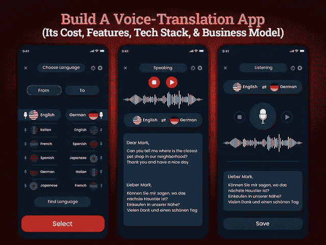

# 搭建一个类似语音翻译机的语言支持 App 需要多少钱？

> 原文：<https://javascript.plainenglish.io/how-much-does-it-cost-to-build-a-language-support-app-like-a-voice-translator-ad7e99329612?source=collection_archive---------7----------------------->

## 建立一个像语音翻译这样的语言支持应用程序:它的成本、功能和商业模式

无论你是跨国旅行还是将你的业务推向国际水平，沟通障碍都是各种人群中最常见的问题之一。学习一门新语言总是很有趣，但这从来都不是儿戏。这就是语言支持或语音翻译应用程序打破障碍并在经常出国旅行或做生意的人中间大受欢迎的地方。

随着全球化和日益增长的国际旅行趋势，语言差异已成为一个严重的障碍。这些障碍不仅影响了商业世界的发展，也限制了人们顺利前往他们选择的国家。事实上，本地市场迅速融入国际业务，导致对翻译应用的需求不断增加。然而，通过推出语音翻译应用程序，你可以抓住一个潜在的商机。它有望打破这些障碍，为国际商务和旅游业带来繁荣。

虽然推出语言翻译应用程序的概念包括以下服务，如配音、语言课程、翻译和口译、语言评估等，但这并不新鲜。然而，随着客户范围的不断扩大，语音翻译应用的范围也在迅速扩大，以满足客户不断变化的需求。

你不必相信我们的话。为了证明我们的说法，我们收集了一些统计数据，并对全球翻译服务进行了市场分析。

## **了解全球语音翻译行业的市场洞察**

语言支持应用程序已经存在很长时间了，但是随着人们需求的变化，是时候重新思考这些解决方案了。确保提供解决方案的高级语言服务应将口头和书面信息转换成另一种口头和手语。如果你打算通过雇佣 [**应用开发公司**](https://www.xicom.ae/services/mobile-app-development/) 来创建一个语音翻译应用，你需要确保你的应用解释正确的意思。随着时间的推移，越来越多的公司认识到拥有翻译应用程序的重要性，因此语音翻译应用程序的范围正在扩大。为了做出公正的决定，我们在这里收集了一些重要的事实和数据，将向您解释翻译服务的市场洞察力。

*   *根据研究与市场的调查报告，在 2020 年至 2025 年的预测期内，语音到语音翻译市场预计以 9.4%的* [*CAGR 增长。*](https://www.businesswire.com/news/home/20200401005536/en/Global-Speech-to-Speech-Translation-Market-2020-to-2025---Growth-Trends-and-Forecast---ResearchAndMarkets.com)
*   *基于* [*市场调研*](https://www.verifiedmarketresearch.com/product/global-translation-services-market-size-and-forecast-to-2025/) *，语言支持类 app 正在为进军法律、金融银行、医疗、旅游出行等市场铺路。*
*   *2020 年法律行业市场份额最大，为 37.36%，市场价值为*[*147.0903 亿，预计 CAGR 增长 2.33%*](https://www.verifiedmarketresearch.com/product/global-translation-services-market-size-and-forecast-to-2025/) *。*
*   *根据调查报告，2020 年翻译服务市场规模为 393.7 亿美元，预计到 2028 年将达到 462.2 亿美元。*

[Image Source](https://www.verifiedmarketresearch.com/product/global-translation-services-market-size-and-forecast-to-2025/)

希望有了这些市场研究的见解，你一定已经知道如何增加在 2022 年推出语言翻译应用的机会。如果你对为什么开发语音翻译应用程序越来越受欢迎感到左右为难，那么我们在这里列出了博客的主要亮点，以帮助你找到答案。

## **博客的主要亮点**

*   为什么语音翻译 App 开发越来越受欢迎？
*   语言支持应用程序是如何工作和翻译的？
*   如何创建语音翻译 App 及其功能？
*   创建语音翻译应用程序的主要功能
*   构建语言支持应用程序需要技术堆栈和应用程序开发团队
*   打造一款能听会说的语音翻译机 App 要多少钱？
*   结论

> 让我们进入这个博客的细节，详细了解这几点…

## **1。为什么语音翻译 App 开发越来越受欢迎？**

想知道为什么人们使用翻译应用程序？事实上，翻译应用程序在过去几年里有了显著的改进，使生活比以往任何时候都更容易。通过集成语音控制技术，这些解决方案使用户能够在以文本或音频格式说话时快速解码单词和短语。他们用得越多，他们就越能更好地解释文本和听起来不正确。

基本上，语音翻译应用程序创建了一个完美的桥梁，消除了您在聊天、阅读、看电视或电影或跨境旅行时遇到的语言障碍和打嗝的风险。通过雇佣 [**app 开发公司**](https://www.xicom.ae/services/mobile-app-development/) ，开发语音翻译 app 变得更加容易，因为他们了解这类 app 的技术要求。通过精心设计的翻译应用程序，用户可以轻松地将任何单词、文本或音频翻译成任何外语。

其次，将音频和文本翻译成不同外语的速度，使这些解决方案在市场上脱颖而出。此外，翻译应用程序消除了交谈中的磕磕绊绊，消除了对愚蠢手势的需求。不要再用你的手来解释你想说什么。

> 除此之外，以下是语音翻译应用的优势:

*   经常出差到不同国家的人可以利用这个语音翻译应用程序来消除语言障碍。
*   人们可以很容易地相互了解，并试图在没有任何语言差异的情况下相互传递信息。
*   当人们旅行或度假时，语音翻译应用程序是一个很好的工具。
*   此外，该应用程序的界面非常简单，可以快速访问。

## **2。语言支持应用程序如何工作并翻译文本和音频？**

毫无疑问，这些应用程序赋予人们权力和消除语言障碍的方式正在人们中间迅速变得重要。此外，这些应用在 Android 和 iOS 平台上很容易获得，因此，人们可以立即从应用商店下载它们。因此，如果你有兴趣为自己的初创公司开发一款语音翻译应用，那么你需要记住几件事；

*让您的应用程序在多个平台上可用，包括 Android、iOS、Windows 等。*

确保它可以免费下载并在多个平台上完美运行。

而说到语音翻译 app 的机制，就需要详细了解了。应用程序将特定语言翻译成所需语言的功能和操作依赖于各种技术。下面详细讨论一下语音翻译 app 的机制。

> **翻译应用程序是如何工作的？**

语音翻译应用程序的功能主要基于三个组件:

*   自动语音识别(ASR)
*   机器翻译
*   语音合成

现在，让我们来了解一下这些技术是如何支持应用程序并允许用户无缝翻译音频和文本的。

首先，自动语音识别技术通过用户的语音识别特定的语言。然后在机器翻译技术的帮助下，语言被进一步翻译成所需的语言，并通过 TTS 进行传递。虽然整体功能看似简单快捷，但为了让它完美运作，确保你 [**雇佣移动应用开发者**](https://www.xicom.ae/services/mobile-app-developers/) 来整合合适的技术。支持该应用的不同功能需要不同的技术选择。由于翻译可能需要文本和音频的形式，因此，整合正确的技术选择是值得的。

因为应用程序的美妙之处在于将一种语言翻译成另一种语言的完美。所以，同样重要的是，要考虑你能为这个应用提供什么样的特性和功能来改变用户体验。

## **3 .如何创建语音翻译应用程序及其功能？**

您的应用程序将添加哪些功能？这个问题的答案将是如何创建语音识别应用程序的主要部分。虽然你可以考虑在你的应用中增加一些功能，但是每增加一个都会增加应用开发的成本。那么，哪些功能需要在您的应用程序中进行优先排序呢？

> **让我们深入分析语音翻译应用的主要特点:**

*   **用户注册:**为了让用户登录应用，请确保您提供了多个应用注册选项。允许用户通过电子邮件 ID 或联系方式注册应用程序。为了加快注册过程，加入社交媒体登录来确保更好的用户体验是有意义的。
*   **选择语言:**为了让用户简单易行，允许他们选择自己想要翻译的语言。
*   **语音通话选项:**通过该功能，用户可以快速解码首选语言的音频信息。应用程序的这一属性将允许用户快速传达对话。
*   **离线支持**:即使在离线模式下，应用的该属性也允许用户访问应用。您可以 [**聘请应用开发者**](https://www.xicom.ae/solutions/hire-developers/) 定制该功能，使您的应用即使在功能有限的离线模式下也能正常运行。
*   **语言选项:**在应用程序中添加世界各地通用的语言选项。推出一个有多种语言选择的应用程序将获得好处，并使其成功。
*   **文本或聊天框:**通过允许用户接收翻译成文本消息的语音消息来扩展应用的功能。此功能简化了理解消息的过程。
*   **访问文件**:除了翻译信息，还允许用户直接从应用程序中将各种文件翻译成自己喜欢的语言。
*   **图片翻译**:实现这个功能会让你的应用在用户中很受欢迎。允许用户扫描图像，并让应用程序翻译成首选语言的意思。这个功能在旅行时会非常有用，你不了解各种标志。
*   **帮助和支持**:很多时候用户会对从哪里开始以及如何操作一个应用感到困惑。为了让第一次使用的用户更容易，您可以通过在屏幕上弹出每一步的消息来帮助他们。这一功能将激励用户使用该应用程序，并定期联系，甚至翻译这些短语的意思。
*   **内容分享**:这个功能会受到用户的高度赞赏。该功能允许用户通过电子邮件与其他人共享翻译的消息或音频剪辑。

这些是创建语音翻译应用程序的几个主要创新功能，使您能够在市场上树立标杆。但问题是做一个语音翻译 app 需要哪些技术。

## **4。构建语言支持应用程序所需的技术堆栈和应用程序开发团队**

开发语音翻译应用是一项复杂的工作。这不仅需要实施正确的技术，还需要一个专家团队来确保无缝的应用性能。所以，如果你打算打造一款语音翻译 app，那么你需要外包一家 [**手机 app 开发公司**](https://www.xicom.ae/services/mobile-app-development/) 。他们将提供一个完整的应用程序开发人员和专家团队，包括业务分析师、项目经理、应用程序开发人员、UI/UX 设计人员和应用程序测试人员。

> 就技术而言，以下是几个主要要求:

*   **安卓应用开发** : Java，Kotlin
*   **iOS 应用开发** : Object C，Swift
*   **跨** - **平台 App 开发** : React Native，Flutter，Xamarin
*   **分析**:谷歌分析
*   **位置**:地理围栏
*   **支付** : Stripe、Brain-tree、PayPal

现在我们转移到主要问题，创建一个语音翻译 app 需要多少成本…

## **做一个语音翻译 App 要多少钱？**

如果你最终决定开发一款语音翻译应用，那么你一定很想知道开发一款应用要花多少钱。但事实是，这要看情况！

开发语音翻译应用程序或语言应用程序的成本取决于各种因素，如操作平台的选择、应用程序设计的复杂性、特性和功能、应用程序开发团队、技术、开发人员的每小时成本等。

开发一个应用程序所需的总小时数将进一步计算各个开发人员的小时成本，以获得最终的估计。没有在线计算器可以帮助你确定开发一个应用程序需要多少时间，而你却不知道你的应用程序到底包含了什么。

如果要根据上面提到的特征得出评估结论，那么有必要将商业广告分成三个复杂部分。

*   **基本应用程序开发:**它包括基本的特性和功能，可能需要大约 4 到 6 个月的时间，成本约为 17，500 美元以上。
*   **现代应用程序开发:**它包括所有现代功能，如内容共享，使用语音检测，检测语言等，可能需要 6 到 9 个多月的开发时间。这种类型的应用程序版本将花费约 20，000 至 25，000 美元以上。
*   **高级应用开发:**语音翻译应用的高级版本将包括高级分析、文件格式翻译、机器人支持等。它利用先进的技术，使应用程序开发耗时 9 个多月。开发高级语音转换应用程序的平均成本将在 27，000 美元到 30，000 美元以上之间浮动。

在您将这些数字作为最终成本之前，我们建议您预约一个免费的咨询时段，与专家讨论您的业务需求。根据业务需求及其复杂性，成本和应用程序开发时间会有很大差异。

## **结论**

这些应用程序的功能以及在几秒钟内将人的语音转换成所需语言的方式，无疑正在获得全球用户的关注。因此，如果你也有兴趣开发一个语音翻译应用程序，那么你可以考虑聘请一家 [**移动应用程序开发公司**](https://www.xicom.ae/services/mobile-app-development/) ，它将帮助你整合正确的技术和方法选择，使这个应用程序正常工作。无论一个人说的话是以单词、短语还是句子的形式，一个 app 都会快速翻译出来。你所需要的只是带来你的想法，让专家将其转化为独特的产品。

因此，如果你期待创建下一个无缝翻译的大型语音翻译应用程序，那么你可以 [**联系我们**](https://www.xicom.ae/contact/) 或在下面提出疑问。

=====================================

*更多内容看* [*说白了。报名参加我们的*](https://plainenglish.io/) [*免费周报*](http://newsletter.plainenglish.io/) *。关注我们的* [*推特*](https://twitter.com/inPlainEngHQ) *和* [*领英*](https://www.linkedin.com/company/inplainenglish/) *。加入我们的* [*社区不和谐*](https://discord.gg/GtDtUAvyhW) *。*