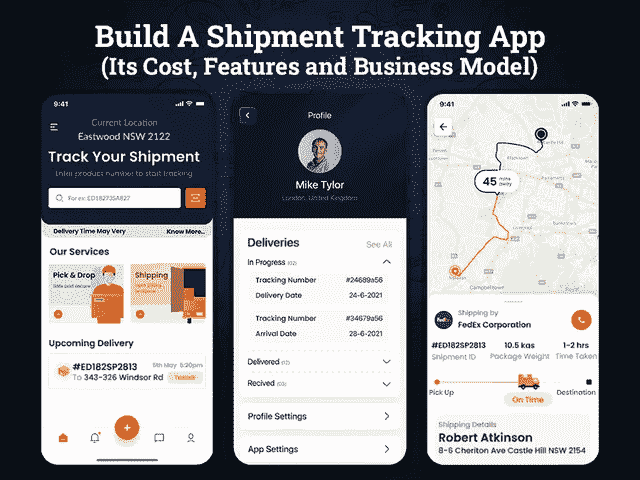
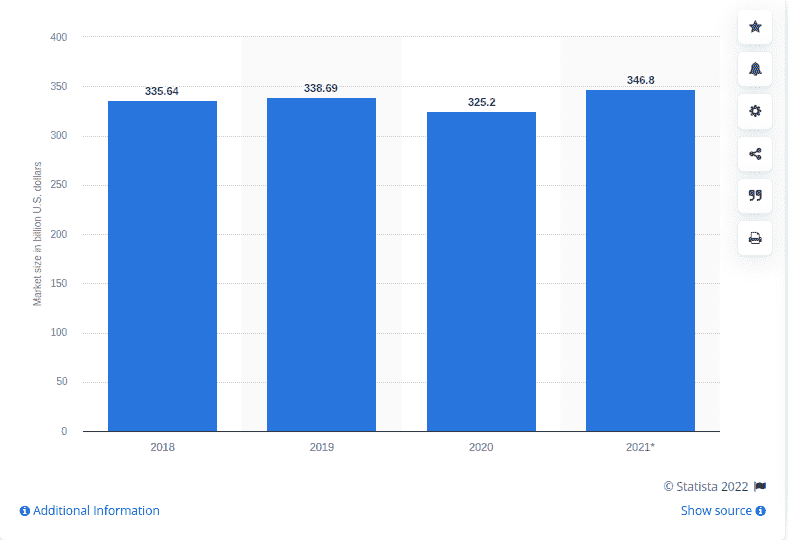

# 建立一个货件追踪应用程序要花多少钱

> 原文：<https://javascript.plainenglish.io/how-much-does-it-cost-to-build-a-shipment-tracking-app-66ed87e08239?source=collection_archive---------8----------------------->

## 建立一个货件追踪应用程序:它的成本、特点和商业模式

近年来，按需应用迅速出现在各个商业领域。随着对按需应用需求的激增，采用传统业务模式的企业正在迅速经历数字化转型。

据预测，到 2023 年，移动应用行业的收入预计将达到 9352 亿美元，这是一个为应用发布做计划的令人担忧的时间。

如果你属于物流行业，并计划将你的快递服务提升到一个新的水平，那么这将是一个开发货运跟踪应用程序的绝佳机会。按需经济已经成为趋势十多年了。随着 Postmates、Airbnb、优步等应用程序的出现，货物跟踪应用程序变得越来越重要，并重新定义了用户体验。

在疫情之后，无论是自愿还是被迫，人们都在快速转向移动应用。当他们可以在家中舒适地购物时，只需在智能手机上点击几下。那么，通过移动应用程序提供实时跟踪包装的便利可能是一个有价值的决定。

事实上，今天，大多数企业都需要某种订单跟踪系统来满足客户需求。实时货物跟踪已经成为几乎每一个智能手机用户的标准做法。但是，当谈到开发应用程序时，开发货物跟踪应用程序的想法开始让企业感到惊讶。

如果你也在纠结如何创建一个货件跟踪应用程序，以及创建一个应用程序需要多少成本？你可以为你的物流业务选择什么样的商业模式…

> 别担心，我们有你所有问题的答案…

**内容重点:**

*   *推出包裹追踪按需交付应用*
*   *包裹追踪按需交付应用:全球快递公司的市场分析*
*   *为什么以及何时您的物流企业需要包裹追踪应用程序？*
*   *货件追踪应用程序/软件是如何工作的？*
*   *如何创建按需交付的包裹追踪应用程序？*
*   *了解您的业务需求和竞争对手*
*   *为您的初创公司选择最佳按需包裹追踪应用*
*   *优先考虑创建货件跟踪应用的特性和功能*
*   *按需送包 App 团队需求*
*   *创建一个货件跟踪移动应用程序需要多少成本？*
*   *最终想法*

为了更好的理解，让我们深入挖掘这些要点…

## **1。引入包裹追踪按需交付应用**

货运跟踪应用程序已经占据了电子商务和货运业务领域的中心位置。借助这些解决方案，服务提供商能够让他们的客户随时了解订单的实时位置和状态。开发这种类型的应用程序的基本目的是利用机器学习和人工技术来收集数据。

通过利用这些技术的丰富性，该应用程序将自动发送关于装运的实时更新。使用这种类型的发货跟踪应用程序，用户可以准确地确定订单何时发货以及来自哪个地区。可以考虑聘请一家 [**手机 app 开发公司**](https://www.xicom.ae/services/mobile-app-development/) 定制 app 架构。一个应用程序显示关于货物和目的地的信息，以及交付时间表、预计到达日期、交付方式、跟踪号等等。此外，当交货状态发生变化时，客户信息会自动更新。因此，确保应用程序应该包括所有功能。

但是，如果你仍然想知道是否值得投资一个按需包裹追踪应用程序？为了做出明智的决定，让我们先睹为快，看看全球快递和本地递送服务的市场统计数据。

## **2。包裹追踪的按需交付应用:全球快递公司的市场分析**

在这个技术驱动的时代，客户不想承受不断给快递办公室打电话以跟踪包裹、获取更新、跟踪司机等令人头痛的事情。许多快递公司为您提供快递跟踪链接，帮助客户跟踪包裹的状态。但是现在时代变了。在这种快节奏的生活中，人们没有时间打开一个链接。事实上，他们在寻找一个即时的解决方案，在他们的手机屏幕上提供完整的细节。

> 当您的企业面临以下情况时，开发定制订单跟踪系统会非常有帮助:

*   如果你是一个制造单位，需要很长的交付时间和延迟，那么你可能经常收到客户的重复请求。在这种情况下，推出一款货件跟踪应用将是一个有价值的决定。
*   其次，万一你的客户更想知道产品的状态，比如产品在哪里。这给维护人员造成了不必要的压力和紧张。但是创建一个订单跟踪应用程序可以解决这个问题。

作为一名企业主，如果你关心为什么你应该投资一个货物跟踪应用程序，那么这里有一些你需要了解的市场分析和统计数据。

随着时间的推移，越来越多的客户对按需交付应用程序着迷。另一方面，这些解决方案使企业能够从客户那里赢得信誉。他们所需要的只是与最好的 [**移动应用程序开发公司**](https://www.xicom.ae/services/mobile-app-development/) 合作。专业协助将帮助他们将应用程序创意转化为完美的解决方案。无论你是物流公司、出租车预订公司还是快递公司，开发一个送货跟踪 app 都将是一个值得做的决定。

**全球快递服务市场分析**

*   *根据市场调查，快递和递送市场的净值将达到 1262 亿美元，预计在未来一年将增长 4%。*
*   *从 2016 年到 2021 年，快递和本地快递市场增长了 5.4%。*
*   *根据调查报告，预计从五年多到 2024 年**[*对快递和送货服务的需求将会增长。*](https://www.researchandmarkets.com/reports/3941516/global-courier-and-delivery-services-industry)*
*   **据 Statista 称，今年全球快递市场的估值将* [*达到 3467 亿美元*](https://www.ibisworld.com/global/market-research-reports/global-courier-delivery-services-industry/) *。**

**

*[Image Source](https://www.statista.com/statistics/1174434/couriers-and-local-delivery-services-market-size-worldwide/)*

## ***3。货件追踪应用程序/软件是如何工作的？***

*货件跟踪软件的机制简单明了，易于使用。它允许客户跟踪包裹的每一个细节的实时位置。让我带您一步一步地了解货件追踪应用程序的流程。*

****第一步:*** *出货的流程从准备单据开始。**

****第二步:*** *订单打包发货后，一个 app 会发出订单跟踪号。它包括流程中所有相关方的所有相关细节。**

****步骤 3:*** *根据这三个活动，用通知更新客户。**

*   *快递公司收到包裹时。*
*   *当包裹在运输途中时。*
*   *包裹送达时。*

****第四步:*** *包裹送达最终地址后，app 会要求送达确认。最后，在您的批准下，数据将最终存储在公司的数据库中。**

*简而言之，这些步骤听起来可能很简单，但是为了让它们看起来简单并且完美无缺，你需要理解应用程序开发的过程。*

# ***4。如何创建用于包裹跟踪的按需交付应用程序？***

*由于货件跟踪应用程序涉及复杂的结构并确保各种细节，因此，请确保您正确构建它以提供出色的用户体验。为了从长远来看节省您的金钱和时间，我们在这里指导您创建包装跟踪应用程序的以下步骤。*

## ***A .了解你的业务需求和竞争对手***

*创建一个能帮助你设定基准并满足市场需求的移动应用程序需要深入的规划和市场研究。在开始应用程序开发之前，花点时间了解你的业务需求、目标受众和发布应用程序的目的。*

*除此之外，想想你的应用程序的技术限制和应用程序开发所需的团队。此外，您的送货服务的地理位置如何？你会在一个城市提供快递服务还是扩展到全国？*

*除此之外，根据你的业务能力，什么样的包裹尺寸，重量和包装风格将被交付？*

*为了更进一步，这里你需要选择正确的商业模式。*

## ***B .为你的初创公司选择最佳按需包裹追踪应用***

*虽然开发包裹跟踪应用程序的简单咒语就像确保从包裹注册到最终交付的实时跟踪包裹的便利性一样简单。但是在你急着 [**雇佣一个手机应用开发者**](https://www.xicom.ae/services/mobile-app-developers/) 之前，你需要了解不同的快件追踪应用，以保证不同的服务。因此，我们将在这里讨论包裹递送应用程序的可能商业模式。让我们来看看你可以考虑的最受欢迎的应用程序开发选项。*

*   ***包裹追踪聚合器***

*如果你是一家快递公司，正在寻找一个标准的解决方案来从一个地方收集所有包裹的信息，那么开发一个包裹跟踪聚合器应用程序将是一个值得的选择。无论承运商是谁，您都可以跟踪您的所有递送。此外，该应用程序将通过及时的通知来更新交付状态。交付和包裹是这种包裹跟踪应用程序的完美例子。*

*   ***邮政和快递服务 App***

*如果你计划创建一个像联邦快递这样的快递服务应用程序，确保当天包裹交付，那么你可以创建一个邮政和快递服务应用程序。你所需要的是创建一个成熟的管理面板，以确保无缝的货件跟踪体验。*

*   ***类似优步市场的包裹递送应用***

*外面还有几百家商家还在从事传统的快递服务业务。优步不仅革新了打车行业，还彻底改造了按需配送行业。因此，开发一个类似优步的快递服务应用程序，将客户和快递服务提供商联系起来，将是一个不错的选择。通过这种方式，企业将获得便捷的递送解决方案，而客户可以及时获得包裹，并能够跟踪包裹。*

## ***C .优先考虑创建货件跟踪应用程序的特性和功能***

*一旦您理解了业务需求并最终确定了业务模型，就该考虑特性和功能的正确范围了。因为功能是你的应用程序最重要的组成部分，也会对预算产生很大的影响，所以优先考虑需求是值得的。在这种情况下，创建一个具有最重要功能的应用程序是开始开发过程的最佳方式。*

*现在的问题是，特性和功能的选择取决于您的业务模型和规范。但在这里，我们列出了包裹递送跟踪应用程序应该具备的一些基本功能。*

> ***创建用户面板的基本特性***

*   ***用户注册:**确保你考虑一个快速简单的注册和登录过程。还提供使用电子邮件 ID、联系方式或社交媒体集成登录应用程序的灵活性。*
*   ***个人资料创建:**允许用户通过提及地址、电话号码、电子邮件来更改、添加或编辑他们的帐户详细信息。ID、档案名称等。*
*   ***仪表板主屏幕:**通过此功能，用户可以访问主屏幕上的仪表板，查看包裹递送状态。他们可以直接从主页追踪包裹。*
*   ***实时跟踪:**通过实时跟踪功能，允许用户通过应用程序定位包裹的实时位置。*
*   ***ETA:** 值得添加此功能，以根据产品类型、重量和尺寸提供估计的包裹交付时间和成本。*
*   ***应用内客户支持:**增加了提供 24*7 协助的能力，具有 AI 聊天机器人功能，可以即时回复查询，减少接听电话的压力。*
*   ***推送通知:**此功能将帮助您让您的用户随时了解包裹的每个活动。*
*   ***折扣和优惠券:**增加检查包裹递送折扣或优惠券的灵活性。*
*   ***多支付集成:**为了方便用户通过多种方式进行支付，您可以集成一个多支付选项。*
*   ***评级和评论:**提供根据服务体验向服务提供商提供反馈和评级的能力。*

> ***创建快递面板的关键功能***

*   ***账户注册:**允许快递服务提供商使用管理面板批准的凭证进行注册。确保他们也上传身份证明以供核实。*
*   ***管理订单:**通过此功能，快递服务提供商可以在一个地方查看和管理订单列表。*
*   ***订单提货:**实施这一功能将是一个有价值的决定。你可以 [**雇佣一个移动应用开发者**](https://www.xicom.ae/services/mobile-app-developers/) 来定制它，并允许服务提供商从易贝、亚马逊、Doordash 等公司获取订单取件请求。*
*   ***交付状态更新:**提供检查包裹交付状态的能力，从包装开始，到送出交付，再到最终估计的交付时间。*
*   ***包裹详细信息:**快递服务提供商可以共享包裹详细信息，如尺寸、类型和重量，并相应地提供估计费用和时间。*
*   ***启用 GPS:** 借助应用内 GPS 功能，快递服务提供商可以访问包裹递送的最可行路线。*
*   ***递送历史:**有了这个功能，快递公司可以随时跟踪他们的递送情况。他们可以维护以前交货的记录并检查历史记录。*

> ***创建管理面板的功能***

*无论商业应用程序的类型或模式，你需要有一个扩展访问权限的管理面板。从使用仪表板跟踪整个包裹递送服务，到访问分析以确定业务进度报告。此外，您需要集成第三方分析工具来跟踪您的应用程序使用情况、用户活动等。*

## ***D .按需送包 App 团队需求***

*无论你是决定建立一个包裹追踪应用程序，如 Deliveries、doorwood 还是 FedEx，都要确保你身边有合适的应用程序开发团队。即使要构建一个 MVP 包裹追踪应用程序，你也需要一个由项目经理、业务分析师、应用程序开发人员、质量保证工程师和 UI/UX 开发人员组成的团队。外包一家 [**移动应用开发公司**](https://www.xicom.ae/services/mobile-app-development/) 的成本会因工程师的技能、应用的复杂程度、开发人员的每小时成本、开发人员的所在地等因素而异。那么做一个包裹追踪 app 要多少钱呢？当然，这将是你们许多人的一个压力很大的问题…让我们在下一节得到答案。*

*了解了开发货件跟踪应用程序的这些要素后，你们中的许多人都非常想知道推出一个应用程序的最终成本是多少。让我们深入探讨一下成本…*

## ***5。创建一个货件跟踪移动应用程序需要多少成本？***

*在评估创建包裹递送应用程序的成本时，请记住，创建应用程序没有标准成本。根据各种因素和业务目标，最终的应用程序开发成本可能会在 17500 美元到 20000 美元之间浮动。*

*现在，你们大多数人都想知道为什么这些估计之间有巨大的差异。在你对这个估计感到困惑之前，你需要了解应用程序开发的总成本是基于以下因素的:*

*   **应用程序的特性和功能；**
*   **应用程序的复杂性及其规模**
*   **操作平台的选择**
*   **app 开发所需的技术**
*   **你雇佣的应用开发团队**
*   **app 开发公司所在地区**
*   **UI 和 UX 设计与测试**

*根据这些因素和你的业务发展想法，专家能够计算出最终的估计。这些是粗略的估计，应用程序开发成本可能会根据应用程序的要求和复杂性而上下浮动。*

*如果你不确定你的应用程序想法转化为一个强大的产品需要多少时间，需要多少成本，那么就值得向专家预约一个免费咨询时段。他们将评估产品细节，并让您了解最终的评估结果。*

## *最终想法:准备好为您的企业开发一款货件跟踪应用程序了吗？*

*无论你是一家努力跟踪其交付情况的电子商务企业，还是一家试图跟上市场趋势的快递服务企业，还是一家涉足物流业务的初创公司，构建一个按需发货跟踪应用程序都将是一个值得的决定。一个货件跟踪软件，如果开发正确，可以为您的业务增加巨大的价值。可以聘请 [**手机 app 开发公司**](https://www.xicom.ae/services/mobile-app-development/) 定制 app。Sing 货件跟踪应用程序正在物流行业领域大力铺路，因此，请确保您正确地定制它。货件追踪应用程序是真正高效、安全和可靠的解决方案，确保了极大的便利性。*

*因此，如果你有任何关于开发一个货运跟踪应用程序的想法，但不确定如何在市场上设立一个基准，那么你可以 [**联系我们**](https://www.xicom.ae/contact/) 或在下面提出疑问。*

*=======================================*

**更多内容请看*[*plain English . io*](https://plainenglish.io/)*。报名参加我们的* [*免费周报*](http://newsletter.plainenglish.io/) *。关注我们的*[*Twitter*](https://twitter.com/inPlainEngHQ)*和*[*LinkedIn*](https://www.linkedin.com/company/inplainenglish/)*。加入我们的* [*社区不和谐*](https://discord.gg/GtDtUAvyhW) *。**