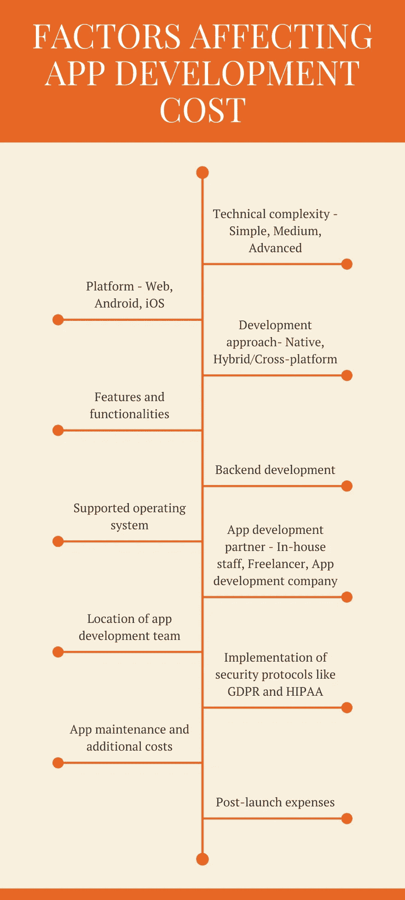
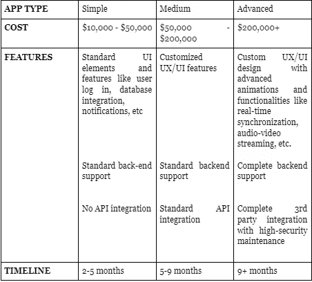
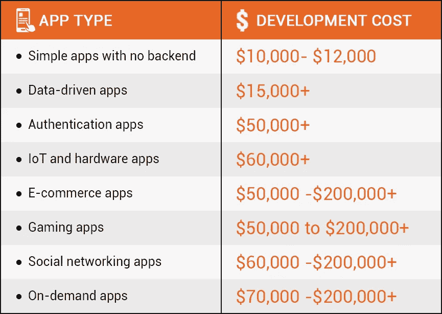

# 2022 年做一个 App 要多少钱？这是答案

> 原文：<https://javascript.plainenglish.io/how-much-does-it-cost-to-build-an-app-in-2022-heres-the-answer-b02ceb471b0f?source=collection_archive---------18----------------------->

## **以下是你如何计算 2022 年的应用开发成本**

想想人类最基本的需求。有 9/10 的几率你可以通过一个 app 遇到他们。虽然最初出于方便而受到青睐，但由于冠状病毒疫情带来的居家文化，移动应用现在已经成为一种必需品。

不相信我们？

**下面是一些统计数据，让我们了解移动应用在我们生活中的重要性。**

据报道，预计 2022 年消费者在移动应用上的支出将超过[1565 亿美元](https://www.statista.com/statistics/695104/worldwide-mobile-app-consumer-spend-by-region/)。到 2023 年，预计移动应用的全球收入将达到 9352 亿美元。人们还发现，目前，用户在手机上花费 92%的时间来访问移动应用程序，而在浏览器上仅花费 8%的时间。

如此惊人的统计数据证明，如果创业公司和中小企业想要在当今的商业世界中生存，投资移动应用程序已经变得至关重要。移动应用增加网站流量，推广品牌，培养与目标消费者的关系，并提高客户保留率。

# 开发一个应用程序要花多少钱:这对商业爱好者来说是个难题

通常是这样的。

一个有抱负或有成就的企业家首先想到一个革命性的想法，他/她相信这个想法会震撼市场。然后，他进行调查、投票，并通过他的市场研究发现，应用程序是接触目标客户的最佳方式。

**但接下来的大问题是……开发一个应用程序要花多少钱？**

如果你的商业想法也因为这样的困境而停止，这个博客就是为你准备的！虽然你也可以咨询软件专家来决定应用程序开发的预算，但更明智的方法是首先自己进行研究。

**这正是我们可以提供帮助的地方。**

从塑造应用程序开发项目的因素到不同类型应用程序的预算细目，我们提供了每一个关键信息来帮助您估算应用程序开发的成本。所以，在你匆忙准备 [**在印度**](https://www.suntecindia.com/hire-dedicated-developers.html) 或一家移动应用开发公司雇佣专门的软件开发人员之前，花点时间想想，“我的企业真正需要什么样的应用？”

> 你得到的答案将是你整个应用开发过程中的指南针。继续读下去，你会知道怎么做。

# 留出应用程序开发预算时，您应该考虑什么？

想出 2022 年的移动应用开发成本并不是什么难事。你需要做的只是记住一些要点。无论是对于一家初创公司还是一家成熟的实体店，你都应该首先定义你的业务所迎合的受众、你的最终业务目标以及编码平台。

根据您的需求，您可能希望 [**雇用专门的移动应用程序开发人员**](https://www.suntecindia.com/hire-mobile-app-developers.html) ，他们将进一步帮助您为您的移动应用程序选择特定的界面和功能。你可能还想添加一些元素来提升你的应用程序的独特性和可用性，比如按钮和仪表盘。请记住，这样的增强将会增加成本！

综上所述，每个 app 都是不一样的，影响其发展的因素数不胜数。下面我们已经指出了其中的大部分。在计划你的应用程序开发预算时，确保你已经在“要解决的问题”列表中勾选了所有的问题。

# 影响应用开发成本的主要因素

## **所有的因素都同样重要吗？**

嗯，所有的因素都很重要，但不是同等重要。

在构建一个应用程序之前，你需要完全清楚的是

*   您希望您的应用程序具备的功能
*   你的软件开发人员的时薪

> 让我们更深入地探讨一下这些因素。

对所有企业主的主要建议是，考虑他们希望他们的应用程序如何交互和易于使用。这有助于他们专注于应用程序的特定功能。现在，这一步绝对至关重要，因为功能的数量与开发一个应用程序所需的时间成正比。

以 Snapchat 等具有高级功能的复杂移动应用为例。我们向你保证，与一个标准的天气预报应用程序相比，它需要更高的预算和更长的时间来构建。

但这还不是全部。

还有一件重要的事情需要考虑，那就是你的开发团队每小时将收取多少费用。这个“时薪”不仅取决于你是打算雇佣移动应用开发公司还是自由软件开发者，还取决于他们在哪里。

> **这一切都好。但是还有更简单的方法来计算成本吗？**

如果你也想知道这个，我们对你的回答是…绝对是的！

通过我们经过测试的公式，你可以很容易地知道你需要多少钱来开发一个应用程序。

> **对于该公式，我们考虑了上述关键因素。**

**App 开发成本=(开发时间*功能)x 小时费率**

你所需要的就是弄清楚影响预算的关键因素，瞧！粗略的 app 开发成本就摆在你面前。

去吧。试试看！

> **常识:越复杂的应用程序，其成本越高**

给你一个平均的估计，开发一个应用可能需要 1 万到 20 万美元甚至更多。所有这一切都取决于我们在上面的等式中谈到的元素。如果我们不考虑费率/小时，决定你预算的关键因素是你希望你的移动应用程序拥有的功能。

> 那么，从哪里开始呢？

要展示这些特性，首先，要弄清楚你的总体业务目标。在此基础上，挑选出适合这些目标的应用程序，以及该应用程序需要哪些功能来吸引您的目标客户群。

对于某些类型的应用程序，开发人员可能需要集成内置的 UI 对象或第三方 API，这意味着您的口袋会有更大的压力。同样，如果你的应用需要授权功能或直观的功能，这些高级功能会让你的预算更高。

考虑到这种复杂性，我们现在可以将移动应用分为三个基本类别——简单、中等和高级。有了如此多样的功能，不仅每个类别的应用程序有不同的暂定成本，而且还有不同的开发时间表。

以上数字代表了行业估计。这意味着您的应用程序开发费用很有可能落入类似的成本范围，正如我们已经展示的那样。

## 记住这条规则:

**更简单的应用程序:更低的成本和更少的时间
高级应用程序:更高的成本和更多的时间**

除了我们已经讨论过的那些，你也可以像很多创业公司一样 [**计划开发一个最小可行的产品**](https://www.suntecindia.com/blog/how-mvp-can-benefit-mobile-app-development/) (MVP)。所以，如果你也有同样的想法，一个好主意是使用 MVP 开发服务。这不仅是一个更便宜的选择，需要 10000 美元或更少的预算，而且是一个省时的选择，因为开发一个 MVP 通常只需要几个星期。另外要考虑的是平台。例如，如果你计划在 Android 和 iOS 平台上同时发布一个基本的应用程序，它可能会产生更高的成本。

# 不同的应用程序类型—不同的应用程序开发成本

从更广的层面来看，对应用程序进行分类的一种方式是根据它们的用途和实际功能。正如我们上面解释的，你的应用程序的类型将决定要集成的功能，这将影响它的成本。因此，根据你的业务，决定你是否需要游戏应用程序、数据驱动应用程序、物联网应用程序或其他应用程序。一旦你决定了类型，确定你是否有预算购买更高级的功能，比如改进的视觉设计，动画，地理定位等等。

例如，与社交媒体应用程序相比，开发一个具有标准功能的小册子式应用程序会给你的口袋带来更小的压力。像宜家一样，如果你的应用程序需要更高级的功能，如人工智能(AI)、增强现实(AR)或虚拟现实(VR)，它将使你的预算高得多。

为了给你一个预算规划项目一个急需的推动力，我们在下面列出了 8 种最常见的应用程序类型以及开发它们所需的平均成本。

## 1.没有后端的简单应用

软件开发人员花费最少的时间和最少的预算来构建没有后端的简单应用程序。大多数时候，这些应用程序甚至不需要任何网络连接就可以访问。然而，随着无数先进的应用程序供消费者使用，这样简单的应用程序已经成为一个过时的概念。

如今，大多数企业更喜欢开发具有更现代功能的应用程序。尽管如此，像时钟、计算器、本地游戏这样的简单应用程序仍然可以在应用程序商店中找到，甚至对一部分人来说也很重要，尤其是老年人。

**开发应用的成本:10，000-12，000 美元**

**时间表:2-5 个月**

## 2.数据驱动的应用

与不需要后端支持的简单应用程序相比，数据驱动的应用程序具有更复杂的功能。也称为信息应用程序，这些应用程序处理特定的信息，并将数据存储在远程服务器或用户的设备上。除了后端支持，他们可能还需要其他功能，如访问摄像头、GPS、图库以及基于其用途的互联网连接。

十多年前，如果你想雇佣专门的软件开发人员来开发一个数据驱动的应用程序，那就需要一大笔预算。由于现在有几个可用的 API，这个任务不仅变得更容易，花费的时间更少，而且预算也更少。尽管现在不太流行，但这类应用程序仍被用于获取特定信息，如股市更新、天气预报、新闻等。

**开发该应用的成本:15000 美元+**

**时间表:1-2 个月**

## 3.认证应用

顾名思义，认证应用程序需要登录，最好是通过社交网络，用户才能访问其全部功能。然后，用户的个人账户与存储在服务器中的数据进行交互，或者在各种设备之间进行同步。

可能需要集成额外的功能和管理面板来促进内容和用户管理，这反过来增加了成本。在应用商店中找到的应用中，最受欢迎的认证应用是 Google Authenticator、Microsoft Authenticator 等。

**开发应用程序的成本:5 万美元+**

**时间表:3-6 个月**

## 4.物联网和硬件应用

物联网应用被认为是一些最现代的移动应用。这些应用程序可以将客户的设备与他们使用的物理设备连接起来，以实现更智能、更无缝的功能。为了发送和接收数据请求，这种应用程序通过 Wi-Fi 或蓝牙相互连接。

连接的物理设备可以包括家用电器、手表、宠物项圈等。

通过无线集成和使用报警和摄像头等功能，这些应用旨在改善互联物理设备的功能。

**开发应用程序的成本:6 万美元+**

**时间表:3-6 个月**

## 5.电子商务应用

2020 年后，如果有一个 app 类别出现了暴涨，那就是电商 app。根据调查报告，从 2019 年到 2020 年，花在移动购物应用上的时间增加了 30%，达到近 820 亿小时。由于产品目录、个性化推荐、购物车、愿望清单、支付整合等功能，甚至传统零售店现在也投资移动电子商务应用。

这样的应用程序有一个复杂的基础设施。除了强大的后端支持，他们还需要一个适当的管理面板来管理用户，订单，库存和支付。因此，如果你想建立这样一个应用程序，你最终的[**成本将取决于你的应用程序设计**](https://www.suntecindia.com/blog/how-much-does-it-cost-to-design-a-mobile-application/) 、复杂性以及你想要包含的功能。在这一类别中非常受欢迎的是像亚马逊、Etsy 和易贝这样的名字。

**开发应用程序的成本:5 万至 20 万美元+**

**时间表:3-9 个月或更长时间**

## 6.游戏应用

游戏应用是 Z 世代的最爱，是乐趣的新定义。从 Ludo 到《愤怒的小鸟》和《糖果粉碎》,这样的应用程序可以同时拥有简单和先进的功能。根据常识，构建一个像 Temple Run 这样复杂的应用程序显然需要更高的预算。

从技术角度来看，决定游戏应用成本的因素包括其对 AI 和 AR 支持、后端支持、3 D 图形、社交媒体功能等的需求。因此，如果你有一个有趣的想法和可观的预算，投资一款游戏应用将是一个明智的决定。为什么不呢？毕竟，2021 年统计报告 显示，游戏是最受欢迎的应用类别，远远超过了所有其他类别。

**开发应用程序的成本:5 万至 20 万美元+**

**时间表:4-12 个多月**

## 7.社交网络应用

在过去的二十年里，社交媒体应用已经发展成为移动应用行业的主导。这类应用程序为用户提供了一个平台，让他们可以通过交换文本、图像、gif、视频等与家人、朋友和其他人进行互动。由于这些程序需要处理大量的数据，明智的做法是雇佣一家 android 或 [**iOS 应用开发公司**](https://www.suntecindia.com/ios-application-development-company.html) 来确保强大的后端支持。

这一类别中最著名的例子是脸书、Twitter、Instagram 和 YouTube，它们需要相当大的预算和数年时间才能完全发挥作用。然而，如果你打算开发一个低调版的应用程序，比如评论和评级应用程序，或者约会应用程序，你的花费可能会少得多。

**开发该应用的成本:6 万至 20 万美元+**

**时间表:3-9 个月或更长时间**

## **8。按需应用**

在过去的几年里，点播应用已经征服了全球市场，成为一个万亿美元的产业。这些应用的内容会实时更新，旨在满足目标客户的特定需求。大多数时候，这些应用程序需要两种不同的解决方案，为用户和骑手提供不同的功能。

按需应用程序通常比其对手更复杂，不仅需要更高级的结构，还需要用户登录、管理和交付面板、用户登录、通信组件以及社交网络应用程序的功能。这一类别中最受欢迎的名字是优步和像 Uber Eats 这样的送餐应用。

**开发应用程序的成本:7 万至 20 万美元+**

**时间表:5-8 个月**

# **结论**

通过这篇文章，我们希望你在最终确定你的移动应用程序开发的预算之前，已经很好地了解了所有应该考虑的事情。如果你是一家初创公司或中小企业的所有者，并且有一个绝妙的想法，那么你最好聘请一家 [**移动应用程序开发公司**](https://www.suntecindia.com/mobile-app-development-services.html) ，它不仅会将你的想法变为现实，还会为你提供最高标准的应用程序开发解决方案。

如果你有一个移动应用的想法，想开发一个应用，并想讨论它 [**联系专家**](https://www.suntecindia.com/contactus.htm) 。

*更多内容请看*[***plain English . io***](http://plainenglish.io/)*。报名参加我们的**[***免费周报***](http://newsletter.plainenglish.io/) *。在我们的* [***社区获得独家访问写作机会和建议***](https://discord.gg/GtDtUAvyhW) *。**