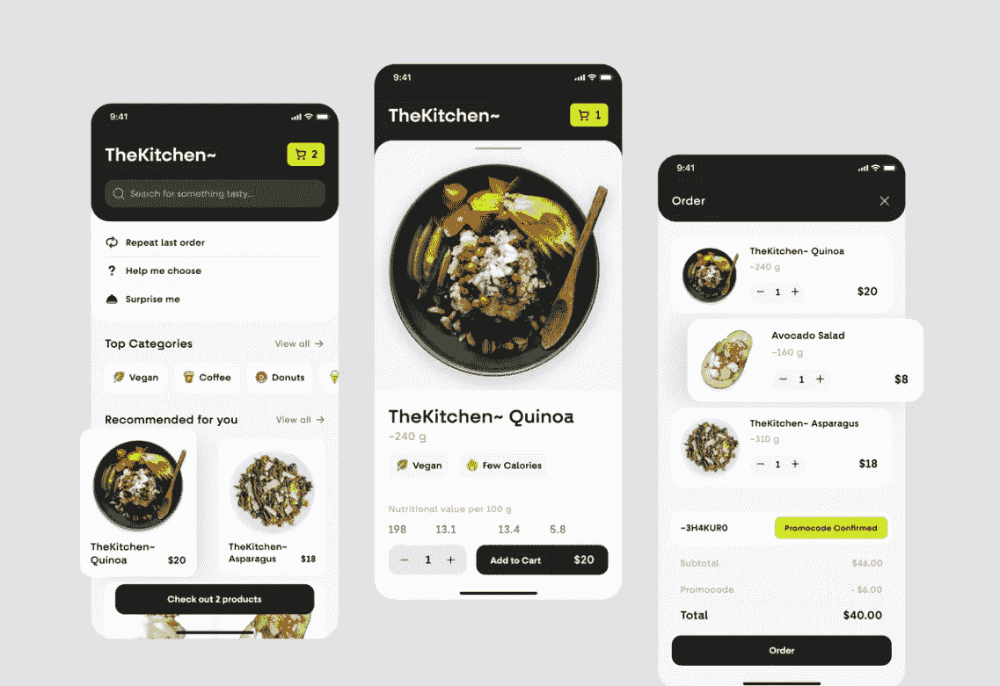
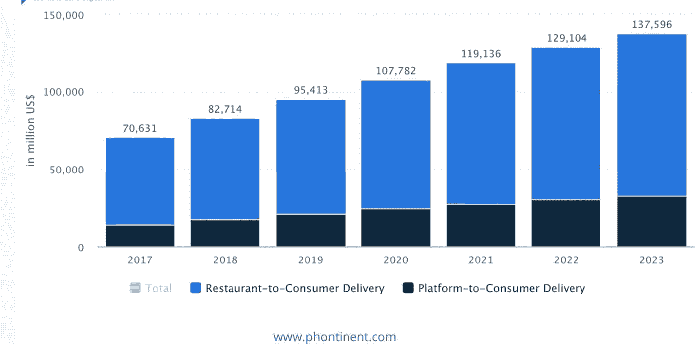
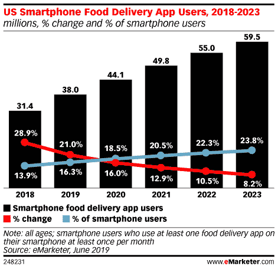
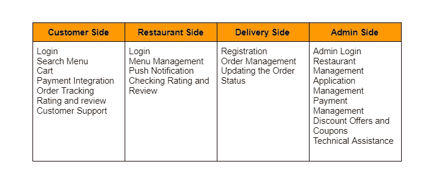

# 建一个像 UberEats 这样的送餐 App 要多少钱？

> 原文：<https://javascript.plainenglish.io/how-much-does-it-cost-to-build-an-on-delivery-app-like-ubereats-d8b48980190d?source=collection_archive---------8----------------------->

## 创建像 Ubereats 这样的送货应用程序的成本

[Image Source](https://dribbble.com/shots/18221219-Food-Delivery-App-Concept)

如果你生活忙碌，很难找到时间准备健康营养的饭菜。然而，当你可以使用像 UberEats 这样的食品配送应用程序时，你可以直接将新鲜的饭菜送到你的门口，而不必离开你的家或自己做饭。

**送餐 app 市场规模:**

你有没有想过开发一个送餐 app 要多少钱？或者更好的是，也许你一直在问自己开发自己的送餐应用程序要花多少钱？如果是这样，你很幸运！我们将深入分析开发像 UberEats 这样的应用程序的价格。然后，我们将根据价格和技能来看选择一家开发公司的优势和劣势。

## **1。什么是 UberEats？**

UberEats 是优步的送餐应用。如果你没有听说过优步，不要担心。它基本上只是一种使用 app 和 GPS 跟踪而不是人类司机的出租车服务。优步正在将其业务扩展到其他垂直领域(如食品配送)，这意味着许多人都在问一个非常重要的问题:什么是 UberEats？基本上，UberEats 为那些想要创建自己的餐厅外卖应用程序的人和那些想要提供外卖服务但没有自己的应用程序的餐厅充当了一个生态系统。

## **2。不同类型的送餐应用**

然而，在了解这些应用程序的成本之前，您需要了解目前市场上可用的不同类型的食品配送应用程序。

*   **餐厅配送应用**

近年来，餐馆外卖应用程序越来越受欢迎。事实上，GrubHub——它有一个从餐馆订购食物的流行应用程序——也提供从个别餐馆订购外卖和送货的选项。其他应用程序也提供类似的服务，包括 EatStreet 和 Delivery Dudes。尽管看起来专注有限，但这些小众应用可以为应用开发者带来巨额利润。

这些类型的应用依赖于当地的夫妻店，否则可能不会被饥饿的消费者发现；如果你住在一个较小的城镇，没有太多的餐馆选择，那么值得一试这些应用程序！

一些应用程序开发者让你可以看到每家餐厅提供什么样的食物，而其他人只会显示他们的菜单，没有描述或评论。许多还集成了第三方应用程序，如优步和 Lyft，使您无需打开多个移动应用程序就可以轻松快速点餐和付款。

*   **商店自有交付应用**

商店自有的交付应用程序通过将所有商品放在一个地方，为顾客提供了更轻松的购物体验。如果你经常在杂货店或连锁药店购物，从商店自有的应用程序订购会很方便。

你不需要下载任何其他送餐应用程序；您已经知道如何使用它，这很好，因为它将有助于降低您的成本！

包括 Whole Foods 和 Publix 在内的一些杂货商已经开发了自己的送货应用程序。CVS 和 Petco 等商店也开始开发应用程序，提供从处方到宠物食品的一切商品。

*   **有后勤支持的平台**

一个有物流支持的平台有多种交付服务，这些服务以集成的方式进行安排。这种划算的模式意味着，顾客将经常享受免费送货和免费食物，尤其是如果他们拥有一个提供送货服务的账户。当你 [**雇佣一个手机应用开发者**](https://www.appsdevpro.com/hire-developers/hire-mobile-app-developers.html) 时，你可以要求他/她根据你的需求添加特定的功能。

当谈到烹饪时，通常有更广泛的选择，同时便利性也经常增强。这些都是你在选择送餐 app 要用什么平台的时候要考虑的因素。

## **3。点餐系统的必备功能**

如果你正在开发一个新的食品应用程序或重新设计一个现有的应用程序，你会希望将此作为一个功能清单，以包括在你的食品订购应用程序中。

## **4。你需要的送餐应用建设团队**

从头开始构建一个送餐应用程序可能是一项艰巨的任务，尤其是如果你打算独自完成或者只和一个人一起完成。以下是所有可能帮助你的应用程序构建项目取得成功的人，以及他们能带来什么，他们可能做多少工作。只要确保每个人都提前了解自己的角色就行了！

*   **项目经理**

对于任何组织来说，项目经理都是一项关键资产，当你在处理一个复杂的项目时，这一点尤为重要。你的公司及其技术基础设施的规模将决定你是否需要一个 IT 项目经理，或者只是需要有人指导你完成一个简单的应用程序开发过程。(如果你找不到内部专业人士，那就去找专门从事项目管理的承包商或自由职业者。)

*   **UI/UX 设计师**

用户界面(UI)和用户体验(UX)设计师负责创建一个不仅在视觉上吸引人，而且易于使用的应用程序。用户界面/UX 设计将是一个协作的努力；你的设计师可能有你没有考虑到的功能或布局的想法。一旦你有了一个 UI/UX 设计，你的程序员将能够根据他或她所看到的创建一个合适的移动应用用户界面。

*   **App 前端开发者**

前端移动应用程序开发人员负责用户界面以及用户如何与之交互。如果你想建立一个看起来很棒的应用程序，在你的团队中有一个前端开发人员是一个好主意。而且，如果你要做原生应用，拥有一个全栈 [**前端移动应用开发者**](https://www.appsdevpro.com/hire-developers/hire-front-end-developers.html) (他可以处理后端和前端)也是必要的。

*   **App 后端开发者**

后端移动应用开发者负责构建和维护支持应用的软件系统。他们的大部分工作是用 web 开发语言完成的，如 Node.js、Ruby、Python 和 PHP，以确保前端开发人员可以通过 API 访问数据。他们还将用户数据存储在数据库和其他信息存储解决方案中，以创建应用后端架构(应用的一部分，所有功能都在其中)。

*   **QA 测试专家**

在向市场发布应用程序之前，确保它已经过至少一名质量保证(QA)专业人员的测试。该团队成员将在您的代码中寻找任何错误或低效之处，并帮助您确定用户是否能够成功使用基于其当前设计的应用程序。如果你负担得起，雇佣一个 QA 测试员是一个增强你的开发团队和减少时间延迟的好方法。

## **5。影响送餐 App 开发成本的六个因素**

根据您的需求和您雇佣的开发人员的技能，食品交付应用程序的开发成本可能会有很大差异，但有一些共同的因素会影响从头开发一个应用程序的成本。为了帮助您理解哪些因素影响了食品配送应用程序的开发成本，我将在下面更详细地讨论这六个因素

*   **功能范围**

应用程序可以做很多不同的事情，但如果你不确定你需要什么，甚至不确定什么是可能的，那么最好从一个小规模的应用程序开始，然后再构建它。从头开始创建一个送餐应用程序需要大量的工作，并且价格不菲。问自己我真正需要什么将帮助你在开发过程中保持低成本。

*   **平台数量**

大多数食品交付移动应用程序都是为多个平台设计的。你瞄准的平台越多，你的应用开发成本就越贵。例如，如果你决心为 iPhone 和 iPad 开发一个 iOS 应用程序，那么它的成本将高于开发一个只能从一个设备访问的原生 Android 或 Windows 应用程序。

*   **复杂性**

你的送餐应用的大小和复杂程度会影响开发成本。如果你正在开发一个只有几个关键功能的简单应用程序，这将比开发一个有很多功能的应用程序更便宜。此外，为 iOS 和 Android 等多个平台开发的应用程序通常比专为单一操作系统设计的应用程序价格更高。

*   **时间框架**

完成项目所需的时间将直接影响项目的成本。花费的时间越长，你需要投入的资金就越多。大多数公司按小时收费，并将其服务加价 10-30%。

*   **送餐 app 开发地点**

应用程序开发的位置会影响其成本。在旧金山或硅谷等较昂贵地区开发的应用程序通常比在海湾国家和印度等较便宜地区开发的应用程序更贵。

这是因为工资更高，导致程序员的时薪更高。尽管东欧的开发人员可能没有美国的开发人员经验丰富，但他们能够工作得更快，因为他们愿意以更低的速度工作更长的时间。

*   **开发者体验**

虽然看起来成本就是钱，但影响应用开发成本的很大一部分是体验。当你 [**雇用拥有丰富专业知识和经验的移动应用程序开发人员**](https://www.appsdevpro.com/hire-developers/hire-mobile-app-developers.html) 时，他们将能够快速高效地工作，从而为你节省资金。

*   **送餐 App 开发成本**

创建一个应用程序的平均成本会根据你想要开发的应用程序的类型、涉及的工作量以及开发团队的不同而有很大的差异。

根据 AppsDevPro 的数据，一个 iOS 应用程序的平均成本约为 25000 美元，通常需要 6 到 10 周的开发时间。对于 Android 应用程序，创建一个独特的、可在多种设备(例如:Android 平板电脑)上使用的应用程序平均需要 2 万美元。

价格上涨可以归因于苹果公司限制开发，因此很少有公司在他们的市场上竞争；以及专门为苹果产品开发应用程序所需的额外开发时间。

# **7 进入移动食品配送市场需要克服的挑战**

根据 Packaged Facts，到 2022 年，全球食品配送服务市场(包括数字和非数字渠道)的价值将达到 102 亿美元，是 2020 年 47 亿美元的两倍多。

这种兴趣很大程度上来自于希望利用这一趋势并以自己的服务进入市场的新公司。

然而，这一领域的成功可能很难实现；在进入市场之前，必须考虑多种因素，以避免某些挑战，使您的业务难以蓬勃发展。

**1)竞争激烈**

送餐的竞争比以往任何时候都激烈。新贵已经出现，每个都希望与 GrubHub 和 UberEats 等巨头竞争市场份额。如果你想赢得你的用户份额，重要的是你要从第一天就明白你将面临什么。

市场已经拥挤不堪，被早已完善策略的玩家所主导；如果你从第一天起就没有脱颖而出，很可能你的生意还没起步就已经破产了。专注于创造一个原创产品或一个利基角度——然后在其他公司开始模仿你的商业模式时坚持下去。

**2)寻找合适的合作餐厅**

餐厅合作是大多数食品配送服务的核心。面临的挑战是找到餐厅合作伙伴，他们将为顾客提供优质的食物，并作为单一产品的一部分帮助营销他们的产品。你需要选择不仅能提供优质顾客服务，而且价格对消费者和你所在地区的其他餐馆都有竞争力的餐馆。

一些送货服务通过最初与当地咖啡店或杂货店合作取得了成功；其他的，比如 DoorDash，提供了一个应用程序，可以从任何一家当地企业订购任何类型的食物。

**3)决定 MVP 特征**

你可以使用一些现成的软件，但这并不意味着你有最好的软件。您可以从头开始定制一个应用程序，但这可能会花费大量的时间和金钱。相反，开发一套功能(并雇用移动应用程序开发人员将这些功能添加到您的应用程序中)，这些功能对于您的产品的第一个版本或最小可行产品(MVP)来说足够好。

MVP 会让你很快进入市场，这样你就可以开始得到反馈，了解你的想法在现实世界中的效果如何。MVP 中的特性之外的特性应该被认为是一个不错的选择——但不是必需的——因为它们可能会增加不必要的复杂性。

**4)找到一家知名的送餐应用开发公司**

虽然，有数百家公司提供移动应用程序开发服务。但并不是所有的都提供世界级的服务。所以，对于一个企业或个人来说，找到一个有信誉的 [**应用开发公司**](https://www.appsdevpro.com/) 是很有挑战性的。在雇用任何移动应用程序开发服务之前，首先要记住的是他们过去开发过什么类型的应用程序，以及他们的客户名单有多大。

**5)生成初始客户需求**

也许你最大的挑战之一就是让顾客加入进来，因为很难把你的服务说出去。虽然有很多餐馆网站也是社交网络，但它们已经有了固定的客户群。当你请求人们使用他们从未听说过的服务时，你很难获得关注。

为了让人们需要你的服务，他们需要一个理由——不仅仅是因为它的存在。为了确保你产生最初的客户需求，头脑风暴创造性的方法，你可以通过相关的或对潜在客户有吸引力的渠道有效地推销自己。如果人们不了解你，他们怎么可能会要求你卖什么呢？

**6)物流**

事情并不总是像看起来那么简单。说到物流，你需要关注两件事:确保送货员的安全和处理食品质量。如果竞争对手已经在物流方面工作了一段时间，你可能很难找到愿意为你的新品牌工作的优秀送货人员。如果他们点的菜来晚了或者湿了，你可能会让客户不高兴。在与供应商或服务提供商签订任何合同之前，请确保您考虑了这些送餐挑战。

**7)营销和广告**

到目前为止，营销和广告是任何企业面临的最大挑战之一，尤其是初创企业。随着广告成本的飙升和营销渠道的日益增多，小企业主或企业家通常很难确定哪些渠道最适合他们的需求和预算。当然，有了今天的在线工具——包括像脸书和 Twitter 这样的社交媒体平台——精明的企业家可以通过点击付费广告在购买前进行尝试。

*   **送餐 App 的大概费用**

众所周知，开发一个应用程序需要钱，但最终花多少钱来制作应用程序可能会令人惊讶:根据你的需求、可定制性和规模，开发一个应用程序可能需要几千美元到几十万(甚至几百万)美元。根据我们的经验，大约 20，000-25，000 美元是贵公司需要投资开发成本的一个很好的大概数字。

# **结论**

像 UberEats 这样的食品配送应用，不可否认它们对行业的影响。然而，随着全球各地对这些服务的需求迅速增长，成为一名创业者仍然有可能获得成功。如果你准备好获得许多机会，那么我们建议雇佣一名专家 [**移动应用程序开发人员**](https://www.appsdevpro.com/hire-developers/hire-mobile-app-developers.html) ，他们可以定制你的特定解决方案需求，并提供关于在这个本地市场中什么最有效的见解。

=======================================

*更多内容看* [*说白了。报名参加我们的*](https://plainenglish.io/) [*免费周报*](http://newsletter.plainenglish.io/) *。关注我们的* [*推特*](https://twitter.com/inPlainEngHQ) *和* [*领英*](https://www.linkedin.com/company/inplainenglish/) *。查看我们的* [*社区不和谐*](https://discord.gg/GtDtUAvyhW) *加入我们的* [*人才集体*](https://inplainenglish.pallet.com/talent/welcome) *。*