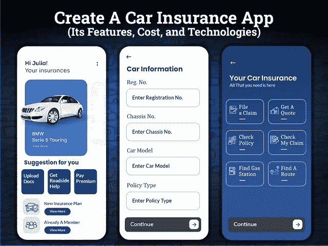

# 创建一个汽车保险应用程序需要多少钱

> 原文：<https://javascript.plainenglish.io/how-much-does-it-cost-to-create-a-car-insurance-app-ea18d84051ae?source=collection_archive---------12----------------------->

## 创建汽车保险应用程序:功能、技术和成本

你是经营保险公司还是属于汽车行业，在寻找提高服务质量水平的方法？汽车保险移动应用程序解决方案可以帮助您增加业务优势。

但一个标准问题是，2022 年创建一个车险 app 需要多少钱？为什么需要创建车险 app？这是阿联酋市场的趋势吗？

等等…我们在这个博客里有所有问题的答案！

数字化正在改变商业世界，开发一个汽车保险应用程序是在蓬勃发展的市场中扩大业务规模的完美步骤。通过创建一个专门的汽车保险应用程序，汽车企业主可以大大增加他们在市场中脱颖而出的机会。

保险公司不得不做出巨大努力来亲自为保险提供便利或争取每个客户的日子已经一去不复返了。汽车保险应用程序可以加强您的地位，通过提供数字解决方案使您能够实现您的目标。事实上，有一个选项可以自动吸引用户的注意力，包括各种优惠、折扣、保单交易。

此外，根据谷歌趋势，汽车保险应用程序越来越多地出现在搜索查询中。而这正是保险公司和汽车业务爱好者抢抓新机遇的最大迹象。

想知道你为什么应该投资汽车保险应用程序，以及创建一个像 State Farm 这样的汽车保险应用程序需要多少成本？

让我们逐一讨论你所关心的问题。通过详细的市场调查和对竞争对手的分析，我们试图从中提取有价值的见解，以帮助您做出明智的决策。

以下是这篇博客的主要亮点:

*   *你为什么要为你的汽车保险公司开发一个应用程序？*
*   *2022 年你能想到的汽车保险应用类型*
*   *汽车保险应用程序的发展趋势，你可以跟随它走向成功*
*   *如何为 2022 年的创业公司打造一款车险 App？
    -车险 App 开发必备功能
    -让你的车险 App 在市场上脱颖而出的小技巧*
*   *创建一个车险 App 需要多少钱？*
*   *结论:在 2022 年让您的汽车保险业务更上一层楼*

让我们深入挖掘这篇博客的细节，从零开始了解汽车保险应用程序的开发过程…

## **为什么要给自己的车险公司建 App？**

毫无疑问，汽车保险行业正在蓬勃发展。这就是为什么保险公司想方设法吸引和留住他们的客户。

事实上，移动应用程序提供了极大的便利，可以公平地说，随着移动应用程序使用的增加，是时候利用数字化的好处了。移动应用的便利可能会帮助你在 2022 年扩大业务规模。

由于汽车保险市场和行业在数字方面落后，因此，是时候通过简单地开发一个汽车保险应用程序来解决这些问题了。如果你还在寻找证据来说服你创建一个汽车保险应用程序。

**了解汽车保险公司的市场统计**

*   根据调查报告，在过去三年中，使用数字工具且满意度最高的客户中有 [20%的增长](https://www.jdpower.com/business/press-releases/2020-us-claims-digital-experience-study)。
*   根据市场研究，2019 年全球汽车保险市场规模为 7393.0 亿美元，预计到 2027 年将达到[1.06 万亿美元。预计从 2020 年到 2027 年，该市场将以 8.5%的 CAGR 增长。](https://www.alliedmarketresearch.com/auto-insurance-market)
*   根据 BITKOM 研究报告，55%的德国消费者在网上购买汽车保险，年龄在 30 岁以下。

*除此之外，保险业务和保险应用程序开发领域还有一些值得注意的事实。*

*   前 100 家机构中有 51%根本没有移动应用程序。
*   其中 30 个拥有原始的移动应用。
*   排名前 6 的公司在他们的投资组合中有 3 个或更多的移动应用。
*   前 10 大机构中有 3 家没有应用程序。

所有这些事实都强烈预示着汽车保险公司的新机遇。投资者将屈服于对移动应用的投资，成为一个创新的移动优先的保险颠覆者。在你急着聘请一家 [**手机 app 开发公司**](https://www.xicom.ae/services/mobile-app-development/) 之前，你需要去查一下另外一面。另一方面，一个应用程序商店通常包含超过 2500 个汽车保险相关的移动应用程序。但其中一个担忧是，人们不会通过移动商店购买此类产品。

想知道为什么人们不通过移动商店购物，这是因为每个应用程序都不提供特殊的移动保险服务。应用程序开始失去市场潜力。

所以作为一家创业公司，如果你打算创建一个汽车保险移动应用程序，那么你需要了解你的客户。记下他们花了多少钱，花了多少时间在手机上，他们就在那里见面。

*所以你一定想知道你需要开发什么类型的应用来启动你的业务？*

# **你能想到在 2022 年创建的汽车保险应用类型**

在你深入研究如何创建一个汽车保险应用程序的规范之前，先花点时间了解一下业务需求。当人们谈论汽车保险应用程序时，他们经常会问汽车保险应用程序的类型。作为一个企业主，你必须关注各种各样的政策。

*所以把车险应用分成三个不同的类别来解决主要问题:*

*   **省时应用:**这种类型的应用会建议司机选择最佳路线到达目的地，不要理会交通堵塞。节省时间的应用程序的另一个方面是提供简单快捷的方式来快速提交保险索赔，并简化保单注册过程。
*   **省钱应用:**人们不会介意通过应用省钱，这种进步的应用提供了省钱的好方法。但是要创建一个应用程序，你需要 [**雇佣一个移动应用程序开发者**](https://www.xicom.ae/services/mobile-app-developers/) 。它们帮助你更好地了解目标受众的消费习惯。例如，通过将机器学习集成到应用程序中来提供经济驾驶的提示。它会分析用户的驾驶风格，并向你建议如何让它更高效。
*   **减压 App:** 提供安全驾驶提示和指南，最大限度降低发生事故的风险。这类车险 app 是现代车险 app 值得选择的。

无论你决定为你的企业创建哪种类型的应用程序，确保你将独特的特性和功能结合起来，使它成为一个通用的解决方案。

# **如何为 2022 年的创业公司打造一款车险 App？**

“你需要在应用程序中包含哪些特性和功能”是这个问题的最大部分，是如何创建一个汽车保险应用程序。不管你的业务需求和应用程序的复杂性如何，这里我们列出了创建任何汽车保险应用程序的一些基本功能。所以一定要考虑这些基本特征…

*   **账号注册:**和其他 app 一样，账号注册是你 app 的第一步，也是最关键的一步。在谈车险 app 的时候，确保你提供了两个注册的选项。允许他们使用电子邮件 ID 或联系方式进行注册。此外，用户应该提到个人资料，如车辆号码，地址，联系方式等。
*   **索赔表:**列表中的第二个特性是添加一个索赔表。确保它能被快速访问和简单归档。允许用户通过此功能申请付款或提交索赔。
*   **客户反馈:**无论你的公司有多受认可，用户仍然可以对你的任何服务不满意，并有权分享他们的担忧。有了这个功能，让他们表达他们的问题并留下反馈，并保证他们的问题会在 48 小时内得到考虑。
*   **实时聊天:**如果之前的功能不足以提供客户支持，那么可以在您的 Android 和 iOS 平台的汽车保险应用程序中添加实时聊天功能。要实现实时聊天支持，您甚至不必指定任何全天候工作的操作员。相反，你可以考虑雇佣一家 [**软件开发公司**](https://www.xicom.ae/) ，帮助你利用人工智能技术，让你实现聊天机器人。它可以帮助用户留言，聊天机器人会自动回复。
*   **安排预约:**通过此功能，用户可以在方便时安排与代理的预约。
*   **保单详情:**屏幕应提供打印保单的数字版本。通过此功能，用户可以查看活动保单的条款和条件。此外，您可以考虑添加按钮，用于打印输出、保存、下载或在电子邮件上共享。
*   **快速访问文档:**让用户访问应用内扫描仪，立即上传身份证、保单详情等文档，而不是携带纸张。你所需要的是确保一个安全的平台来上传文件和限制第三方访问。
*   **实时 GPS 跟踪:**忽视通过移动设备进行实时跟踪的优势是不明智的。通过这一功能，可以确定用户的位置，这样当用户提出索赔时，服务提供商可以立即知道位置。
*   **路线规划:**是车险 app 的另一个重要功能。虽然它与保险应用程序并不直接相关。然而，这可能是一个提前规划和建立路线的绝佳机会，这将进一步帮助驾驶员提前规划他们的路线，并确保智能驾驶体验。
*   **在线道路援助:**这可能是对司机最大的援助。Win 按需道路救援功能允许司机立即按下紧急帮助，并让您的应用程序定位实时位置。此外，确保该功能在离线和在线模式下都能工作。
*   **保费计算:**交保险就是计算保费。因为它包括数百件事情，所以不要手动计算，确保用户可以通过简单地添加细节或选择汽车保险政策来获得估计。
*   **设置提醒:**为了让你的用户参与到一个应用中，确保你添加了这个功能来与用户交流。你也可以选择 [**雇佣一个手机应用开发者**](https://www.xicom.ae/services/mobile-app-developers/) 来定制这个功能。该功能将通过提醒客户保险费、到期日、获得折扣的可能性或公司推出的新服务来帮助他们建立联系。
*   支付整合:在一个屋檐下提供所有设施将是赢得用户心的完美选择。由于人们使用多种支付方式，尽管提供了通过信用卡、借记卡或 Google Pay 等进行支付的灵活性。

## **让你的车险 App 在市场上脱颖而出的小技巧**

当谈到为汽车保险业务开发应用程序时，在市场上脱颖而出的方法有限。但你的客户在使用应用程序时总是在寻找这样一件事，那就是通过应用程序获得更多好处和价值。因此，作为一名企业主，你可以抓住这个最大的机会，想办法让你的客户在使用你的应用时感到忠诚和投入。

**以下是让你的车险 app 成功的小技巧:**

*   **节省时间的附加服务:**客户总是被那些能让他们更快、更便捷地提交索赔的应用程序所吸引。此外，你可以考虑在应用程序中提供道路救援功能。
*   **安全附加条款:**除了提供意外保险，提供安全高效驾驶的建议也是值得的。提醒司机注意交通堵塞或路障，将交通事故的风险降至最低。
*   **省钱附加软件:**客户总是在寻找能帮他们省钱的应用。因此，除了提供多种汽车保险政策，你还可以通过评估司机的行为来提供节省油耗的建议。

简而言之，要让这些功能有效工作，你需要利用机器学习等先进技术，帮助你分析用户行为，使你能够做出个性化的行动。此外，它还包括许多 API 来访问来自 GPS 等第三方服务的数据，这有助于提供更好的路线。

现在你们中的许多人都在想和关心这样一个问题，即创建一个像 state farm 这样的汽车保险应用程序需要多少成本。

## **创建一个车险 App 需要多少钱？**

估计汽车保险应用程序的开发成本总是很棘手，因为汽车保险应用程序标签下的特性和功能通常很复杂。复杂的应用程序结构将花费更多的时间，最终转化为昂贵的开发成本。

但仍然确定汽车保险应用程序的开发成本并不是火箭科学。如果你知道是什么因素导致了应用程序的开发成本，那么你就可以很容易地估算出创建一个汽车保险应用程序的大概成本。

**我们来看看影响车险 app 费用的各种因素:**

*   *应用程序的复杂性*
*   *app 的特性和功能*
*   *用户界面/UX 设计和应用测试*
*   *应用开发团队及其每小时成本*
*   *操作系统的选择*

每个因素都会极大地影响应用程序开发成本。每个企业都有自己的需求，向应用程序开发中添加一系列功能可能会导致应用程序开发成本突然上升。如果考虑上述特性和功能，那么开发一个汽车保险应用程序的平均成本约为 20，000 至 25，000 美元+。此外，根据应用程序的复杂程度，汽车保险应用程序开发可能需要 4 个月到 9 个多月的时间。

在得出任何结论之前，请记住，应用程序开发的成本和时间会根据您业务需求的复杂性而上下波动。

## **结论:在 2022 年让您的汽车保险业务更上一层楼**

汽车行业永远不会走下坡路，因此，考虑推出一个汽车保险应用程序将是一个值得的决定，以扩大你的保险业务。这篇博客详细介绍了创建汽车保险应用程序的细节，包括成本和功能。由于在保险行业脱颖而出的机会有限，因此雇佣一家 [**移动应用程序开发公司**](https://www.xicom.ae/services/mobile-app-development/) 来帮助您优先考虑独特的特性和功能是一个相当重要的决定。

此外，保险行业已经成为一个有利可图的行业，因此，专业的帮助可以帮助您通过混合应用程序解决方案进入市场。你所需要的就是带上你的想法！

如果您有兴趣创建一个汽车保险应用程序，使您能够在初始阶段获得成功，那么您可以 [**联系我们**](https://www.xicom.ae/contact/) 或在下面提出疑问以获得进一步的帮助！

=======================================

*更多内容看* [*说白了。报名参加我们的*](https://plainenglish.io/) [*免费每周简讯*](http://newsletter.plainenglish.io/) *。关注我们的*[*Twitter*](https://twitter.com/inPlainEngHQ)*和*[*LinkedIn*](https://www.linkedin.com/company/inplainenglish/)*。加入我们的* [*社区不和谐*](https://discord.gg/GtDtUAvyhW) *。*