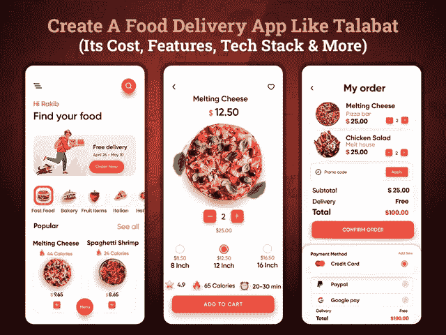

# 创建一个像 Talabat 这样的送餐应用程序需要多少成本

> 原文：<https://javascript.plainenglish.io/how-much-does-it-cost-to-create-a-food-delivery-app-like-talabat-bd7e766c3e93?source=collection_archive---------2----------------------->

## 2022 年打造一款像 Talabat 一样成功的订餐 app

近年来，随着世界饮食习惯的改变，在线食品行业正在显著崛起。不管是选择还是被迫，在新冠肺炎期间，人们都倾向于在线平台。像 Instacart 这样的大多数杂货店送货服务都表示，他们 2022 年的目标实际上已经达到了锁定的最初阶段。

因此，如果你仍在用传统的商业模式管理你的食品配送业务，那么你就失去了一个潜在的细分市场。食品配送市场已经被 UberEats 或 Talabatm 等应用程序所主导。因此，你们中的许多人想知道如何创造自己的品牌形象？

随着对食品配送服务需求的不断增加，精心规划的食品配送应用仍有发展空间。然而，要想让它成功，你需要在你的商务应用中加入一个独特的主张。是时候了解当地的市场需求了。研究什么是趋势，什么在下降，谁在与你的品牌竞争。收集这些信息将有助于你在市场上保持安全。

因此，无论你是计划在迪拜创建一个食品配送应用程序，还是已经在阿联酋、卡塔尔、科威特或沙特阿拉伯等中东国家经营食品配送业务的企业家。现在是将您的业务迁移到数字平台的大好时机。首先，创建一个像 UberEats 或 Talabat 这样的送餐应用程序是一个完美的想法。然而，在你启动你的应用程序开发项目之前，了解市场是很重要的。相关的统计数据可能会对你有用。

**博客重点:**

*   *为什么要开发像 Talabat 这样的送餐应用？
    -对阿联酋 Talabat 食品配送行业和市场份额的洞察*
*   【Talabat Like 送餐 app 如何运营业务？
*   *建立一个像 Talabat 这样的应用需要什么？
    -应用程序的 UI/UX 设计
    -送餐应用程序的特性和功能
    -应用程序创建所需的技术专家*
*   *创建一个像 Talabat 这样的送餐 App 需要多少成本？
    -安排 Talabat 等送餐 App 的费用*
*   *如何像 Talabat 一样将你的送餐 App 货币化？*
*   *结论:开始创建像 Talabat 一样的送餐应用*

为了更好地理解，让我们深入这些要点的细节…

## **为什么要创建 Talabat 这样的送餐 App？**

全球食品配送服务业务正在快速增长，阿联酋市场也不例外。像 UberEats 或 Talabat 这样的在线食品交付应用程序已经让这个市场火了起来。说到送餐应用，Talabat 是一款始于 2004 年的更受欢迎的应用。它是由科威特的企业家发起的。现在，该应用程序正在七个中东国家运行，包括阿曼、约旦、阿联酋、沙特阿拉伯、卡塔尔和科威特。

通过这个应用程序解决方案，用户可以搜索附近的餐馆、酒店，甚至搜索特价商品，并将食物送到你的住处。用户还可以获得添加到购物车中的餐馆及其食品的详细信息。他们可以使用应用程序的功能定制他们的食物。这一切都要归功于阿联酋 的一家 [**送餐应用开发公司，它让食品初创公司有可能创建一个像 Talabat 这样的应用。最棒的是，专家可以帮助你为 iOS 和 Android 平台创建一个移动应用。它能让你获得最大的市场份额。**](https://www.xicom.ae/services/mobile-app-development/)

> 如果你想知道为什么值得在 2022 年建立一个像 Talabat 这样的食品交付应用程序，那么这里是市场统计数据:

*   根据调查报告，预计[在线食品配送部门的收入将在 2022 年](https://www.statista.com/outlook/dmo/eservices/online-food-delivery/worldwide)达到 33392.57 亿美元。
*   该研究称，收入预计将显示 8.29%的年增长率，预计到 2026 年市场规模将达到 4664.72 亿美元[。](https://www.statista.com/outlook/dmo/eservices/online-food-delivery/worldwide)
*   到 2025 年，按需送餐细分市场的用户数量预计[将达到约 4.985 亿](https://www.statista.com/outlook/dmo/eservices/online-food-delivery/worldwide)。
*   2025 年，在线食品配送部门的收入可能会增长 [13.23%，这可能会带来 195.91 亿美元](https://www.statista.com/outlook/dmo/eservices/online-food-delivery/worldwide)。
*   此外，Talabat 每天在这个应用程序上处理超过 100，000 个订单。

有了这些统计数据，你一定会对食品配送市场的发展有所了解。如果你是一个想投资生意的商人，那么创建一个在线食品配送应用程序是你食品事业的完美选择。有了阿联酋的应用开发者，迪拜的移动应用开发变得容易多了。从一个应用程序开始，你需要了解它是如何工作的，以及构建一个应用程序需要什么…

## 【Talabat Like 送餐应用如何运营业务？

你知道是什么让塔拉巴特在食品配送行业如此成功吗？其无缝的界面和简单的应用程序设计使其对客户具有吸引力。此外，当你计划开发一个像 TALABAT 这样的应用程序时，请记住它在三个层面上工作:它们是:

*   **顾客/用户应用:**该应用版本可在 app store 下载，允许用户使用该应用查看食物的所有细节。他们可以查看详细信息，并从附近的餐馆点餐。
*   **服务应用:**这是应用工作中必不可少的服务应用。要创建这个应用版本，你可以 [**在阿联酋雇佣一个手机应用开发者**](https://www.xicom.ae/services/mobile-app-developers/) 。这个应用程序版本用于管理食品订单、连锁餐厅、更新菜单、价格等信息。
*   **送货员应用:**该应用版本供送货员全面管理交付和订单。

现在的问题是，像 Talabat 这样的送餐应用程序是如何工作的？让我们进入细节…

**以下是解释 Talabat 功能的分步指南**

*   在应用程序中设置一个位置，查找提供各种菜单的当地餐馆。可能包括印度、意大利、美国等品种。
*   探索一款应用程序，获取您首选地点的最新餐厅优惠和折扣信息。
*   允许用户使用各种过滤器搜索食物。它可以基于美食、送货地点、支付选项、优惠和交易等。
*   确保用户可以查看更新图像、价格和选择的餐厅菜单。
*   用户可以添加自己的特殊要求，餐厅将确认送货时间。
*   接下来，允许用户使用借记卡、信用卡或货到付款进行在线支付。
*   用户可以保存多个交货地址，以便快速结账，并在多个地点安排交货。
*   基于食品质量和交付，用户可以分享他们的体验，并提供评级和评论。
*   此外，食品配送应用程序有实时聊天支持，经常帮助用户毫不费力地下单。

当然，这种送餐应用的机制听起来很简单。但为了让它简单地运行，你需要了解创建一个像 Talabat 这样的食品交付应用程序到底需要什么。

## **建立一个像 Talabat 这样的应用需要什么？**

现在你知道了像 Talabat 这样的食品配送应用程序是如何工作的了。现在是时候了解帮助您创建一个让您成功的食品配送应用程序的关键参数了。

不要东张西望，让我们开始看看创建应用程序需要考虑的事情:

*   **App 的 UI/UX 设计**

设计是你的应用程序的核心和灵魂，它决定着你的品牌形象。应用程序设计在吸引用户注意力方面起着重要的作用。因此，大多数企业在阿联酋 雇佣一家 [**移动应用开发公司，以一种奇特的方式定制设计。然而，与其让它看起来太花哨。确保您的设计简单，易于导航，并能快速访问设计。记住你在屏幕上看到的越多，就越能保证用户体验。**](https://www.xicom.ae/services/mobile-app-development/)

设计一个像 Talabat 这样的送餐应用程序需要时间、精力和金钱。为了让它完美地工作，它包括一个用户面板，服务面板和送货男孩面板。并且每个面板涉及不同的 UI/UX 设计方面。人们需要注意设计来呈现赏心悦目的屏幕。

与其他食品交付应用程序一样，Talabat 的应用程序克隆也涉及主要功能。它包括注册，订单历史，联系信息，跟踪付款，等等。决定这一切在你的屏幕上是什么样子。为此，你需要线框和原型的应用程序设计。在纸上勾勒出应用程序的设计将有助于你理解你到底需要在屏幕上向用户展示什么。

*   **送餐 App 的特点和功能**

特性和功能的选择对应用的成功有很大的影响。一个精心设计的应用程序将允许客户顺利访问应用程序，在多个地点下多个订单，进行安全支付等等。最重要的是，应用程序的无缝导航将帮助您将客户带回应用程序，以获得更多订单。

由于特色和功能是送餐应用的主要元素，因此，让我们多做一些努力，让它更令人满意。以下是您可以考虑在每个面板上实现的功能列表…

**用户面板的特性**

*   用户登录:增加使用多个选项(如电子邮件 id、电话号码或社交媒体平台)登录应用程序的灵活性。确保你包括一个简单和容易的登录过程。
*   位置:允许用户设置交货位置。通过 GPS 导航，客户可以手动设置位置，也可以让应用程序使用自动位置设置器。
*   主页:确保在主页上提到所有重要的亮点，如交易、促销代码、食品类别等等。这将允许用户快速下订单，而不会与导航混淆。
*   菜单:在精心设计的类别下提供广泛的食物选择。你也可以雇佣一个移动应用开发者来定制菜单，并允许用户使用各种过滤器来搜索食物。
*   在地图上设置取货点:一旦用户选择了食物，允许顾客在地图上设置取货点或卸货点。
*   购物车部分:通过这个功能，用户可以查看他们的订单详细信息，并能够编辑、删除和添加更多产品。
*   审查屏幕:在您进行最终付款之前，审查屏幕将为您提供最终细节，包括订单、付款、运费等。
*   支付方式:确保你整合了多种支付方式。因为这是一个重要的功能，所以在阿联酋 雇佣一家了解海湾国家支付方式的 [**应用开发公司是有意义的。允许用户通过信用卡、借记卡、PayPal、Google Play 等进行支付。**](https://www.xicom.ae/services/mobile-app-development/)
*   订单历史:该功能将允许用户检查过去的订单并重新订购食品，而不必经历完整的过程。
*   优惠和折扣:使用推送通知，你可以让你的用户随时了解应用程序上推出的所有优惠、折扣和交易。
*   应用内聊天:一旦订单被确认，客户可以轻松地与餐厅和送货员沟通，甚至不需要分享他们的个人联系方式。应用内聊天功能将帮助他们进行无缝沟通。
*   跟踪送货员:在地图上跟踪司机的实时位置，得到订单配送的预估。

**餐厅面板特征**

*   注册/注册:允许餐馆使用管理员批准的凭证注册一个应用程序。
*   订单请求:使用该功能，餐馆可以检查订单数量和用户的详细信息，包括食品、地址和联系方式。
*   接受/拒绝订单:根据驱动程序的可用性，允许服务提供商接受或拒绝订单请求。
*   聊天/通话:使用应用程序内的聊天和通话功能，餐厅可以轻松地与用户建立联系。
*   推送通知:该功能将允许服务提供商向他们的客户提供订单状态更新，如订单确认、发货、开始准备等。
*   支付整合:允许服务提供商通过多种支付方式接受支付。允许他们接受通过信用卡，借记卡，贝宝，谷歌支付，货到付款支付。
*   交易历史:这将有助于服务提供商跟踪他们收到的所有付款、取款和退款。

**送货员的特点**

*   登录应用程序:使用管理员提供的凭证，送货员可以注册应用程序。确保他们核实自己的详细信息，包括姓名、车辆号码等。
*   订单请求:根据他们在特定位置的可用性，他们可以灵活地接受或拒绝食品订单。
*   工作状态:允许他们通过在应用程序中设置工作状态来管理他们的上班/下班时间。
*   推送通知:该功能将在下订单或取消订单、支付交易等时通知他们。
*   订单历史记录:提供跟踪他们成功交付或取消的订单数量的灵活性。
*   应用内聊天:这将允许送货员使用应用内通信功能与客户交流。

这些是开发送餐应用程序时需要考虑的几个基本功能。但是如果预算和开发时间不是你的主要限制，那么你可以选择高级应用版本。但在此之前，你需要知道如何创建一个应用程序…

*   **应用开发团队创建应用的需求**

要创建一个像 Talabat 这样的食品交付应用程序，你需要一个成熟的专业应用程序开发人员团队，他们了解你的业务需求。确保他们有技能使用正确的技术将你的想法变成现实。你需要在阿联酋雇佣一个更了解当地市场需求的 [**软件开发公司**](https://www.xicom.ae/) 。此外，他们为您提供一个完整的团队。开发团队包括业务分析师、项目经理、应用开发人员、UI/UX 设计人员、应用测试人员等等。外包应用程序开发公司的简单原因是他们有管理多个客户项目的经验。他们更好地了解市场的脉搏，并能够在开发过程中实施成熟的方法以确保成功。

现在的问题是如何从商业投资中获利？

## **如何将你的送餐 App 货币化，获得更好的利润？**

如何从你的送餐应用中获利是投资者的主要问题。在食品配送市场取得成功的一个特定方面取决于您为应用程序选择的货币化策略。虽然有多种方法可以从你的商业投资中获利，但这里我们要提到的是塔拉巴特是用来赚钱的。

*   **配送费用:**如果您没有使用自己的配送团队，您可以为客户安排物流服务。您可以收取统一的送货费，也可以根据送货地点设定价格。
*   **高峰时段价格:**这是这款应用最棘手的盈利方式之一。可以像 UberEats、Talabat 等在高峰时段支付附加费。要定制这个功能，你可以在阿联酋雇佣一个更了解市场迫切需求的移动应用开发者。在高峰时段收取额外费用是赚取额外收入的好方法。
*   **订购计划:**根据月度、季度和年度计划，您可以向客户提供额外折扣。此外，允许应用程序成员在订单上获得免费送货和独家优惠。

现在剩下的问题是，创建一个像 TALABAT 这样的送餐应用程序需要多少成本。

## **创建一个像 Talabat 这样的送餐应用程序并管理其成本需要多少钱？**

创建一个送餐应用程序的平均成本和时间从 20，000 美元到 50，000 多美元不等，开发可能需要 4 到 9 个月以上的时间。现在你们很多人都在想，为什么 app 开发成本和时间差距这么大？

简单的答案是，创建任何应用程序都没有标准价格，因为它的成本是根据不同的因素计算的。而且，要计算 app 开发成本和时间，你需要知道你在尝试构建什么，涉及到什么。

影响应用程序开发成本的主要因素包括应用程序结构的复杂性、特性和功能的选择、技术、应用程序开发团队、开发人员的每小时成本、UI/UX 设计、操作系统的选择等等。即使是这些因素中的一个变化，也可能导致最终应用程序开发成本的巨大差异。

所以问题是，你如何管理应用程序开发成本，并能够开发低至 20，000 美元的应用程序。

**这里有几个管理送餐 app 开发成本的小技巧:**

*   考虑跨平台应用开发方法，而不是原生应用。这将帮助您节省高达 40%的应用程序开发成本。此外，80%的代码库在跨平台框架中是可重用的，因此您也可以节省大量的开发时间。
*   去寻找一个 MVP 解决方案，而不是选择推出一个成熟的应用程序。TALABAT 是一个完全成熟的应用程序，但请记住，它涉及多年的更新和改进。最初，它是作为一个基本版本推出的，并随着时间的推移随着最新功能的增加而扩展。因此，创业公司可以考虑一个基本的应用版本，而不是将大量资金置于风险之中。他们只需要添加独特的介词，就能在繁荣的市场中获得成功。
*   不要在不同的平台上手动测试应用程序，考虑雇佣能够利用先进测试工具优势的应用程序开发人员。

希望这些提示能帮你节省大量的应用开发成本和时间。但同样，这些只是估计。应用程序开发的最终成本可高可低，取决于你的商业理念。因此，我们建议您预约一个免费的咨询时段，与专家讨论您的应用创意。

## **结论:准备像 Talabat** 一样推出你的送餐应用

在这篇博客的最后，值得一提的是，像科威特、迪拜、沙特阿拉伯这样的海湾国家拥有巨大的食品配送应用潜力。因此，如果你打算推出类似 Talabat 的食品配送应用程序，那么这是占领市场的正确时机。您可以在阿联酋 雇佣一家 [**移动应用开发公司，帮助您根据当地市场需求定制应用，让您获得成功。由于有许多领先的食品交付应用程序可用，因此，专家将为您的应用程序添加独特的方法和策略，帮助您在竞争激烈的市场中占据一席之地。**](https://www.xicom.ae/services/mobile-app-development/)

在开发针对海湾受众的食品配送应用时，关注特殊需求非常重要。从他们特殊的食物需求到优秀的用户界面，都需要密切关注。这只有当地的应用程序开发者才能理解。

因此，如果你有任何计划推出的食品交付应用程序的想法，那么你可以 [***联系我们***](https://www.xicom.ae/contact/) 或在下面提出疑问以获得更好的帮助。

=======================================

*更多内容请看*[*plain English . io*](http://plainenglish.io/)*。报名参加我们的* [*免费每周简讯*](http://newsletter.plainenglish.io/) *。在我们的* [*社区不和谐*](https://discord.gg/GtDtUAvyhW) *获取独家写作机会和建议。*