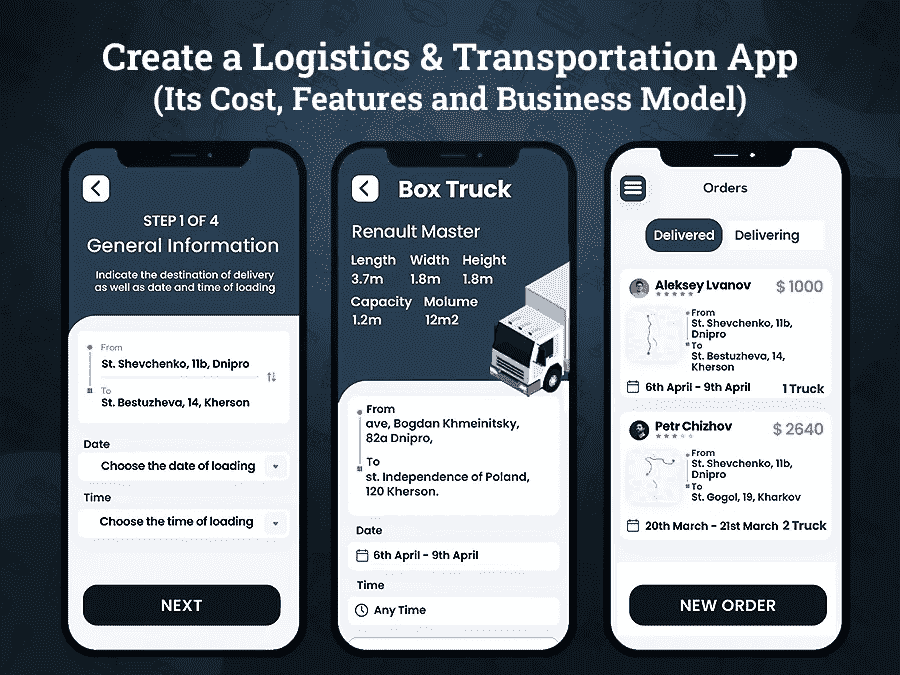
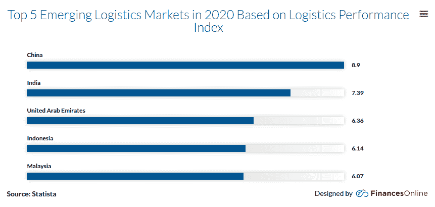

# 创建一个物流运输 App 需要多少钱？

> 原文：<https://javascript.plainenglish.io/how-much-does-it-cost-to-create-a-logistics-and-transportation-app-ce4efc32a110?source=collection_archive---------6----------------------->

## **是时候创建自己的物流业务应用程序了:了解如何创建和为什么创建**

你属于货代还是物流行业？如果是，那么你肯定理解在制造商、运营商、供应商和零售商之间跳舞的痛苦。你一定知道把大量的产品放到货架上有多困难。事实上，无论是管理仓库还是向客户递送包裹，传统的商业模式已经过时了。

多年来，客户、零售商或物流行业取得了长足的进步！从传统的向客户递送包裹到监控所有的物流和运输操作，只需点击应用程序屏幕，一切都变得可能。

要简化您的物流和运输业务，您需要的只是获得运输和物流行业与移动 app 开发的融合。

*是的，你没听错！*

如今，物流行业与最新技术高度融合，并提供多种转型模式来满足市场不断增长的需求。

电子商务行业的蓬勃发展给了货运代理采用多种物流选择以在行业中生存的最大理由。总而言之，它确保了从订单到交付的无缝流程。

尽管如此，我还是想知道，为什么你需要创建一个物流和运输应用程序？

*想想看，你多久会接到顾客打来的询问包裹下落的电话？
追踪司机或联系司机实时定位有多烦？
如果他们报告车辆故障问题并导致包裹递送延迟，该怎么办？*

所有这些麻烦的简单解决方案是开发一个物流和运输应用程序来简化操作。从管理车队、仓库、员工到客户，应用程序可以帮助您随时随地处理一切。

如果你想知道创建一个运输和物流应用程序需要多少成本，那么这里有一个完整的指南。这个博客会给你一个完整的功能概述，技术栈，商业模式，盈利策略和总成本。所以让我们直接进入事实。

**博客重点:**

*   *了解交通物流行业市场统计*
*   *物流和运输移动应用程序是如何工作的？*
*   *对于运输业务，您应该考虑哪些类型的物流 app？*
*   *创建物流手机 App 的必备功能*
*   *开发像 DHL 这样的物流 App 需要哪些技术？*
*   *物流移动 App 如何创收？*
*   *做一个物流运输手机 App 需要多少钱*
*   *结论:开发一个物流应用程序是你企业的未来吗？*

*让我们深入挖掘每一点，以便更好地理解……*

## **了解运输和物流行业的市场统计**

毫无疑问，移动应用已经成为我们生活中的主导部分。因此，利用智能手机和移动应用程序的力量，你可以在市场上保持竞争力。近年来，物流运输行业正在经历一场突如其来的繁荣。而聘请一家 [**手机 app 开发公司**](https://www.xicom.ae/services/mobile-app-development/) 为你的企业打造一款可扩展的物流运输 app，肯定会比别人多一份优势。而按需运输应用程序可以让用户预订他们选择的物流，将他们的物品从一个地方转移到另一个地方。

你不必相信我们的话…我们在这里提供你的市场见解…

> **运输和物流市场洞察、规模和创收**

*   根据联合市场研究公司的调查报告，全球物流市场预计将从 2017 年的 76，412.0 亿美元跃升至[，到 2027 年](https://www.alliedmarketresearch.com/logistics-market)达到 129，756.4 亿美元。
*   根据市场统计，2020 年至 2027 年，物流行业预计以 6.5%的 [CAGR 增长。](https://www.alliedmarketresearch.com/logistics-market)
*   据统计，到 2022 年，全球物流市场预计将增长到 12.26 万亿美元。
*   根据物流绩效，阿联酋被视为[2020 年](https://financesonline.com/transportation-industry-statistics/)最大的新兴物流市场之一。

[Image Source](https://financesonline.com/transportation-industry-statistics/)

希望这些统计数据能向你解释物流市场的发展情况。如果你是一个处理物流或运输的组织，那么投资于可扩展和功能丰富的应用程序肯定会让你成功。但是在你开始在阿联酋雇佣一个移动应用开发者之前，确保你了解物流应用是如何工作的。对该机制的基本了解将有助于您更好地规划业务所需的应用类型。此外，应用程序开发需要优先考虑哪些功能。

## **物流运输手机 app 是如何工作的？**

在现代社会，运输和物流应用在实现企业成功方面发挥着重要作用。此外，精心设计的应用程序可以帮助您简化操作，并为零售部门提供强大的支持。但是，为了让它以这种方式工作，你需要了解你的业务是如何运作和运作物流的。这就是物流应用程序可以通过确保实时监控、车队跟踪、装运管理等为您的物流业务提供巨大帮助的地方。

> 因此，如果你计划创建一个货运代理应用程序，那么这里有几个主要步骤:

***步骤 1:*** *包裹请求实际上是由发货人生成的，它提供了与重量、目的地、尺寸、负载、始发地和目的地相关的信息。*

***第二步:*** *司机会收到运输细节的通知，一旦他们批准了运输请求，就会立即提供运输服务。*

***第三步:*** *司机在接受配送请求后，会通过接入内置的 GPS 功能，跟踪车辆的实时更新，来配送包裹。*

***第四步:*** *货物交付后，通知发货人包裹已交付，并生成一个新手。*

现在你知道了物流和运输应用程序的基本功能，尽管是时候了解你想要创建什么类型的应用程序了。不同的企业有不同的观点，因此，请确保您创建的应用程序最适合您的企业。

## **对于运输业务，您应该考虑哪些类型的物流应用程序？**

在各种类型的物流运输 app 中，你需要弄清楚哪种类型的 app 在找你的业务。毕竟，您的最终决策将决定要考虑哪些功能以及构建这些功能需要多少成本。

*   **按需配送应用:**在疫情之后，急需商品和食品的配送应用在 2022 年占据了中心舞台。为了满足这些用户把东西送到他们家门口的需求，雇佣移动应用开发者是值得的。在专业人士的帮助下，你可以开发一个应用程序，或者扩展现有的电子商务或食品配送业务。无论你是一个新的企业还是一个独立的创业公司，创建一个按需交付应用程序将帮助你的业务更上一层楼。
*   **车队管理 App:** 这类 App 基本上是针对那些涉及到车辆和车队相关的所有信息和数据进行整理的业务。车队管理应用程序经过定制，可为车辆的有效协调、无缝管理和完美组织提供支持。在物流应用程序中使用集成信息系统将确保无差错的车队运营和顺畅的车辆管理。您只需确保您的应用符合政府法规，降低总体成本并提高业务绩效。
*   **数据管理解决方案:**如果你是一家初创公司，希望获得帮助你管理仓库的解决方案，那么投资数据管理应用将是一个值得的决定。这种类型的应用程序将帮助您存储、整理和控制与商店产品相关的大量数据。此外，通过应用程序，企业可以随时随地访问数据。
*   **车队和货运追踪应用:**你是否厌倦了接听客户询问行踪的电话？不断给司机打电话了解他们的实时位置，以估计他们的送货时间，这让你感到沮丧吗？如果是，那么创建一个用于车队和货运跟踪的应用程序是合乎逻辑的。该应用程序与实时位置相集成，允许管理人员和企业保持对车队和货物的控制。

在决定为您的企业创建物流和运输应用程序时，您可以考虑以下几种应用程序类型。但是请记住，每个应用程序结构需要不同的开发方法和特性。因此，在你开始雇佣一家 [**应用开发公司**](https://www.xicom.ae/services/mobile-app-development/) 之前，确保你了解市场需求。对增加成功机会的特性和功能进行优先级排序。此外，特性和功能的选择也会影响为您的企业构建物流应用程序的成本。让我们转向构建一个货运和运输应用程序所需的特性和功能…

# **创建物流手机 App 的必备功能**

当谈到开发一个应用程序时，没有比成为一个独特的定制功能更好的成功方式了。因此，为了启动你的商务应用，我们将向你解释创建物流应用的基本功能。如果您正在考虑构建一个一体化的解决方案来全面管理物流和运输。然而，为了让它完美地运行，你需要为用户、司机/员工和管理员创建一个应用程序。因此，让我们看一下创建所有这些面板所需的特性。

> **创建客户面板的功能**

*   **用户注册和应用程序登录:**要访问应用程序，新用户需要注册并登录应用程序。为应用程序注册提供多个选项，包括电话号码、电子邮件 ID 或社交媒体集成。
*   **车辆选择:**在按需物流 app 上增加选择车辆的灵活性是一项重要功能。这有助于用户根据要求选择车辆。根据需求，您可以选择任何车辆，包括货车、卡车、拖车、集装箱卡车等等。
*   **安排和管理预订:**增加安排取货和立即使用服务的功能。你所需要做的就是提到预定的日期、地点和时间。
*   **应用内支付:**用户登录应用后，允许用户使用多种方式进行支付。通过多支付选项，您可以使用信用卡、借记卡、Paypal、Google pay 等进行支付。
*   **支付安全:**为了确保安全的支付功能，创建一个具有两步认证机制的应用内支付功能。这将降低欺诈性付款的风险。
*   **实时跟踪:**这是你的应用程序最重要的功能之一。这是用户对你的运输和物流应用的第一个期望。所以一定要考虑实施。
*   **实时提醒:**使用推送通知是让您的客户了解重要提醒的好方法。此外，它还可以帮助您提高用户参与度。
*   **估算费用计算:**在使用网上物流运输服务时，让顾客事先知道服务的价值。你可以考虑 [**雇佣一个应用开发者**](https://www.xicom.ae/solutions/hire-developers/) ，让你实现一个费用计算器，提供基于包裹大小和重量的估算。
*   **访问历史:**通过此功能，用户可以检查以前的交易和发票以及服务提供商，以便进一步快速决策。
*   评级和评论:如果能增加一个功能，让用户根据自己的体验分享反馈，那就太好了。

> **创建驱动面板的特征**

*   **注册和认证:**允许司机使用管理员批准的凭证访问应用程序。此外，对于验证，必须上传用于验证的文档。
*   **管理请求:**为司机或调度员提供工具，根据他们的可用性接受或拒绝订单请求。
*   **使可用性:**为驾驶员添加显示他们的可用性、免打扰、不可用性或忙碌时间的功能。这将帮助他们更好地管理他们的请求。
*   **导航:**这是该应用的一项重要功能，司机或经销商可以轻松选择前往客户地址的最佳路线。事实上，这将帮助他们提供准时交货。
*   **支付:**多支付集成，允许司机通过多种支付方式接受支付，包括信用卡、借记卡、Google Pay 等。

> **创建管理面板的功能**

*   **登录/仪表板:**通过使用凭证，管理员可以登录到应用程序并直接接触仪表板。管理员能够通过实时数据查看待处理和已完成的订单。
*   **车队和车辆管理:**借助该功能，管理员可以轻松管理车队。对于管理员来说，引入新的运输工具甚至更新现有的运输工具将变得更加容易。
*   **管理付款和发票:**提供生成和更新发票、管理付款、批准付款等功能。
*   **驾驶员监控:**该功能有助于管理和分配任务给驾驶员/调度员，并监控他们的路上时间、活动和未决请求。

这些是创建物流运输应用程序的基础应用程序版本的基本功能。要为物流业务创建一个应用程序，您需要 20，000+美元的预算。而且，如果你雇佣的是一家领先的 [**移动应用开发公司**](https://www.xicom.ae/services/mobile-app-development/) ，那么创建一个应用需要 4 到 5 个月的时间。然而，如果你要与领先的物流应用竞争，那么你需要采用先进的功能。它可以包括应用内聊天、多语言支持、实时分析师、GPS、云操作等等。如果你考虑开发高级 app 版本，那么它会有更高的开发成本和时间。

然而，在你直接进入估算应用程序开发成本的过程之前，你需要了解应用程序开发的技术栈。

## **开发像 DHL 这样的物流 App 需要哪些技术？**

为了物流和运输应用的稳健运行，你需要选择正确的技术。创建物流和运输应用程序的技术选择也会影响应用程序的开发成本。

虽然它是移动应用程序开发过程中不可或缺的一部分，需要决定应用程序的前端和后端、支付系统、实时分析等。请确保您决定使用一个确保平稳运行且需要最少更新的版本。

> **下面是创建物流应用程序时可以考虑的语言的快速概述:**

*   **安卓** : Java，Kotlin
*   **iOS** :迅捷，客观 C
*   **前置**后置:HTML，CSS
*   **后端** : Python，Angular，JavaScript
*   **云**:谷歌云平台(GCP)、微软 Azure、亚马逊 AWS
*   **支付网关** : PayPal、Stripe
*   **真实** - **时间分析** IBM、思科、Hadoop、Spark
*   **推送通知** : Firebase，Twilio
*   **地图**:谷歌地图 API，苹果地图，Waze

在投入了这么多精力之后，很多创业公司都在追逐一个问题，如何从这个 app 模块中赚取利润。

## **一个物流移动 App 如何创收？**

多年来，对数字解决方案的需求大幅增长。来自世界各地不同垂直行业的人们都在寻找在线解决方案。这种改变用户的方法不仅可以帮助企业发展，还可以为他们提供多种收入来源。因此，如果你正在创建一个物流应用程序，那么这里有一些你可以寻找的创收策略:

*   **第三方广告**

虽然广告对用户来说是最讨厌的，但免费的应用程序版本可以用来通过广告赚钱。

*   **设定佣金费用**

应用程序所有者要么从平台上列出的司机那里收取固定金额的佣金，要么改变交易金额的百分比。这可能是从你的应用程序中获利的最好方式之一。

*   **免费增值模式**

你可以使用 15 天的试用版或免费的基础版来启动该应用程序。但允许用户使用付费会员的应用程序的高级功能。

现在的问题是，做一个 app 需要多少成本，一个 app 上市需要多少时间？

## **做一个物流运输手机 App** 要多少钱

在估算应用程序开发成本的时候，忘记那些声称你要开发一个低于 15，000 美元的应用程序的营销陷阱。事实上，在不知道你到底在考虑开发什么以及你需要创建什么类型的应用的情况下，评估应用开发成本是一个错误的问题。

但是，确定应用程序开发成本也不是火箭科学。你所需要的是理解什么参数在影响应用程序开发成本。*因此，在估算应用开发成本时，请记住以下几个因素*

*   操作系统选择—原生 Android/iOS 或跨平台
*   应用程序结构的复杂性:基本/现代或高级
*   特性和功能:MVP 解决方案或成熟的应用程序
*   UI/UX 设计和应用程序测试
*   应用程序开发及其每小时成本。

评估所有这些因素，物流应用程序开发的平均成本可能在 20，000 美元到 25，000 美元之间，具体取决于业务需求。

为了做出公平的决定，预约一个免费咨询专家的时间来讨论商业想法总是值得的。

## **结论:开发一个物流应用程序是你企业的未来吗？**

在这篇博客的结尾，可以公平地说，物流和运输行业可以通过技术集成带来重大变化。为您的企业开发一个物流和运输应用程序将是一个有价值的决定，因为它将帮助您简化复杂的操作，管理车队和数据。你可以聘请一家 [**移动应用开发公司**](https://www.xicom.ae/services/mobile-app-development/) 来让你的应用解决方案像专业人士一样工作，他们会帮助你根据市场和用户的需求集成特性和功能。由于物流行业目前正在蓬勃发展，因此，现在是时候通过为您的企业创建按需应用程序物流应用程序来抓住这一势头了。

如果您有任何想法想要转变成一个强大的解决方案，那么请考虑聘请专家或 [**联系我们**](https://www.xicom.ae/contact/) 进一步讨论您的问题。

========================================

*更多内容请看*[*plain English . io*](https://plainenglish.io/)*。报名参加我们的* [*免费周报*](http://newsletter.plainenglish.io/) *。关注我们*[*Twitter*](https://twitter.com/inPlainEngHQ)*和*[*LinkedIn*](https://www.linkedin.com/company/inplainenglish/)*。加入我们的* [*社区*](https://discord.gg/GtDtUAvyhW) *。*