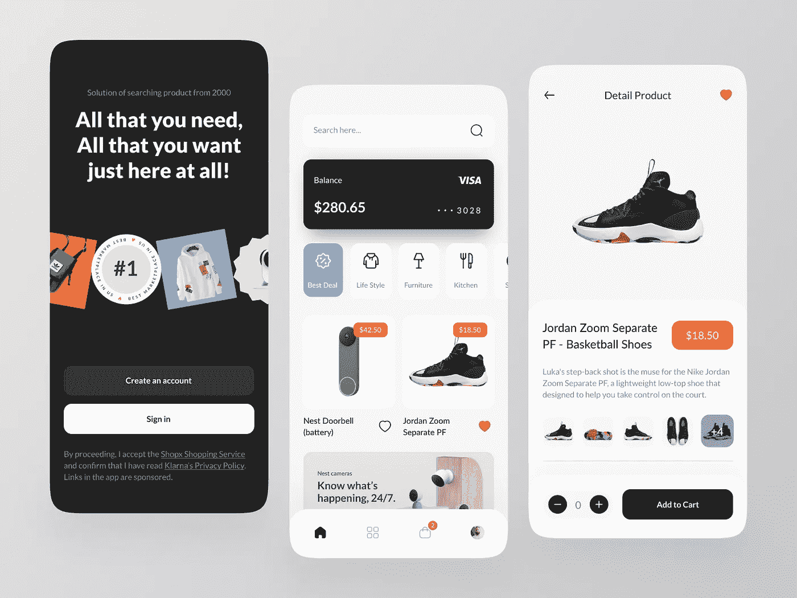

# 创建一个像亚马逊这样的应用程序需要多少成本

> 原文：<https://javascript.plainenglish.io/how-much-does-it-cost-to-create-an-app-like-amazon-862ac0de1414?source=collection_archive---------14----------------------->

## 创建一个像亚马逊一样的应用程序:它的成本、功能、商业模式等。

[Image Source](https://dribbble.com/shots/17253496/attachments/12361034?mode=media)

得益于亚马逊提供的服务和功能，亚马逊重新定义了市场行业。30 天内约 23 亿的访问量证明了这个巨头在这个行业的表现。这意味着围绕这个概念将会有很多想法和灵感。

你一定正在阅读这篇文章，因为你也对这个电子商务巨头着迷，并渴望创建自己的应用程序。这应该会引发一些问题，比如如何才能建立一个像亚马逊这样的应用程序。如果这是真的，你应该雇佣能把这个愿景变成现实的应用开发者。如果你在一个季度(2021 年第四季度)通过在线销售赚了 660 多亿美元，那么你一定做对了一些事情。*以下是你在踏上实现同样目标的旅程之前应该知道的事情！*

## **从博客中获得的关键信息:**

*   什么是电商 app？
*   如何建立一个像亚马逊一样的电子商务应用程序:从开始到结束的分步指南
*   任何电子商务应用程序都应该包含的必备功能:
    -客户要考虑的
    -卖家要考虑的
    -管理员要考虑的
*   电商 app 的商业模式有哪些？
*   建一个亚马逊这样的 app 要多少钱？
*   结论

## **什么是电商 app？**

电子商务应用程序是一个平台，充当连接卖家和买家的媒介。有许多不同类型的电子商务应用程序可用。例如，亚马逊将零售商聚集在一起，将他们与顾客联系起来，并对每一笔购买收取佣金。所以，换句话说，亚马逊允许商务活动通过他们的平台进行。

# **如何建立一个像亚马逊一样的电子商务应用程序:从头到尾的逐步指南**

这就是事情变得棘手的地方。如果你想雇佣一名电子商务应用程序开发人员，那么你必须知道这个过程应该是怎样的。让我们把它分成几个步骤:

**第一步:概念可视化和规划:**

这是开发任何产品最常见的步骤。理解问题陈述，并提出一个不仅有利可图而且能达到目的的解决方案。市场调查应该彻底完成，以确保没有重复发明轮子，术语“克隆”与你的想法没有联系。

**第二步:选择平台:**

与 Android 相比，拥有更多 iPhone 用户的目标国家将有不同的关注点。如果没有奇偶校验，那么使用混合技术(如 React Native)进行开发只会确保时间和成本得到控制。雇用 React 本地开发人员将确保项目开发和维护不是一件昂贵的事情。

**第三步:最终确定范围:**

根据你的预算、扩展想法和未来计划，你应该定义你的应用程序的功能。从基于电话号码的登录到对卖家的评级，一切都应该定义，以确保开发过程顺利进行。

**第四步:**最后，最重要的一步是根据首选技术雇佣专门的开发团队。

# **任何电子商务应用都应该具备的特性:**

无论是顾客还是零售商，都必须关注用户的幸福。创建一个成功的应用程序的整个想法应该围绕着应该向用户提供什么，以便他们不断回到平台上来满足他们的需求。

## **客户必备功能:**

*   **顺利入职:**客户越容易注册，即使不使用应用程序，他们也会感觉越好。你一定也感受到了这一点，当你访问一些应用程序时，它们是多么的简单和困难。如果它们很容易，你已经进入了应用程序，并尝试一下。注册过程不应超过 2-3 次点击。
*   **社交登录:**大多数用户希望使用简单易行的步骤，社交登录就是其中之一
*   **折扣和推荐:**如果你是为了给自己的权威盖章，就要想出尽可能吸引潜在客户的折扣和方案。
*   **高级搜索:**获得交叉销售和追加销售产品的推荐是获得更多销售并保持用户兴趣的好方法。
*   **支付方式:**不是每个人都喜欢相同的支付方式。多种选择将意味着用户不必在付费前思考。亚马逊还提供使用信用卡/货到付款的支付方式。这不仅提供了更多的灵活性，也为顾客提供了一个选择范围。这就是 [**招聘电子商务开发人员**](https://www.appsdevpro.com/hire-developers/hire-ecommerce-developers.html) 可以根据目标国家以及可用的支付选项提供建议和想法的地方。
*   **购物车:**易于访问的购物车部分将意味着用户可以继续添加产品，并在以后处理订单时访问它们。
*   **订单历史:**允许用户查看他们过去所有订单、发票和交易细节的标签是记录和分享信息的好方法。
*   评级和评论:这将保持对质量的检查，并激励卖家更好地为顾客服务！
*   **交付状态:**让用户及时了解订单状态是最受欢迎的功能，不容错过。
*   **退货和退款:**一个明确的退货和退款流程不仅能让顾客轻松，还能帮助卖家记录他们的收入。
*   **常见问题:**一个允许用户访问任何问题和疑问的答案的部分也将有助于收集投诉。
*   促销活动:运行电子邮件活动可以让用户随时了解即将到来的优惠活动，并留住那些已经离开的用户。

## **卖家必备功能:**

*   **库存管理:**对于任何卖家来说，库存都是最重要的数据集，给他们一个完整的洞察力只会有助于他们长期管理业务。
*   **促销活动:**开展电子邮件活动可以让用户及时了解即将推出的产品，并留住那些已经离开的用户。
*   **支付结算:**流程越简单，支付结算就越好，也能让卖家保持积极性。
*   **通知:**这对卖家来说很重要，因为这有助于他们在游戏中处于领先地位。
*   **Reports dashboard:** 对所有正在发生的事情以及他们的业务进展情况的深入了解只会帮助卖家改善他们的业务。 [**雇佣有经验的 web 开发人员是很重要的，他们可以创建像 BI 仪表板一样复杂，像图形界面一样简单的仪表板。**](https://www.appsdevpro.com/hire-developers/hire-web-app-developers.html)

## **管理员必备功能:**

*   **用户管理:**管理员应该能够查看与客户相关的所有数据，以便分析可以帮助他们提前关注和计划。
*   卖家管理:能够处理卖家并查看他们的商业信息，包括产品清单、销售额和收入，这是必备的能力。
*   **品类管理**:如其所述，后期可以有添加更多品类的可能，并且具有查看每个品类下的商品和添加新品类的能力是不能遗漏的。
*   **销售和折扣**:管理员应该能够查看销售数据和折扣信息，以保持对他们和平台的收入标签。
*   **反馈**:对于任何成功的平台来说，客户服务都是关键，因此反馈是分析平台表现的一个很好的工具。

# **电商 app 的商业模式有哪些？**

像亚马逊这样的电子商务应用有各种各样的收入模式。他们结合各种方法和商业模式来实现应用程序的货币化。毫无疑问，世界已经从桌面转向了应用，这意味着通过 [**雇佣移动应用开发者**](https://www.appsdevpro.com/hire-developers/hire-mobile-app-developers.html) 来开发同样的应用是显而易见的。你可以借鉴的一些想法是:

*   **服务费:**卖家每成功做一笔生意，平台会从他们的收入中抽取一定比例的费用。这是最常见的盈利方式，因为零售商也明白，必须向聚合商支付服务费用。
*   经常性订阅:亚马逊提供 Prime 会员资格，允许他们获得经常性收入，以换取高级服务，如一天送货、免费送货和非订阅会员无法享受的特别折扣。从而长期留住用户。
*   **关联公司**:如果你不能成为制造商/销售商，你可以成为推广者。这意味着，你将获得帮助亚马逊销售的报酬，作为回报，你将获得！这听起来有多酷？事实上，亚马逊有超过 900，000 名联盟营销人员，这本身就暗示了他们的规模有多大，甚至在通过向这些联盟营销人员付费而从他们的个人资料中删除之后，公司的利润有多高！

## **建一个亚马逊这样的 App 要多少钱？**

要知道涉及的成本，了解 app 开发流程很重要。同样可以分为线框、设计、开发、部署。

1.线框是一个过程，它有助于创建设计构想的第一级模板。这有助于定义元素的位置和流程的样子。

2.设计是将色彩融入产品生命的过程(字面意思也是！).这是所有最终设计完成的地方，也是开发优秀应用程序的基础。

3.发展是骨架注入生命，愿景变成现实的地方。雇用移动应用程序开发人员是一项严肃的任务，员工应该有足够的能力处理你对应用程序的所有设想。

4.在部署过程中，在测试环境中开发和编码的所有内容都会迁移到您的服务器(云服务器或物理服务器)，然后提交到应用商店进行审核。这是一个苹果和谷歌审查提交的应用程序的阶段，如果一切都按照他们的指导方针进行，应用程序就准备好上线了！

上述成本取决于各种因素，例如技术、涉及的资源数量和项目复杂性等等。从印度雇佣开发人员只会有助于保持低成本。项目开发可以大致分为三个级别:

1.基本知识:把这个项目看作是一个低成本的事情，以便在实现牵引力的同时测试水和规模，这是一个好主意，有助于控制你的预算。这种情况下需要的投资约为 15，000-20，000 美元。

2.**标准**:一个标准项目允许基本商品和一些商品具有一些功能，包括对废弃手推车的智能提醒或定向广告活动，成本约为 25，000-35，000 美元。

3.**高级**:一个全面的应用程序，不仅具有足够平台运行的功能，还通过 AR/图像搜索或票务系统等功能为客户提供增强的体验，以确保客户在任何过程中都能获得完整的帮助，起价约为 45，000 美元以上。

# **结论**

电子商务解决方案已经成为一个如此普遍的话题，以至于不仅有消费品的卖家，还有杂货的卖家！这个市场正在不断扩大，如果你能够挖掘正确的市场，这个平台可以达到的高度是无限的。最重要的方面是易用性。客户发现平台越简单，他们对你和你的应用就越忠诚。这个过程需要时间，但是如果以一种有计划的方式正确地完成，通过记住目标受众、预算、未来计划等因素来很好地定义和考虑项目，那么这个旅程将是一次愉快的经历。

这主要取决于雇佣应用程序开发人员的**他们不仅可以根据以往项目的经验提供建议，还可以指导你找到你可能没有想到的最佳方法。希望这些信息能帮助你理解开发过程中的细节。我们在这里只是以防你很好奇，想了解更多关于应用程序开发的知识。请随时联系我们或发送您的以下问题！**

**======================================**

***更多内容请看*[***plain English . io***](https://plainenglish.io/)*。报名参加我们的* [***免费周报***](http://newsletter.plainenglish.io/) *。关注我们关于*[***Twitter***](https://twitter.com/inPlainEngHQ)*和*[***LinkedIn***](https://www.linkedin.com/company/inplainenglish/)*。查看我们的* [***社区不和谐***](https://discord.gg/GtDtUAvyhW) *加入我们的* [***人才集体***](https://inplainenglish.pallet.com/talent/welcome) *。***