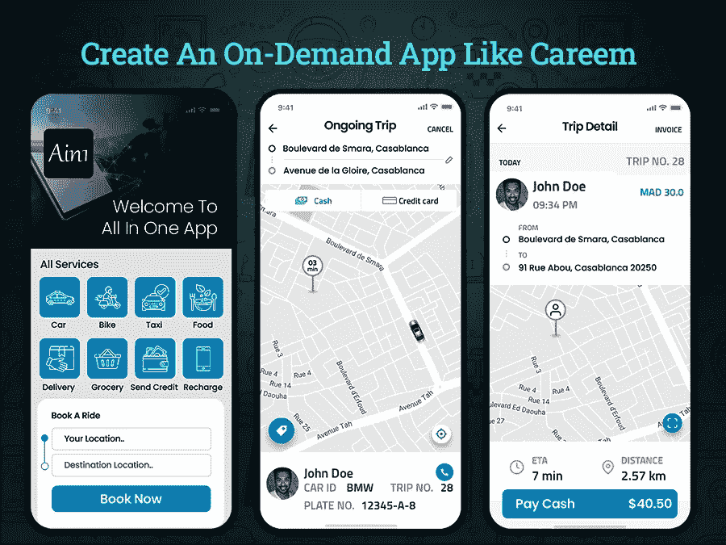

# 创建一个像 Careem 这样的应用程序需要多少成本

> 原文：<https://javascript.plainenglish.io/how-much-does-it-cost-to-create-an-app-like-careem-e933901ca426?source=collection_archive---------14----------------------->

## **创建一个像 Careem 一样的按需应用程序:它的成本、功能和技术栈**

近年来，按需应用占据了中心舞台，出租车预订行业也不例外。像优步和 Careem 这样的按需出租车预订应用程序因确保无缝的乘车体验而得到全球认可。

您是否也来自出租车预订行业，并且正在寻找潜在的方法来将您的业务扩展到新的高度？相信我，如果你仍然在用传统的商业模式管理你的汽车租赁或出租车预订服务，那么这是一个期待创造数字化存在的令人担忧的时间。没有更好的方法来创建像 Careem 这样的按需出租车预订应用程序。

既然你在这个博客上，你肯定有兴趣了解创建一个像 Careem 这样的叫车应用程序需要多少成本。而且，如何从一个 app 开始？别担心，我们已经为你收集了所有的信息。

**以下是博客的主要亮点:**

*   *为什么创建一个按需打车的应用程序是有利可图的？*
*   *如何让你的打车预约 App 从 Careem 中脱颖而出？
    -了解 Careem 出租车应用程序的主要亮点
    -使用现有出租车预订应用程序的提示*
*   *如何创建像 Careem 这样的按需打车预约 App？
    -了解出租车预约 app 的组成及其功能*
*   *Careem 类按需拼车 App 使用的技术*
*   *创建一个像 Careem 这样的打车预约 App 需要多少成本？*
*   *结论:准备好你的出租车预约业务*

为了更好地理解，让我们深入了解每一点的细节…

## **为什么创建按需打车预约应用程序有利可图？**

在当前时代，按需出租车预订应用程序已经成为交通行业的时髦词汇。这些应用让个人从一个目的地到另一个目的地变得更加简单和经济。此外，创建出租车预订应用程序现在正成为运输企业主的一项智能举措，并使他们能够瞄准大量受众。像 Careem 这样的打车应用克隆为创业公司树立了一个完美的榜样。事实上，说像 Careems 这样的出租车预订应用程序比传统企业的交易量大并不为过。

如果你仍然想知道为什么要投资按需打车应用，那么你需要了解这些统计数据。

**打车市场的重要洞察和创收**

*   根据 [Statista 报告](https://www.statista.com/outlook/mmo/shared-mobility/shared-rides/ride-hailing-taxi/worldwide?currency=usd)，打车市场在 2020 年将达到 2168.1 亿美元，预计 CAGR 将增长 13.7%。
*   据预测，到 2024 年，出租车市场的价值将达到约[3187.65 亿美元。](https://www.statista.com/outlook/mmo/shared-mobility/shared-rides/ride-hailing-taxi/worldwide?currency=usd)
*   根据[市场调查报告](https://www.statista.com/outlook/mmo/shared-mobility/shared-rides/ride-hailing-taxi/worldwide?currency=usd)，中东和非洲的在线出租车预订服务将大幅增长。
*   用户渗透率预计也将在 2023 年从 18.1%升至 19.4%。
*   根据 Statista 的报告，到 2026 年，用户数量预计将增长到 16.63 亿。

毫无疑问，这些统计数据描绘了一幅清晰的打车行业发展图景。而且，说出租车预订行业正在经历一场繁荣也不会错，成为这个行业的一部分对商家来说可能是一个有利可图的决定。如果你正考虑在阿联酋雇佣一家 [**移动应用开发公司**](https://www.xicom.ae/services/mobile-app-development/) 你可以很容易地开始，但请记住你需要的不止这些。为了更好地理解包含什么以及如何使其在行业中脱颖而出，我们在这里提到了 Careem 的高要求性以及在创建 Careem 这样的按需出租车预订应用程序时需要考虑的关键点。

# **如何让你的打车预约 App 从 Careem 中脱颖而出？**

为了建立一个成功的出租车预订应用程序，重要的是要考虑市场研究，以收集对市场的宝贵见解。如果你是和 Careem 这样的按需打车预约 app 竞争，那么先了解一下它的独特卖点。

**了解 Careem 打车 App 的主要亮点**

自 2012 年成立以来，Careem 通过允许用户预订汽车准时到达而吸引了用户的注意力。而沙特的 enter returns 为该项目提供了 190 万美元的资金。但是今天，该组织运营着 1000 多辆汽车，并筹集了 5950 万美元的收入。

Careem 最大的问题是，他们没有自己的车队，所有车队都与阿联酋领先的豪华轿车组织联合在一起。

此外，在多个投资者的支持下，Careem 已经发展壮大，并在迪拜和阿布扎比利用了总计 350-400 名司机。

此外，与其他驾驶汽车预订应用程序相比，Careem 价格适中，预订服务出色。

**以下是使 Careem 在行业中脱颖而出的关键特性:**

*   *Careem 提供两种类型的出租车预订按钮，一种是“立即预订”按钮，用于快速预订出租车，另一种是“稍后”按钮，用于稍后乘坐或预先计划的出租车服务。*
*   *该应用程序的界面超级快捷简单，让你在不到 20 秒的时间内完成整个出租车预订过程。*
*   *一款应用集成了便捷的支付方式。*
*   *用户可以访问司机的实时位置。*
*   *这款 app 的评分框架对用户和司机都有用。*

**使用现有出租车预订应用程序的提示**

在这个竞争激烈的世界里，在出租车预订行业建立自己的品牌比以往任何时候都更具挑战性。要想在这个欣欣向荣的行业获得成功，你所需要的就是采取独特的方法，在迪拜雇佣移动应用开发者。当地的专业团队会帮你定制完美迎合市场需求的 app 结构。此外，他们知道市场的脉搏，因此帮助您整合先进的功能。此外，我们在这里分享一些给你的生意增加优势的小技巧。

*   *为您的应用添加全天候客户支持*
*   *以独特的卖点争取 MVP 发展*
*   *实现定制的特性和功能*
*   *关注准时到达，因为附近有多种司机可供选择。*
*   *允许用户根据需要预订不同类型的车辆。*
*   介绍特定路线上的优惠或交易。
*   *获取奖励积分和订阅计划。*
*   *用于快速出租车预订的集成费用比较工具*

此外，在开发像 Careem 这样的出租车预订应用程序时，您需要寻找更多的特性和功能。

# **如何创建像 Careem 一样的按需出租车预订应用**

如果你最终决定创建一个出租车预订应用程序，那么首先你需要了解应用程序的主要元素是什么。创建一个像 Careem 这样的租车应用程序是相当具有挑战性的。原因是，现在 Careem 在拉合尔、卡拉奇、伊斯兰堡、海得拉巴、白沙瓦、费萨拉巴德等地工作。因此，要与 Careem 这样的出租车预订应用竞争，你需要创建一个客户、司机和管理应用。每个应用面板都包含不同的特性和功能。让我们来看看创建像 Careem 这样的出租车预订应用程序的基本功能。

**创建客户端应用的功能**

*   **用户注册:**为了确保快速、无障碍的应用程序注册过程，允许用户使用电话号码、社交媒体集成或电子邮件 ID 进行注册。
*   **出租车预订:**该功能为用户提供了预订适合其出行需求的汽车的便利。通过输入地点，他们可以进一步选择汽车类型和取货地点。
*   **费用估算:**该功能是指根据行程时间和距离估算乘坐费用。你只需要在应用程序中实现一个票价计算器，自动计算乘车成本。
*   **实时司机追踪:**通过这项功能，用户可以随时关注司机的位置，并能够看到他已经走了多远。
*   **推送通知:**这是出租车预订应用的一个基本功能，可以提供关于他们乘坐的持续更新。你可以 [**在阿联酋雇佣一个软件开发者**](https://www.xicom.ae/services/hire-software-developers/) 来定制这个功能。它还可以用作市场工具，让您的用户了解不同游乐设施的最新优惠和折扣。
*   **支付集成:**像 Careem 这样的出租车预订应用程序使用多种支付选项，允许用户通过信用卡、借记卡、Google Pay 等进行支付。
*   **应用内聊天:**通过在应用内实现聊天和通话功能，提供应用内客户支持。这将允许客户联系司机，甚至不必分享个人资料。
*   **评分与点评:**基于乘车体验，允许用户给司机评分并留下反馈。

**创建驾驶员侧应用的功能**

*   **应用程序登录和注册:**允许司机使用管理面板批准的凭据注册应用程序。
*   **驱动程序状态:**使用此功能，驱动程序可以选择显示其状态，管理员将知道驱动程序的可用性。
*   **档案编辑:**增加更新档案信息的灵活性，包括经验年限、车辆编号、他们使用的车辆类型等。
*   **应用内聊天/通话:**整合通话或信息功能将帮助乘客在不使用个人联系信息的情况下与乘客取得联系。你可以在阿联酋雇佣一个移动应用开发者来定制这些功能。它不仅可以帮助您确保无缝的客户支持，还可以帮助用户立即讨论他们的问题，甚至不需要分享他们的私人联系方式。
*   **活动提醒:**它帮助司机了解他们何时收到新的预订请求。根据他们的可用性，他们可以接受或拒绝请求。
*   **应用内导航:**在应用内实现 GPS 导航功能将使驾驶员能够轻松定位骑手或预订的目的地。
*   **估计:**由于该功能对于驾驶者了解估计的时间和成本非常重要，因此对于驾驶者也同样重要。

**创建管理端的功能**

*   **车辆管理:**管理员可以访问公司注册车辆的所有相关信息。
*   **生成发票:**游乐设备完成后，管理员有权生成应用内账单和发票。
*   **处理投诉:**客户反馈对你的业务很重要。这一部分是为了让管理员了解客户面临的问题，并确保为用户提供满意的解决方案。
*   **预约管理:**根据特定位置的司机的可用性，管理员的职责是为司机预约大量服务。

这些是帮助您创建基本应用程序结构的几个特性和功能。但是，在与 Careem 等出租车预订应用竞争的同时，你需要 [**雇佣一名移动应用开发者**](https://www.xicom.ae/services/mobile-app-developers/) 来帮助你实现高级应用功能。但是现在让我们直接来看看用于创建出租车预订应用程序的技术。

## **Careem 类按需拼车 App 使用的技术**

如果你想创建一个像 Careem 或优步这样的出租车预订应用程序，集成一些技术使你的应用程序完美工作是很重要的。通过正确选择技术，您的应用程序将确保出色的用户体验，因此让我们来看看使您的应用程序像 Careem 一样运行的技术。

*   *针对安卓 App- Kotlin，Java*
*   *对于 iOS- Swift，目标 C#*
*   *燃烧基——建筑精细应用*
*   *APNS —用于推送通知*
*   *Twilio-用于短信集成*
*   *脸书 SDK——用于通过 app* 发现人们的行为
*   *谷歌地图 API——用于地理定位、追踪、路线选择和导航*
*   *Google Place-查找地点或目的地*
*   *js-用于后端开发*
*   *支付集成- PayPal、Strip* e、Braintree
*   *亚马逊 S3-用于云存储*
*   *亚马逊 EC2-用于云托管*

这些是可以帮助您创建出租车预订应用程序的几种基本技术选择。但是为了满足你的应用开发需求，你需要雇佣一个应用开发团队。它必须由业务分析师、项目经理、质量保证工程师、UI/UX 设计师和应用程序开发人员组成。他们的每小时费用将取决于应用程序的复杂性。

## **创建一个像 Careem 这样的打车预约 App 需要多少成本？**

像 Careem 这样的按需出租车预订应用程序在过去几年里已经完全超越了它。它不仅包含可扩展的高级功能，还使用了高级技术。如果你正在考虑开发一个包含所有这些现代功能和技术的成熟的出租车预订应用程序，那么应用程序开发的平均成本将达到 25，000 美元以上。

然而，如果你是一家初创公司或商业爱好者，那么你可以考虑建立一个 MVP 解决方案。它包括基本的特性和功能。利用这种独特的方法创建一个基本的出租车预订应用程序的平均成本将在 17，500 美元到 20，000 美元以上。

这些是基于博客中提到的特性和技术的粗略估计。但是对于真正的成本评估，您需要记住一些影响成本的因素。它包括:

*   *应用程序结构的复杂性*
*   *特性和功能选择*
*   *技术堆栈和用户界面/UX 设计*
*   *App 测试*
*   *应用程序开发团队及其每小时成本*

在您做出任何决定之前，值得与专家讨论您的应用程序开发需求，并预订一个免费的咨询时段。

## **结论:准备好制作你的出租车预约 App**

有了这个博客，不可否认的事实是，开发按需出租车预订应用程序有着光明的未来。如果你还假设有一个应用程序可以帮助你扩大业务范围，那么你需要有一个出色的应用程序想法，可以解决客户的需求，并为你的业务增加价值。在阿联酋雇佣一家 [**移动应用开发公司**](https://www.xicom.ae/services/mobile-app-development/) 是使用正确策略创建应用的完美方法。通过创建可扩展的按需出租车预订应用程序并实施正确的功能集，您可以有效地扩展您的业务。你所需要的是有一个有能力的应用程序开发团队在你身边赢得这场比赛。

因此，如果你有任何应用程序开发的想法，想要转化为应用程序解决方案，那么你可以 [**联系我们**](https://www.xicom.ae/contact/) 或者在下面提出疑问。

========================================

*更多内容请看*[*plain English . io*](https://plainenglish.io/)*。报名参加我们的* [*免费周报*](http://newsletter.plainenglish.io/) *。关注我们的*[*Twitter*](https://twitter.com/inPlainEngHQ)*和*[*LinkedIn*](https://www.linkedin.com/company/inplainenglish/)*。加入我们的* [*社区不和谐*](https://discord.gg/GtDtUAvyhW) *。*