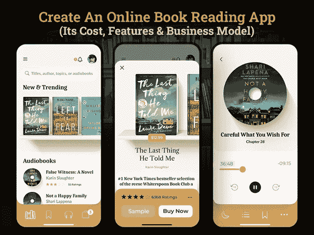

# 创建一个像 Kindle 这样的电子书应用程序需要多少成本

> 原文：<https://javascript.plainenglish.io/how-much-does-it-cost-to-create-an-e-book-app-like-kindle-d2e95f1cea38?source=collection_archive---------16----------------------->

## 创建一个类似亚马逊 Kindle 的电子书应用:**它的成本、功能和商业模式**

在现代生活中，移动应用已经发展到几乎无所不包。随着新兴技术和智能手机设备的日益普及，人们正在迅速改变他们访问一切的心理。书店已经注意到顾客行为的重大变化。

今天，人们的阅读和学习习惯正在迅速转向数字平台。这一切都要归功于 Kindle 这样的电子书应用程序，它把你从随身携带书籍的麻烦中解救出来。打开应用程序，点击书籍，开始阅读。人们喜欢读书，为什么不呢？毕竟，从童年开始，我们就开始听故事，不管是押韵的小句子还是小说。由于故事在培养我们的智力、提高注意力和塑造我们的知识方面起着至关重要的作用，因此，故事在我们的生活中占有特殊的地位。

如果你正在经营一家书店，并有兴趣将其扩展到数字平台，那么创建一个像 Kindle 或 Souq 这样的电子书应用程序将是一个成功的完美方式。

如果你想知道从哪里开始，为什么要为读者建立一个应用程序，那么你可以看看这个博客。我们已经为您的疑问列出了深入的答案。以下是博客的主要亮点。

**本博客重点:**

*   *你为什么要打造像亚马逊 Kindle 这样的电子书阅读器？*
*   *了解电子书阅读器 App 的类型*
*   *如何打造电子书或有声读物 App？
    -在线阅读书籍的特点*
*   *如何将你的电子书应用货币化，并从商业投资中获利？*
*   *创建一个像 Kindle 这样的在线阅读 App 需要多少成本？*
*   *结论:像亚马逊 Kindle 一样推出你的电子书应用*

为了更好地理解，让我们深入这些要点的细节…

## **为什么要打造亚马逊 Kindle 这样的电子书阅读器？**

像亚马逊 Kindle、Souq 这样的电子书应用就像是对读者的祝福。人们可以在手机上在线阅读任何种类的书籍。它越来越受欢迎的最好的部分是它易于访问的界面，确保了读者的良好用户体验。如果你曾经体验过 Kindle 阅读，那么你可能会理解它是多么令人满意。网上有大量的书籍可供阅读。甚至在线书店也让 Kindle 成为最好的电子书阅读应用。此外，方便地访问各种各样的电子书图书馆使它更受读者欢迎。

*据统计，2019 年全球在线图书服务市场规模为 177 亿美元，预计 2020 年至 2027 年*[*【CAGR】*](https://www.grandviewresearch.com/industry-analysis/online-book-services-market)*增长 5.8%。*

在疫情期间，超过 200 万名新用户注册了电子书应用。

根据这些数据，很明显，对电子书应用的需求与日俱增。而现在你应该考虑推出 Kindle 这样的电子书阅读器应用的原因，显然是因为客户的高需求。

2020 年，读者尤其是 18 至 29 岁年龄段的读者几乎没有时间每周去书店。这就是为什么有一种解决方案倾向于让用户通过智能手机阅读书籍。要启动你的应用，你只需要在阿联酋雇佣一家 [**移动应用开发公司**](https://www.xicom.ae/services/mobile-app-development/) 。雇佣本地开发团队的最大原因是他们更了解市场和用户的需求。因此，他们将定制应用程序界面，并能够推出适合您业务的应用程序。而作为出版社，你可以抓住他的机会，为读者提供一个专属的电子阅读平台，让你在市场中脱颖而出。

但在你直接进入任命开发者的过程之前，有必要知道你需要开发什么类型的在线图书阅读应用。

# **了解电子书阅读器 App 的类型**

开发一个应用程序，通过数字化展示来启动你的业务，总是让你兴奋不已。但是，如果你选择了错误的应用程序开发方法，这种兴奋很快就会变成一个错误。要以正确的方向开始你的应用程序开发项目，请确保你花时间了解你的业务需求。进行深入的市场调查，了解竞争对手的起伏。收集了所有这些事实和数据后，你就可以决定你想要什么类型的电子书阅读器了。

*你登陆市场的那一刻，你会发现整个电子书阅读市场分为两大块:*

*   **开发专用电子书阅读器:**专用电子书阅读器是一款专门定制的应用程序，允许用户阅读不同数字格式的电子书，包括 PDF、FB2 和 EPUB。
*   内置阅读器的电子书商店:开发这样一个应用程序是完全不同的。有了这种类型的应用程序，读者可以直接从应用程序开始阅读。他们不需要访问任何第三方网站或平台来访问一本书。你可以考虑在迪拜雇佣一个应用开发者来创建一个内置阅读器的电子书商店。它更类似于亚马逊 Kindle，在 170+个国家有售，拥有超过 140 万种不同语言的书籍。有更多的功能使这种类型的在线图书阅读器与众不同。

现在的问题是，如何创建它并抓住占主导地位的亚马逊 Kindle？简单的答案是寻找必要的特性和功能来创建一个电子书应用。

# **如何建立一个电子书或有声读物应用程序？**

开发一个电子书阅读器应用程序是相当具有挑战性的。但是当你知道这个概念并且心中有一个清晰的定位，那么没有什么可以阻止你发布一个成功的应用。然而，如果你打算建立一个类似亚马逊的 Kindle 电子书阅读器应用程序，那么它需要远见卓识，经验丰富的应用程序开发团队，以及无与伦比的用户界面。

通过在阿联酋外包一家领先的 [**手机 app 开发公司**](https://www.xicom.ae/services/mobile-app-development/) ，就可以轻松覆盖这几点。利用多年的开发经验，他们会向您推荐一组合适的特性和功能，您可以考虑在您的应用程序中实现。此外，Kindle 是一个成熟的应用程序，使用 Kindle 的应用程序克隆开发一个应用程序可能需要 9 个月以上的开发时间和昂贵的预算。所以，我们先从电子书阅读器 app 的基本特性和功能说起。

**吸引读者的电子书阅读器应用的基本特征**

*   **用户登录**:轻松快捷地注册应用。要访问电子书阅读应用 Kindle，你可以让用户使用电子邮件 ID、电话号码或社交媒体平台注册一个应用。
*   **多** - **平台支持**:不要专门为特定平台创建应用，要确保你的应用兼容运行在 iOS、Android、MAC、PC 上。
*   **电子书搜索:**让你的电子书 app 更容易被用户浏览。允许用户轻松地找到一本书，并过滤搜索结果。书籍可以按照作者、出版商、流派等进行分类。
*   **文本书签**:给页面做书签是这款应用的一个重要功能，可以帮助用户从他们离开的地方继续阅读。
*   **夜间模式阅读**:通过夜间模式阅读功能，用户可以在白光和黑色之间自动切换。它可以让你改变背景和文本颜色，以减轻眼睛疲劳。
*   **语言翻译**:增加将书翻译成不同语言的灵活性，会让读者更容易阅读。
*   **我的图书馆**:提供管理图书购买、图书下载、杂志、已读和未读图书的功能。
*   **个性化阅读**:允许读者通过一些便捷的功能来调整自己的阅读模式。这些功能可能包括更改字体大小、字体类型、页面调整、导航、添加注释和突出显示等等。
*   **In** - **App 词典**:为了保证优秀的阅读体验，请务必提供 App 内词典。通过突出一个词，读者可以得到作品的意思。
*   **离线阅读**:该功能可以转变阅读体验，让读者在没有任何互联网中断的情况下访问书籍。你可以 [**雇佣一个手机应用开发者**](https://www.xicom.ae/services/mobile-app-developers/) 来定制这个功能，为用户提供离线阅读体验。
*   **文字转语音**:考虑在你的应用上实现这个功能将是一个很好的决定。这将允许读者大声朗读一篇课文或一本书。
*   - **App 支付**中的**:允许用户使用多种支付方式进行支付，包括信用卡、借记卡等。**
*   **上传内容**:通过此功能，您可以编辑、更新、上传或删除电子书应用中的内容。

这些是你可以考虑在你的电子书阅读器应用中实现的几个基本功能。但你们中的许多人想知道如何从这个应用程序解决方案中赚钱或获利。

*让我们找到这个问题的答案……*

## 如何将你的电子书应用货币化，并从商业投资中获利？

出版社最常问的问题是如何将电子书阅读器应用货币化。虽然这种应用解决方案有不同的赚钱方式，但我们在这里讨论的是亚马逊 Kindle 使用的几种策略。

*   **订阅服务**

这可能是你的应用程序的主要收入来源。订阅服务可以按月、季度或年度计划提供。根据订阅计划的类型，您可以设置会员费用，并允许读者访问应用程序的高级功能，如有声读物、高级过滤器、无限下载等。

*   **书籍下载费用**

如果你打算向读者提供离线阅读体验，那么你可以为下载应用程序收取额外的费用。不同书籍的下载价格不同。

*   **应用内购买**

这可能是一个从你的应用中获取利润的好方法。这包括用户从你的商店购买电子书或有声读物。

这是帮助你赚大钱的几个策略，但对于所有在线购买，请确保你在应用程序中有退款、积分或钱包充值功能。现在让我们转向主要问题:创建一个电子书阅读器应用程序需要多少成本…

## **创建一个像 Kindle 这样的在线阅读应用需要多少成本？**

用一个 app 开发的标准成本来回答这个问题，是相当具有挑战性的。因为不同的企业有不同的需求，并使用不同的方法来开发应用程序。因此，没有放之四海而皆准的解决方案。

估计创建一个电子书阅读器应用程序的成本实际上取决于各种因素。主要的成本影响因素包括应用程序的复杂性、特性和功能、UI/UX 设计、应用程序测试、操作平台的选择等等。你在这些因素上的微小变化，都可能带来 app 开发成本的重大变化。

因此，如果我们总结出创建像 Kindle 这样的电子书阅读器应用程序的应用程序开发成本，那么它将在 20，000 美元到 25，000 美元+之间。根据应用程序的复杂性和业务需求，应用程序开发可能需要 4 个月到 9 个月以上的时间。

所以在你做任何决定之前，我们建议你预约一个免费的专家咨询时段。

## **结论:像亚马逊 Kindle 一样推出你的电子书应用**

不可否认，传统的读书方式已经慢慢过时了。人们更经常地转向提供书籍阅读、指南、杂志等的数字平台。如果你打算建立一个像 Kindle 一样的电子书阅读器应用程序，那么聘请一家 [**移动应用程序开发公司**](https://www.xicom.ae/services/mobile-app-development/) 是值得的。虽然我们试图涵盖一切，帮助您了解应用程序开发过程及其成本。然而，应用程序开发方面的专业协助将使您能够采用独特的方法，并在竞争激烈的市场中脱颖而出。

如果你有任何想法来建立一个电子书阅读器应用程序，或者正在寻找专家的帮助来帮助你开始，那么你可以 [**联系我们**](https://www.xicom.ae/contact/) 或者在下面提出疑问。

====================================

*更多内容看* [*说白了。报名参加我们的*](https://plainenglish.io/) [*免费每周简讯*](http://newsletter.plainenglish.io/) *。关注我们的*[*Twitter*](https://twitter.com/inPlainEngHQ)*和*[*LinkedIn*](https://www.linkedin.com/company/inplainenglish/)*。加入我们的* [*社区不和谐*](https://discord.gg/GtDtUAvyhW) *。*