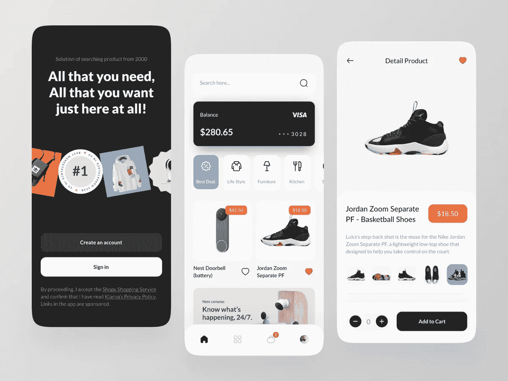
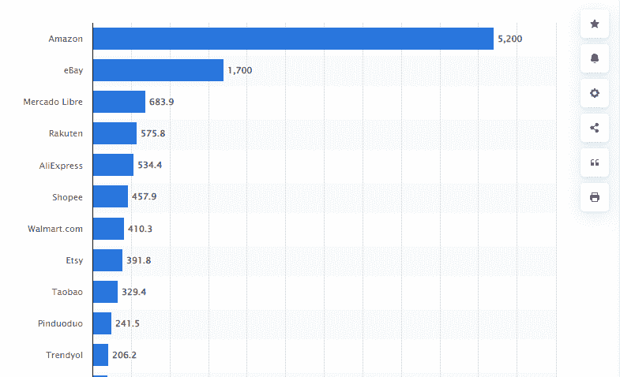

# 创建一个在线市场应用程序需要多少成本

> 原文：<https://javascript.plainenglish.io/how-much-does-it-cost-to-create-an-online-marketplace-app-d86fcce2eafc?source=collection_archive---------3----------------------->

## **创建一个在线市场应用程序:其功能、成本、盈利策略和技巧**

[Image Source](https://dribbble.com/shots/17253496-ShopX-Mobile-App-Exploration)

随着越来越多的人倾向于在线购物平台，拥有你的 marketplace 应用程序已经成为许多零售商的迫切需求。像亚马逊、Etsy 或易贝这样绝对成功的市场，是启动你网上购物业务的最大灵感。创建一个在线市场应用程序将帮助你增加现金流，扩大你的客户群。选择将您的传统业务模式迁移到数字平台将为您提供一个机会，让您的企业成为最佳在线市场。

然而，当你考虑开发一个像亚马逊或易贝这样的在线市场应用程序时，你脑海中的第一个问题可能是，开发一个在线市场应用程序需要多少成本？如何设置像亚马逊或易贝这样的市场应用程序？成功的应用程序需要整合哪些基本特性和功能？

**如果你也在思考同样的问题，那么你来对地方了。这个博客涵盖了一切，帮助你做出明智的决定:**

*   了解在线市场应用的市场统计数据
*   你的电子商务业务需要什么类型的市场应用？
*   如何创建在线市场应用程序？
*   在 2022 年创建成功的在线市场应用程序的必备功能
*   选择合适的应用开发团队
*   为市场应用挑选最佳盈利策略
*   创建一个在线市场应用程序需要多少成本
*   拿走

让我们深入了解每一点，以便更好地理解:

## **了解网上商城 App 的市场统计**

在过去的十年里，电子商务行业已经从一个广泛的阵列。随着新兴技术和创新的出现，电子商务平台已经从单一类别彻底转变为所有类别，最大的例子是亚马逊。

通过提供大量的好处，从快速送货到无障碍退货，以及实时跟踪到多种支付选项，电子商务市场应用的需求正在激增。

> 你不必相信我们的话。在这里，我们收集了一些真实的事实，以帮助您了解市场应用程序如何在 2022 年占据中心舞台。

*   *根据* [*调查报告*](https://www.statista.com/statistics/1155246/leading-online-marketplaces-usa-average-monthly-visits/) *，亚马逊和易贝是全球访问量最大的在线市场。*

[Image Source](https://www.statista.com/statistics/1155246/leading-online-marketplaces-usa-average-monthly-visits/)

*   *根据市场调查，超过 2 亿人***为更快的运输和其他优质服务向亚马逊付费。**
*   **根据 Statista 的数据，亚马逊或易贝处理的商品总额约为*[*873.7 亿美元。*](https://www.statista.com/topics/4827/online-marketplaces/#dossierContents__outerWrapper)*
*   **根据市场报告，在线市场应用产生了*[*103 亿美元*](https://www.statista.com/topics/4827/online-marketplaces/#dossierContents__outerWrapper) *。**

*简而言之，这些统计数据对于正在为成为这个蓬勃发展的行业的一部分铺平道路的初创公司来说非常鼓舞人心。然而，在你直接进入 [**雇佣移动应用开发者**](https://www.appsdevpro.com/hire-developers/hire-mobile-app-developers.html) 之前，有必要决定你需要开发哪种类型的市场应用。不同的应用程序有不同的属性，因此根据应用程序的类型，应用程序开发成本将进一步决定。*

## *你的电子商务业务需要什么类型的市场应用？*

*无论你是创业公司还是领先的企业家，不同的企业有不同的需求。因此，在你进入应用程序开发过程和评估应用程序开发成本之前，决定你可能需要什么类型的在线市场应用程序是值得的。此外，市场应用的选择取决于目标受众和买卖关系的预期性质。*

> ***这里是你可以选择的主要在线市场应用程序开发方式:***

*   ***B2B 市场应用***

*B2B 市场应用程序是为那些有兴趣批量销售产品和服务的企业设计的。他们的想法是将销售和购买过程自动化，并提高交易绩效。B2B 应用类型的主要例子有阿里巴巴、电子世界贸易等等。*

*   ***B2C 市场应用***

*B2C 市场为企业直接向客户销售产品和服务提供了一个公共平台。这些类型的市场应用变得非常受欢迎，因为它们在一个地方提供各种各样的商品。像 B2C 这样的市场应用通常通过佣金、订阅费、上市费等来赚钱。这种应用类型的一个主要例子是全球速卖通和亚马逊。*

*   ***客户对客户(C2C)市场应用***

*点对点或客户对客户市场应用程序将个人联系起来，分享产品和服务，以换取金钱或其他产品。大多数情况下，你可以通过广告和付费推广来赚钱。这类应用最常见的是 Etsy、优步等。*

*这些是创业公司应该知道的最常见的在线市场应用类型。但是在你开始选择这些应用类型之前，你需要知道如何创建一个应用。为此， [**雇佣一名印度应用开发者**](https://www.appsdevpro.com/hire-developers.html) 很重要，他可以将你的应用想法转化为完美的解决方案。你所需要知道的就是你需要在你的应用中集成哪些特性和功能。*给你一个简要的想法，你需要阅读博客的下一步。**

# ***如何创建在线市场应用程序？***

*无论你是在开发一个成熟的市场应用还是一个 MVP 解决方案，了解如何在 2022 年创建一个成功的市场应用是很重要的。所以第一步是要知道你的应用需要包含哪些特性和功能。因为你在应用中提供的东西是创建应用的最大部分。因此，让我们深入了解创建市场应用程序的特性和功能。*

***A .在 2022 年创建成功的在线市场应用程序的必备功能***

*市场上可能有数百个电子商务应用程序，但通过实施独特的特性和功能，您可以使其在市场中脱颖而出。因此，如果你计划成功地创建一个像 Amazon 一样的市场应用程序，确保创建一个用户面板、卖家面板和管理面板。*

**让我们详细了解每个面板所需的功能。**

***创建市场应用用户面板的功能:***

*   ***用户登录:**要开始使用一个应用程序，为用户提供多种注册方式非常重要。确保您通过使用联系人详细信息、电子邮件 id 或社交媒体集成将该功能添加到应用程序注册中。只需将脸书、Instagram 或 Twitter 等社交媒体平台连接起来，你就可以让用户直接注册一款应用。*
*   ***搜索框:**在注册一个应用程序后，用户可以直接进入搜索框，找到他们在你的应用程序中到底在看什么。确保在应用程序的主页上添加搜索框，以确保出色的客户体验。*
*   ***带过滤器的产品列表:**允许用户根据自己的选择过滤产品，从而使搜索更快更容易。使他们能够使用各种过滤器，如服装、品牌、年龄、颜色等。*
*   ***产品描述:**确保所有产品列表后面都有详细的产品描述，包括材料类型、洗涤信息、维护等细节。*
*   ***收藏夹:**每次用户打开应用都不是为了买东西。在这种情况下，你可以选择 [**雇佣一名电子商务开发人员**](https://www.appsdevpro.com/hire-developers/hire-ecommerce-developers.html) 来为客户定制应用程序的界面，并使用一个快捷的收藏夹按钮对其进行定制。客户可以直接将产品添加到他们喜欢但稍后购买的收藏夹中。*
*   ***分享:**通过社交媒体集成，用户可以通过各种应用程序轻松地与朋友和其他用户分享产品。*
*   ***评级和评论:**根据产品体验，允许用户分享他们的反馈并对产品进行评级。*
*   ***支付:**为了确保无缝购物体验，您可以考虑添加多种支付集成，并允许用户通过 PayPal、信用卡/借记卡或 Google pay 进行支付。*
*   ***实时递送状态:**通过整合 Google Apps，用户可以查看自己包裹的实时状态，并估计递送需要多长时间。*
*   ***添加到购物车:**确保您的 marketplace 应用程序中有一个功能，允许用户在不离开购物页面的情况下快速将产品添加到购物车。*
*   ***我的购物车:**将产品添加到购物车后，提供检查购物车中产品详细信息的功能。*
*   ***订单历史:**为了确保无缝购物体验，用户只需轻轻一点就可以查看订单历史并处理重复订单。*

## ***创建应用程序卖家面板的重要功能***

*   ***注册/卖家注册:**让卖家的注册过程更简单，让他们使用管理员提供的凭证登录应用程序。*
*   *产品管理:在正确的类别下列出产品是很重要的。产品管理功能将允许卖家以正确的方式对其产品进行分类，并允许用户轻松找到正确类别下的产品。*
*   ***库存管理:**为了跟上客户需求，维持库存水平很重要。要实现这个功能，你可以 [**雇佣一个跨平台的 app 开发者**](https://www.appsdevpro.com/hire-developers/hire-cross-platform-app-developers.html) ，帮助卖家轻松查看库存水平。什么产品卖得快，什么产品卖得慢。*
*   ***优惠和折扣:**为了提高用户参与度并让他们更长久地使用你的应用，你可以向用户发送短信提醒。向用户发送折扣通知。*
*   ***评级和评论:**允许卖家查看客户给出的评级和评论，以简单解决痛点。*
*   ***报告和分析:**让你的应用程序生成销售报告并提供分析，以便卖家可以了解他们的业务表现如何。*
*   ***付款接受:**让卖家通过多种付款方式接受付款，无论是 Google Pay、Paypal 还是信用卡/借记卡。*
*   ***退货管理:**提供轻松管理退货订单的功能，并相应更新用户。*

## ***创建市场应用程序管理面板的功能***

*   ***用户管理:**允许管理员管理不断增长的用户群，并相应地扩展应用程序，以避免造成混乱。*
*   ***卖家管理:**管理员将进行验证，并只列出应用程序的授权卖家。*
*   ***客户支持:**在应用程序中添加此功能，并允许管理员提供快速的客户支持。*
*   ***类别管理:**管理员有权根据客户的搜索和要求管理不同类别下的产品。*
*   ***报告和分析:**管理员可以访问一个仪表板，在那里他们可以轻松地确定用户流量和销售来源。*

*这些是你在创建一个基本的市场应用时可以考虑实现的几个基本特性。但如果你要与亚马逊或易贝等成熟的市场应用竞争，那么寻找高级特性和功能来提供无与伦比的优质体验是值得的。但是要制作这样一个现代化的 app，就需要 [**聘请专门的 app 开发团队**](https://www.appsdevpro.com/dedicated-development-team.html) 。专家们可以倾其所能，将一个应用创意转化为一个强大的解决方案，这种方式更有可能在这个蓬勃发展的市场中取得成功。*

*让我们来看看开发 marketplace 应用程序需要什么样的开发团队的细节。*

## ***B .选择合适的应用开发团队***

*开发像亚马逊这样的在线市场应用是一项复杂的任务。在考虑开发一个成熟的 marketplace 应用程序时，您需要注意它对数千种产品的产品目录的无缝处理和操作。它看起来更像一个简单的应用程序，但实际上包裹着各种技术和强大的后端，使它能够完美地工作。*

*要创建像易贝或亚马逊这样的市场应用，基本上，你需要一个业务分析师和项目经理团队，雇佣一个 React 原生应用开发者，或原生应用开发者，UI/UX 设计师，和应用测试员。根据应用程序的复杂程度，您可以验证应用程序开发团队的技能和经验。*

## ***C .为市场应用挑选最佳盈利策略***

*无论你是一家初创公司还是领先的企业家，首要关注的是知道如何从你为自己的企业创建的应用程序中获利。虽然有太多的货币化策略可以采用，但我们在这里讨论的是亚马逊、易贝和 Esty 采用的创收策略。*

***最有潜力的货币化策略有:***

*   ***佣金费用:***

*作为应用程序的所有者，在每笔交易中收取佣金是一种很好的赚钱方式。你可以设定佣金的百分比，或者开始向卖家收取标准金额。*

*   ***配送费用***

*有许多卖家可以进一步向他们的客户提供送货服务。在这种情况下，如果你可以向卖家提供送货服务，那么向卖家或客户收取服务费来创造收入就太好了。*

*   ***挂牌费用***

*你可以向卖家收取一定的刊登费用作为注册金额。此外，你可以将它作为功能列表费用，并允许卖家在应用程序的主页上突出显示。*

*   ***广告***

*广告总是最大的创收策略之一。你可以允许第三方企业使用你的应用中的空间来显示他们的广告，并收取一定的广告费用。*

*这些是帮助你从业务中获利的几个主要的货币化策略，但是在你直接去 [**雇佣一个移动应用开发者**](https://www.appsdevpro.com/hire-developers/hire-mobile-app-developers.html) 之前，你会想在 2022 年建立一个市场应用要花多少钱？网上有很多指南，但是在信任它们之前，有必要知道到底是什么增加了你的应用开发成本。*

## *创建一个在线市场应用程序需要多少成本？*

*无论你是在开发一个 MVP 还是一个成熟的高级在线市场应用程序，你的第一个问题一定是围绕着，创建一个应用程序要花多少钱？但是，当谈到构建一个市场应用程序时，这是一个相当大的过程，需要足够的时间，因此你一定想知道“开发一个应用程序需要多长时间？”*

*这个问题没有简单的答案。开发一个 app 更像是买车。因为你需要决定各种事情，比如模型、颜色和类型，所以你也需要评估应用程序开发的各种因素。*

*就开发应用程序而言，影响应用程序开发成本的主要因素有:*

*   ***操作平台选择:** iOS/Android 原生，跨平台 app 开发*
*   ***应用的复杂程度:**基础、现代或高级应用版本*
*   ***特性和功能:**根据应用程序的复杂程度，您可以选择在现代功能中添加基本功能，如语音搜索命令、增强现实、人工智能聊天机器人等。*
*   ***UI/UX 设计:**确保你有一个简单而有吸引力的 app 界面。复杂的设计不仅需要很长时间，还会增加访问应用程序的复杂性。*
*   ***应用测试:**在你启动一个应用之前，在各种设备上测试它是很重要的。时间越长，成本就越高。*

*总的来说，这些是影响应用程序开发成本的主要因素。在评估和总结所有这些因素后，平均应用程序开发成本将达到 10，000 美元到 25，000 美元以上，具体取决于复杂性和业务需求。就其开发时间而言，基本应用程序可能需要 4 个月，而高级应用程序版本可能需要 9 个月以上的开发时间。*

*应用程序开发成本会根据你的业务需求而上下浮动。所以在你做评估之前，有必要和专家预约一个免费的咨询时段来讨论你的项目需求。*

# ***拿走***

*如果你正在寻找一个个性化商业逻辑的在线市场平台，那么希望这个指南已经给了你详细的见解。虽然启动开发流程的不同方式会影响最终的应用程序开发成本，因此， [**雇佣移动应用程序开发人员**](https://www.appsdevpro.com/hire-developers/hire-mobile-app-developers.html) 是有意义的。专家将帮助您使用一系列新功能定制应用程序，使您的市场应用程序在竞争中脱颖而出。此外，让业内最好的应用程序开发人员参与您的项目将确保更快的应用程序发布，并将应用程序错误的风险降至最低。*

*因此，无论您是计划创建一个 MVP 解决方案还是一个全功能的在线市场应用程序，您都可以联系我们或在下面提出疑问，以获得专家解决方案和实际评估。*

*======================================*

**更多内容看* [*说白了。报名参加我们的*](https://plainenglish.io/) [*免费周报*](http://newsletter.plainenglish.io/) *。关注我们的* [*推特*](https://twitter.com/inPlainEngHQ) *和* [*领英*](https://www.linkedin.com/company/inplainenglish/) *。查看我们的* [*社区不和谐*](https://discord.gg/GtDtUAvyhW) *加入我们的* [*人才集体*](https://inplainenglish.pallet.com/talent/welcome) *。**