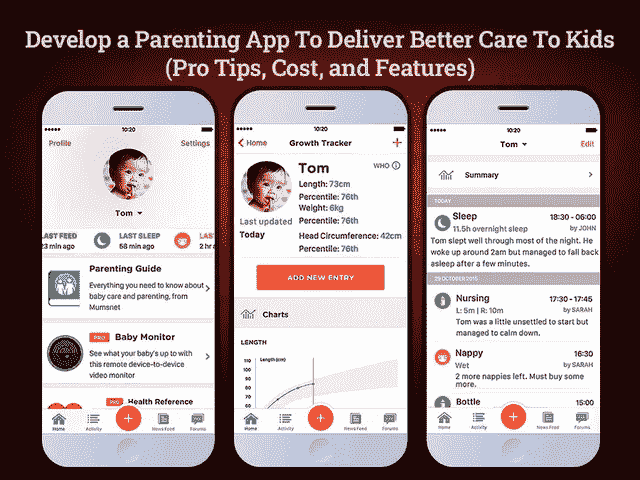

# 为了更好的照顾，创建一个最好的育儿 App 要花多少钱？

> 原文：<https://javascript.plainenglish.io/how-much-does-it-cost-to-create-the-best-parenting-app-for-better-care-3a21001cb45e?source=collection_archive---------12----------------------->

## 开发一个育儿应用程序来为孩子提供更好的照顾需要多少钱？

婴儿是一种福气，第一次把他们抱在怀里是一种奇妙的感觉。但是对于新父母来说，照顾一个小家伙总是一项艰巨的任务。理解婴儿的呼唤，并在适当的时候安慰他们，需要在传统的养育孩子的深入过程中积累经验。新父母通常选择保姆服务来减轻他们的育儿工作。但在新冠肺炎事件之后，抚养孩子变得更具挑战性。父母不得不照顾他们的孩子，不得不忍受远程工作的痛苦。

如果你也在追同样的情况，不要慌。在当今快节奏的生活中，为人父母已经成为一种挑战。对于那些不得不在家庭责任和工作之间周旋的双职工父母来说尤其如此。不过不用担心，每个问题都有解决的办法。许多父母在谷歌上搜索育儿技巧和养育孩子的专业建议。当然，作为回报，你会收到无数条建议，但问题是这些建议有多可靠。事实是，没有适用于所有孩子的标准建议。每个孩子都是不同的，需要个性化的关注和照顾。

那么，在为人父母的旅程中，什么是合适的伴侣呢？好吧，答案是在养育孩子的移动应用程序中有很好的帮助。按需育儿应用已经成为新父母的新游戏规则改变者。通过在应用程序中提供这些实用的育儿技巧、功能和特性，这些解决方案让大多数妈妈都坚持使用它。

因此，如果你也计划为担心孩子的新时代父母设计这样的平台，那么现在是做出决定的最佳时机。

在你对开发育儿应用程序时从哪里开始和考虑什么感到困惑之前，你可以通过这篇博客指南获得所有答案。

**博客的主要亮点**

*   *你为什么要投资育儿应用开发？*
*   *你能想到的 2022 年开发的育儿应用类型
    ——让管理孩子变得更容易的最佳育儿应用*
*   *进入育儿应用程序开发流程
    -具有医学视角的父母护理应用程序的顶级功能
    -为父母创建应用程序面板的必备功能
    -集成到育儿应用程序中的其他重要功能*
*   *做一个育儿 App 要多少钱？*
*   *结论:打造一款按需育儿应用，帮助你管理孩子*

让我们深入了解每个参数的细节，以便更好地理解。

## **为什么要投资育儿 App 开发？**

创建移动应用程序所需要的只是一个好的应用程序创意。但是，在你对应用程序开发进行任何投资并投入巨大努力之前，你肯定想验证它是否值得。市场需要你的解决方案吗？人们需要一个解释吗？为了找到这些问题的答案，我们探索了最新的统计数据和趋势，并收集了一些有助于您做出决定的事实。

**育儿 App 开发行业的市场洞察**

*   报告调查报告显示，play 市场上有超过 4300 款免费移动育儿 app。
*   按照感应塔的说法，已经发现了；市面上免费的育儿 app 比付费的还多。
*   市场调查已经注意到，28%的美国父母每年在保姆身上花费 30，000 到 75，000 美元，假设建立一个保姆市场有很大的容量。

的确，有了这些统计数据，你就很容易理解育儿类 app 的重要性了。但是应用的成功取决于你开发应用的方式。你可以聘请一家 [**手机应用开发公司**](https://www.xicom.biz/services/mobile-app-development/) 来定制应用，但在此之前，确保诸如母亲、父亲、婴儿、孩子、父母、家庭等词找到你的应用。

因此，考虑到所有这些小技巧，您可以创建一个解决方案，并缩小规格。但是在你进行应用程序开发之前，你需要决定你需要开发哪种类型的育儿应用程序。

# **你能想到的 2022 年开发的育儿应用类型**

当谈到开发一个育儿应用程序时，你需要评估几个参数，并在一个应用程序中提供所有功能，这可能很难管理。与其让应用程序的结构变得如此复杂以至于难以操作和导航屏幕，不如根据它们的主要用途将它们分成几个类别。因此，在开发育儿应用程序时，你可以考虑以下几种应用程序类型:

> **育儿应用和育儿解决方案的类型**

*   儿童监控和照顾婴儿的应用程序
*   连接父母和健康专家的应用程序
*   为家长提供有趣学习技巧的应用程序
*   监控儿童位置的应用程序
*   育儿技巧和抚养孩子的应用程序
*   共同养育支持和解决方案应用程序
*   面向儿童的各种艺术和游戏相关应用

考虑到种类繁多的应用程序类型，您可以选择构建完全符合您需求的解决方案。毕竟，选择应用程序开发将成为一个完整的收入来源，并促进您的业务增长。不同的 app 有不同的用途。因此，在你继续下一步之前，看一看流行的育儿应用程序是合乎逻辑的。

## **让管理孩子变得更容易的最佳育儿应用**

许多人说，对于初为人父母的人来说，管理孩子总是更难。但是我想说，如果你采用先进的技术，就不会有那么大的挑战。作为三个孩子的母亲，我更喜欢使用不同的应用程序来管理我的孩子。无论是安抚婴儿，监控孩子的营养，管理屏幕时间还是保持健康的记录。有不同的应用程序可以处理它。

*这里有一些适合幼儿、婴儿和学龄前儿童的流行应用:*

**友善地:**这是一款总部位于悉尼的应用程序，允许父母搜索附近的保姆和保姆以建立联系。这个应用程序还有一个选项，让父母分享保姆的联系方式，并在应用程序中分享育儿技巧。

**云婴儿监控器:**这种类型的应用受到家长们的赞赏，并在全球范围内使用。由于它可以在 iOS 和 Android 设备、Apple TV 和 Apple Watch 上使用，因此父母使用它变得非常方便。创建一个 app，你可以选择 [**聘请一个手机 app 开发者**](https://www.xicom.biz/offerings/hire-mobile-developers/) ，定制类似云宝宝监视器的功能。该应用程序充满了各种有用的选项，包括夜间时钟、夜间灯光、噪音和运动警报、监控选项、直播视频、婴儿音频、while 噪音集、摇篮曲等。

**Cozi 家庭组织者:**父母有一张他们需要处理和照顾孩子的任务清单。有时很难让一切保持同步并在控制之下。这就是像 Cozi Family Organizer 应用程序这样的应用程序方便地工作并在视觉上愉悦调度程序的地方。

这些是为数不多的在全球范围内越来越受欢迎的应用程序。但是，如何创建一个吸引全球注意力并在市场上立足的应用程序呢？让我们进入应用程序开发的细节。

# **进入育儿 App 开发流程**

如何打造一个成功的育儿 app？决定应用程序的特性和功能可以帮助你赢得一半的战斗。因此，在你陷入需要优先考虑哪些功能的困境之前，花点时间了解一下你的目标受众。所以，当你决定投资一个移动应用程序时，确保你雇佣了一个软件开发公司，它可以很好地将这个想法变成现实。当应用程序专注于儿童时，这项工作变得有点棘手。毕竟，每个年龄段都有自己的行为、情绪、态度、行为、期望等。因此，牢记一切，我们根据具体需求对特性进行了分类。

**从医学角度看父母护理应用程序的主要特性**

*   **App 注册:**下载一个 App，就该注册了。使用电子邮件 ID 或联系信息，用户可以注册应用程序。
*   **创建个人资料:**允许家长使用个人资料图片创建孩子的个人资料，编辑姓名，更新联系方式，提及年龄、体重和身高。
*   **健康更新:**该功能允许父母详细标记孩子的疫苗接种和健康问题。这项功能将帮助父母保持一个适当的跟踪记录，他们的宝宝的健康和问题。
*   **联系健康专家:**允许父母通过应用程序与儿科联系，让他们能够安排在线咨询，以获得快速帮助。
*   专家健康提示:对于新时代的父母来说，管理和照顾孩子将是一种新的体验；因此，了解他们的健康问题会有点困难。在那里你可以提供育儿博客、健康专家
*   **上传处方:**通过此应用程序，您可以方便地保存每份医疗报告。允许他们在应用程序中上传处方以获得医疗援助。

**为父母创建应用面板的必备功能**

*   **育儿小贴士:**板载各种博主和儿科，提供初为人父母者可以依赖的快速育儿小贴士。这些育儿技巧将帮助父母管理他们的孩子，使他们能够为孩子提供更好的照顾。
*   **检查孩子的活动:**允许父母快速查看孩子的所有活动和时间表，如睡觉时间、付款时间、吃饭时间等。
*   **餐食计划:**不同年龄段有不同的餐食推出。那么，父母如何知道该介绍什么呢？在那里你可以 [**雇佣一个手机应用开发者**](https://www.xicom.biz/offerings/hire-mobile-developers/) 来定制应用结构并添加这个功能。为不同年龄组提供有吸引力的膳食计划。你所需要做的就是确保它们制作迅速，味道好，营养丰富。
*   监控:父母的首要职责始终是照看孩子。但是当你已经忙于其他杂务时，这就变得有点棘手了。它提供了将你的应用程序与摄像头连接以监控他们活动的功能。
*   **照片和视频观察:**用来自活动的图像标记实时观察。
*   **学习故事和作品集:**作为一个蹒跚学步的孩子的家长，你需要为你的孩子创建作品集。而这只会发生在你持续监控实时观察的时候。事实上，添加应用程序内的功能，在跟踪活动后自动生成您孩子的作品集。
*   **生成每日报告:**添加创建每日报告的功能，解释您孩子的活动，并让您知道发展评估分数。
*   **推送通知:**有了这个功能，家长可以通过短信、照片和视频，以及邮件上的备注接收紧急提醒。
*   **拦截危险应用:**防止孩子与陌生人聊天，用安全的浏览器过滤掉色情内容。
*   **获取报告:**每日报告将提供关于谁、什么、在哪里以及如何的知识。

**幼儿应用开发中需要考虑的其他特性**

*   **控制屏幕时间:**使用日常设备屏幕定时器功能，您可以固定屏幕时间并定制您孩子的数字体验。这将帮助你把他们从游戏成瘾和流媒体视频中拯救出来。此外，你可以选择应用程序上的教育和吸引人的内容。
*   **阻止通话功能:**进入 app 设置，只允许已知号码的来电。在手机上设置特定的号码，如家庭号码，以便于访问。
*   **拦截短信:**您可以拦截短信，防止孩子与陌生人聊天。
*   **位置跟踪:**有了这个功能，父母可以检测到孩子的实时位置，并在紧急情况下轻松跟踪他们。

在开发育儿和保姆应用程序时，这些是你可以在育儿应用程序中实现的少数功能。创建一个基本版本的应用程序平均需要 3 到 4 个月的时间，但是已经有各种各样的应用程序可以提供基本的服务。所以作为一家初创公司，你一定在想如何从这款应用中赚钱。

## **如何从育儿 App 上投资赚钱？**

开发移动应用程序并投入大量精力的简单目的是从应用程序中获得良好的收入。但问题是，一个人如何投资育儿应用开发解决方案，并能够赚到钱？app 开发项目入门，你可以选择聘请一家 [**手机 app 开发公司**](https://www.xicom.biz/services/mobile-app-development/) 将你的项目创意变成现实。但在此之前，你需要有一个出色的战略来帮助你将业务推向市场，并让客户看到它。随着越来越多的家长了解你的 app 并下载，会有更大的机会盈利。但核心问题仍然是一样的:什么是最好的货币化战略？

这里有一些帮助你赚取利润的想法:

*   **订阅计划:**根据家长的要求，为家长提供每月或每周的服务，您可以提供他们订阅该计划。根据订阅计划，您可以在应用程序中提供一系列出色的功能，为父母提供额外的帮助和协助。
*   **应用内广告:**允许第三方品牌发布广告创收。这是从你的应用程序中产生利润的一个很好的方法，你需要做的就是确保这些品牌属于同一个社区。

## **创建一个育儿 App 需要多少钱？**

开发一个育儿应用程序是复杂的，涉及到对每个功能的仔细关注。根据应用程序的结构和功能，开发移动应用程序的成本会有很大差异。而且，每个企业都有自己的目标和要求；因此，没有标准的解决方案。没有在线计算器能帮你估算出准确的 app 开发成本。*因此，要确定创建一个育儿应用程序需要多少成本，你需要了解各种影响成本的因素。这可能包括:*

*   **app 的复杂程度:**更复杂的 app 结构会在 app 开发上花费更高的时间，最终增加 app 开发成本。
*   **特性和功能:**你可以用大量的特性和功能来丰富你的应用，但是每个特性都会增加应用开发的时间和成本。所以创业公司可以考虑开发具备基本功能的 MVP 解决方案。
*   **应用程序开发团队:**要创建一个成熟的育儿应用程序，你需要雇佣一名应用程序开发人员、UI/UX 设计师、应用程序测试人员、业务分析师和项目经理。此外，他们的每小时费用因其技能、经验和地点而异。在印度可以低至 20 美元/小时，在美国为 150 美元/小时。雇佣昂贵的专家并不能保证优秀的产品质量，然而以最低的每小时成本雇佣专家并不意味着他们没有技能。评估参数并做出明智的决定。
*   **UI/UX 设计:**应用程序设计是你产品的一个重要方面，所以保持一个简单、容易和有吸引力的应用程序设计，确保在多个屏幕之间无缝导航。

评估所有这些因素和基本功能及其复杂性，我们得出结论，一个父应用程序的平均应用程序开发成本将在 20，000 美元至 25，000 美元+之间浮动。应用程序开发的成本和时间将主要取决于应用程序的业务需求和复杂性。所以在你做任何决定之前，有必要和专家预约一个免费的咨询时段来讨论项目细节。

## **结论:打造一款按需育儿应用，帮助你管理孩子**

在当今时代，育儿应用被认为是对新父母的巨大支持。这些应用程序不仅成为潜在的信息来源，还使得在一个地方管理所有与婴儿相关的数据变得更加容易。家庭在使用这些应用程序时感到不知所措，从 24*7 监控活动到保持健康跟踪。作为一家初创公司，你所需要的只是雇佣一家 [**移动应用开发公司**](https://www.xicom.biz/services/mobile-app-development/) 来启动你的项目。他们将帮助实现一系列丰富的特性和功能，使其流行起来，并证明这款应用程序是父母的一笔优秀资产。由于这两个应用程序商店都没有这么多可用的应用程序，专家可以通过使用跨平台应用程序开发方法，让你的应用程序在两个平台上都可用，而不会给你带来太大的经济负担。

因此，如果你对创建一个育儿应用程序或寻找专家来帮助你开始使用此类解决方案有任何疑问，你可以联系我们或在下面提出疑问。

========================================

*更多内容看* [*说白了。报名参加我们的*](https://plainenglish.io/) [*免费每周简讯*](http://newsletter.plainenglish.io/) *。关注我们的*[*Twitter*](https://twitter.com/inPlainEngHQ)*和*[*LinkedIn*](https://www.linkedin.com/company/inplainenglish/)*。加入我们的* [*社区不和谐*](https://discord.gg/GtDtUAvyhW) *。*