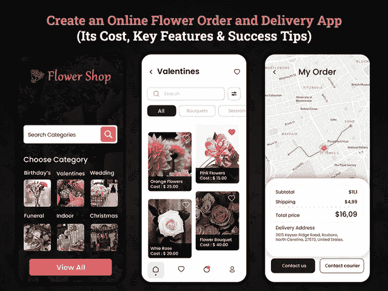
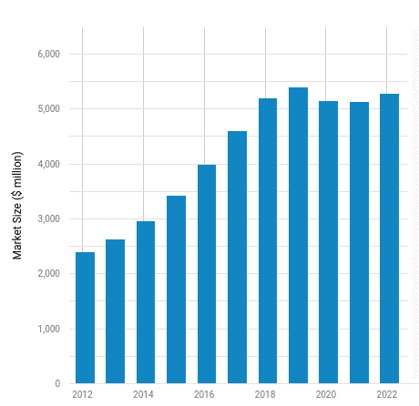

# 开一个网络订花送花业务 App 需要多少钱？

> 原文：<https://javascript.plainenglish.io/how-much-does-it-cost-to-start-an-online-flower-ordering-and-delivery-business-app-d043c1db2dbc?source=collection_archive---------12----------------------->

## 创建一个在线鲜花订购和交付应用程序:其成本，关键功能和成功秘诀

如果我们说花店正快速从实体店转向网上商店，那一点也不为过。对在线服务的需求不断增长，不仅长期增强了经济，也为花店的发展提供了潜在的机会。

毫无疑问，疫情在客户行为方面发生了巨大的变化。人们互动、做生意、工作和购物的方式——一切都发生了革命性的变化。这就是技术占据中心舞台的地方，并给人们带来了通过创造数字资产来产生商业利润的积极希望。此外，可以肯定地说，在这个衰退的经济中，创建一个在线的存在是恢复商业根基的唯一可能的方法。

今天，没有网上店铺的花店销售额几乎为零。无论是生日、庆典、婚礼、正式的商务会议，还是室内装饰，每一个特殊的场合如果没有鲜花都是不完整的。因此，如果你仍然在用传统模式管理你的鲜花递送业务，那么现在是时候创建一个在线鲜花订购和递送业务应用程序了。

***想知道投资一款送花 app 是否是一个符合逻辑的决定？全球疫情之后还需要吗？***

今天的花卉产业正在全球范围内发展和演变。此外，在线服务的普及预计将继续增长，并使在线花店受益。如果你还不确定，那么我们在这里分享 2022 年及以后的花卉产业统计数据。

## **全球网上花店显著统计**

如果你喜欢为特殊的场合插花，开一家网上花店会是一个有回报的生意。近年来，美国消费者越来越习惯于网上购物。此外，客户购物习惯的持续转变极大地影响了花店创建快速订购和交付的移动应用程序。

以下是网上花店行业令人瞠目的统计数据:

*   *根据市场调查，2022 年网上花店将占据*[*53 亿美元的市场规模*](https://www.ibisworld.com/industry-statistics/market-size/online-flower-shops-united-states/) *。*
*   *根据调查报告，CAGR 网上花店的市场规模以* [*2.8%的速度增长。*](https://www.ibisworld.com/industry-statistics/market-size/online-flower-shops-united-states/)

[Image Source](https://www.ibisworld.com/industry-statistics/market-size/online-flower-shops-united-states/)

*   *根据一份调查报告，全球花卉产业价值估计每年超过***1048 亿美元。美国每年花在花卉产品上的钱超过 260 亿美元。美国每家花店的平均年销售额超过 322，000 美元。**
*   ***花卉行业发生的交易中，82%发生在三个事件上:30%发生在情人节，26%发生在圣诞节和光明节，26%发生在母亲节。这些假期贡献了 81%的年收入。***
*   ***2020 年，平均每人将花费*[*132.65 美元购买鲜花*](https://whydoeseverythingsuck.net/blog/flower-industry-statistics/#Flower_Industry_Statistics_for_the_US) *，远高于 2017 年的每笔交易 107.89 美元。***
*   **[*全球 18%的互联网用户*](https://www.statista.com/statistics/276846/reach-of-top-online-retail-categories-worldwide/) *在网上购买过鲜花和礼品套装。***

**关于在线花店的统计数据和事实清楚地描述了为什么你应该投资在线鲜花订购和交付移动应用程序。随着在线市场的不断发展，可以肯定地说，开发在线鲜花订购和交付应用程序是一个相当重要的决定。但是在你直接进入雇佣一个 [**app 开发公司**](https://www.xicom.biz/services/mobile-app-development/) 的流程之前，有必要了解一下如何入门。鲜花递送行业已经被 Bouqs Co、UrbanStems、Farmgirl 等应用程序所主导。因此，收集一些构建按需送花应用程序的技巧是有意义的，这可以让你在行业中脱颖而出。**

# ****开始网上花卉生意:成功秘诀****

**开发一款送花 app，包括很多规划、策略、准备工作。开始你自己的花卉生意，这也是非常具有挑战性的。无论你是季节性花店还是打算开自己的花店，有几个因素你需要牢记在心。这里有一些提示来运行一个成功的网上花卉生意，使你在市场上保持领先地位。**

*   ****了解市场需求和机会****

**因为你要开一家花店，所以你需要了解花本身。开办鲜花递送店的最大挑战是每天有 45%的鲜花死亡。就像两朵花中有一朵需要丢弃。由于这个原因，在美国销售的 80%的鲜花是从其他国家进口的。这不仅是一个昂贵的选择，而且给供应商带来了巨大的问题。因此，如果你准备创建一个鲜花递送应用程序，那么支持当地供应商是值得的。这将确保你更快，更新鲜的花持续更长时间。此外，它促进了社区的经济发展，并为顾客提供了高质量的鲜花。**

*   ****了解你的客户****

**在开网上花店的时候，你应该知道你的目标受众是谁。80%的鲜花销售贡献给了女性顾客。然而，另一个有趣的事实是，你需要考虑到超过 60%的鲜花销售是为真正购买它们的人购买的。像这样的统计数据将有助于花店了解他们的理想客户，并为他们提供一个完美的营销角度。**

**为了了解你的顾客，你可以考虑以下几个问题:
——他们需要鲜花的目的是什么？
-他们寻找什么类型的花？
-追踪他们之前的鲜花购买行为？**

*   ****不要只依靠特殊场合****

**毫无疑问，鲜花是任何庆祝活动中最重要的部分之一。但花店令人惊讶的是，50%的销售额是在非日历事件上产生的。换句话说，一半的鲜花销售是自发产生的，而人们全年都在购买。许多花店都很好奇，想直接进入 [**雇佣一个移动应用开发者**](https://www.xicom.biz/offerings/hire-mobile-developers/) 来开始他们的冒险。拥有一家花店可能是任何人的个人选择。但要想成功，你需要合适的现金流。为了拓展业务，你需要挖掘市场，了解他们为什么买花。除了，哪些日子对他们来说是特别的，他们买什么特别类型的花。收集这些信息对企业主来说实际上是一个里程碑。**

*   ****送花****

**这是网上花店成功的一个关键。要取得成功，你所需要的就是管理一个协调良好的专用交付系统。确保工作人员有足够的能力在不影响质量的情况下运送鲜花。优质、准时地将鲜花送到顾客家门口是构建一个成功的在线鲜花配送 app 的基本要素。**

**简而言之:有了这些提示和建议，希望你已经理解了“如何开始网上花卉生意并赚取丰厚的利润？”。但是，发展一家网上花店，要考虑的远不止这几点。在你雇佣软件开发公司将你的应用想法转化为一个完美的解决方案之前，你需要优先考虑你计划通过你的应用提供的功能。App 的特性和功能是最大的成本驱动因素，因此我们不会超出预算，而是在这里向您深入解释。**

***但在此之前，有一些 app 开发的基础东西需要你看一看……***

## ****了解成功送花手机 App 的独特属性****

**在开发一个移动应用程序时，有成百上千的东西需要寻找，但开发一个成功的移动应用程序有一些特定的属性。因此，如果你是一个商业爱好者，不知道在应用程序开发中需要考虑什么，以及如何让它吸引客户，那么让我们从应用程序开发的基本属性开始。**

*   ****摄影和摄像可以改变游戏规则****

**由于网上购物的需求激增，所以确保顾客能够从各个角度检查产品的细节。他们可以通过手机屏幕放大并感受产品。确保你是从不同的角度和在不同的环境下拍摄照片。此外，你可以聘请专业摄影师来拍摄专业且高分辨率的花卉图像和视频，以吸引购买。最重要的是，根据调查，花很长时间加载的沉重图像可以提高客户的跳出率。**

*   ****完整的产品细节和说明指南****

**它可以作为一个完美的营销技巧为您的企业。产品细节基本上是一个简短的描述，解释产品的质量，美观，以及使用该产品的原因。因此，请确保您提供的方式能够让客户立即将其添加到购物车中。此外，您还可以提供护理详情。**

*   ****简单、容易、有吸引力的用户界面/UX 设计，更好的用户参与度****

**与其创建一个非常花哨和复杂的应用程序设计，不如寻找一个易于访问的 UI/UX 设计。多屏幕之间简单明了的导航总是受到客户的青睐。确保你雇佣了一个 [**应用程序开发公司**](https://www.xicom.biz/services/mobile-app-development/) 来帮助你用简单的 UI/UX 设计定制应用程序。此外，它包含的问题更少，增强了客户体验，并很好地提高了用户参与度和性能。简单而用心的 UI/UX 设计可以在你的商业应用和用户之间创造一个完美的汇聚点。**

*   ****100%退货政策赢得信任****

**随着市场上各种竞争对手的出现，获得关注和建立用户信任是最具挑战性的工作。然而，产品交换或退货政策可以让买家放心，如果他们对产品质量不满意，他们可以很容易地交换/退货。你的应用程序的这个功能可以让客户在你的应用程序上自由购物。因此，始终确保您的政策是良好的回报，以避免混乱。**

*   ****面向事件的产品包装****

**你的应用程序的这个功能可以帮助你赢得客户的心。他们可能会在网上订购，但他们永远不想减少这种活动的乐趣和魅力。因此，利用定制包装的鲜花礼物或巧克力可以成为一个热点卖点。此外，它可以帮助你赚取额外的特殊服务的钱。**

**简而言之，作为一个创业公司或花卉企业主，你需要考虑这些要点，以捕捉潜在的细分市场。此外，让我们直接进入开发一个成功的鲜花递送移动应用程序的特性和功能。**

## ****网上送花手机 App 开发关键功能及成本估算****

**诚然，特性和功能是影响成功的一个主要因素，但它也会增加你的应用程序开发成本。作为一家初创公司，你可能会对决定你应该在应用程序中包含哪些功能感到困惑。此外，最初，你永远不会想在鲜花递送应用程序开发上进行巨额投资。因此，这里我们提到了你可以考虑在鲜花递送应用程序中实现的一般功能。**

> ****创建花店订购和交付应用的一般特性和功能****

## ****送花 App 创建用户面板的功能****

*   ****用户注册:**您可以通过 Gmail ID、手机号码或社交档案为用户提供三种简单的登录选项。**
*   ****浏览产品:**通过这个功能，用户可以通过 app 浏览你提供的鲜花列表。你可以 [**雇佣 app 开发者**](https://www.xicom.biz/solutions/hire-developers/) 对各种花进行分类。精心设计的花卉种类会增加用户体验。**
*   ****应用搜索过滤器:**允许用户根据不同的需求对鲜花进行分类。添加基于特殊场合如情人节、生日、婚礼、葬礼等搜索鲜花的功能。**
*   **下订单:在下订单时，你可以提及某些花卉的最低数量和质量。允许用户只需轻轻一点就可以快速将鲜花添加到购物车中。确保他们不想离开当前页面来中断购物体验。**
*   ****创建/更新花篮:**让用户在购物车中查看订单。此外，允许他们增加数量或从购物车中删除鲜花。**
*   ****添加到愿望清单:**为了节省购物时间，允许顾客探索鲜花，并将其添加到他们以后想要购买的愿望清单中。顾客不必一开始就浏览产品，而是可以直接进入愿望清单，以后再下订单。**
*   ****多种支付方式:**订单确认后，允许客户使用多种支付方式进行支付，包括信用卡、借记卡、PayPal、Google Pay 等。**
*   ****查看订单历史:**跟踪客户订单。这将允许你快速重新排列鲜花，而不用经历整个过程。**
*   ****跟踪订单交付:**这将帮助客户轻松跟踪送货男孩的实时位置。事实上，这也将给出鲜花递送的估计。**
*   **评级和评论:根据他们的购物体验，让用户分享他们的反馈或给服务提供商评级。**

## ****创建鲜花配送应用程序供应商面板的功能****

*   ****通过电子邮件注册/登录:**允许供应商使用管理面板批准的登录凭据登录应用程序。**
*   ****创建和管理个人资料:**供应商可以创建个人资料，并编辑姓名、简历、品牌标志等详细信息。**
*   ****管理和更新产品:**通过此功能，供应商可以在应用程序中添加、删除和编辑产品的详细信息。此外，允许他们编辑或添加花卉的细节或描述。**
*   ****查看和管理订单:**为确保鲜花准时交付给客户，您可以自动创建订单顺序，以避免产品交付延迟。**
*   ****接受订单:**根据鲜花和送货员的供应情况，供应商决定接受还是拒绝订单。**
*   ****推送通知:**这是一个完美的营销工具，可以帮助你更新客户的一切信息，包括订单状态、付款状态、交易、折扣等等。**
*   ****跟踪实时送货:**确保你有一个功能，可以让客户跟踪订单状态和送货男孩的实时位置。这将有助于他们了解送货需要多长时间。**
*   ****接受支付:**人们使用多种支付方式，所以确保他们接受所有平台的支付，包括信用卡、借记卡、PayPal、Google Pay 等等。**
*   ****查看评级和评论:**允许供应商查看客户对其服务质量的评级和评论。这将帮助供应商确定他们需要关注的领域。**
*   ****应用内聊天支持:**为了提供出色的用户支持，您可以提供应用内聊天和通话功能。订单确认后，您可以使用应用内聊天功能联系送货员。**

## ****创建送花手机应用管理面板的功能****

*   ****管理供应商和花店:**管理员有权管理供应商和花店的多个配置文件。这将确保他们能够顺利地管理订单。**
*   ****仪表板:**登录应用程序时，管理面板会被定向到应用程序的仪表板，该仪表板提供所有业务洞察。你可以雇佣一家 [**软件开发公司**](https://www.xicom.biz/) 来定制这个功能，因为它在你的结构中占有重要的地位。管理员可以每周或每月生成业务进度报告，以了解用户最活跃的位置、活跃用户的数量等。**
*   ****查看收入和客户获取:**管理员可以访问应用程序的分析，并能够确定他们每月或每年赚多少钱。除此之外，他们一个月内处理和拒绝的订单数量。**

**这些是您在开发 MVP 解决方案时可以考虑的基本特性。这将是创业公司或商业爱好者的理想选择。然而，如果你打算与行业巨头竞争，那么超越基本功能是值得的。当然，大多数特性会增加你的开发成本，但是它会增加你成功的机会。**

## ****让您的送花应用脱颖而出的高级功能****

**在线送花应用程序中实现高级功能肯定会增加应用程序开发成本。但是，它肯定会拓宽在市场上取得成功的范围。如果你是在和行业内的巨头竞争，那么你的应用必须要有独特的东西。在你的应用中采用现代功能将有助于你在行业中脱颖而出，并让你能够与领导者竞争。**

***让我们来看看为你的送花应用增加优势的高级功能:***

*   ****社交注册/登录:**快速、简便、快捷的登录流程将提高客户参与度。允许用户使用社交媒体个人资料和联系方式注册。**
*   **聊天机器人支持:聊天机器人的实施将确保全天候为客户提供卓越的客户支持。在你的应用中集成一个复杂的聊天机器人将改善客户体验。**
*   ****机器学习:**这将帮助你跟踪客户行为、购买模式，并向客户推荐合适的产品。该功能将在整个购买过程中为他们提供帮助。**
*   ****图片/语音搜索:**虽然如今每个人都变得精通技术，但通过语音和图片搜索来搜索鲜花的功能真的很有帮助。这将是你的应用程序的独特卖点。**
*   ****应用内摄像头:**应用内摄像头的功能将允许客户点击花朵的图片，并能够直接上传到应用中。如果退款或退货，客户可以直接在应用程序中上传图片并分享评论。**
*   ****忠诚度计划:**该功能对用户来说就像一块磁铁，可以让你留住现有的用户。为了让它完美运行，你可以 [**雇佣手机应用开发者**](https://www.xicom.biz/offerings/hire-mobile-developers/) 来定制这个功能。忠诚度或推荐计划激励客户使用和分享应用程序，以赚取更多购物积分。**
*   ****多种支付选项:**通过在应用程序中集成多种支付选项，用户可以轻松快捷地进行支付。最常见的支付平台可能包括 Google Pay、PayTM、ApplePay 等等。**
*   ****多语言支持:**如果您的目标是该国的多个地区，此功能非常重要。该应用程序提供不同语言版本，有助于客户轻松访问该应用程序并进行购买。**
*   ****产品信息管理(PIM):**PIM 系统的实施将有助于在一个地方收集和管理所有花卉信息。该功能将有助于分析和营销某些产品，并通过各种分销渠道进行销售。**

**你可以选择一套优秀的功能来定制应用程序，但它的工作方式会对应用程序的性能产生很大的影响。你需要了解哪些技术可以帮助你创建一个精彩的送花 app。**

## ****创建在线送花应用所需的技术支持****

**无论你是在构建一个 MVP 解决方案还是一个成熟的应用程序，它的性能都是企业主要关心的问题。因此，关注能让你的应用完美运行的技术是很重要的。**

**以下是一些建议，你可以考虑创建一个在线送花应用程序:**

*   ***安卓开发 App: Java，Kotlin***
*   ***iOS 开发:Swift，Objective C***
*   ***跨平台 App 开发:React Native、Flutter、Xamarin***
*   ***数据库:MongoDB、Cassandra、HBase***
*   ***云环境:Google、AWS、Azure***
*   ***导航:谷歌地图***
*   ***实时分析:Flink、Storm***
*   **推送通知:Push.io，Twilio**
*   ***支付:Stripe、Braintree、PayPal、网上银行、Google Pay、Apple Pay***
*   ***短信&电话验证:Nexmo，Twilio***
*   ***前端:CSS3，引导***
*   ***直观界面:Python，Javascript***
*   ***谷歌签到/脸书 SDK***
*   ***数据库管理:Postgres，HBase，MongoDB，Cassandra***

## ****如何将你在开发花店应用程序上的商业投资变现？****

**毫无疑问，在花费了巨额的投资和心血打造了一家送花店之后，你一定很好奇它是如何帮你盈利的？有很多方法可以将你的送花应用货币化。但是在你 [**雇佣移动应用程序开发者**](https://www.xicom.biz/offerings/hire-mobile-developers/) 来创建一个送花应用程序之前，确保你选择了一个能确保最大利润的。事实上，您所需要的只是了解如何以最佳方式利用这些特性，从而为您带来丰厚的收入。以下是你能想到的几个最有回报的赚钱策略:**

*   **产生收入的第三方广告**
*   **在应用程序内购买额外的礼物，如泰迪熊、巧克力、篮子等。**
*   **收取供应商列表费。你可以设定一个标准费用，也可以对一笔交易收取一定的费用。**
*   **向客户销售订阅计划，让他们受益于鲜花的额外折扣。**

**知道这些之后，你们中的许多人都在想，创建一个鲜花应用程序到底要花多少钱？**

## ****创建一个在线鲜花订购和配送业务 App 需要多少成本？****

**创建一个应用程序没有标准成本，但如果你想知道创建一个在线鲜花订购和交付应用程序的估计成本，那么你需要考虑几个因素。**

**平均应用程序开发成本取决于你的应用程序结构的复杂程度和你选择定制的应用程序开发公司。通过将适当的功能选择与行业趋势技术相结合，您可以创建无与伦比的高质量解决方案。当然，这将使你能够推出一个出色的应用程序，也能快速扭转局面，但这将需要一个高端开发团队，这将增加你的应用程序开发成本。**

**因此，基本上，当你开始开发一个成熟的楼层交付应用程序时，你需要一个由业务分析师、项目经理、应用程序开发人员、UI/UX 设计师、应用程序测试人员等组成的团队。此外，创建移动应用程序的平均成本也取决于应用程序的复杂程度。此外，特性和功能列表也会极大地影响应用程序的开发成本。根据所有这些因素，创建一个在线鲜花订购和交付应用程序的平均成本将在 20，000 美元至 25，000 美元以上。**

**在你做出任何决定并相信这些估计之前，可以说这些只是粗略的估计。不同的企业有不同的需求，因此每种变化都会在应用程序开发成本上产生巨大的差异。**

## ****结论:准备开一家网上送花店****

**鲜花递送行业正在迅速变成一个十亿美元的市场。如果你也梦想在这个行业成名，并期待成为这个蓬勃发展的领域的一部分，那么发展网上业务是一种潜在的方式。通过选择雇佣一家 [**移动应用程序开发公司**](https://www.xicom.biz/services/mobile-app-development/) ，你可以轻松创建一个可以帮助你在行业中脱颖而出的应用程序。一个开发良好的应用程序不仅会成为一个传播口碑的伟大平台，还会让人们预订订单，分享应用程序，并利用定制包装的送货上门服务。一个设计巧妙的应用程序可以让你获得大量的客户数据，这对业务扩张有积极的帮助。**

**=======================================**

***更多内容请看*[***plain English . io***](http://plainenglish.io/)*。报名参加我们的**[***免费周报***](http://newsletter.plainenglish.io/) *。在我们的* [***社区获得独家访问写作机会和建议***](https://discord.gg/GtDtUAvyhW) *。****