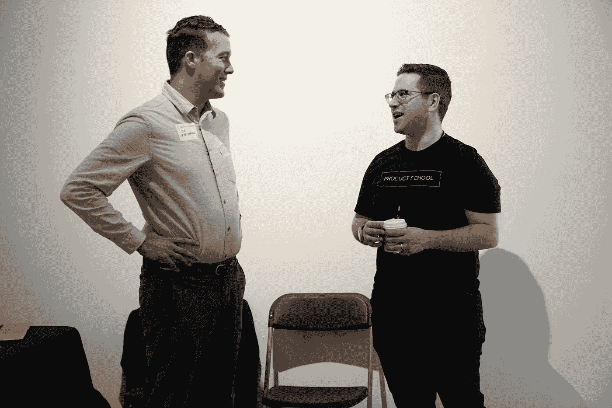

# 我的老板如何看待初级和高级程序员

> 原文：<https://javascript.plainenglish.io/how-my-boss-sees-a-junior-and-a-senior-programmer-2c0ec3dd08e8?source=collection_archive---------3----------------------->

## 他用自己的话描述了他们。

Photo by [Product School](https://unsplash.com/@productschool?utm_source=medium&utm_medium=referral) on [Unsplash](https://unsplash.com?utm_source=medium&utm_medium=referral)

程序员处于 IT 职业的最底层，但薪水很高。他们了解编程语言，知道如何将负载笔记本中描述的一些功能翻译成该编程语言的指令。

他们通常还做其他工作，如创建脚本文件、测试、测试程序，以及修复阻止程序完成和完成其预期任务的错误。

一般程序员可以来自语言教学学院，在那里学习 4 到 6 个月。后来，他通常以实习生的身份进入，在那里他已经作为团队助理完成简单但必要的任务，编程和其他计算机任务的外围任务，对于专业人员来说简单且非常枯燥，例如更改记录的描述或列表集合中字段的长度。

我把它们作为一个测试来复制和更改注册、取消、修改、咨询的列表，并在屏幕上和纸上列出应用程序中出现的所有表格，如省份、邮政编码、材料和风格。

通过这一测试，即在加入该团队约六个月后，他们被建议作为永久员工或通过工作进入(取决于工作前景和公司留下的空缺)，或在最坏的情况下，他们被告知不可能成为永久员工。他们被保证给他们一封推荐信，无论他们找到什么工作，同时，继续作为实习生，直到我们可以通过做实习工作或开始做编程工作为他们提供一个地方，以获得更多的经验。

# **初级程序员**

初级程序员负责编写被认为是简单先验的程序，逐渐负责处理更复杂的程序，直到他们被认为是编程语言和操作系统方面的专家。链接几个程序，并能够在一个链中测试它们和其他更复杂的任务，典型的专家程序员或高级程序员。

当认为他们有足够的水平时，这在很大程度上取决于他们的价值和他们证明这一点的可能性，但让我们说正常情况下在 8 个月到两年之间，建议公司管理层将他们提升为高级程序员。,

# 高级程序员

他是一个有编程经验的程序员。基本上保留了两个任务，实现先验看起来更复杂的程序及其微调，以及在应用程序中制作的程序链的微调。所以它研究的不是一个程序而是一组程序的正常运行，

另一个基本任务是创建可能有冲突内容的记录，如字母、空格、句点、符号等。在必须是数字或不可打印字符的字段中，中间空格或字母数字区域中的正字法符号，并检查生成这些字段的程序是否能检测到它们。

如果可能，将它们转换成有效数据(例如，它们消除了千位分隔点并压缩了数据。或者，如果不可能，它们停止程序并输出错误消息，以便操作者知道应用程序的原因并手动纠正它或清除注册表，

该计划必须有计划的自动系统，从某一点重新处理一切，如果在应用程序的处理出错。

同样，如果数据是由应用程序获取的，他们必须在捕获数据时放置一个数据验证控件(通常在奖学金获得者经常使用的屏幕上)，如果数据是从数据库继承而来的，也必须放置一个数据验证控件。通知项目经理，以便他可以检查该数据的质量是否在其他地方得到控制。

最高级的也是根据功能分析写最简单的负载笔记本，比如实习生要执行的带表的，初级程序员要执行的最简单的程序。

也监督研究员的工作，对其正常运作负责，学习两件事，指挥和承担责任，当他们提升到下一个专业水平，也就是有机分析师的水平时，他们将继续行使这两件事。

*更多内容看*[**o**](https://plainenglish.io/)**。报名参加我们的* [***免费周报***](http://newsletter.plainenglish.io/) *。关注我们关于*[***Twitter***](https://twitter.com/inPlainEngHQ)*和*[***LinkedIn***](https://www.linkedin.com/company/inplainenglish/)*。查看我们的* [***社区不和谐***](https://discord.gg/GtDtUAvyhW) *，加入我们的* [***人才集体***](https://inplainenglish.pallet.com/talent/welcome) *。**