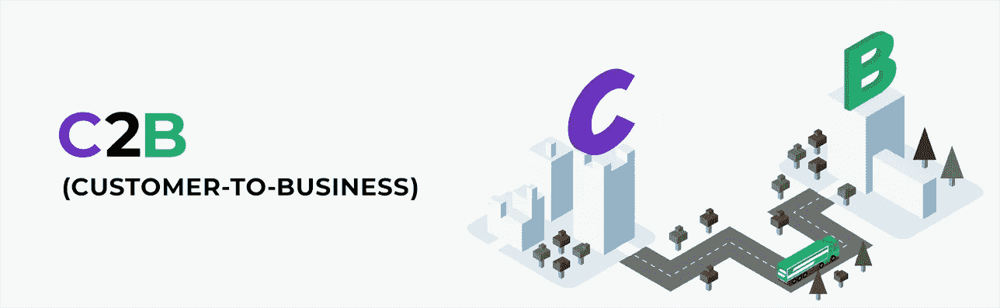

# 按需应用如何将一家初创企业转变成一家拥有数百万资产的公司

> 原文：<https://javascript.plainenglish.io/how-on-demand-apps-can-transform-a-start-up-into-a-multi-million-firm-f95be34a02d7?source=collection_archive---------16----------------------->

随着 2021 年底的到来，我们发现如今的企业已经经历了一波数字化转型。从他们营销、提供服务和繁荣的方式开始。而 [***按需 app 开发***](https://www.technource.com/on-demand-app-development/) 是促使这一演变发生的唯一原因。

但这部分的基础是由电子商务网站奠定的。但随着智能手机的出现，这些网站采取了便捷的移动应用程序的形式。后来优步来了，彻底改变了这里的面貌。它开始提供的 24*7 服务引发了一场革命，进而改变了全球企业的运作方式。

有很多公司跳上了这趟列车，通过在线服务充分利用了他们的业务。这是我们今天讨论的真正主题，我们将看到今天的企业如何利用按需应用市场，并从初创企业获得数百万美元的业务。

开始了。

# 什么是按需应用？

按需应用是一种移动或网络应用，允许用户在家门口向服务提供商订购商品或服务。该平台可以是来自城市或附近区域的各种提供商的集合。或者他们可以像沃尔玛一样成为一个知名的供应商。

这对消费者和供应商来说是一个双赢的局面。消费者可以从众多的供应商中进行选择，而供应商可以扩大他们的客户群，而不必在营销策略上投入太多。市场中的新参与者获得了提供服务的公平机会，从而创造了竞争优势。

人们可以将按需应用开发解决方案想象成多个企业和消费者之间的桥梁。这项服务为时间紧迫的个人、家庭和千禧一代带来了便利。选择相同的好处是，他们可以用市场上最好的移动应用程序开发框架*来指导一个人。*

# *市场规模:按需应用*

*全球许多企业已经成功发现了客户的痛点，并成为他们生活中不可或缺的一部分。这导致了收入、投资、利润、市场份额等的持续增长。*

*以下是一些统计数据，让我们了解按需经济这些年是如何蓬勃发展的。*

*   *截至 2020 年 3 月，Urban Clap(现名)的估值达到 9 亿美元。该平台已经筹集了高达 2.15 亿美元的资金。*
*   *自 2020 年 2 月以来，Swiggy 的估值为 38 亿美元，并在过去一年中筹集了 1.5 亿美元。*
*   *2019 年底，Ola cabs 的估值达到 100 亿美元。在 25 轮投资中成功筹集了 38 亿美元。*
*   *Coursera 在 f 轮融资中筹集了令人惊讶的 1.3 亿美元，到 2020 年 7 月估值达到 25 亿美元。*
*   *在其 7 个融资阶段中，优步筹集了 102 亿美元的资金，在首次公开募股前估值为 1200 亿美元。*

# *为什么点播应用获得了如此高的认可度？*

*按需应用程序让客户熟悉了众多的购买选项、速度、准确性、有保证的质量以及最重要的客户满意度。这项服务在用户的智能手机、他们的生活和他们的思想中创造了一个永久的空间，原因有很多。*

*一些显而易见的原因是。*

*   *无论你属于哪个年龄段，点播应用都提供了一个直观的用户界面，可以很容易地访问。*
*   *他们提供高效的服务，同时保护您数据的安全性和隐私。*
*   *他们提供多种登录选项，如使用电话号码、脸书或谷歌手柄。*
*   *这些平台还推出了多种支付选择，人们可以通过传统的信用卡/借记卡支付，使用金融科技应用程序，或在交货时支付。这为退房提供了快速方便的选择，节省了大量时间。*

# *市场上的点播应用类型*

*消费者和供应商之间的关系发生了维度上的转变。这是通过数字化引入的业务的现代性质的结果。总的来说，这种关系变得更加直接。顾客可以直接查看或询问他们想要的东西，并支付相同的费用。这消除了对中间商的需求。同时缩小整个项目(即从开始到发布)的 [***移动应用开发成本***](https://www.technource.com/blog/mobile-app-development-cost-complete-guide/) 。*

*以下是目前市场上可用的点播应用类型。*

# *B2B:企业对企业*

**

*许多企业向其他小型或大型企业提供产品和服务。例如，用于洗衣和其他相关行业的化学品，用于机械行业和杂工服务的工具，等等。*

*这些 B2B 企业迎合特定的企业，为他们提供原材料进行进一步的加工。B2B 商业领域的一些知名公司包括 Delhivery、FedEx、Postmates、Cargomatic 等等。其他虚拟 B2B 业务包括 Zoom 和 WebEx。*

# *C2C:消费者对消费者*

**

*这是一个有趣的细分市场，卖家也是消费者，他们愿意出售自己的商品，从中赚取一些回报。这一部分还包括没有收入的工作或服务。*

*这些平台为人们提供了一个机会，从一间空房到一把旧吉他，从收藏品和游戏到线上和线下学费。支付系统被设计成卖方或买方不能欺骗对方。一些著名的 C2C 平台包括 OLX、BlaBlaCar 和 Sidecar。*

# *B2C:企业对消费者*

**

*这是随需应变的利基，提供业务的许多服务供应商和服务的客户。它促进供应商和消费者之间服务和商品的订购、列表和交易。顾客可以选择在线支付或货到付款。一些成功的 B2C 平台包括 Urban Company、Ola Cabs、VistaJet、Swiggy 和 Postmates。*

# *C2B:消费者对企业*

**

*今天，互联网为有知识、有技能的个人提供了一个向全球企业和机构提供服务的机会。个人可以作为自由职业者工作，而不必成为组织的全职员工。这些平台为内容作者、社交媒体影响者、游戏和图形设计师等创造性工作提供了充足的机会。这些平台的一些众所周知的例子包括 UpWork、Fiverr、用于照片的 Unsplash、用于网络和移动应用程序开发的 Freelancer 等等。*

# *初创企业如何从按需应用中获益？*

*许多初创公司通过明智地投资按需应用开发，成为了百万富翁公司。人们可以利用数字世界的许多方面来提供最好的服务。这里有一个相同的列表。*

# *开发无缝、直观的移动应用*

*世界上智能手机用户的总数每分钟都在增加。根据未来的预测，采用率肯定会更高。初创企业可以省去这些麻烦，尝试移动优先的方法。与网络应用相比，使用这种应用可以瞄准更大的消费者群体。你可以尝试一份详细的 [***移动应用开发指南***](https://www.technource.com/blog/mobile-app-development-guide-to-beginners/) 来学习如何实现同样的目标。*

# *企业和员工的高投资回报率*

*按需业务成功时会产生巨大的投资回报，从而增加每个员工的收入。收入越高，员工的满意率就越高，从而导致更好地完成目标，获得更多的奖金和佣金。当员工对组织满意时，他们会比平时付出更多的努力。*

# *可量测性*

*任何企业失败或阻碍其发展的一个原因是其可扩展性。例如，你的在线杂货交付应用程序应该是这样的，如果一个客户想从多个供应商订购产品，它应该提供同样的便利。如果你的应用程序没有这个功能，它应该以一种可以随时随地灌输这些功能的方式来构建。*

# *包扎*

*这篇博客有个总结。我们希望它提供了关于按需应用开发上升趋势的重要信息。为了获得 2022 年你所在行业的准确市场数据，你必须联系一家顶级移动应用开发公司*。**

**你对点播市场有什么看法？请在评论区分享你的观点，与我们交流。感谢您的阅读。**

***更多内容看* [***说白了就是 io***](http://plainenglish.io/) *。报名参加我们的* [***免费周报***](http://newsletter.plainenglish.io/) *。在我们的* [***社区获得独家访问写作机会和建议***](https://discord.gg/GtDtUAvyhW) *。***