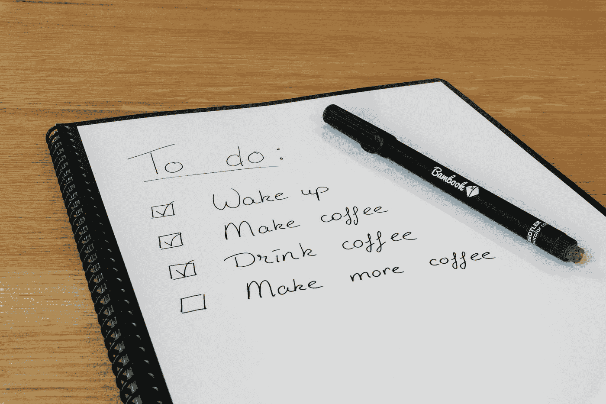

# 程序员如何在繁忙的工作日程中变得更好

> 原文：<https://javascript.plainenglish.io/how-programmers-can-get-better-despite-their-busy-work-schedule-b6778a836124?source=collection_archive---------14----------------------->

## 程序员可以做的一些简单的事情。

Photo by [Thomas Bormans](https://unsplash.com/@thomasbormans?utm_source=medium&utm_medium=referral) on [Unsplash](https://unsplash.com?utm_source=medium&utm_medium=referral)

如果你想在劳动力市场上保持“可雇佣性”，获得新的计算机技能是一项必须计划的活动。编程是一个快节奏的行业。总是有新的语言、框架、工具和方法需要学习。很费时间，而且不是所有人都习惯。

不幸的是，当你有了家庭和/或孩子时，这也变得更加困难。所以我把自己提高程序员技能时的习惯整理了一下。

## **1。清晰、计划周密的目标**

这不是开始学习所有新奇事物的问题。你必须根据你的职业选择来设定目标。例如，我们强迫自己每 3 个月、4 个月或 6 个月学习一些新的东西，以了解一切。一项新技能。两三年后，我们将会掌握许多技能。

## **2。学科**

纪律往往是实现目标的人和没有实现目标的人之间的唯一区别。纪律是坚持或强迫自己坚持自己的时间表。做你计划好的事。一开始并不容易，但随着时间的推移，这变得很自然。

## **3。组织**

怎么学就是面授，MOOCs，书，项目。你当然知道什么对你来说更容易。选择你觉得舒服的方法。不是所有的方法都适合每个人。是白天、晚上、周末，还是 RTT 和节假日期间？是每个人的责任吗？

## **4。时间**

许多人说没有时间观看或学习新技能。他们说，一天只有 24 小时。虽然白天有全职工作，但是家庭(老婆孩子)，还是要找时间的。

每个人都有时间，但你必须抓住它。一个朋友曾经建议我写下我是如何在一周内不改变习惯的情况下度过时间的。

在实验结束时，我惊讶于我所花时间的那些毫无兴趣的耗时活动:社交网络、阅读无关文章、电视、网络浏览等。

你得把你浪费的时间用来做不相关的事情。然后，用它来训练自己。

这是可能的，我经常这样做。我希望这篇文章给了你一些线索，让你有时间提高自己的技能。

*更多内容请看*[***plain English . io***](https://plainenglish.io/)*。报名参加我们的* [***免费周报***](http://newsletter.plainenglish.io/) *。关注我们关于*[***Twitter***](https://twitter.com/inPlainEngHQ)*和*[***LinkedIn***](https://www.linkedin.com/company/inplainenglish/)*。加入我们的* [***社区不和谐***](https://discord.gg/GtDtUAvyhW) *。*