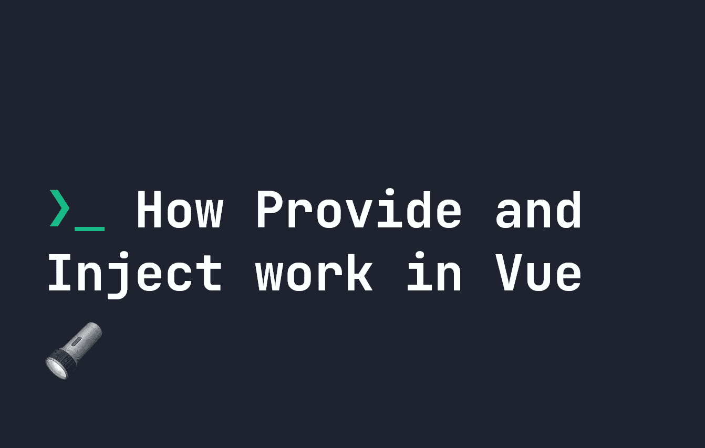
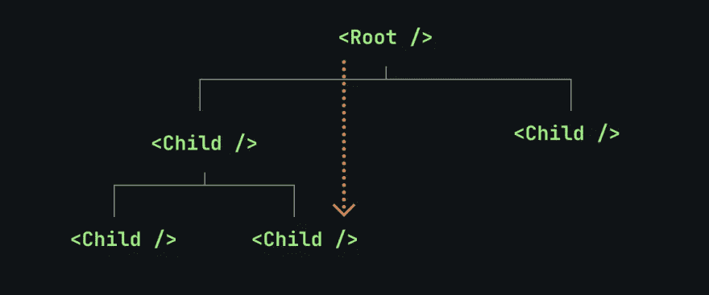

# 如何在 Vue.js 中提供和注入工作

> 原文：<https://javascript.plainenglish.io/how-provide-and-inject-work-in-vue-js-5b2de8a93ae?source=collection_archive---------10----------------------->

## 提供和注入让我们将数据放在应用程序结构中较低的位置。让我们看看它们是如何工作的。



在 Vue 中很容易为子元素提供/赋予属性。Vue 中的属性是我们将数据从父元素或 Vue 模板传递到子元素的主要方式之一。例如，在下面的代码中，我们赋予子元素`PopularList`属性`name`，并将其设置为`Most Popular Posts`。这意味着`PopularList`现在可以访问数据`Most Popular Posts`:

```
<PopularList name="Most Popular Posts" />
```

然而，有时子元素可以包含其他子元素。如果我们想将数据从父组件传递到孙组件，更简单的方法是使用**provide**/**inject**。这让我们**在父级别提供**数据，而**在它之下的任何级别注入**数据。

这意味着如果我们有一个属性不是由子代使用，而是由**孙代**使用，我们不必像`Parent → Child → GrandChild`一样通过两者传递它——我们可以简单地将它作为`Parent → Grandchild`传递，如下图所示:



# 如何在 Vue 中使用提供和注入

如果您正在使用 composition API，您可以使用`provide`函数`provide`任何数据集:

```
<script setup>
    import { provide } from 'vue'
    provide('myKey', 'message');
</script>
```

`provide`既有键又有值——以上，键是`myKey`，值是`message`。与 props 一样，这可以是一个对象、一个数字或任何其他有效的类型。我们还可以让这个属性成为 reactive，这样它就可以通过使用`ref`函数在孙元素中保持最新:

```
<script setup>
    import { provide, ref } from 'vue'
    const message = ref('message');
    provide('myKey', message);
</script>
```

如果您使用的是 Options API，则可以使用以下结构在组件中提供数据:

```
export default {
    provide: {
        myKey: 'message'
    }
}
```

如果你想在`provide`中选择 API 版本的反应性，你必须使用`computed`。因此，组合 API 与`provide/inject`一起使用更加简单。如果我们给出每个实例的状态，也就是数据来自`data()` 函数，我们也需要使用`provide()`符号。

```
export default {
    data() {
        return {
            message: 'message'
        }
    },
    provide() {
        return {
            // This sets `myKey` to the message property from data().
            // Putting it in `computed()` makes it reactive.
            myKey: computed(() => this.message)
        }
    }
}
```

**现在**我们已经提供了数据，可以通过使用`inject`函数在任何级别的任何子组件中访问它。

# 在 Vue 中使用注入访问父数据

现在我们已经在组件中定义了`provide`，您可以使用`inject`来访问该数据。在子组件或孙组件中，我们可以访问`myKey`来引用`message`。例如，假设我们有一个 Vue 组件，如下所示:

```
<script setup>
    import { ref, provide } from 'vue'
    import ChildElement from './Child.vue';
    const message = ref('message');
    provide('myKey', message);
</script>
<template>
    <p>Hello World!</p>
    <ChildElement />
</template>
```

…然后是一个子元素(`Child.vue`)，如下所示:

```
<script setup>
    import GrandChildElement from './GrandChildElement.vue';
</script>
<template>
    <GrandChildElement />
</template>
```

在`GrandChildElement`中，我们可以访问`myKey`，因为我们在父节点中提供了它。我们也可以在`Child.vue`中这样做，但是我们也可以只使用道具。`provide`赋予我们从多个层面获取数据的能力。为了在`GrandChildElement`中访问这些数据，我们使用`inject`。我们的`GrandChildElement.vue`文件可能看起来有点像这样:

```
<script setup>
import { inject } from 'vue'
const message = inject('myKey')
</script>
```

`const message`这里将返回文本`message`，因为这是我们用`provide`设置的`myKey`。如果您使用的是 Options API，您可以这样做:

```
export default {
    inject: [ 'myKey' ],
    created() {
        // Can access this.myKey here
    }
}
```

现在`myKey`的值可用于孙组件，而不需要先通过 props 传递给子组件。

*更内容于* [***普通英语***](https://plainenglish.io/) *。报名参加我们的* [***免费周报***](http://newsletter.plainenglish.io/) *。* [***推特***](https://twitter.com/inPlainEngHQ) *和*[***LinkedIn***](https://www.linkedin.com/company/inplainenglish/)*追随我们。查看我们的* [***社区不和***](https://discord.gg/GtDtUAvyhW) *并加入我们的* [***人才集体***](https://inplainenglish.pallet.com/talent/welcome) *。*