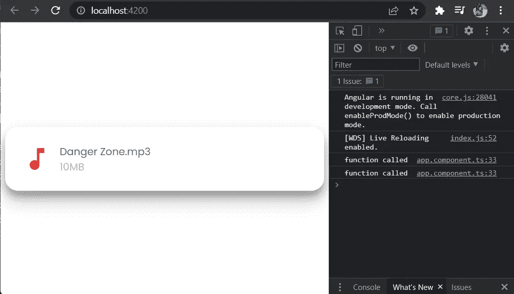
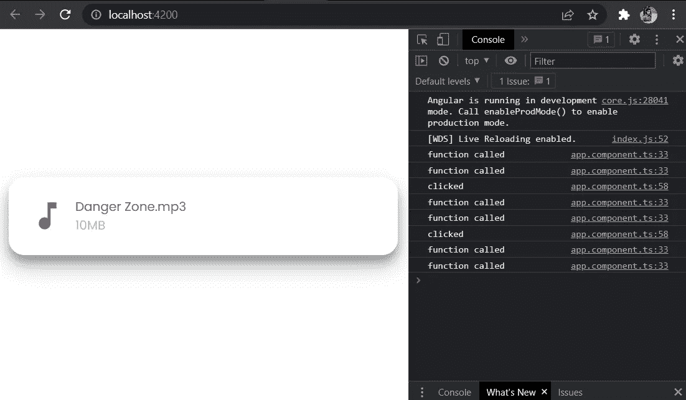
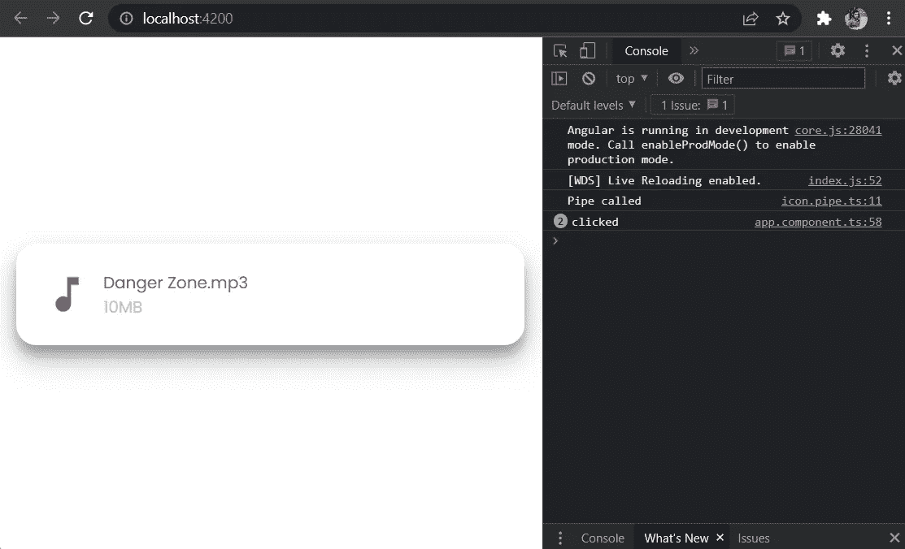

# 纯管道如何提高 Angular 应用程序的性能

> 原文：<https://javascript.plainenglish.io/how-pure-pipes-can-improve-angular-applications-performance-c83106ac45e0?source=collection_archive---------3----------------------->

## 如何使用纯管道提升 Angular 应用程序性能的指南。


Photo by [Pietro Mattia](https://unsplash.com/@pietromattia?utm_source=medium&utm_medium=referral) on [Unsplash](https://unsplash.com?utm_source=medium&utm_medium=referral)

在 Angular 中开发应用程序时，我们可能会遇到这样的情况:我们需要从 HTML 模板本身调用一个方法来获取一些将在 UI 中显示的数据。但是这个方法调用不依赖于任何事件。这种情况的典型例子如下—

示例 1 —

```
<div> {{ **showData()** }} </div>
```

示例 2 —

```
<div>      
      </div>
```

上述方法肯定会奏效。但是这种方法的问题是，每次角度变化检测运行时都会调用该方法。

让我们通过一个例子来理解这一点。请拉下面的 GitHub 库，切换到**非优化**分支。

[](https://github.com/souvik-pl/ANGULAR_PIPE) [## GitHub - souvik-pl/ANGULAR_PIPE

### 此项目是使用 Angular CLI 版本 12.0.0 生成的。为开发服务器运行 ng serve。导航到…

github.com](https://github.com/souvik-pl/ANGULAR_PIPE) 

在那里，我们有 app.component.ts 的*和***app . component . ts***文件，如下所示*

*当这个 app 组件初始化时， ***ngOnInit()*** 生命周期钩子被调用，它又调用 ***getFiles()*** 方法。该方法将调用另一个同名的***file system service***方法来获取文件数据。*

*下面给出了 ***文件-system.service.ts*** 文件—*

*在上面的 ***getFile()*** 方法中，我们正在创建 1 秒的延迟，以获得实际 API 调用的感觉。*

*这里的 ***FILE_DATA*** 只是在 ***mock-data.ts*** 文件中定义的一个 JavaScript 对象。*

*因此，在***app.component.html***文件的第 4 行，我们调用***getIconBasedOnMimeType()***方法来根据文件的 Mime 类型获取 SVG 图标的名称。*

*为了检查这个方法被调用的次数，我们在这个方法中写了下面一行。*

```
*console.log('function called');*
```

*现在，我们将使用 **ng serve** 命令运行这个应用程序。我们将在浏览器中看到以下内容。*

**

*在控制台中，我们可以看到`function called`已经打印了两次。因此，我们可以得出结论，在加载该页面时，更改检测运行了两次，并且方法***getIconBasedOnMimeType()***被调用了两次，即使参数没有被更改。*

*现在，让我们看看当我们在 app 组件中附加一个 **click** 事件监听器时会发生什么。我们将对 app.component.ts 的*和***app . component . ts***文件做一些小的修改，如下所示**

**应用程序重新加载后，我们将在屏幕上单击两次，这是我们在控制台中看到的内容—**

****

**在这里，我们可以看到，在屏幕上单击两次后，更改检测运行了 4 次。结果***getIconBasedOnMimeType()***被调用了 4 次。**

**但是，如果我们使用一个纯管道，而不是从模板中调用这个方法，那么只要参数保持不变，这个方法就不会在变化检测运行时被反复调用。**

**现在，让我们来了解一下纯管道和不纯管道的区别。**纯管道**仅在 angular 检测到传递给管道的参数发生变化时调用。**

**然而，每次变化检测运行时，都会调用一个**不纯管道**。**

**现在，我们将创建一个新文件 ***icon.pipe.ts*** ，如下所示**

**当它被调用时，它将在控制台中记录`Pipe called`。**

**现在，我们还要修改***app.component.html***文件。**

**应用程序重新加载后，我们将在屏幕上的任意位置单击 2 次，我们将能够看到以下内容—**

****

**这里我们可以看到`Pipe called`只打印了一次。**

**您可以在存储库的主分支中获得用管道优化的代码，其链接如上所述。**

**因此，通过这个小小的改变，我们可以提高应用程序的性能。**

***更多内容请看*[***plain English . io***](http://plainenglish.io/)*。报名参加我们的* [***免费每周简讯***](http://newsletter.plainenglish.io/) *。在我们的* [***社区***](https://discord.gg/GtDtUAvyhW) *获得独家获得写作机会和建议。***