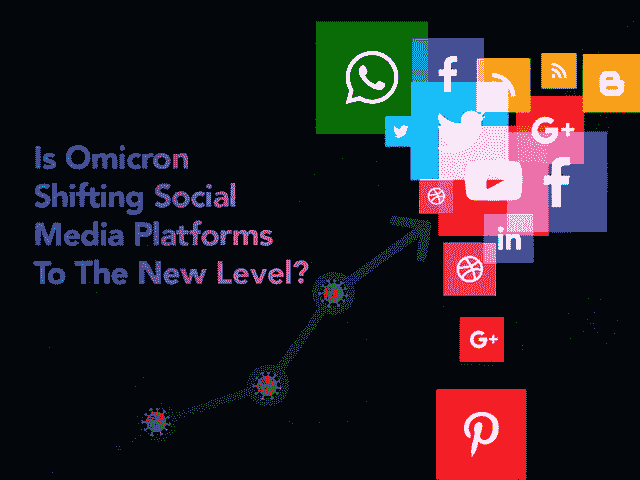

# 新冠肺炎变体如何将社交媒体平台提升到一个新的水平

> 原文：<https://javascript.plainenglish.io/how-the-covid-19-variant-is-shifting-social-media-platforms-to-a-new-level-5f0140b79792?source=collection_archive---------24----------------------->

## 【Omicron 如何将智能手机用户转移到社交媒体平台

一种新的新冠肺炎变种病例的迅速传播再次让人们对封锁感到恐惧。事实上，人们正在讨论的这种新变种比 Delta 变种高 6 倍，并且预计它将比任何其他病毒传播得更快。此外，根据健康专家的说法，很快它将传播到每个国家，人们会不断地坚持社交媒体平台，以了解 Omicron 案例中的每一个运动及其对企业越来越大的影响。

虽然世界被预测为地方病，但奥米克隆案例的突然繁荣演变了疫情的未来。在所有这些场景中，社交媒体平台获得了巨大的人气。无论是与朋友和远亲保持联系，建立职业网络，寻找灵魂伴侣，还是交流各种信息和经验，社交媒体应用程序都将在 2021-22 年迅速占据中心舞台。随着移动设备的广泛使用和技术解决方案的进步，企业好奇地需要知道如何创建一个社交应用程序来应对不断增长的市场需求。

随着新冠肺炎新变种的爆发，世界各地的用户在社交网络应用上变得更加活跃，原因有几个。随着新新冠肺炎版本的出现，人们已经明白了一件事，即使在新冠肺炎之后，社交媒体应用程序仍然是我们日常生活中重要的一部分。

因此，在你开始考虑在 omicron 这样的时代建立一个社交媒体应用程序需要多少成本之前，合乎逻辑的做法是仔细看看社交媒体应用程序的开发以及它将如何影响其正在进行的开发。

## **基于技术的社交媒体应用的市场洞察**

不可否认的事实是，无论是在职业领域还是个人领域，创新技术都弥合了沟通鸿沟。开发社交媒体应用的趋势已经从脸书或 Instagram 的推出开始，但这次疫情为这个行业带来了繁荣。

> 你不需要相信我们的话，这里是描绘社交媒体应用如何重塑世界的[统计数据](https://statusbrew.com/insights/social-media-statistics/#social-media-usage-statistics)

*   根据调查报告，约有 48.8 亿互联网用户积极访问社交媒体应用程序，这几乎占世界人口的 62%。
*   过去一年，社交媒体应用的活跃用户数量增加了 4 亿多，总人数增加了 9.9%，达到 45.5 亿。
*   45%的消费者主要依赖社交媒体平台上影响者的推荐。
*   在社交媒体上对某个品牌有过正面体验的消费者中，有 71%肯定会向朋友和家人推荐该品牌。
*   91%的社交媒体用户通过移动设备访问社交渠道。

随着社交媒体内容对用户的影响越来越大，为您的企业开发社交媒体应用程序已经成为一个比以往任何时候都更重要的决策。对于企业来说，全球社交媒体用户数量的增长已经变得比以往任何时候都更加重要。但发展社交媒体市场最令人惊讶的是，算法一直在变化。所以这就是你需要雇佣一家 [**移动应用程序开发公司**](https://www.xicom.biz/services/mobile-app-development/) 的地方，它通过测试新策略和实施更好的技术来迎合客户不断变化的需求，帮助你在社交媒体游戏中保持领先。

如果你真的有兴趣开发一个社交媒体应用程序，成为这个蓬勃发展的行业的一部分，那么你的下一个问题必须是，“2022 年你需要开发什么类型的社交媒体应用程序？”

## **最新概念:2022 年创业公司的新型社交媒体平台**

现代社会发展了社交媒体行业，并使网络世界的社交媒体互动成为可能。随着时间的推移，对技术支持的社交媒体应用的需求也发生了革命性的变化。因此，以下是你可以开发的社交媒体应用类型，以满足不断增长的市场需求:

*   社交网站:一个让世界各地的人们联系起来进行专业和个人交流的平台。
*   **在线杂志应用:**提供杂志的应用，用户可以将杂志切换到不同的类别，如宝莱坞、科技、医疗保健、名人等。
*   **一个协作业务项目的 App:**以任何一种项目起家的人，都可以寻找其他对协作感兴趣、有相同兴趣的人。
*   **生成内容的社区和分享应用:**一种应用，可以在其中形成具有相似兴趣的社区或群组，并开发内容和与他人分享。
*   **一款社交博客应用:**擅长写作、渴望了解最新消息的人可以利用这个平台发表博客。
*   **微博应用:**它提供了一个平台，提供了一个快速分享短博客的机会，并让用户参与到平台中来。
*   **虚拟游戏和分享应用:**一个平台，用户可以在这里玩各种游戏，同时利用实时通信，无论是音频还是视频。
*   **群组音频聊天应用:**像 clubhouse 一样，你可以创建一个社交媒体平台，用户可以在那里创建一个音频聊天的房间。对于那些有很好的演讲能力但害怕在任何人面前出现的人来说，这是一个很好的平台。
*   **视频博客和评级应用:**在这个现代，人们更倾向于视频内容，而不是阅读文本内容，提供分享视频博客并允许用户对其进行评级的能力，将是 2022 年企业的一个美妙的应用开发想法。

无论你选择什么类型的应用程序来开发一个应用程序，一个重要的问题是如何为你的应用程序增加价值？通过 [**雇佣移动应用程序开发者**](https://www.xicom.biz/offerings/hire-mobile-developers/) 你可以很容易地将应用程序的想法转化为一个强大的解决方案，但你所需要的是理解你可以在解决方案中实现什么特性和功能。因此，在您继续下一步之前，让我们来看看社交媒体应用程序开发过程中的主要特性和功能…

# **让你的社交媒体应用更有价值的技巧**

当谈到开发移动应用程序时，即使是市场巨头如脸书、谷歌、微软似乎也有不同的市场领域。但谈到现实，每天都有新类型的社交媒体应用程序开发出来，以提供更好的用户体验，更创新的解决方案和功能。为了使它更容易，你可以雇佣一个软件开发公司，使你能够建立一个解决方案，通过提供广泛的特性和高级功能来解决主要目的或用户的特定需求，使你的用户保持对应用程序的忠诚。

*以下是您可以考虑在社交媒体应用中实现的功能列表。*

*   **用户登录:**要开始使用应用程序，请确保用户可以使用社交网络应用程序的联系方式、电子邮件 Id 或凭据轻松注册。尽量保持用户界面简单，这样用户就可以轻松上手，没有任何麻烦。
*   **简单搜索:**当用户登陆主页时，他们直接进入应用程序的搜索功能。提供应用程序的搜索功能。允许用户根据兴趣、位置、姓名等各种过滤器搜索个人资料和页面。
*   **个性化用户资料:**允许用户添加或编辑个人资料的详细信息，如姓名、电子邮件 ID、资料图片、简历、联系方式等。
*   **通知:**这是你的应用程序的一个重要功能，它允许你让你的用户随时了解其他人的活动，如发表评论、在个人资料上发布等。
*   **消息**:添加应用内消息功能是这款应用真正的组成部分。确保你有一个易于访问的用户界面，帮助你的用户与应用保持互动。
*   **消息** **状态**:像脸书或任何其他社交媒体应用一样，允许用户上传消息状态，并在个人资料上保留 24 小时，之后消失，没有历史记录。
*   **评论** **和** **喜欢**:允许用户评论和喜欢他人个人资料上的帖子。
*   **上传** **内容**:通过该功能，用户可以在个人资料上上传视频、音频或图片内容，这些内容将会反映在他们的时间线上。
*   **创建** **群组** **和** **社区**:允许用户创建兴趣相似的用户群组或社区。
*   **发送** **邀请**:让用户可以向自己的朋友、家人和公司专业人士发送邀请，让他们轻松拓展人脉。
*   **移除** **或** **拒绝** **请求**:增加移除或取消用户请求的可能性，以防用户没有兴趣进一步连接。

> **以下是你可以考虑在社交媒体应用中实现的一些高级功能:**

*   **直播:**由于越来越多的人对观看直播感兴趣，因此在你的应用中加入直播选项将是一个值得考虑的好选择。这是一个很好的方式，可以立即与观众取得联系，并让你展示产品或服务。
*   **个人资料定制:**确保应用程序能够定制你的社交网络页面的外观和感觉，以满足你的需求和品牌的吸引力。
*   **数据加密:**不言而喻，你的平台应该是高度安全的，在两个用户之间加密。
*   **分析:**这是一个非常重要的功能，它提供了对数据和分析的访问，您可以跟踪您的用户位于何处，他们最常使用的设备类型和内容类型，以便您可以相应地对您的应用程序进行更改。

## **做一个社交媒体 App 要多少钱？**

创建一个社交媒体应用程序的成本因不同因素而有很大差异。因此，构建一个社交媒体应用程序没有标准成本。

然而，当你知道哪些因素促成了最终的开发，以及你需要在你的应用中包含哪些元素时，仍然估计开发一个社交媒体应用 的平均成本并不是火箭科学。

影响应用程序开发成本的主要因素是应用程序的复杂性、平台选择、应用程序的特性和功能、技术选择、您为应用程序开发雇佣的应用程序开发团队等等。

因此，如果你计划创建一个 MVP 社交媒体应用解决方案，那么成本肯定会比开发一个包含所有这些高级功能的成熟应用更低，速度也更快。

比方说，如果你正在使用上述特性开发一个 MVP 解决方案，那么每个平台的应用程序开发成本估计在 15，000 美元到 20，000 美元之间。然而，如果你正在考虑从头开始开发一个社交媒体应用程序，那么你需要考虑后端开发的成本，这可能需要 6 个多月的时间。开发一个成熟的社交媒体应用程序的平均成本大约在 25，000 美元到 35，000 美元之间，这取决于各种因素。

在你得出任何结论之前，请记住，每个企业都有自己独特的需求，因此没有社交媒体应用程序能够满足你的业务需求。因此，与专家预约一个免费的咨询时段来获得一个估计值是一个合乎逻辑的决定。

# **结论**

在新冠肺炎疫情和 Omicron 案件的严重打击期间，如果你正在寻找有利可图的商业机会，开发社交媒体应用程序可能是你的救星。通过这篇博客，我们已经解释了所有这些关于开发增值社交媒体应用的重要事情。但是，如果你真的想在这个社交媒体市场茁壮成长，雇佣一家 [**移动应用开发公司**](https://www.xicom.biz/services/mobile-app-development/) 可能是一个值得的决定。如果你坐在那里认为这将花费巨大的预算和时间来启动，那么请再想想，因为专业开发人员可以通过实施正确的技术来加快事物的发展。

========================================

*更多内容请看*[***plain English . io***](http://plainenglish.io/)*。报名参加我们的* [***免费周报***](http://newsletter.plainenglish.io/) *。在我们的* [***社区***](https://discord.gg/GtDtUAvyhW) *获得独家获得写作机会和建议。*