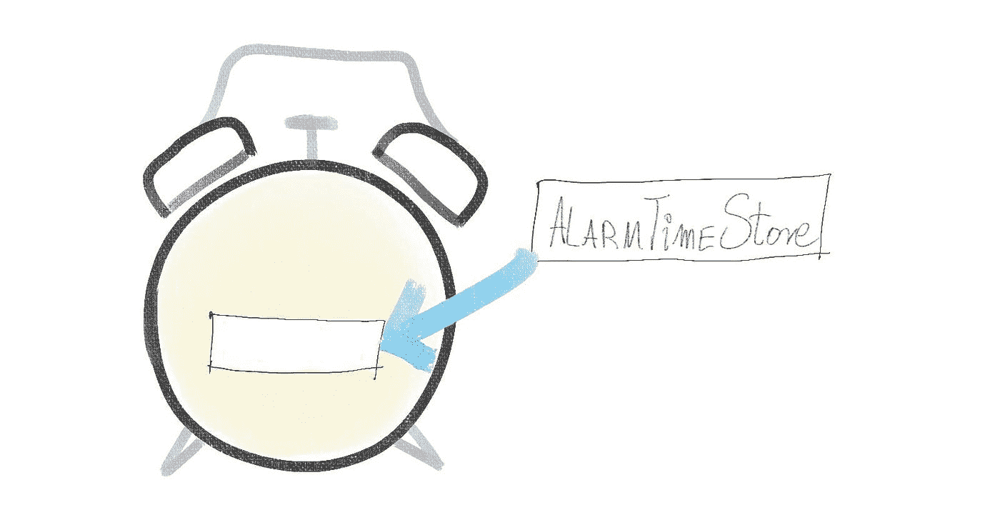
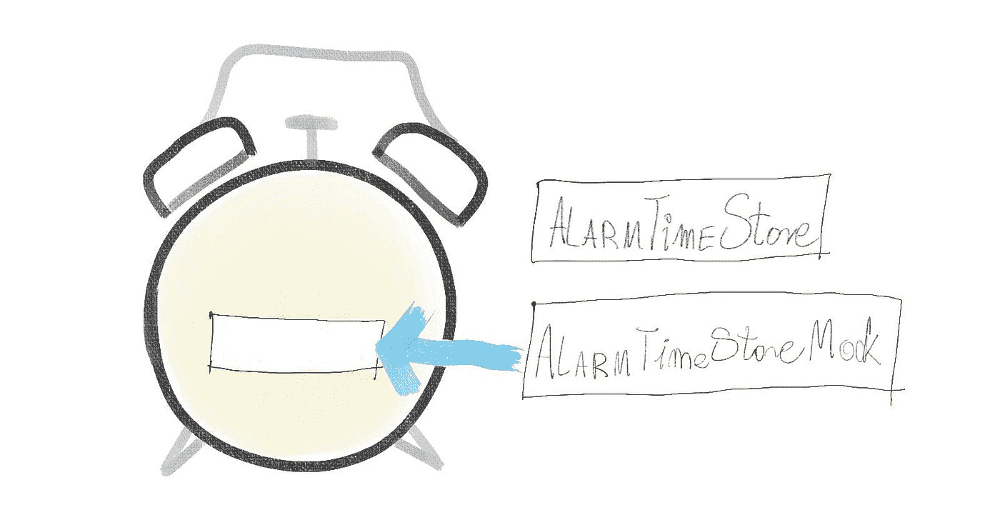

# 缺少内部状态如何使您的类更容易测试和重构

> 原文：<https://javascript.plainenglish.io/how-the-lack-of-internal-state-makes-your-classes-easier-to-test-and-refactor-c2c609fad9f?source=collection_archive---------17----------------------->

你可能经常听说测试驱动开发(TDD)或者仅仅是编写测试就能让你的代码变得更好。很难说这是不是真的，除非你以前见过编写单元测试对代码的影响。让我们用一个简单的例子来看看这种影响:将一个类的内部状态移动到一个依赖项。

# 缺乏内部状态和可测试性

保持状态最直接的方法是添加一个私有变量，并把需要的值放在一边以备后用。这将完成工作，但它使测试更加困难。对于完整的测试覆盖，您需要:

1.  将实例置于您想要测试的状态
2.  检查它的行为

随着您添加更多的内部变量，实现预期的状态变得更加复杂:除了简单的状态，您还需要包含它们之间的组合。如果一切都按预期运行，可能会有无法实现的无效组合——但是您可能会对测试代码在达到这种不可能的条件时是否优雅地降级感兴趣。

还有一种从测试中访问类的私有变量的诱惑，但是这种方法感觉是错误的。它依赖于知道类的实现，它忽略了我们为类型定义的接口。

# 把这个州搬出去

为了使代码更易测试，我们可以定义一个单独的类来保存状态。这个新类引入了一个具有新界面的层，我们可以用它来描述对象之间的关系。您可以模仿用于设置和检索状态更改的方法，从而使测试更加容易。

# 低测试性示例

作为一个低可测试性的例子，我们将有一个闹钟类:

我们可以期待这个时钟的某些行为:

*   当当前时间与设定的闹钟时间一致时，闹钟就会响
*   用户可以设置闹钟时间

如果您想测试这种行为，您需要两种方法之一:

1.  等到硬编码的闹铃时间到来，看看闹铃是否响起
2.  将时间设置为离闹钟时间只有几分钟，看看它是否按预期响起

方法 1 是错误的；这可能需要几个小时的等待。

方法 2 也有缺点，只是更加微妙。这将要求您的测试读取当前时间，并增加等待结果的秒数。设置等待时间将是在稳定测试和等待太长时间减慢测试之间的权衡，在稳定测试中，我们等待足够长的时间以避免错过慢机器上的点。

# 更多可测试的例子

我们可以通过将状态移至外部来提高代码的可测试性:

因此，在这种情况下，引入一个依赖项-AlarmTimeStore-它将值集保持在 AlarmClock 类之外。

# 这如何使测试更容易

当我们将状态移出时，我们引入了一个依赖项来促进测试。当我们在测试中运行这个类时，我们用模拟替换了实际的依赖关系。模拟是对其他实例的替代，这些实例提供了相同的接口，但允许设置期望值。您可以提供一个函数调用将返回的值。

Mocking 允许您独立于其他代码运行类或函数——因此您可以控制将什么值返回到您的单元，并检查它是否按预期运行。

# 这如何让代码变得更好

通过将状态移出，我们在这两个类之间定义了一个清晰的分离。随着持久层有了一个明确定义的接口，将来更容易:

*   使它更高级:例如，不将值存储在运行时内存中，而是将其保存到浏览器或文件中，或者
*   在应用程序的其他部分重用它:随着应用程序变得越来越复杂，我们可以通过概括我们在这里构建的解决方案来找到不同的用例。

# 常见的评论:如此多的抽象层

一些人批评这种方法引入了太多的抽象层来实现特性。当我试图保持代码的可测试性时，我得到了这样的反馈。最有可能的是，这是一个关于单元测试的个人品味和信念的问题:我喜欢我的代码被测试所覆盖，并且我乐于对代码设计进行细微的改变以确保它易于测试。如果有人不关心测试，我不确定是否有强有力的论据证明这种方法在客观上比其他方法更好。我上面列出的灵活性的价值取决于我们在某个时候实际需要它们的可能性。如果你很可能不需要它们，你可以说这是为我们可能永远不需要的用例做准备的不成熟的行为。

# 想多读点？

如果你觉得这篇文章有帮助，你可以在这里继续阅读关于测试的文章。

*最初发布于*[*https://how-to . dev*](https://how-to.dev/how-the-lack-of-internal-state-makes-your-classes-easier-to-test-and-refactor)*。*

*更多内容请看*[***plain English . io***](https://plainenglish.io/)*。报名参加我们的* [***免费周报***](http://newsletter.plainenglish.io/) *。关注我们关于*[***Twitter***](https://twitter.com/inPlainEngHQ)*和*[***LinkedIn***](https://www.linkedin.com/company/inplainenglish/)*。加入我们的* [***社区不和谐***](https://discord.gg/GtDtUAvyhW) *。*