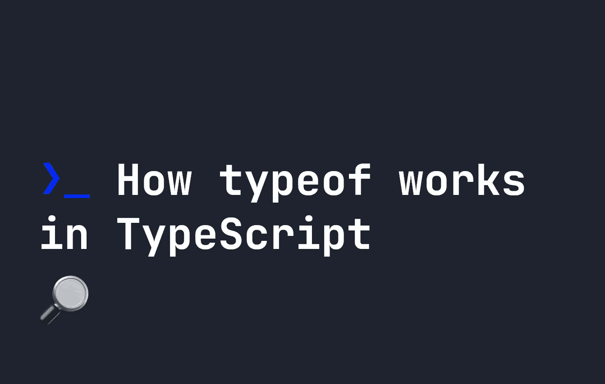

# “typeof”运算符在 TypeScript 中的工作方式

> 原文：<https://javascript.plainenglish.io/how-the-typeof-operator-works-in-typescript-899522a4ec26?source=collection_archive---------13----------------------->

## 关于“typeof”运算符如何在 TypeScript 中工作的教程。



在 JavaScript 中，我们已经有了一个普通的`typeof`操作符，可以用来查找任何东西的类型:

```
let x = "hello world";
console.log(typeof x); // Returns "string"
```

由于 **TypeScript** 是一种强类型语言，`typeof`的含义略有不同。虽然对于所有的基本 JavaScript 类型`typeof`功能保持不变，但它也获得了一些额外的、有用的特性。我们来看看`typeof`在 TypeScript 中是如何工作的。

# “typeof”在 TypeScript 中如何工作

`typeof`在 TypeScript 中最基本的应用是创建新的基本类型。如果我们在 TypeScript 中定义我们自己的[定制类型，我们可以使用`typeof`来复制一个现有项目的类型。一个简单的例子，我们用一个`number`并在它的背面创建一个自定义类型，看起来像这样:](https://fjolt.com/article/typescript-creating-custom-types)

```
let x = 1234;// Custom type aNumber
type aNumber = typeof x;
```

如果变量类型可能不同，并且我们想要匹配一个特定的变量，这可能是有用的。在创建具有许多属性的自定义类型时，如果这些属性应该与现有的变量类型相匹配，它也会很有用:

```
let x = 1234;
let y = "string";// Custom type aNumber
type myType = {
    name: typeof y,
    age: typeof x,
}
```

如你所见，`typeof`基本上给了我们一种区分现有对象的**值**和**类型**的方法。它还可以非常直观地与`ReturnType`结合，以获得函数的返回值，从而确保在期望从函数中获得值时的类型一致性:

```
function myFunction(x: string, y: string) {
    return { 
        firstName: x,
        lastName: y
    }
}
type nameType = ReturnType<typeof myFunction>;
```

[我已经在这篇文章](https://fjolt.com/article/typescript-returntype-utility-type)中更详细地介绍了 ReturnType，所以如果你想了解更多，可以查看一下。同样，[你可以在这里了解更多关于 TypeScript 的知识。](https://fjolt.com/category/typescript)

*更多内容请看*[***plain English . io***](https://plainenglish.io/)*。报名参加我们的* [***免费周报***](http://newsletter.plainenglish.io/) *。关注我们关于*[***Twitter***](https://twitter.com/inPlainEngHQ)*和*[***LinkedIn***](https://www.linkedin.com/company/inplainenglish/)*。查看我们的* [***社区不和谐***](https://discord.gg/GtDtUAvyhW) *加入我们的* [***人才集体***](https://inplainenglish.pallet.com/talent/welcome) *。*