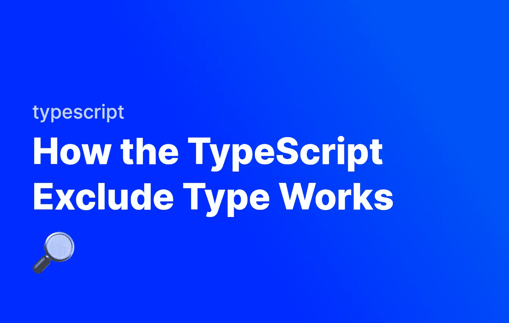

# 类型脚本排除类型的工作方式

> 原文：<https://javascript.plainenglish.io/how-the-typescript-exclude-type-works-dff4f429dc84?source=collection_archive---------19----------------------->

## 简单看一下 Exclude 实用程序类型在 TypeScript 中是如何工作的。



在 TypeScript 中，`Exclude`实用程序类型允许我们从已经定义的联合类型中排除某些成员。这意味着我们可以获取一个现有的类型，并针对特定的情况从其中删除项目。

让我们看看`Exclude`实用程序类型在 TypeScript 中是如何工作的。

# 实用程序类型

实用工具类型是在 TypeScript 中定义的用于解决特定问题的类型。如果您不熟悉在 TypeScript 中定义自定义类型，请在此处阅读我的定义自定义类型指南:

[](https://fjolt.com/article/typescript-creating-custom-types) [## 在 Typescript 中创建自定义类型

### Javascript 是一种弱类型语言，这意味着我们通常不会考虑类型。Typescript 是强类型的…

fjolt.com](https://fjolt.com/article/typescript-creating-custom-types) 

# 排除类型在 TypeScript 中的工作方式

在 TypeScript 中，我们可以定义一个称为联合类型的特定类型。联合类型是某事物可能值的列表。例如:

```
type myUnionType = "🍇" | "🍎" | "🫐" | "🍋"
```

上图中，如果我们给某个东西一个 myUnionType 类型，那么它只能有 4 个值:🍇,🍎、🫐或🍋。例如:

```
type myUnionType = "🍇" | "🍎" | "🫐" | "🍋"// This works!
let myString:myUnionType = "🍇"// This throws an error! "Type '"some-string"' is not assignable to type 'myUnionType'.
let secondString:myUnionType = "some-string"
```

现在我们已经介绍了工会类型如何工作的基本知识，让我们来谈谈`Exclude`。

# 排除类型

假设我们有一种情况，我们想要使用`myUnionType`，但是我们不想包含🍋在有效值列表中。这种情况在现实生活中的 API 响应中可能会发生——假设您有一个标准的 API 响应类型，但是您想要从该 API 类型中删除一个特定情况下的字段。

这就是我们可以使用`Exclude`的地方。它的语法是`Exclude<UnionType, ExcludedMembers>`。我们传入普通的联合类型，然后在第二个参数中说明我们想要从中移除哪些成员。

让我们来试试:

```
type myUnionType = "🍇" | "🍎" | "🫐" | "🍋"// This works!
let lemon:myUnionType = "🍋"// This throws an error! Type '"🍋"' is not assignable to type '"🍇" | "🍎" | "🫐"'.
let noLemonsPlease:Exclude<MyUnionType, "🍋"> = "🍋"
```

第二个变量`noLemonsPlease`抛出一个错误，因为我们使用了`Exclude`来移除🍋这个特定变量的联合类型。这意味着我们可以在其他地方正常使用该类型，然后在需要时用`Exclude`排除成员。

如果我们想要删除多个成员，我们只需用`|`将它们分开:

```
type myUnionType = "🍇" | "🍎" | "🫐" | "🍋"// This works!
let lemon:myUnionType = "🍋"let noLemonsPlease:Exclude<myUnionType, "🍋"> = "🍇"
//  ^
//  └ - - Type is  "🍇" | "🍎" | "🫐"let noApplesOrLemons:Exclude<myUnionType, "🍋" | "🍎"> = "🍇";
//  ^
//  └ - - Type is  "🍇" | "🫐"let onlyRaspberries:Exclude<myUnionType, "🍋" | "🍎" | "🫐"> = "🍇";
//  ^
//  └ - - Type is  "🍇"let backToLemons:myUnionType = "🍋"
//  ^
//  └ - - Type is  "🍇" | "🍎" | "🫐" | "🍋"
```

因此,`Exclude`类型让我们可以灵活地在合适的时候删除特定的元素，并在需要的时候保留它们。

这个题目到此为止。感谢您的阅读。

*更多内容请看*[***plain English . io***](https://plainenglish.io/)*。报名参加我们的* [***免费周报***](http://newsletter.plainenglish.io/) *。关注我们关于*[***Twitter***](https://twitter.com/inPlainEngHQ)*和**[***LinkedIn***](https://www.linkedin.com/company/inplainenglish/)*。加入我们的* [***社区***](https://discord.gg/GtDtUAvyhW) *。**