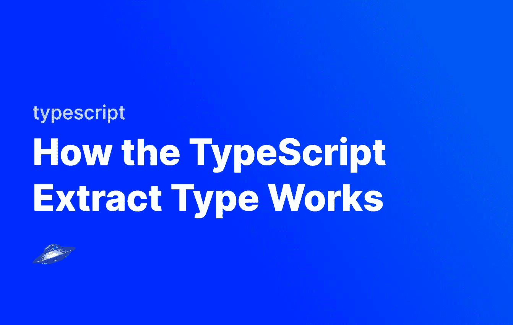

# TypeScript 提取类型如何工作

> 原文：<https://javascript.plainenglish.io/how-the-typescript-extract-type-works-651c7fcc1db4?source=collection_archive---------12----------------------->

## 简要看看 Extract 实用程序类型在 TypeScript 中是如何工作的。



`Extract`实用程序类型允许我们检查特定成员的联合类型，并根据剩余的内容返回新的类型。与 `[Exclude](https://fjolt.com/article/typescript-exclude-type)` [型](https://fjolt.com/article/typescript-exclude-type)格式颇为相似的[。](https://fjolt.com/article/typescript-exclude-type)

让我们来看看它是如何工作的。

# 实用程序类型

实用工具类型是在 TypeScript 中定义的用于解决特定问题的类型。如果您不熟悉在 TypeScript 中定义自定义类型，请在此处阅读我的定义自定义类型指南:

[](https://fjolt.com/article/typescript-creating-custom-types) [## 在 Typescript 中创建自定义类型

### Javascript 是一种弱类型语言，这意味着我们通常不会考虑类型。Typescript 是强类型的…

fjolt.com](https://fjolt.com/article/typescript-creating-custom-types) 

# 提取类型如何在 TypeScript 中工作

在 TypeScript 中，我们可以定义一个称为联合类型的特定类型。联合类型是某事物可能值的列表。下面显示了一个示例，其中类型 myUnionType 表示变量，其他输出只能是四个值之一:🥒,🥔,🌶或者🌽

```
type myUnionType = "🥒" | "🥔" | "🌶" | "🌽"// This works since 🥒 is a member of "🥒" | "🥔" | "🌶" | "🌽"
let myFirstVariable:myUnionType = "🥒"// This doesn't work since "my-string" is NOT member of "🥒" | "🥔" | "🌶" | "🌽"
let mySecondVariable:myUnionType = "my-string"
```

# 提取类型

如果我们想从一个联合类型中删除特定的元素，我们可以使用`[Exclude](https://fjolt.com/article/typescript-exclude-type)` [类型](https://fjolt.com/article/typescript-exclude-type)——但是还有其他方法可以操作联合类型。

`Extract`类型让我们定义一个新的列表，如果列表中的任何项目存在于我们的原始类型中，则返回一个新的类型。

让我们看一个简单的例子:

```
type myUnionType = "🥒" | "🥔" | "🌶" | "🌽"let myFirstVariable:Extract<myUnionType, "🥒" | "🥔"> = "🥒"
//  ^
//  └ - - Type is "🥒" | "🥔"
```

当我们写`Extract`时，它为`"🥒" | "🥔"`检查`myUnionType`。如果它们存在，它会创建一个新类型，包含存在的项。因为两者🥒和🥔存在于我们的联盟类型中，我们以一种新的类型结束——`"🥒" | "🥔"`。

如果我们在我们的`Extract`语句中定义了不存在于原始联合类型中的成员，那么它们将在新类型中被忽略。例如:

```
type myUnionType = "🥒" | "🥔" | "🌶" | "🌽"let myFirstVariable:Extract<myUnionType, "🥒" | "🥔" | "🍇"> = "🥒"
//  ^
//  └ - - Type is STILL "🥒" | "🥔" since "🍇" is not in myUnionType
```

使用`Extract`并不影响原来的类型，所以如果我们愿意，还是可以使用:

```
type myUnionType = "🥒" | "🥔" | "🌶" | "🌽"let myFirstVariable:Extract<myUnionType, "🥒" | "🥔" | "🍇"> = "🥒"
//  ^
//  └ - - Type is "🥒" | "🥔"let mySecondVariable:myUnionType = "🌶"
//  ^
//  └ - - Type is "🥒" | "🥔" | "🌶" | "🌽"
```

因此，当我们希望将原始的联合类型限制为特定变量或输出的已定义成员数时，`Extract`是一个很好的工具。它给了我们灵活性，让我们可以动态地定义类型，我们可以在代码中的任何地方使用它。

这个题目到此为止。感谢您的阅读。

*更多内容请看*[***plain English . io***](https://plainenglish.io/)*。报名参加我们的* [***免费周报***](http://newsletter.plainenglish.io/) *。关注我们关于*[***Twitter***](https://twitter.com/inPlainEngHQ)*和**[***LinkedIn***](https://www.linkedin.com/company/inplainenglish/)*。加入我们的* [***社区***](https://discord.gg/GtDtUAvyhW) *。**