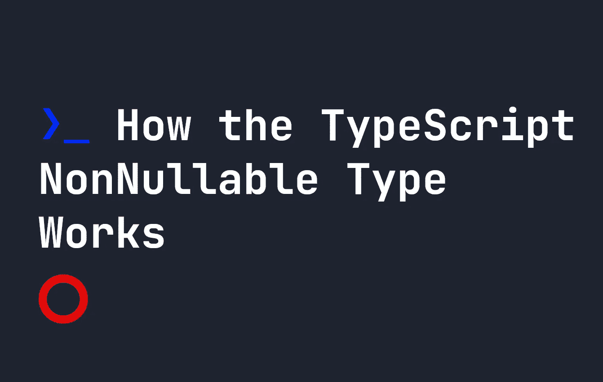

# TypeScript 非空类型如何工作

> 原文：<https://javascript.plainenglish.io/how-the-typescript-nonnullable-type-works-ccfd68972f02?source=collection_archive---------4----------------------->



`NonNullable`类型是 TypeScript 中的一个实用类型，它创建一个新类型，同时删除所有的`null`或`undefined`元素。它让我们获取现有的类型，并修改它们，使它们更适合某些情况。让我们看看它是如何工作的。

# 自定义类型

本文涵盖了自定义类型。要了解更多关于自定义类型的信息，请在这里阅读我的指南。

# 不可空的实用程序类型

`NonNullable`实用程序类型的工作方式很像其他实用程序类型，因为它可以接受一个现有的类型，并在您认为合适的时候修改它。例如，假设我们有一个特定的联合类型，它接受`null`和`undefined`作为潜在选项:

```
type myType = string | number | null | undefined
```

这个例子在一个例子中工作得很好，但是在我们代码的另一部分，我们不想接受`null`或`undefined`。我们可以为此创建一个新的类型，或者我们可以重用`myType`，使用`NonNullable`:

```
type myType = string | number | null | undefinedtype noNulls = NonNullable<myType>
```

在上面的例子中，`noNulls`现在是类型`string | number`。

*更多内容看* [***说白了就是***](https://plainenglish.io/) *。报名参加我们的* [***免费周报***](http://newsletter.plainenglish.io/) *。关注我们* [***推特***](https://twitter.com/inPlainEngHQ) *和*[***LinkedIn***](https://www.linkedin.com/company/inplainenglish/)*。加入我们的* [***社区不和谐***](https://discord.gg/GtDtUAvyhW) *。*