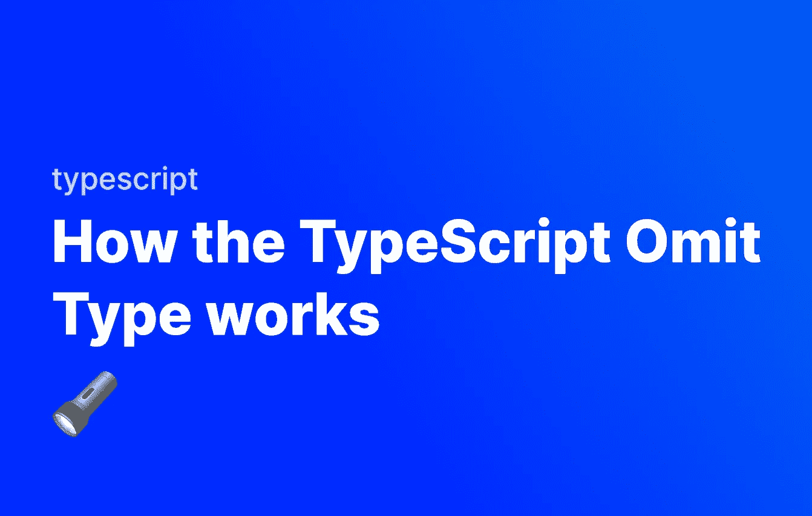

# TypeScript 省略类型的工作原理

> 原文：<https://javascript.plainenglish.io/how-the-typescript-omit-type-works-d22a8e7d9ceb?source=collection_archive---------11----------------------->



TypeScript 提供了许多实用工具类型，用于解决在 Javascript 中使用类型所产生的特定问题。TypeScript 中使用的一个非常有用的实用类型是 Omit 类型，它允许我们自定义一个已经存在的类型。让我们看看它是如何工作的。

# 自定义类型

本文假设您知道如何在 TypeScript 中创建自定义类型。如果您不知道，请在这里阅读我关于自定义类型的文章。

# TypeScript 省略类型

在 TypeScript 中，我们经常创建自定义类型，这让我们可以确保数据符合特定的格式。例如，如果我们想要创建一个自定义用户类型，它有四个字段— `firstName`、`lastName`、`age`和`lastActive`，我们可以这样做:

```
type User = {
  firstName: string;
  lastName: string;
  age: number;
  lastActive: number;
}
```

可悲的是，编码并不总是一帆风顺的。有时，我们希望再次使用我们的类型，但是从它那里删除某些元素，从而创建一个新的类型。为此，我们可以使用`Omit<Type, Omissions>`。省略接受两个值:

*   我们的新类型所基于的类型
*   列出所有要移除的字段的联合类型。例如，如果我们想要获取我们的用户类型，并删除 age 和 lastActive，我们可以执行以下操作:

```
type User = {
  firstName: string;
  lastName: string;
  age: number;
  lastActive: number;
}type UserNameOnly = Omit<User, "age" | "lastActive">
```

现在我们有两种类型——`User`，这是我们的核心用户类型，`UserNameOnly`，这是我们的用户类型减去`age`和`lastActive`。类似地，如果我们只想删除`age`，这就足够了:

```
type UserNameAndActive = Omit<User, "age">
```

现在我们可以在代码中的任何地方使用新类型。这使我们可以灵活地使用一个类型，并根据具体情况对其进行转换。下面是使用这两种新类型的示例:

```
type User = {
  firstName: string;
  lastName: string;
  age: number;
  lastActive: number;
}type UserNameOnly = Omit<User, "age" | "lastActive">
type UserNameAndActive = Omit<User, "age">const userByName:UserNameOnly = {
    firstName: "John",
    lastName: "Doe",
};
const userWithoutAge:UserNameAndActive = {
    firstName: "John",
    lastName: "Doe",
    lastActive: -16302124725
}
```

*更多内容请看*[***plain English . io***](https://plainenglish.io/)*。报名参加我们的* [***免费周报***](http://newsletter.plainenglish.io/) *。关注我们关于*[***Twitter***](https://twitter.com/inPlainEngHQ)*和*[***LinkedIn***](https://www.linkedin.com/company/inplainenglish/)*。加入我们的* [***社区不和谐***](https://discord.gg/GtDtUAvyhW) *。*