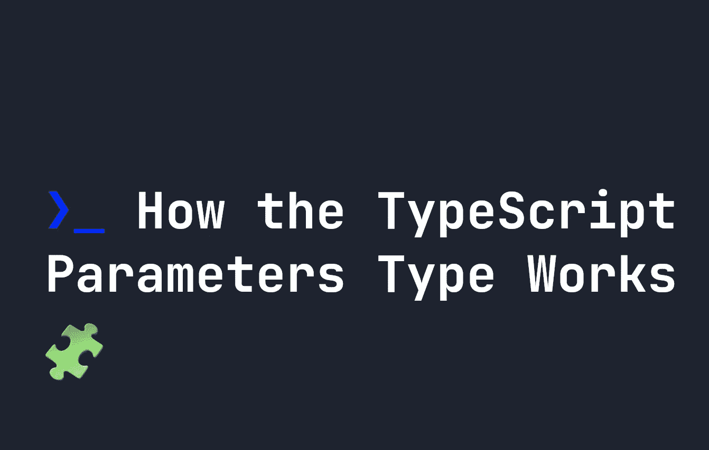

# TypeScript 参数类型如何工作

> 原文：<https://javascript.plainenglish.io/how-the-typescript-parameters-type-works-4d55b8389907?source=collection_archive---------11----------------------->

## 什么是参数类型？它是 TypeScript 中的一种实用类型，允许我们获取函数的参数，并将其转换为一种新的类型。



TypeScript `Parameters`类型用于获取函数的**参数**或**自变量**，并基于它们创建一个新类型。当我们知道一个`Function`的输入符合某种类型，并且我们想要复制它时，这是非常有用的。在本指南中，让我们看看`Parameters`实用程序类型是如何工作的。

# TypeScript 自定义类型

本指南涵盖了自定义类型。如果你不熟悉自定义类型，请在这里阅读我的自定义类型指南。

# 参数类型如何工作

假设你有一个函数，有一定数量的参数。例如，下面是一个带有两个参数的 TypeScript 函数，`a`和`b`:

```
const myFunction = (a: string, b: string) => {
    return a + b;
}
```

假设我们想要运行这个函数。一种方法是在数组中传递一个[元组类型](https://fjolt.com/article/typescript-tuples)的[三点](https://fjolt.com/article/javascript-three-dots-spread-operator)操作符。例如:

```
const myFunction = (a: string, b: string) => {
    return a + b;
}let passArray:[string, string] = [ 'hello ', 'world' ]// Returns 'hello world'
myFunction(...passArray);
```

这里我们定义了一个 tuple，简单来说就是`[string, string]`，我们可以将它传递给 myFunction，同时满足`a`和`b`参数。

这很好，但是如果`myFunction`的论点改变了呢？如果`myFunction`来自第三方脚本，这种情况尤其可能发生。然后，我们不仅要更新函数，还要记得更新传入的元组类型。我们还需要保持包`myFunction`的最新状态，以防它发生变化。

相反，如果我们想确保它们总是匹配的，我们可以使用`Parameters`来产生相同的类型。这将创建一个元组类型的参数，而不是我们必须手动定义它:

```
type myType = Parameters<typeof myFunction>
// Equivalent to a tuple type of:
// type myType = [ a: string, b: string ]
```

这让我们在定义自定义类型时省去了一些麻烦，因为我们现在可以将类型为`myType`的任何东西传递给`myFunction`而不用担心出错:

```
const myFunction = (a: string, b: string) => {
    return a + b;
}type myType = Parameters<typeof myFunction>let myArray:myType = [ 'hello ', 'world' ];myFunction(...myArray)
```

# 使用参数实用程序类型键入特定参数

参数类型也非常灵活，允许我们定义更多的参数。例如，如果我们只想匹配函数`myFunction`中第一个参数的类型，我们可以像引用一个简单的数组一样，添加`[0]`。下面将匹配`a`的类型，但是如果我们想要匹配`b`的类型，我们可以使用`[1]`:

```
type myType = Parameters<typeof myFunction>[0]
// Equivalent of 'string'
```

这样，如果需要的话，我们可以在代码中为每个参数定义自定义类型。例如，这里我们为函数的第一个和第二个参数定义了两个自定义类型，并将它们都传递给我们的函数:

```
const myFunction = (a: string, b: string) => {
    return a + b;
}type aType = Parameters<typeof myFunction>[0]
type bType = Parameters<typeof myFunction>[1]let a:aType = 'hello '
let b:bType = 'world'myFunction(a, b)
```

# 参数带来更多乐趣

由于`Parameters`将参数的类型转换为新的类型，我们也可以直接传递一个函数给它。下面将产生一个类型`[ a: string, b: number ]`。这不如从特定函数中获取参数有用，但在某些情况下可以派上用场:

```
type anotherType = Parameters<(a: string, b: number) => void>
```

这个题目到此为止。感谢您的阅读。

*更多内容看* [***说白了。报名参加我们的***](https://plainenglish.io/) **[***免费周报***](http://newsletter.plainenglish.io/) *。关注我们关于*[***Twitter***](https://twitter.com/inPlainEngHQ)*和*[***LinkedIn***](https://www.linkedin.com/company/inplainenglish/)*。加入我们的* [***社区***](https://discord.gg/GtDtUAvyhW) *。***