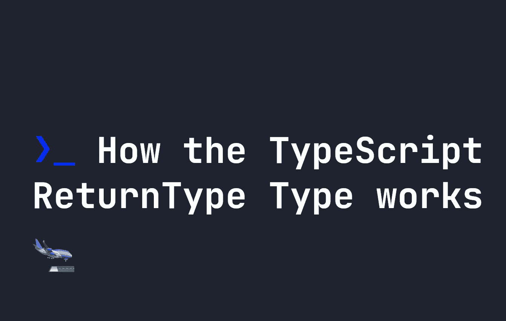

# TypeScript ReturnType 类型如何工作

> 原文：<https://javascript.plainenglish.io/how-the-typescript-returntype-type-works-238a6e201806?source=collection_archive---------5----------------------->



TypeScript 中的`ReturnType`是一个实用程序类型，与[参数类型](https://fjolt.com/article/typescript-parameters-utility-type)非常相似。它让你获取一个函数的返回输出，并基于它构造一个类型。

# ReturnType 实用程序类型

在特定函数的输出需要被另一个函数接收的情况下,`ReturnType`实用程序类型非常有用。在这种情况下，您可能会创建一个新的自定义类型，函数的输出会将其自身约束到该类型。

让我们来看一个愚蠢的例子。下面，我们定义一个新的类型，它有两个属性，`a`和`b`，都是数字。然后一个函数将这个对象上的所有数字转换成字符串，并返回一个新的类型。我们定义了一个自定义类型，叫做`Data`，它期望`a`和`b`是字符串。

```
function sendData(a: number, b: number) {
    return {
        a: `${a}`,
        b: `${b}`
    }
}type Data = {
    a: string,
    b: string
}function consoleData(data:Data) {
    console.log(JSON.stringify(data));
}let stringifyNumbers = sendData(1, 2);
consoleData(stringifyNumbers);
```

由于`consoleData`期望数据的格式为`Data`，如果`a`或`b`为数字，TypeScript 将抛出错误。我们的`sendData`函数通过将`a`和`b`转换成字符串来解决这个问题。

这种设置的问题是，如果我们添加或更改了`sendData`或我们的输入数据，那么`Data`也需要更新。这没什么大不了的，但是很容易产生 bug。因此，我们可以使用`ReturnType`来简化我们的类型声明。我们的`Data`型可以这样写:

```
function sendData(a: number, b: number) {
    return {
        a: `${a}`,
        b: `${b}`
    }
}
type Data = ReturnType<typeof sendData>
// The same as writing:
// type Data = {
//     a: string,
//     b: string
// }
```

由于`sendData`返回类型`{ a: string, b: string }`中的数据，`Data`成为该类型。这意味着我们不必维护来自`sendData`的输出的两个副本——相反，我们有一个，在函数内部，和一个符合那个的类型，简化了我们的代码。

*更多内容请看*[***plain English . io***](https://plainenglish.io/)*。报名参加我们的* [***免费周报***](http://newsletter.plainenglish.io/) *。关注我们关于*[***Twitter***](https://twitter.com/inPlainEngHQ)*和*[***LinkedIn***](https://www.linkedin.com/company/inplainenglish/)*。加入我们的* [***社区不和谐***](https://discord.gg/GtDtUAvyhW) *。*