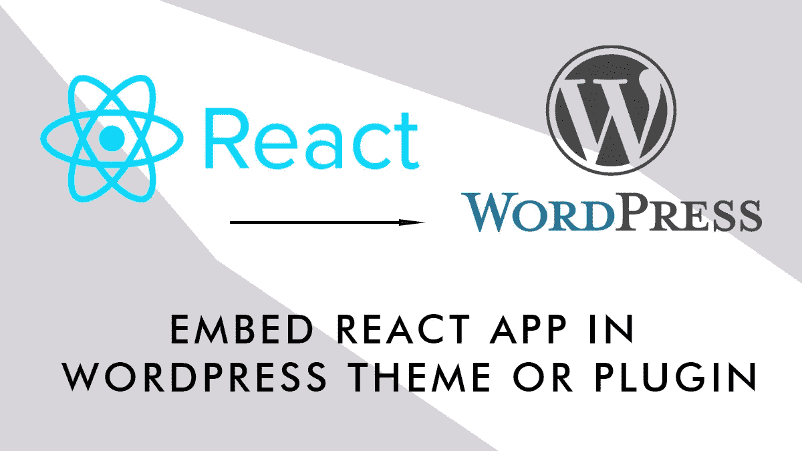

# 如何向 WordPress 页面添加 React 应用程序

> 原文：<https://javascript.plainenglish.io/how-to-add-a-react-app-to-wordpress-pages-61aee723d607?source=collection_archive---------2----------------------->



有时，在 WordPress 页面中嵌入一个 React 应用程序可能是有用的(多步调查、天气应用程序、预订系统、外部数据源，例子数不胜数)。这是完全可行的，但是由于 WordPress 中的 React 实现，这可能会比较棘手。

从版本 5(古腾堡的出现)开始，WordPress 包含了 React，并允许开发者通过抽象层访问它( *wp.element* 细节及其存在的理由可以在[这里](https://github.com/WordPress/gutenberg/tree/trunk/packages/element)找到)，当你在 WordPress 内部开发 React 应用程序时，你需要引用那个包装器来让它平稳运行。

在这篇文章中，我将尝试指导你如何在 WordPress 站点中包含一个 React 页面，将它添加到模板中，或者使用插件/短代码方法。

## 先决条件

要跟进，您至少需要:

*   本地 WordPress 安装
*   对自定义模板、插件开发、主题定制等 WordPress 概念有基本到中等的理解
*   React 和 JS 的基础知识
*   节点包管理、脚本、网络包的基本知识

## 基础知识

如前所述，WordPress 提供了一个我们可以使用的 React 抽象层和一个允许我们简单直接集成的包( [@wordpress/scripts](https://developer.wordpress.org/block-editor/reference-guides/packages/packages-scripts/) )。

抽象层已经包含了`React, ReactDom, useEffect…`等等，所以如果你正确地使用了 *wp.element* ，你就不需要在你的应用中导入它们

此外，节点包将包含以 WordPress 将正确使用的方式构建应用程序所需的所有脚本(例如在一个文件中)。

## 方法

在 WordPress 页面中包含 React 应用程序有很多方法，我将详细介绍我目前使用的两种方法:

*   基于模板:我们将在我们的主题中包含我们的 react 应用程序，我们将使用`function.php`添加它。如果你需要你的应用在站点范围内运行(例如在页眉或页脚)，或者如果你在一个定制的页面模板内运行它，这种方法是有用的。
*   Plugin/shortcode:我们将构建一个(基本)插件，该插件公开一个将呈现 React 应用程序的 shortcode。如果你需要你的应用程序在更多的页面或帖子上运行，并且你需要更多的灵活性(例如定位)，可以使用这种方法

## 模板方法

首先，你需要移动到你的主模板文件夹，使用下面的命令设置一个`package.json` fille:

```
npm init
```

完成后，您可以使用以下命令安装 WP 脚本:

```
npm install @wordpress/scripts --save-dev
```

当模块安装好后，我们可以将构建/编译脚本添加到`package.json`文件中。
打开 package.json 并将以下内容添加到脚本部分(稍后我们将看到如何使用这些脚本:

你需要的最后一件事，仍然在你的主题文件夹中，是添加一个 WordPress 兼容的 webpack 配置文件`webpack.config.js`:

我们现在准备开始编写 React 应用程序，在你的主题目录中创建一个`src`文件夹，并添加`App.js`和`index.js`文件

在 index.js 中，我们使用不是从 ReactDom 导入的 render 方法，但是我们从 *wp.element* 中获得它，剩下的是基本的 React，我们导入应用程序，并在 id 为‘my-React-App’的元素中呈现它

在 App.js 中，我们编写我们的主要 React 应用程序，不要忘记，如果您需要 React 或 ReactDOM 中的某些内容，您不需要导入它，但是它可以从 *wp.element、*中获得，例如，如果您需要`useEffect`或`useState`，您只需使用:

```
const {useState, useEffect} wp.element
```

我们现在准备在 WordPress 页面上显示我们的最小应用程序。
我们现在将使用以下命令编译它:

```
npm run build
```

这将在一个 index.js 文件中构建我们的应用程序，该文件将放在`build`文件夹中，这样我们就可以通过以下方式将其从`function.php`中排队:

不要忘记['wp-element']部分，它是一个 Javascript 依赖项，表示您将需要为前端做出反应。

最后一点是修改页面(或帖子，或页眉，或页脚)模板，以包含以下代码:

```
<div id="my-react-app"></div>
```

您希望 React 应用程序显示的位置。

**开发而不重建** 在开发期间，为每次更改重建应用程序可能会很繁琐，因此您将使用以下脚本:

```
npm run start
```

它会不断检查您的`src`文件夹中的更改，并根据保存的更改重建应用程序，这样您就不需要不断地重建应用程序。

## 插件/短代码方法

使用这种方法，我们将构建一个暴露短代码的基本插件，React 应用程序将在找到短代码的地方呈现。
首先，你需要创建并激活一个框架插件:
移动到你的插件文件夹并创建一个目录(例如`reactplug`)，在该目录下，创建一个文件`reactplug.php`并填充插件的基本信息:

```
<?php/**
* Plugin.
*
* @package reactplug
* @wordpress-plugin
*
* Plugin Name:     React in WP
* Description:     Add React app via shortcode
* Author:          popeating
* Author URL:      [https://](https://mikhailroot.ru)popland.it
* Version:         1.0
*/
/**
```

然后像在模板部分那样设置环境，这次在你的插件文件夹 init `package.json`上工作，安装 WP 脚本，添加脚本部分，创建`webpack.config.js`文件，在新创建的`src`文件夹中添加 App.js 和 index.js 文件，用`npm run build`构建脚本

现在，回到你的插件文件，添加一些基本的功能，为 WordPress 添加一个短代码，并让脚本入队:

像以前一样，我们将脚本(及其 wp-element 依赖项)入队，并注册一个新的短代码，它将呈现`<div id="my-react-app"></div>`，这是我们 React 应用程序的入口点。

现在，您可以在希望 React 应用程序呈现的页面(或帖子)上使用短代码。

如前所述，在开发期间，您可以使用

```
npm run start
```

根据变化自动构建应用程序。

## 下一步是什么

这里有很多可以改进的地方，例如，脚本可以有条件地加载(只在特定的文章类型上加载，或者如果一个页面有特定的名称或模板)。您可以通过短代码将数据传递给 React 应用程序。同样使用这种模式，您可以将短代码转换成可以在侧栏或页脚中使用的小部件。

*更多内容看* [***说白了就是 io***](http://plainenglish.io/) *。报名参加我们的* [***免费周报***](http://newsletter.plainenglish.io/) *。在我们的* [***社区不和谐***](https://discord.gg/GtDtUAvyhW) *获得独家获取写作机会和建议。*