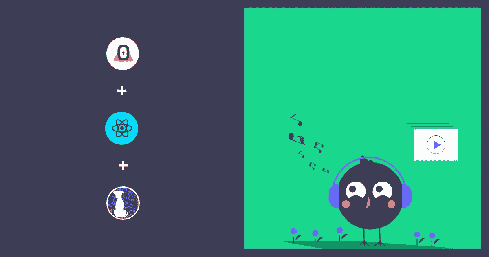
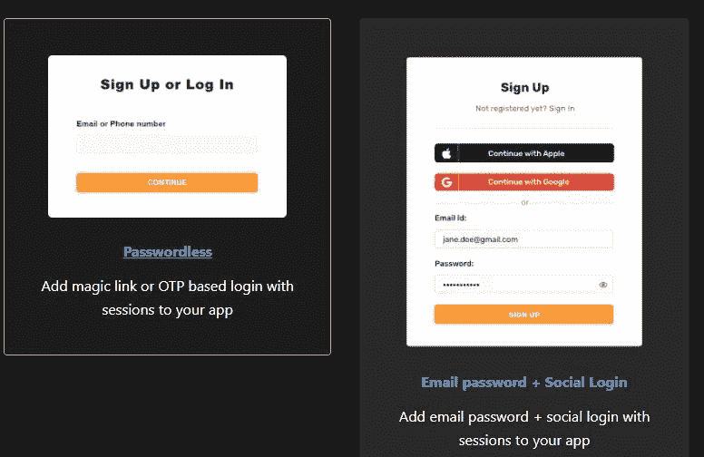
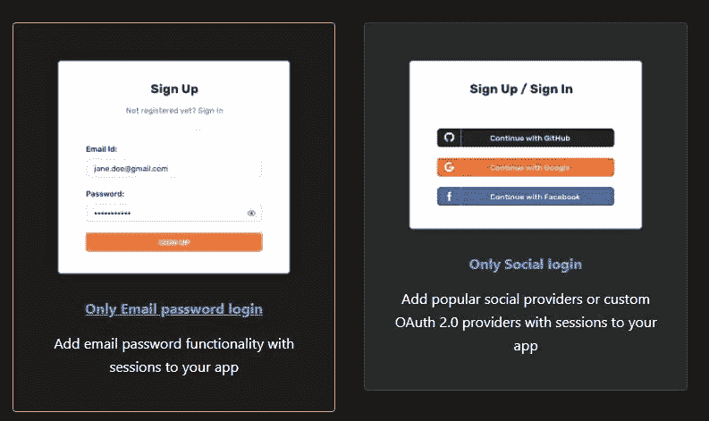
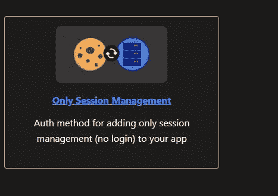
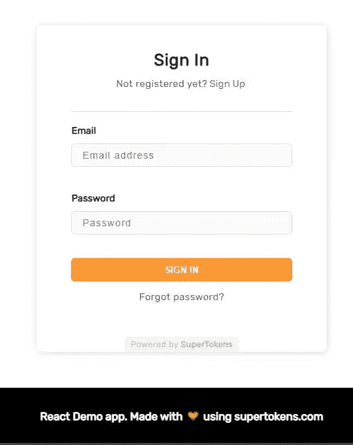
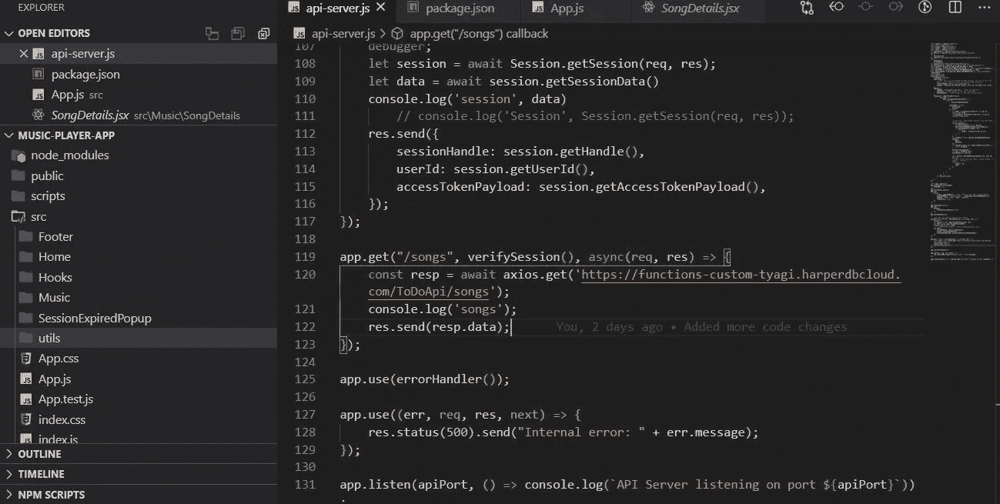
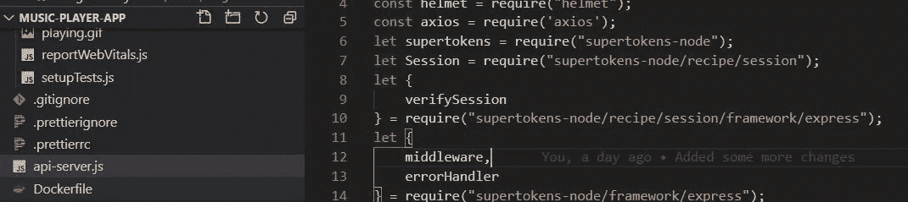

# 如何在 React 应用中使用超级令牌添加认证和安全 HarperDB APIs

> 原文：<https://javascript.plainenglish.io/how-to-add-authentication-secure-harperdb-apis-using-supertokens-in-your-react-app-d3af60ae45bb?source=collection_archive---------16----------------------->

## 一个关于如何制作一个音乐播放器应用程序的教程，它使用 SuperTokens 进行身份验证，使用 HarperDB 作为后端。



为应用程序添加授权和身份验证是开发人员的一项常见任务。

当你推出一个新产品、一家创业公司或一个附带项目时，它会让人感觉像是一项任务。

本教程将教我们如何制作一个音乐播放器应用程序，它使用 SuperTokens 进行身份验证，使用 HarperDB 作为后端。

# 该应用程序的一些最重要的功能

**在后端:**

1.  用几乎少得多的零配置来保护您的 API。
2.  使用超级令牌在服务器端保护您的第三方 API。
3.  会话管理很简单。

**在前端侧:**

1.  对于登录，使用 SuperTokens 的库组件，它是作为 npm 包提供的。
2.  没有必要开发任何额外的认证代码。
3.  不需要在 UI 端维护令牌。
4.  您不必担心在 UI 端管理令牌刷新调用，因为 SuperTokens 会为您处理它。

# TL；速度三角形定位法(dead reckoning)

以下是获得源代码或更快了解这两种产品的链接:

*   [源代码](https://github.com/tyaga001/music-player-app)
*   [超级油轮](https://supertokens.com/)
*   [超级令牌 GitHub](https://github.com/supertokens)
*   [HarperDB](https://harperdb.io/)

# 你会发现什么

*   如何使用超级令牌添加身份验证？
*   如何保护第三方(HarperDB)端点。

# 让我们来谈谈超级油轮

*   SuperTokens 是一种开源认证。
*   他们帮助您快速启动，以便您可以专注于核心产品。
*   SuperTokens 是 100%开源的。
*   开发者可以拥有和管理他们用户的数据。
*   超级令牌可以在你的场所免费运行，也有一个慷慨的托管层给那些不想自己管理它的人。

SuperTokens 是一个为您的应用程序提供的多功能认证和授权解决方案。

# 先决条件

本教程假设读者具备以下条件:

**安装在本地开发机器上的节点。**

您可以通过在终端中运行以下命令来验证您是否做到了这一点。

```
node -v
```

否则，从[这里](https://nodejs.org/en/download/)下载。

**HTML、CSS、JavaScript、React 的基础知识**

看看我们是如何开发 React 应用程序并使用超级令牌对其进行认证的。

# 项目设置的摘要

耶！本节将创建一个 React 音乐播放器应用程序，并纳入 SuperTokens 和 HarperDB。

*或者，您可以通过克隆* [***GitHub 库***](https://github.com/tyaga001/music-player-app) *来利用 start 目录作为您的项目根。它包括整个项目设置，将让你开始。*

# 如何开始使用超级油轮

SuperTokens 提供了各种现成的食谱供选择。

你可以看到所有的食谱。[此处](https://supertokens.com/docs/community/recipes)



我们将使用预先构建的 **EmailPassword** 方法来访问[演示应用程序](https://emailpassword.demo.supertokens.com/auth?rid=emailpassword&redirectToPath=)，它看起来像这样。



SuperTokens 网站上有这个食谱的文档。[点击这里](https://supertokens.com/docs/emailpassword/introduction)

现在，分叉 [GitHub 库](https://github.com/supertokens/supertokens-auth-react/tree/master/examples/with-emailpassword)

# 让我们来看看制作这个应用程序所依赖的所有项目

## `Dependencies used:`

# 在 React 应用程序中使用 SuperTokens npm 包

**本演示应用展示了以下使用案例:**

*   注册
*   签约雇用
*   注销
*   忘记密码流程
*   会话管理和调用 API

现在，您可以使用 npm 安装项目依赖项:

```
npm install
```

现在是时候让这个演示应用程序发挥作用了。

```
npm run dev
```

示例应用程序将在(http://localhost:3000)上运行，而 API 服务器将在(http://localhost:3001)上运行。

# 在前端，身份验证

我们在前端使用 supertokens-auth-react 包来处理身份验证(发送和接收令牌)。

**会话在 app.js 文件中初始化:**

要在 API 请求中将令牌传递给服务器，我们必须包含以下代码行。

```
Session.addAxiosInterceptors(axios);
```

Supertokens-auth-react 包将处理在客户机上存储令牌、向服务器传输令牌以及在令牌过期之前更新令牌。

# 让我们讨论一下我们用来创建音乐播放器应用程序的 react 组件

在 Visual Studio 代码中，文件夹结构如下所示:



## 1.音乐容器(音乐容器. jsx)

我们管理这个组件中所有与状态相关的东西，并呈现所有子组件。

这里，我们调用 API server.js 公开的 songs 端点来获取歌曲列表。

## 2.歌曲列表(SongList.jsx)

所有的歌曲都在这个组件中呈现。

当你点击面板中的歌曲时，播放器组件将播放面板中的每首歌曲。

## 3.播放器(Player.jsx)

这个播放器组件中使用 HTML5 音频元素来播放应用程序中的所有歌曲。

## 4.进度(Progress.jsx)

进度条组件用于显示歌曲的进度。

## 5.歌曲详情(SongDetail.jsx)

曲目标题和专辑缩略图显示在该组件中。

# 保护第三方 API

我们使用 API 服务器来使用 SuperTokens 后端包进行令牌管理和会话管理。



```
let supertokens = require("supertokens-node");
let Session = require("supertokens-node/recipe/session");
```

**必须首先初始化 supertokens 节点包:**

我们向 react 应用程序公开了歌曲端点来检索音乐列表。

我们在这个端点中调用 HarperDB 端点来接收来自 DB 的歌曲列表。

因此，get 方法的第二个参数 verifySession 为我们进行验证(令牌，会话)。

超级令牌使这种方法可用。

***SuperTokens 负责用户登录演示应用时的令牌创建和会话管理。***

这就是这篇博客的内容。

今天，我希望你学到了一些新的东西，如果你学到了，请喜欢并分享它，以便其他人也能看到它。

感谢您成为我们的普通读者；你是我能够与你分享我的生活/工作经历的重要原因。

**获取最新信息，在 Twitter 上关注** [**超级微博**](https://twitter.com/supertokensio) **。**

**在** [**的 Twitter 上关注我。**](https://twitter.com/TheAnkurTyagi)

如果你想了解更多关于 SuperTokens 的知识，我推荐你阅读去年的博客文章。

[**关于超级令牌的一切——Auth 0、Firebase Auth 和 AWS Cognito 的开源替代方案。**](https://theankurtyagi.hashnode.dev/everything-about-super-tokens-an-open-source-alternative-to-auth0-firebase-auth-and-aws-cognito)

*更多内容请看*[***plain English . io***](http://plainenglish.io/)*。报名参加我们的* [***免费周报***](http://newsletter.plainenglish.io/) *。在我们的* [***社区不和谐***](https://discord.gg/GtDtUAvyhW) *获取独家写作机会和建议。*