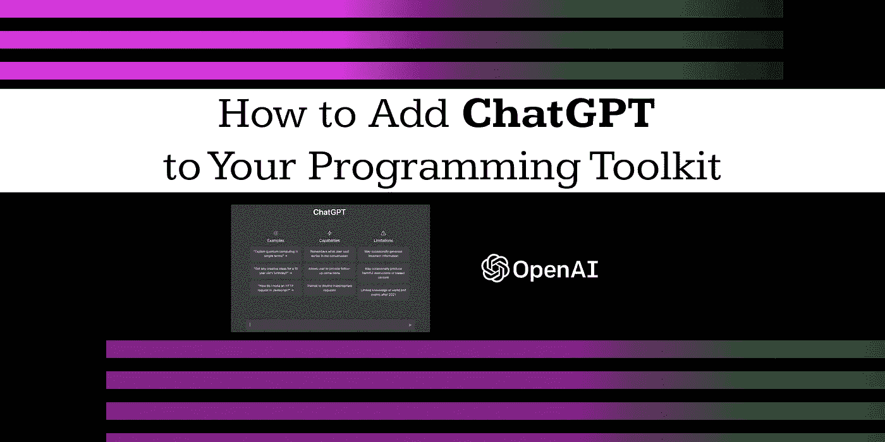

# 如何将 ChatGPT 添加到您的编程工具包中

> 原文：<https://javascript.plainenglish.io/how-to-add-chatgpt-to-your-programming-toolkit-46b75d50d1db?source=collection_archive---------0----------------------->



# 什么是 ChatGPT

ChatGPT 是一个开源的对话式人工智能(AI)平台，可以让开发人员更容易地将自然语言处理(NLP)功能带到他们的项目中。使用 ChatGPT，开发人员可以快速创建理解和响应自然语言输入的应用程序。本文将讨论使用 ChatGPT 进行编程项目的好处，如何开始使用它，以及一些有效使用它的技巧。

# 为什么应该使用 ChatGPT

ChatGPT 提供了许多优于其他人工智能解决方案的优势。其中最突出的就是它的易用性。ChatGPT 的设置和入门只需要很少的设置，而且该平台使用起来非常直观和简单。此外，ChatGPT 是开源的，这意味着开发人员可以利用该平台的功能，而无需支付任何许可费。

# ChatGPT 入门

要开始使用 ChatGPT，第一步是创建一个开发人员帐户。这可以通过 [ChatGPT 网站](https://openai.com/blog/chatgpt/)完成。一旦创建了帐户，开发者就可以访问该平台的文档和教程，以了解关于该平台的更多信息以及如何使用它。

# 如何使用 ChatGPT

ChatGPT 是用于对话创建的 GPT(生成式预训练转换器)语言模型的改进版本。它的目的是在对话环境中为文本输入创建类似人类的答案。

要使用 ChatGPT，您必须能够访问模型以及与它交互的方法。OpenAI API 提供了与 ChatGPT 和其他语言模型接口的简单 API，是实现这一点的一种方法。

# 使用 Python 和 ChatGPT

下面解释了如何使用 OpenAI API 让 ChatGPT 提供响应。

遵循这个简短指南中的步骤，但是首先必须先在您的开发环境中安装和设置 Python。这可能已经完成了，否则你可以在 [Python 网站](https://www.python.org/)上学习如何做。

1)首先，您需要创建一个帐户，以便在[https://beta.openai.com/](https://beta.openai.com/)获得 API 密钥。

2)接下来使用命令行安装`openai` Python 库

```
pip install openai
```

3)使用`openai.Completion`类创建一个 ChatGPT 答案。例如:

```
import openai

# Set the API key
openai.api_key = "YOUR_API_KEY"

# Use the `Completion` class to generate a response
model_engine = "text-davinci-002"
prompt = "Hello, whats up?"
response = openai.Completion.create(
    engine=model_engine,
    prompt=prompt,
    max_tokens=1024,
    n=1,
    temperature=0.5,
)

# Print the response
print(response.text)
```

基于输入提示“你好，什么事？”，此代码将导致 ChatGPT 提供响应。较高的温度会产生更多样的答案，而较低的温度会产生更保守和更少变化的答案。`temperature`的参数将调节反应的不可预测性。

控制 ChatGPT 行为的其他选项包括 max tokens 参数，该参数限制生成的答案中可能使用的标记(单词和标点)的数量。

# 有效使用 ChatGPT 的技巧

一旦开发人员熟悉了这个平台，有一些技巧可以帮助他们充分利用它。首先，考虑将要创建的对话的结构很重要。开发一个清晰的对话流程有助于确保用户体验的流畅，以及应用程序对用户输入的准确响应。此外，开发人员还应该花时间测试应用程序，并确保它按预期工作。

# 摘要

ChatGPT 是一个功能强大且易于使用的平台，使开发人员更容易在他们的项目中实现自然语言处理。通过正确的设置和一些简单的技巧，开发人员可以快速使用 ChatGPT 创建理解和响应自然语言输入的应用程序。

如果你喜欢这篇文章，你可能也会喜欢我的帖子、推文和内容。如果你很好奇，看看我的 [*社交媒体简介*](https://limey.io/andrewbaisden) *，别忘了订阅和关注，因为我正在分享编程和激励资源和知识，以支持你实现你的目标💫*

*更多内容请看*[***plain English . io***](https://plainenglish.io/)*。报名参加我们的* [***免费周报***](http://newsletter.plainenglish.io/) *。关注我们关于*[***Twitter***](https://twitter.com/inPlainEngHQ)[***LinkedIn***](https://www.linkedin.com/company/inplainenglish/)*[***YouTube***](https://www.youtube.com/channel/UCtipWUghju290NWcn8jhyAw)*[***不和***](https://discord.gg/GtDtUAvyhW) ***。*****

*****对缩放您的软件启动感兴趣*** *？检查* [***电路***](https://circuit.ooo/?utm=publication-post-cta) *。***