# 如何在 JavaScript Roguelike 中添加遗迹

> 原文：<https://javascript.plainenglish.io/how-to-add-collectible-items-in-a-javascript-roguelike-93d934b499b8?source=collection_archive---------9----------------------->


Photo by [Dan Farrell](https://unsplash.com/@farreal?utm_source=unsplash&utm_medium=referral&utm_content=creditCopyText) on [Unsplash](https://unsplash.com/s/photos/crystals?utm_source=unsplash&utm_medium=referral&utm_content=creditCopyText)

在冒险游戏中，知道新的物品可能在某个地方会鼓励你去探索不寻常的地方。因为 roguelike 使用程序生成的关卡，所以由关卡生成算法在激发探索的地方放置物品。在本教程中，我们将从一个工作的地牢爬虫开始，并编写逻辑将可收集的遗物放在每个房间序列的末尾。下面是这种级别的一个例子，其中有三个紫色的遗迹。

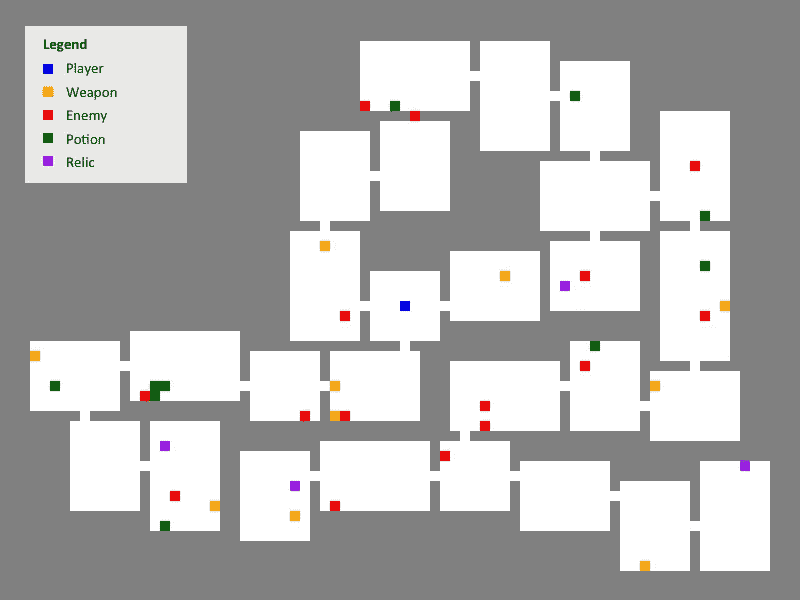

See if you can find the four purple relics!

游戏是这样运作的:你用光标键控制玩家，当你碰到敌人时就和他们战斗。你可以拿起绿色的生命药剂来恢复生命，如果你移动到橙色的武器上，它就会变成你所使用的武器。当你收集一件遗物时，玩家的经验值会随机增加。而在这个游戏的最终版本中，需要收集所有的遗物才能完成关卡。

# 入门指南

要获取启动代码，请从 [Github](https://github.com/nevkatz/js-roguelike-relics) 下载 [zip 文件](https://github.com/nevkatz/js-roguelike-relics/archive/refs/heads/main.zip)。解压后，您会看到一个`project`目录，以及两个解决方案目录，您可以在工作过程中查看。`css`和`js`目录各有一个文件供所有三个游戏版本使用。

```
js-roguelike-relics
  |
  *--project
  |
  *--phase-1-solution
  |
  *--phase-2-solution
  |
  *--js
  |
  *--css
```

在`project`目录中有一个显示游戏的`index.html`文件。还有一个包含四个 JavaScript 文件的`js`目录，我们将在这里进行编码。

```
project
  |
  *--index.html
  |
  *--js
      |
      *--game.js
      |
      *--room.js
      |
      *--script.js
      |
      *--sequence.js
```

## 游戏地图

和很多 roguelikes 一样，这是一款基于磁贴的游戏。每种类型的牌都有自己的数字代码，见`script.js`。

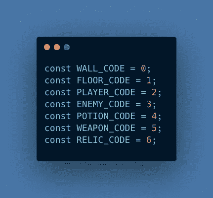

The tile codes used in the game.

`game.js`文件存储了`Game`类及其方法。

The game class

一旦地图生成，它就被绘制在一个`<canvas>`元素上。`Game`对象存储了对一个`<canvas>`元素的引用及其被称为`context`的绘图方法包。

## 地图

游戏的`map`属性将地牢地图存储在一个 2D 数组中。如果一个 3x3 的房间被添加到一个 5x5 地图的中心，那么`map`阵列将类似于下图。

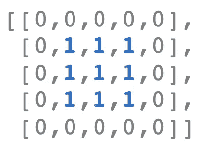

A small 2D map array with a 3x3 room.

如果一个遗迹被添加到房间的中央，一个代码`6`、`RELIC_CODE`将被交换到第三行的第三个位置。

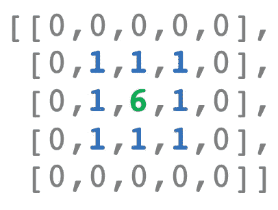

The map with a relic placed in the center.

最后，这个游戏有一个`enemies`数组，用来记录还有多少敌人。在最初的游戏中，如果数组是空的，玩家就赢了这一关。

## 房间

游戏地图是使用每个房间的一个对象创建的。每个房间对象都是由位于`room.js`的`Room`类构建的。

The Room class.

最重要的房间属性是`start`、`center`和`end`对象。每一个都存储`x`和`y`值。`start`对应于左上角，而`end`坐标对应于右下角。


A room’s start, center, and end properties

# 任务 1:添加房间和游戏方法

让我们从添加一些新方法到`Room`和`Game`类来放置遗迹开始。

## A.寻找免费的磁贴

要放置遗迹，我们需要找到房间里没有被玩家、敌人或其他物品占据的地砖。

在`room.js`中有一个名为`selectFreeCoords`的空方法。在该方法中，让我们初始化一个名为`validCoordSets`的数组，它将存储每个地砖的坐标。

```
Room.prototype.selectFreeCoords = function() { 

    let validCoordSets = [];
}
```

现在让我们添加一个助手函数来测试一个坐标是否有效。

```
const valid = (x,y) => game.map[y][x] == FLOOR_CODE;
```

现在让我们添加一个循环，该循环遍历地图的每个瓷砖，如果是地砖，则将它的坐标推入数组。

```
for (let y = this.start.y; y < this.end.y; ++y) {                                                                
  for (let x = this.start.x; x < this.end.x; ++x) {                                                                    
    if (valid(x,y)) {                                         
      validCoordSets.push({x,y})                                       
    }                 
  }        
}
```

接下来，让我们从数组中随机选择一个索引。

```
let idx = Math.floor(Math.random()*validCoordSets.length);
```

让我们返回在该索引处选择的坐标，并使用三元运算符来处理空数组的情况。

```
return validCoordSets.length > 0 ? validCoordSets[idx] : null;
```

以下是在`room.js`中寻找空闲图块的完整方法。

The selectFreeCoords method.

## B.计算房间中某一类型的瓷砖

在决定在一个房间里放置一个遗迹之前，我们也想让游戏检查一个遗迹是否存在。为了处理这个问题，让我们编写一个`tileCount`方法来计算一个房间中的遗物数量。

上面的方法计算房间中与传入的`tileCode`相匹配的瓷砖数量。我们调用的时候会传入`RELIC_CODE`，也就是`6`。

## C.检查剩余的遗迹

因为完成这一关需要收集所有的遗物，所以让我们去`game.js`写一个`itemsLeft`方法来返回还剩多少遗物。为此，我们将遍历所有房间，让每个房间调用它的新`tileCount`方法。

Counting the number of items left.

我们将在本文的后面看到这些方法发挥作用。

# 任务 2:检查序列构建功能

在`script.js`文件中，有一个`startGame`函数，当一个新的关卡开始时，它就会启动。我隐藏了大部分逻辑，以突出被称为`sequentialRooms`的神秘功能。

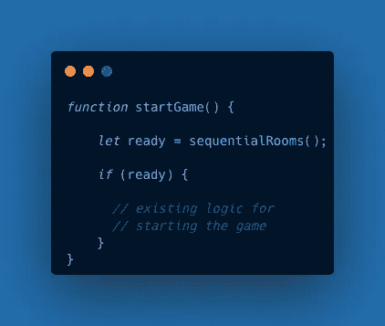

The startGame function

让我们打开`sequence.js`，仔细看看生成游戏地图的`sequentialRooms`。

首先调用`resetMap`方法，用墙砖填充关卡贴图。

```
game.resetMap();
```

然后用`addCenterRoom`在中间加一个房间。

```
let baseRoom = addCenterRoom();
```

接下来，在一个`while`循环中，从`Game`对象的`rooms`数组中选择一个随机房间。

```
let idx = Math.floor(Math.random()*game.rooms.length);                                  baseRoom = game.rooms[idx];
```

之后，调用`buildSequence`函数，该函数使用`baseRoom`开始一个新的房间序列。

```
buildSequence(baseRoom);
```

循环继续，直到我们达到最小房间数或最大尝试数。

## 添加中心房间

让我们检查一下`sequentialRooms`调用的`addCenterRoom`方法。

下面是发生的事情的快速分解。

*   使用地图尺寸`ROWS`和`COLS`确定`center`。
*   `genDim`用于生成房间尺寸。
*   `generateRoom`创建房间对象。
*   一个`roomToMap`方法将房间添加到 2D `map`数组中。
*   游戏还将房间推成了 1D `rooms`阵列。

## 构建房间序列

现在让我们看一下`buildSequence`方法，我们的大部分工作将在这里进行。

让我们来看看如何创建一个线性系列的房间。

*   `maxSeqLen`已声明，这是一个序列中的最大房间数。
*   在循环中，`addAdjacentRoom`被调用，它创建了一个与初始`baseRoom`相邻的房间。
*   如果不能添加新房间，我们就退出循环并返回。
*   否则，`baseRoom`连接到`newRoom`。
*   只要一个`newRoom`存在，那么*就变成*的`baseRoom`用于循环的下一个回合。

在[构建序列](/arranging-adjacent-rooms-in-a-javascript-roguelike-a5c178772d31)教程中详细介绍了`addAdjacentRoom`功能。

下面是`buildSequence`被调用一次后一系列房间的样子。

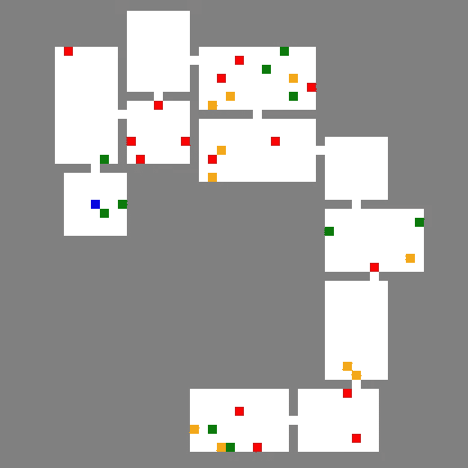

One room sequence.

# 任务 3:给每个房间序列添加一个遗迹

既然我们已经查看了关键代码，让我们添加删除遗物的逻辑，从一个叫做`placeRelic`的助手函数开始，它可以放在`buildSequence`中。

Logic for placing a relic.

让我们分解`placeRelic`,并探索它如何使用其他函数工作。

*   我们首先调用我们的`tileCount`方法来确保房间里没有遗物。
*   如果没有遗迹，我们调用我们写的`selectFreeCoords`方法在房间里找一个空闲的瓷砖。
*   然后我们调用`placeItem`，这是`script.js`中的一个函数，它将文物添加到 2D `map`数组中，如果它可见，就将其呈现在画布上。

## 检查一个项目是如何放置的

下面是完整的`placeItem`功能。

The full placeItem function.

开始时，它调用`addObjToMap`，将遗迹瓦片代码添加到地图的指定坐标处。

```
function addObjToMap(coords, tileCode) {
   game.map[coords.y][coords.x] = tileCode;
}
```

使用`drawObject`方法呈现项目，该方法使用`<canvas>`元素的`context`属性绘制图块。

现在，让我们回到`buildSequence`并弄清楚如何使用`placeRelic`。

回想一下，如果我们没有得到一个新的房间，我们就会打破循环。

```
let newRoom = addAdjacentRoom(baseRoom);    
                                                                     if (!newRoom) { 
  break;
}
baseRoom.directConnect(newRoom);
```

在我们休息之前，让我们调用`placeRelic`以便我们在这个序列的最后一个房间添加一个。

```
if (!newRoom) { **placeRelic(baseRoom);**
  break;
}

baseRoom.directConnect(newRoom);
```

再往下，让我们检查一下是否到达了序列中的最后一个房间。如果是这样的话，我们从来没有打破循环，所以让我们添加一个遗迹到这个最后的房间。

```
if (!newRoom) { placeRelic(baseRoom);
    break;
}

baseRoom.directConnect(newRoom);**if (i == maxSeqLen -1) {
   placeRelic(baseRoom);
}**baseRoom = newRoom;
```

如果你在浏览器中打开你的项目，你应该能够在不同的地方看到紫色遗迹，类似于下面显示的等级。

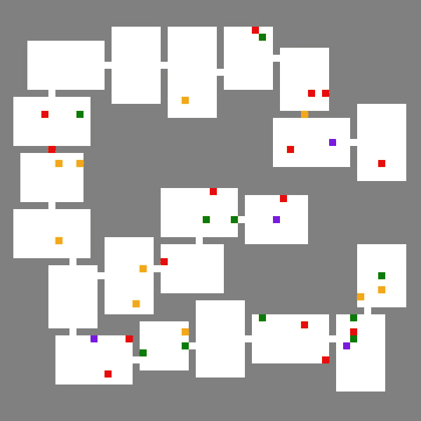

Here relics are placed, but they are not at the end of the room sequences.

不过，还是有一些问题。

*   当你收集一件遗物时，什么都不会发生——它只会消失。
*   收集遗物不需要完成关卡。
*   遗迹不一定出现在可见房间序列的最后一个房间。

接下来让我们解决这些问题。

# 任务 4:处理遗物的收集

我们先去`script.js`看看`addKeyBoardListener`，它处理的是玩家和其他瓷砖类型可能发生的碰撞。在`if`树上，在`WEAPON`条件下，让我们添加一个处理遗迹的新条件。在这个条件下，我们会将玩家的`relics`计数加 1。

```
else if (game.map[y][x] == RELIC_CODE) {
   player.relics++;
}
```

## 增加经验值

现在让我们设定一个获得这件遗物的经验值的最大值。

```
else if (game.map[y][x] == RELIC_CODE) {
   player.relics++;
 **const maxValue = 10;**
}
```

让我们在零和`maxValue`之间选择一个随机数。

```
else if (game.map[y][x] == RELIC_CODE) {
   player.relics++;
   const maxValue = 10; **player.xp += Math.round(Math.random()*maxValue);**
}
```

## 移走遗迹

现在让我们从地图上移除遗迹。

```
else if (game.map[y][x] == RELIC_CODE) {
   player.relics++;
   const maxValue = 10;   player.xp += Math.round(Math.random()*maxValue);
 **  removeObjFromMap(x,y);**
}
```

下面是`roomObjFromMap`功能。

```
function removeObjFromMap(x, y) {
   game.map[y][x] = FLOOR_CODE;
};
```

## 制造获胜所需的遗迹

让我们首先收集赢得游戏所需的所有遗物。当一个遗迹被收集时，让我们添加一个对名为`checkForWin()`的函数的调用。

```
else if (game.map[y][x] == RELIC_CODE) {
   player.relics++;
   const maxValue = 10;   player.xp += Math.round(Math.random()*maxValue);
  removeObjFromMap(x,y);  **checkForWin();** }
```

下面的初始`checkForWin()`函数以前只在击败敌人时调用。

```
function checkForWin() {
   if (game.enemies.length == 0) { userWins();
   }
}
```

为了制造所需的遗迹，我们必须改变`checkForWin`中的条件。让我们用之前写的`itemsLeft`方法来统计关卡中剩余的遗迹数量。

```
function checkForWin() {
   if (game.enemies.length == 0 && 
  **    game.itemsLeft(RELIC_CODE)==0)** { userWins();
   }
}
```

此时，您的项目应该与`phase-1-solution`相同或相似。继续在浏览器中打开两个`index.html`文件进行比较。

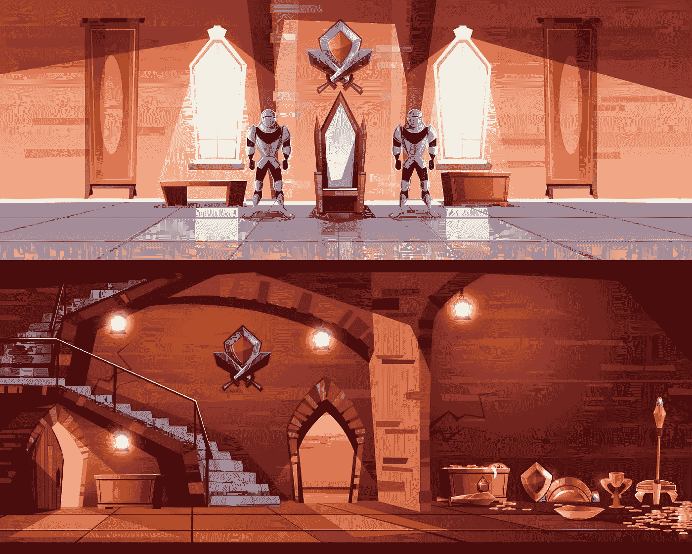

[Castle interior vector](https://www.freepik.com/vectors/castle-interior) created by vectorpouch at [freepik.com](http://www.freepik.com)

# 任务 5:优化遗迹的放置

尽管我们在任务 2 中做出了努力，但遗物并没有出现在房间序列的结尾。这有两个原因:

*   房间序列可以从先前序列的最后一个房间开始，有效地扩展了序列。结果，有圣物的房间不再是最后的房间。
*   在一个失败的序列的情况下，一个遗迹被放置在现有的房间里，新的序列将会分支。

因此，让我们为我们的算法添加一些新规则:

*   新的房间序列不能从序列中的最后一个房间分支出来。
*   如果一个新的序列不能开始，遗物将不被放置。

为了给实现这些规则打下基础，现在让我们让游戏知道它创建的序列。

## 从序列中选择房间

让我们回到`sequence.js`并修改`sequentialRooms`。在我们创建了第一个`baseRoom`之后，让它成为我们第一个场景的第一个房间。

```
function sequentialRooms() { game.resetMap(); let baseRoom = addCenterRoom();

 **  let roomSequence = [baseRoom];**
```

接下来，让我们将这个新的房间序列作为序列数组中的第一个。

```
let sequences = [roomSequence];
```

## 避开最后一个房间

在我们的`while`循环中，我们从`game.rooms`数组中选择一个随机的房间。

```
let idx = Math.floor(Math.random()***game.rooms.length**);
```

这意味着任何房间都可以被选为起点，包括前面序列中的最后一个房间！

因此，与其从整个地图中选择一个房间，不如让我们随机选择一个房间序列来处理。

```
let seqIdx= Math.floor(Math.random()*sequences.length);
```

现在，让我们抓住选择的序列，并使其成为新的`roomSequence`。

```
roomSequence = sequences[seqIdx];
```

然后让我们得到一个随机选择的房间的索引。为了避开最后一个房间，我们将使用一个比`roomSequence`数组长度少*一个*的范围。

```
let roomIdx = Math.floor(Math.random()*(roomSequence.length-1));
```

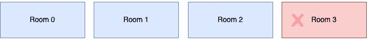

With our new logic, the last room cannot be chosen.

现在让我们修改一下`baseRoom`的分配，这样我们就可以从`roomSequence`而不是`game.rooms`那里获得选择的房间。

```
baseRoom = roomSequence[roomIdx];
```

## 构建序列

我们已经有了`buildSequence`调用，它现在使用序列中的新`baseRoom`——但是现在让我们捕获一个返回值，因为我们想要存储每个序列。

```
**roomSequence** = buildSequence(baseRoom);
```

下面是两个序列调用`buildSequence`后两个序列的示意图。在地图上，第一个序列的索引`1`处的房间连接到第二个序列的第一个房间。

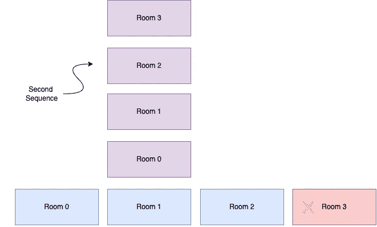

A new sequence of rooms emerges!

只要返回的序列不为空，我们就将其添加到我们的`sequences`数组中。这样以后可能会随机选择。

```
baseRoom = roomSequence[roomIdx];roomSequence = buildSequence(baseRoom);**if (roomSequence.length > 0) { 

   sequences.push(roomSequence); 
}**
```

下面是我们的 2D `sequences`阵列，有两个长度相同的序列。

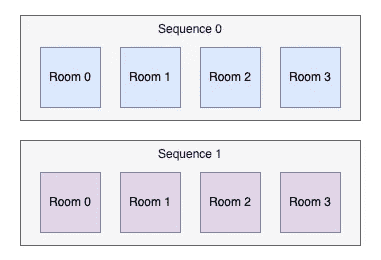

Each number corresponds to the index of the room in its array.

就这样——`sequentialRooms`函数现在是“序列感知的”让我们对它的助手函数`buildSequence`做一些修改，以避免在新序列失败时放置遗迹。

## 追踪我们构建的序列

就在`maxSeqLen`赋值下面，让我们初始化一个我们将要返回的`roomSequence`数组。

```
const maxSeqLen = 8;**roomSequence = [];**
```

还记得我们下面的循环吗？

```
for (var i = 0; i < maxSeqLen; ++i) { let newRoom = addAdjacentRoom(baseRoom);
```

回想一下，当没有新房间时，我们跳出循环，调用`addRelic`。然而，如果一个新的序列无法开始，遗迹将被添加到先前序列中的`baseRoom`中——因此，让我们只添加一个遗迹，如果我们正在完成的新序列有一个或多个房间。

```
let newRoom = addAdjacentRoom(baseRoom);if (!newRoom) { **if (roomSequence.length > 0) {**
        placeRelic(baseRoom);
  **  }**
    break;
}
baseRoom.directConnect(newRoom);
```

再往下，在第二次调用`placeRelic`之后，让我们将新房间添加到当前序列中。

```
 break;
}
baseRoom.directConnect(newRoom);if (i == maxSeqLen -1) {
     placeRelic(newRoom);
}

**roomSequence.push(newRoom);**baseRoom = newRoom;
```

最后，让我们返回`roomSequence`，这样就可以将它添加到`sequentialRooms`中的序列数组中。

```
return roomSequence;
```

现在你应该有一个游戏，只在每个房间序列的结尾放置遗物。此外，所有新序列都应该从现有序列中分支出来，而不是无意中扩展它们。因为遗迹现在需要完成水平，玩家必须探索所有的房间。

下面是一个第二阶段的例子，在每个序列的结尾都有一个紫色的遗迹。

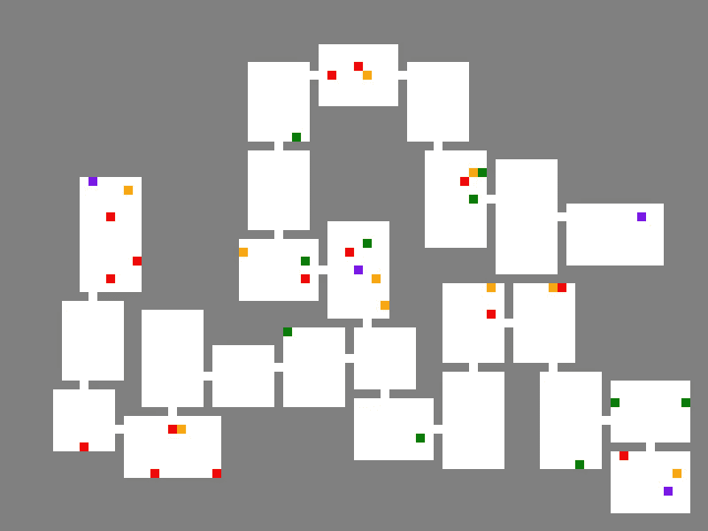

A Phase 2 level.

祝贺您，您已经完成了本教程！您可以将您的代码与`phase-2-solution`中的`sequence.js`文件进行比较，该文件也可以作为[要点](https://gist.github.com/nevkatz/a9dd070238fd0d531dc7337000605487)获得。你也可以把你的游戏比作这个[演示](https://roguelike-relics.netlify.app/phase-2-solution/index.html)。

## 建议的后续步骤

*   添加其他类型的收藏品，如开门的钥匙。
*   考虑让敌人移动。
*   设定每一关的最小遗迹数量。

我希望你喜欢这个教程。有关这里使用的房间顺序逻辑的更多背景信息，请查看下面的文章。

[](/arranging-adjacent-rooms-in-a-javascript-roguelike-a5c178772d31) [## 用 JavaScript Roguelike 构建一系列房间

### 让我们用相邻房间的序列来生成地牢等级。

javascript.plainenglish.io](/arranging-adjacent-rooms-in-a-javascript-roguelike-a5c178772d31) 

*更多内容看* [***说白了就是 io***](https://plainenglish.io/) *。报名参加我们的* [***免费周报***](http://newsletter.plainenglish.io/) *。关注我们关于*[***Twitter***](https://twitter.com/inPlainEngHQ)*和*[***LinkedIn***](https://www.linkedin.com/company/inplainenglish/)*。查看我们的* [***社区不和谐***](https://discord.gg/GtDtUAvyhW) *加入我们的* [***人才集体***](https://inplainenglish.pallet.com/talent/welcome) *。考虑* [***加入介质***](https://medium.com/@nevkatz/membership) *。*