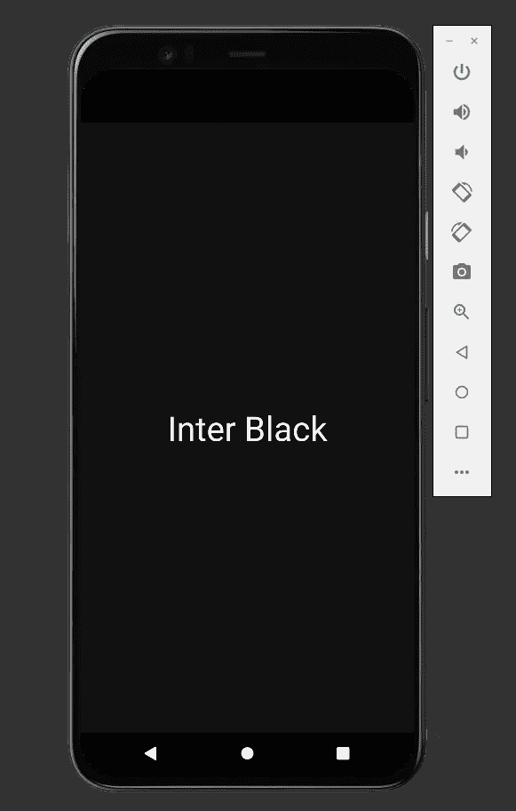
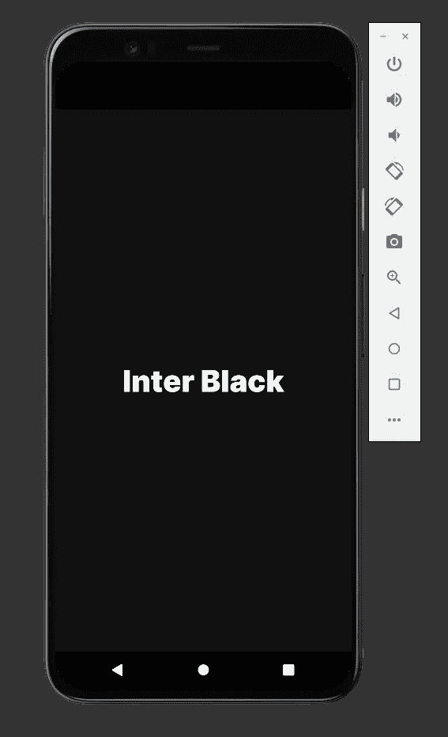
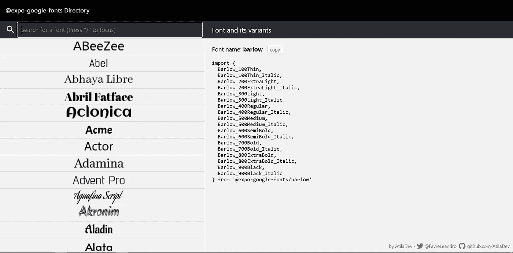

# 如何以最简单的方式在 React Native 中添加自定义字体

> 原文：<https://javascript.plainenglish.io/how-to-add-custom-fonts-in-react-native-the-easy-way-d5986d700f52?source=collection_archive---------1----------------------->

## 反应自然

## 如何使用 Expo-Google-Fonts 在 React Native 中加载字体


Photo by [Tran Mau Tri Tam](https://unsplash.com/@tranmautritam?utm_source=medium&utm_medium=referral) on [Unsplash](https://unsplash.com?utm_source=medium&utm_medium=referral)

字体设计可以成就你的应用，也可以毁掉它。虽然使用默认的无衬线字体没有问题。有时我们需要选择一种更好地反映我们应用程序的字体。

本文将向您展示如何使用`[Expo-Google-Fonts](https://github.com/expo/google-fonts)`库将自定义字体导入 react native。

# 添加样板代码

第一步是向我们的应用程序添加一些样板文件。将以下代码添加到您的应用程序中。

App Boilerplate

您应该会看到下面的屏幕:



What you should see in your app

如果现在看起来很基础也不用担心。一旦我们添加了自定义字体，它会看起来更好！

# 将 expo-google-font 添加到我们的项目

既然我们已经设置好了样板文件，是时候将`[Expo-Google-Fonts](https://github.com/expo/google-fonts)` 和`[expo-fon](https://docs.expo.dev/versions/latest/sdk/font/)t`添加到我们的应用程序中了。第一步是使用 expo 来安装库

```
expo install @expo-google-fonts/inter expo-font
```

之后，将以下导入语句添加到应用程序的顶部

```
import { useFonts, Inter_900Black} from '@expo-google-fonts/inter';
```

**Inter_900Black** 是我们将使用的字体，而 **useFont** 钩子将把我们的字体加载到我们的应用程序中。

# 正在加载我们的字体

下一步是使用 useFont 钩子将我们的字体加载到我们的应用程序中。之后，我们将文本样式的字体系列设置为 **Inter_900Black。**

这方面的代码如下:

Using the useFont hook to load Inter_900Black google font

# 添加应用程序

字体很可能没有改变，或者即使改变了，也不是您期望的字体。原因是我们的应用程序在字体加载之前加载了。为了解决这个问题，我们必须使用 react-native 提供的`[AppLoading](https://docs.expo.dev/versions/latest/sdk/app-loading/)` 组件来保持闪屏可见，直到我们的字体被加载。

## 导入应用程序组件

在我们使用`[AppLoading](https://docs.expo.dev/versions/latest/sdk/app-loading/)`组件之前，我们首先必须将它添加到我们的项目中。在终端中运行以下代码来安装组件:

```
expo install expo-app-loading
```

然后在应用程序顶部导入它:

```
import AppLoading from 'expo-app-loading'
```

## 使用应用程序加载组件

要使用 AppLoading，我们必须在我们的应用程序中进行一些[条件渲染](/how-to-implement-conditional-rendering-in-react-and-react-native-the-right-way-f00e2fa7a730)。

在我们的字体加载之前，我们将显示`[AppLoading](https://docs.expo.dev/versions/latest/sdk/app-loading/)`组件。但是，一旦字体被成功加载，我们将显示我们的主要内容。

这方面的代码如下:

Adding AppLoading to our App

现在，您应该会在应用程序中看到以下屏幕:



Completed Screen

# 选择不同的字体

文章到此结束，但还有一件事我需要提一下。如果您计划使用不同的字体，那么 **InterBlack** `[Expo-Google-Fonts](https://github.com/expo/google-fonts)`有一个目录，其中包含所有列出的字体所需的导入语句[这里](https://directory.vercel.app/)。

每种字体都有自己的导入语句和库，所以安装正确的字体很重要！

## 安装演员字体

例如，如果您想使用 Actor 字体，您可以安装以下软件包:

```
expo install @expo-google-fonts/actor
```

并使用以下导入语句:

```
import {    Actor_400Regular  } from '@expo-google-fonts/actor'
```

## 安装巴洛字体

但是，如果您想使用巴洛字体，您需要安装一个不同的软件包:

```
expo install @expo-google-fonts/barlow
```

并使用以下导入语句:

```
import {      Barlow_500Medium,Barlow_900Black,} from'@expo-google-fonts/barlow'
```



Expo Google Font import Directory Screenshot

# 结论

感谢您阅读完我的文章**“如何在 React Native 中轻松添加自定义字体”**。如果你有任何问题，请随意提问，我会尽快回答。

我希望你有美好的一天。如果你是新手，你可以点击这里的链接[加入。](https://bookeraziz.medium.com/membership)

## 资源

1.  [世博谷歌字体](https://github.com/expo/google-fonts)

2.[世博谷歌字体(字体目录)](https://directory.vercel.app/)

*更多内容请看* [***说白了就是***](http://plainenglish.io/) *。报名参加我们的* [***免费每周简讯***](http://newsletter.plainenglish.io/) *。在我们的* [***社区不和谐***](https://discord.gg/GtDtUAvyhW) *获得独家获取写作机会和建议。*