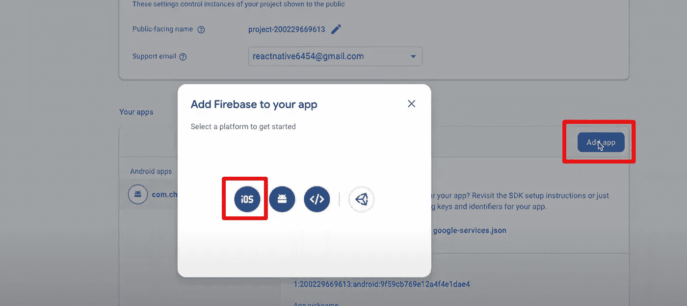
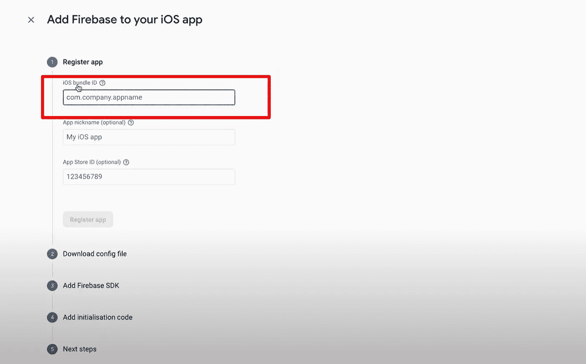
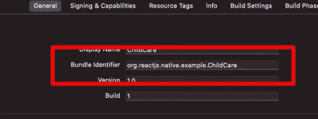
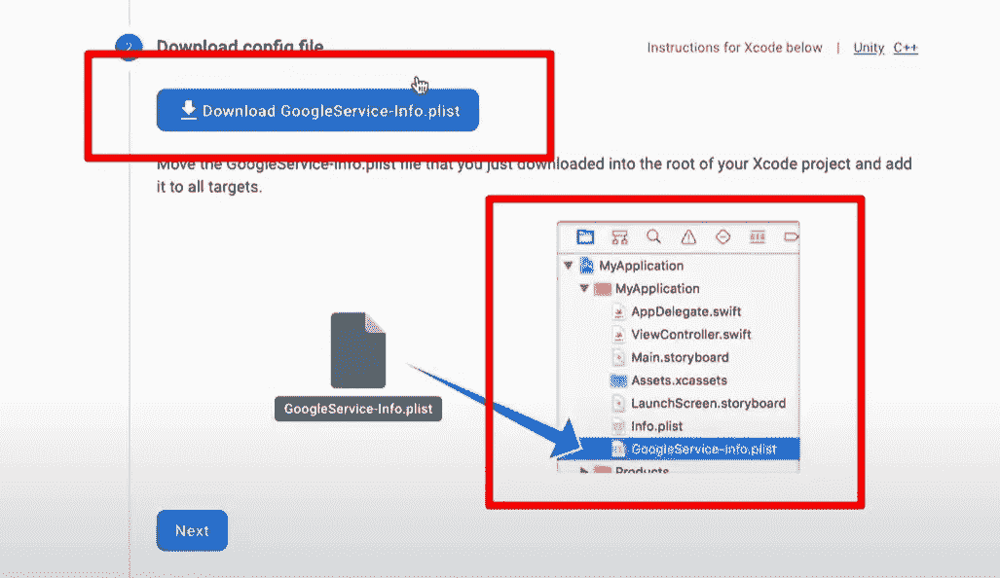
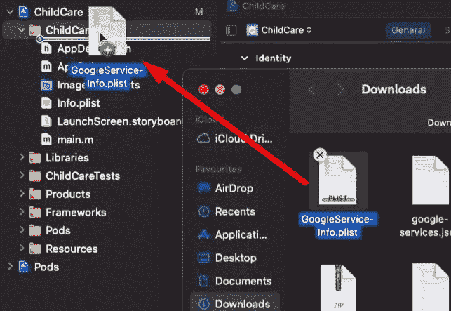
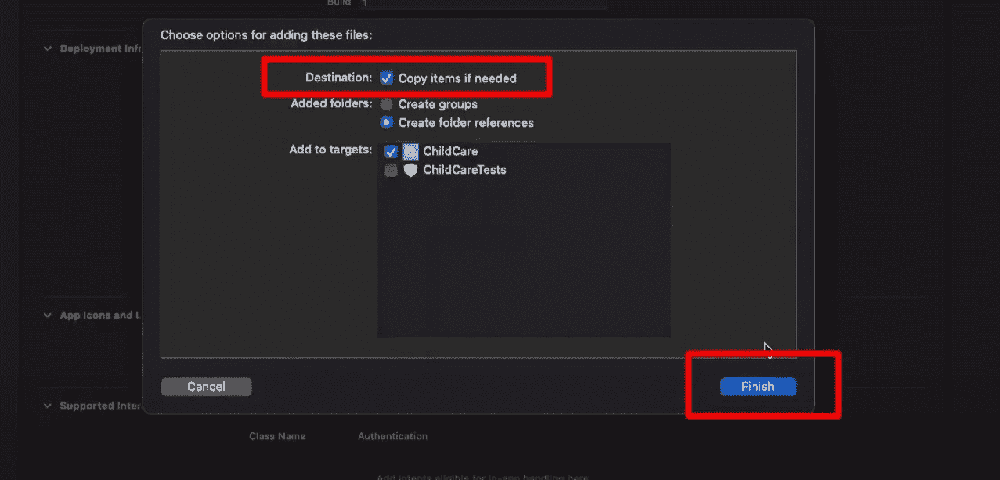
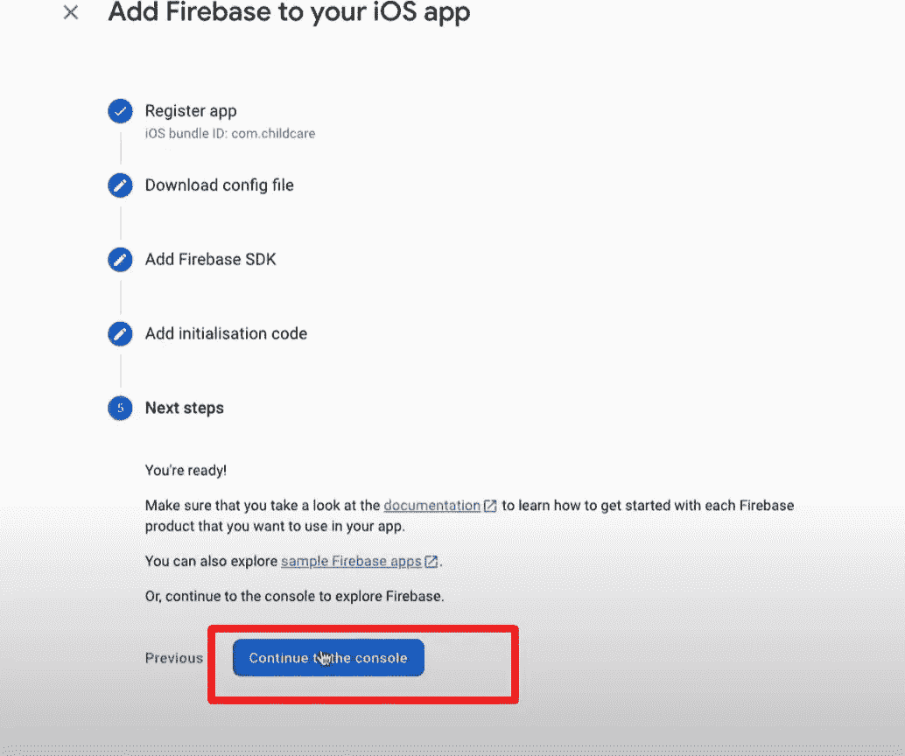
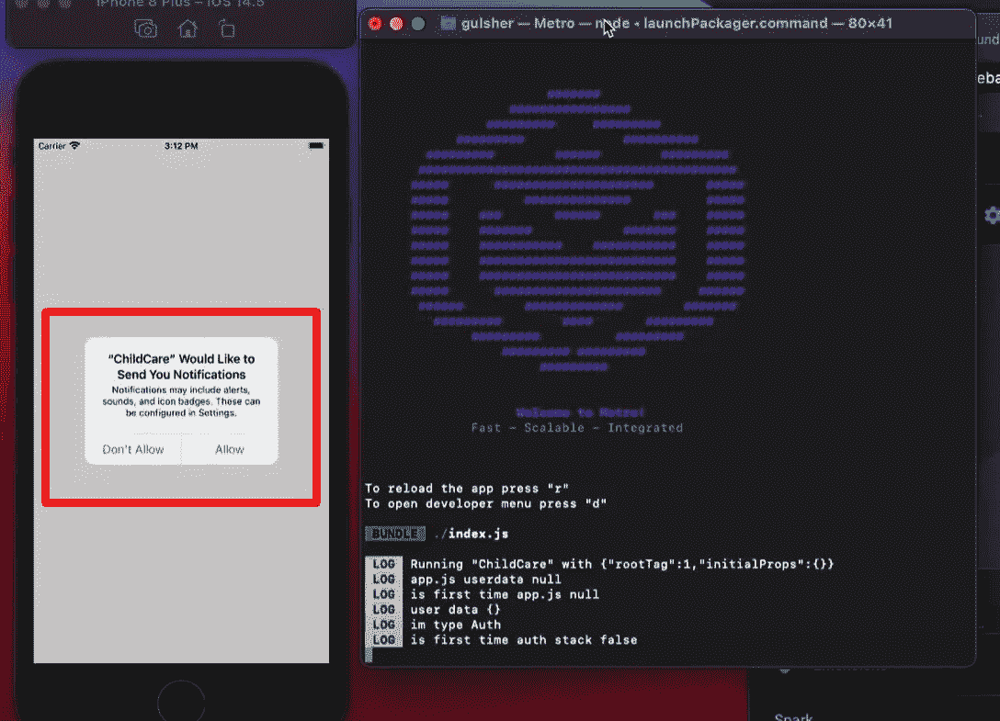

# 如何将 Firebase 推送通知添加到 iOS 版 React 原生应用中

> 原文：<https://javascript.plainenglish.io/how-to-add-firebase-push-notifications-on-your-react-native-app-for-ios-369806ea8c04?source=collection_archive---------3----------------------->


React 原生应用的主要功能之一是 Firebase 推送通知，这将增加与最终用户的互动，并向他们更新您添加到应用中的最新功能。

今天，我将向您展示如何将 Firebase 通知功能添加到 iOS 版 React 原生应用程序中。所以让我们开始吧。

首先，让我们处理好软件包并下载它们。

```
**//download the packages that are needed**
yarn add @react-native-firebase/app
npm i @react-native-firebase/app
------------------------------------
yarn add @react-native-firebase/messaging
npm i @react-native-firebase/messaging
```

现在创建一个名为**的文件 pushNotificationManager.ts**

```
**//pushNotificationManager.ts**import messaging from ‘@react-native-firebase/messaging’;
import AsyncStorage from ‘@react-native-async-storage/async-storage’;export const requestUserPermission = async () => {
const authStatus = await messaging().requestPermission();
const enabled =
authStatus === messaging.AuthorizationStatus.AUTHORIZED ||
authStatus === messaging.AuthorizationStatus.PROVISIONAL;if (enabled) {
console.log(authStatus) **// you can remove the console.log later**
GetFCMToken();
}};const GetFCMToken = async () => {
let fcmtoken = AsyncStorage.getItem(‘fcmtoken’);
if (!fcmtoken) {
try {
let fcmtoken = await messaging().getToken();
if (fcmtoken) {
await AsyncStorage.setItem(‘fcmtoken’, fcmtoken);
}} 
catch (error) {console.log(error)}}};export const NotificationListener = () => {
messaging().onNotificationOpenedApp(remoteMessage => {
console.log(
‘Notification caused app to open from background state:’,
remoteMessage.notification,
);
});messaging().getInitialNotification().then(remoteMessage => {
if (remoteMessage) {
console.log(
‘Notification caused app to open from quit state:’,
remoteMessage.notification,
);
}});
messaging().onMessage(async remotemessage => {
console.log(‘remote message’, JSON.stringify(remotemessage));});messaging().onNotificationOpenedApp(remotemessage => {
console.log(‘remote message’, JSON.stringify(remotemessage));
});};
```

在我们创建了我们的**pushnotificationmanager . ts**文件之后，我们需要在 **App.tsx** 和 **index.js** 上添加几行代码。所以我们来补充一下。

```
***App.tsx*** *//import the function that you create on pushnotificationHelper.ts file* import { NotificationListener, requestUserPermission } from './src/utils/pushnotificationHelper'; export default function App() {//below what you need to add
**useEffect(() => {
requestUserPermission()
NotificationListener()
}, [])**return ()}
```

```
**//index.js file** //you just need to add highlighted code down belowimport { AppRegistry } from ‘react-native’;import App from ‘./App’;import { name as appName } from ‘./app.json’;**import messaging from ‘@react-native-firebase/messaging’;****messaging().setBackgroundMessageHandler(async remoteMessage => {****console.log(‘Message handled in the background!’, remoteMessage);****});**AppRegistry.registerComponent(appName, () => App);
```

我们完成了代码的添加。现在让我们去完成 Firebase 的工作。

**第一步:**进入 Firebase，在项目设置上，你需要添加一个新的 iOS app。在下图中，你可以找到如何添加新的应用程序。



**第二步**:你需要正确添加 iOS 捆绑包名称，这真的很重要。



您可以找到包 Id。如果你点击 XCode 上的项目文件，弹出的屏幕会显示捆绑包 Id。你可以在下图中学习如何找到它。



成功添加捆绑包 Id 后，只需在同一屏幕上单击下一步。

**第三步**:现在你已经准备好下载 Firebase 将为你创建的 **google.json** 文件了。下载后，只需将文件放在项目的根目录下。



在我们正确地添加了 google.json 文件之后，只需返回 Firebase 控制台并完成注册即可。



我们差不多完成了，只剩下一步了。因此，让我们在 AppDelegate.m 文件中添加几行代码。要允许 Firebase on iOS 使用凭据，必须在应用程序的引导阶段配置 Firebase iOS SDK。

为此，打开您的`/ios/{projectName}/AppDelegate.m`文件，并添加以下内容:

在文件的顶部，导入 Firebase SDK:

```
#import <Firebase.h>
```

在您现有的`didFinishLaunchingWithOptions`方法中，将以下内容添加到该方法的顶部:

```
- (BOOL)application:(UIApplication *)application didFinishLaunchingWithOptions:(NSDictionary *)launchOptions {
 *//Add only the code below here*
  **[FIRApp configure];**
 // ...
}
```

为此，我们需要自动链接并重新构建我们的项目，只需在您的终端中运行命令，您就可以使用 Firebase 推送通知了。

```
cd ios/
pod install --repo-update
cd ..
npx react-native run-ios
```



如果你有一个模拟器，它显示上述内容，这意味着你做的一切都是正确的。恭喜你！你做到了。:)

希望这对你有帮助。如果是这样的话，给我一个 follow 之类的。:)

我的 LinkedIn:[AKIN Kara yun | LinkedIn](https://www.linkedin.com/in/akin-karayun-ab3239bb/)

[阿金·卡拉云](https://devakinkarayun.web.app/)

*更多内容请看*[***plain English . io***](https://plainenglish.io/)*。报名参加我们的* [***免费周报***](http://newsletter.plainenglish.io/) *。关注我们关于*[***Twitter***](https://twitter.com/inPlainEngHQ)[***LinkedIn***](https://www.linkedin.com/company/inplainenglish/)*[***YouTube***](https://www.youtube.com/channel/UCtipWUghju290NWcn8jhyAw)*[***不和***](https://discord.gg/GtDtUAvyhW) *。***