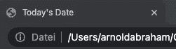
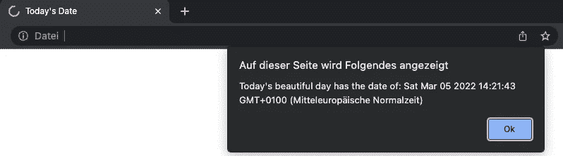
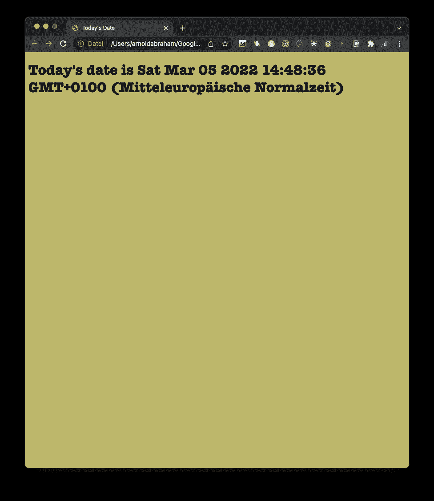

# 编码初学者如何在 HTML 中添加 JavaScript

> 原文：<https://javascript.plainenglish.io/how-to-add-javascript-to-html-for-coding-beginners-19e85a999e63?source=collection_archive---------17----------------------->

## 使网页具有交互性并构建 web 应用程序


Combination of JavaScript, HTML & CSS Made by Author via Canva

[JavaScript](/5-hugely-beneficial-javascript-essentials-to-pass-your-interview-655540ffc1d1) (JS)是一种用于 web 开发的编程语言。

作为 web 的核心技术之一，它与 HTML 和 CSS 一起用于创建交互式网页和 web 应用程序。遵循通用渲染标准的现代 web 浏览器通过内置引擎支持 JavaScript，无需额外的插件。

处理 web 文件时，JavaScript 必须与 HTML 标记一起加载和执行。在页面上运行 JS 有两种方式:

1.  在 HTML 文档中嵌入 JS
2.  将您的 JS 代码放在一个单独的文件中，浏览器将随 HTML 文档一起下载该文件。

在本教程中，您将发现如何在 web 文件中包含 JavaScript，既可以嵌入 HTML 文档中，也可以作为单独的文件。

# 1.向 HTML 文档中添加 JavaScript

您可以使用包装 JavaScript 代码的唯一 HTML `<script>`标签将 JavaScript 代码添加到 HTML 文档中。

`<script>`标签可以放在 HTML 的`<head>`部分或`<body>`部分，这取决于您希望 JavaScript 何时加载。

通常，JavaScript 代码可以放在文档的`<head>`部分，使其包含在 HTML 文档的主要内容之外。

> 建议:把它放在文档的末尾。一旦代码开始运行，您就想让您的 HTML 完全加载。

## JavaScript 警报示例

考虑下面的空白 HTML 文档，其标题在浏览器中显示为今天的日期:



Browser Tab of blank.html

目前，这个文件只包含 [HTML 标记](/8-memorable-html-secrets-that-let-you-turn-tables-at-your-job-interview-f405743e2c0e)。让我们将以下 JavaScript 代码添加到文档中:

这将使网页显示一个带有当前日期的警告，而不管用户何时加载该站点。

您需要在 HTML 文件中添加一个`<script>`标签和一些 JavaScript 代码来完成这个任务。

首先，您将在`<head>`标记之间添加 JavaScript 代码，通知浏览器在加载页面的其余部分之前运行 JavaScript 脚本。

例如，只需将其添加到`<title>`标签下，如下所示:

加载页面后，您将收到类似以下内容的警告:



如果您想将显示更改为 [HTML](/8-memorable-html-secrets-that-let-you-turn-tables-at-your-job-interview-f405743e2c0e) 的主体，您需要在`<head>`选项卡之后应用它，以便它显示在页面上，如下例所示:

通过 web 浏览器加载的上述 HTML 文档的输出如下所示:


# 将 JavaScript 分离到外部文件中的原因

小脚本或者只在一个页面上运行的脚本可以在 HTML 文件中很好地工作。

但是对于较大的脚本或者将在许多页面上使用的脚本，这不是一个实用的解决方案，因为包含会变得很麻烦或者难以阅读和理解。

在下一节中，我们将在 HTML 文档中使用一个单独的 JavaScript 文件。

# 2.使用单独的 JavaScript 文件

JavaScript 代码通常保存在 HTML 文档中引用的一个或多个 js 文件中。

以适应更大的脚本或跨多个页面使用的脚本，类似于 CSS 等外部资源的引用方式。

使用单独的 JavaScript 文件的优点包括:

*   将 HTML 标记和 JavaScript 代码分开，使它们更容易使用
*   单独的文件使维护更容易
*   当 JavaScript 文件被缓存时，页面加载更快

[为了演示如何将 JavaScript 文档链接到 HTML 文档，让我们创建一个小的 web 项目](/5-hugely-beneficial-javascript-essentials-to-pass-your-interview-655540ffc1d1)。它将由 js/目录中的 main.js、CSS/目录中的 style.css 和项目根目录中的基本 index.html 组成。

```
project/
├── css/
|   └── style.css
├── js/
|   └── main.js
└── index.html
```

您可以从上一节中的 HTML 模板开始:

现在让我们将您的 JavaScript 代码移动到 script.js 文件中，该代码将日期显示为一个`<h1>`头:

要引用这个文件，您需要向`<body>`部分添加一个`<script>`标记，代码如下:

`<script>`标签指向我们 web 项目的 js/目录中的 script.js 文件。

让我们在 HTML 文件的上下文中查看这一行，在本例中是在`<body>`部分中:


Result of Index.html With Referenced JavaScript File

最后，通过向`<h1>`标题添加背景颜色和样式来编辑`style.css`文件:

由于这也是一个外部文件，您需要在我们 HTML 文档的`<head>`部分中引用[CSS](/10-exclusive-css-facts-you-should-know-to-confidently-land-a-junior-developer-job-33581198375b)文件:

现在 JavaScript 和 CSS 已经准备好了，您可以在您选择的 web 浏览器中加载 index.html 页面。您应该会看到如下所示的页面:



Result of Index.html After Referencing style.css & main.js

# 结论

本教程讲述了如何在 web 文件中包含 JavaScript，无论是嵌入在 HTML 文档中还是作为单独的。js 文件。

从这里，您可以学习如何使用 JavaScript 开发人员控制台，以及如何用 JavaScript 编写注释。

获取网站开发者备忘单，只研究你第一份工作真正需要的东西！


[26 Web Dev Cheats Anyone Should Have To Land A Job](https://arnoldcodeacademy.ck.page/26-web-dev-cheat-sheets)

*更多内容看* [***说白了。报名参加我们的***](https://plainenglish.io/) **[***免费周报***](http://newsletter.plainenglish.io/) *。关注我们关于*[***Twitter***](https://twitter.com/inPlainEngHQ)*和*[***LinkedIn***](https://www.linkedin.com/company/inplainenglish/)*。加入我们的* [***社区***](https://discord.gg/GtDtUAvyhW) *。***