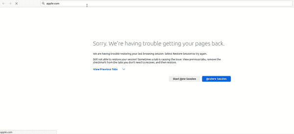
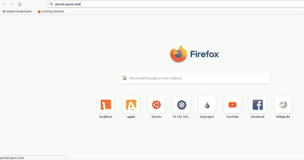
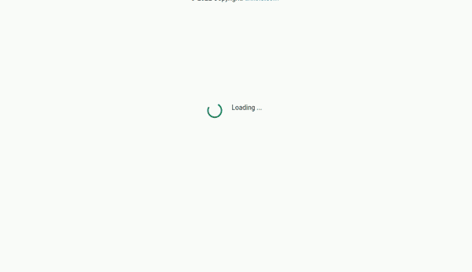

# 如何将加载器或进度条添加到 Angular 应用程序中

> 原文：<https://javascript.plainenglish.io/how-to-add-loaders-or-progress-bars-to-your-angular-application-74707394126f?source=collection_archive---------3----------------------->

## 当您的 Angular 应用程序正在处理某些东西时，向用户显示加载器、进度条或微调器。

Photo by David Bartus

本指南将向您展示如何在 Angular 应用程序中创建和开始使用加载器或旋转器，以获得更好的用户体验。

## 为什么要显示加载进度？

从设计的角度来看，为了获得流畅的用户体验，应用程序在处理或等待某个操作完成时向用户提供反馈是非常重要的。

例如，当您的主页第一次加载时，可能需要一些时间，这取决于用户的互联网速度，当然，也取决于您的应用程序有多大。您可以显示一个简单的加载器，而不是仅仅显示一个空白页面，您的应用程序用户将会知道页面加载正在进行中。

下面是在模拟的慢速 3G 网络上，在没有加载器或进度反馈的情况下，[苹果页面](http://apple.com)的加载示例。

这里是 [Azure portal](http://portal.azure.com) 页面在慢速网络上的加载，有一个加载器或旋转器。

如果你像大多数网络用户一样是住院病人，你会认为苹果网站不起作用。

## 进度加载工具

根据您的设计和其他需求，您可以在应用程序中显示或使用不同种类的加载器、微调器或进度条。

大多数组件库，如 Bootstrap、Angular material、Ignite UI for Angular 等，也提供微调器或进度条供您在应用程序中使用。你也可以使用**。gif** 图片，如果你愿意。

## 创建简单的加载程序

为了使本指南简单并迎合所有读者，不管您使用的是什么组件框架，我将用文本显示加载进度。

您可以轻松地用您选择的任何加载器、微调器或进度条替换加载文本。

我们将展示组件从 web API 获取数据时的加载文本。

假设您有一个名为 **user.service.ts** 的简单服务，它从 API 获取用户数据，您的服务可能如下所示。

在您的 **users.components.ts** 文件中，您使用上面的**用户服务**通过在 ngOnInit 方法中订阅 **getUsers** 来获取用户。此外，您还创建了一个 **isLoading** 布尔变量并将其设置为 false。

当你的页面初始化时，也就是在 ngOnInit 方法中，你将 **isLoading** 变量设置为 true，当它完成获取数据或出现错误时，将它设置为 false。

## 运行中的装载机或旋转器

最后，在你的模板中，当订阅正在进行时，即当 **isLoading** 变量为真时，显示加载文本。否则，您将显示用户详细信息。

下面是运行中的加载器，请注意，我在下图中添加了一个引导旋转器。

## 最后的想法

本指南向您展示了如何将简单的加载器或旋转器添加到角度应用程序中。

当您的应用程序正在处理某些事情时，向您的用户提供适当的反馈是一个重要的设计考虑因素。

*更多内容请看*[***plain English . io***](https://plainenglish.io/)*。报名参加我们的* [***免费周报***](http://newsletter.plainenglish.io/) *。关注我们关于*[***Twitter***](https://twitter.com/inPlainEngHQ)*和*[***LinkedIn***](https://www.linkedin.com/company/inplainenglish/)*。加入我们的* [***社区不和谐***](https://discord.gg/GtDtUAvyhW) *。*