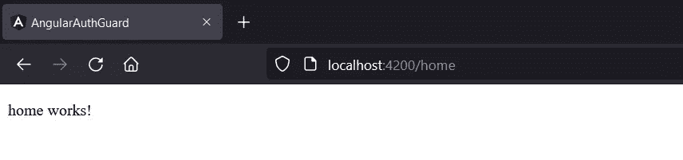
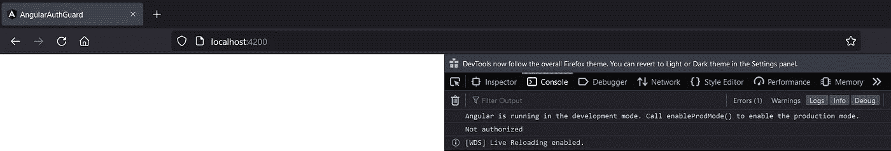
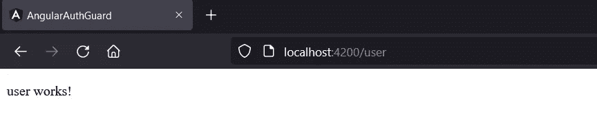

# 如何为角度应用添加路由保护

> 原文：<https://javascript.plainenglish.io/how-to-add-route-guard-for-angular-applications-309f3b0ca845?source=collection_archive---------6----------------------->


Photo by [Markus Winkler](https://unsplash.com/@markuswinkler?utm_source=unsplash&utm_medium=referral&utm_content=creditCopyText) on [Unsplash](https://unsplash.com/s/photos/protect?utm_source=unsplash&utm_medium=referral&utm_content=creditCopyText)

在 angular 应用程序中，有时您可能需要将某些页面/路径限制给用户。例如，可能有一个只能由登录用户访问的页面。因此，如果我们能够阻止用户在没有登录系统的情况下进入这个页面，那就太好了。这种功能可以通过路由保护来实现。

angular 提供了几种路由器防护装置，每一种都有不同的用途。在这里，我们将重点关注路由器防护最常见的使用案例，即使用 **canActivate** route guard 阻止某些用户访问应用程序的特定路由。

让我们开始旅程吧。

1.  使用以下命令创建一个新的角度项目。

```
***ng new <projectName>***
```

2.让我们添加两个组件来比较有和没有路由器防护的变化。执行以下命令。

```
***ng g c home
ng g c user***
```

主页是公开的，而用户页面只允许登录的用户使用。

3.创建服务。这就是验证用户的逻辑所在。使用以下命令创建服务。你可以给任何你想要的名字。

```
***ng g s auth***
```

4.让我们创建路由器防护。下面的命令可以做到这一点。它会问你想用什么路由器保护。选择激活。

```
***ng g g auth***
```

然后，您将能够将下面的 TS 文件命名为 auth.guard.ts。

auth.guard.ts

5.接下来，让我们向 auth-service 添加一个简单的逻辑。

auth.service.ts

这只是一个非常简单的代码，只有一个布尔变量。但这是您可以编写实际逻辑来检查用户是否经过身份验证的地方。

6.现在我们可以在 canActivate 内部检查这个。

auth.guard.ts

授权服务已被注入到授权保护中。如果用户已登录，则 canActivate 返回 true，否则返回 false。我为未授权的标准添加了 console.log()。

6.最后，我们必须为我们的路由添加 auth-guard。

如开头所述，/home 路由是公共的，/user 路由是受限的。所以我们要做的就是为上面定义的路线添加***can activate:[auth guard]***。就是这样！

让我们验证一下这是否有效。我已经删除了 app.component.html 的所有 HTML，除了***<router-outlet></router-outlet>***以便于可视化结果。

执行以下命令来运行项目。

```
ng serve
```

把[http://localhost:4200/home](http://localhost:4200/home)放到浏览器上。我们可以看到以下内容。



home page

现在检查一下[http://localhost:4200/u](http://localhost:4200/home)ser。我们将得到下面的输出。



因此，它不允许我们进入用户页面。它也在控制台中显示“未授权”。按预期工作。

现在将 auth-service 中的 ***loggedIn*** 变量改为 ***true*** 。现在它应该允许访问用户页面。



user page

是的，有效！。

请注意，不建议这样做来增加我们应用程序的安全性。这种安全性必须在服务器端实现。这对于改善用户在这类事情上的体验很有帮助。

您可以在这里找到工作示例。

[](https://github.com/Kanchana46/angular-auth-guard.git) [## GitHub-kanchana 46/angular-auth-guard

### 此项目是使用 Angular CLI 版本 8.3.19 生成的。为开发服务器运行 ng serve。导航到…

github.com](https://github.com/Kanchana46/angular-auth-guard.git) 

编码快乐！

*更多内容看* [***说白了. io***](http://plainenglish.io/) ***。*** *报名参加我们的* [***免费每周简讯***](http://newsletter.plainenglish.io/) ***。*** *在我们的**[***社区不和谐***](https://discord.gg/GtDtUAvyhW) ***中获得独家写作机会和建议。****