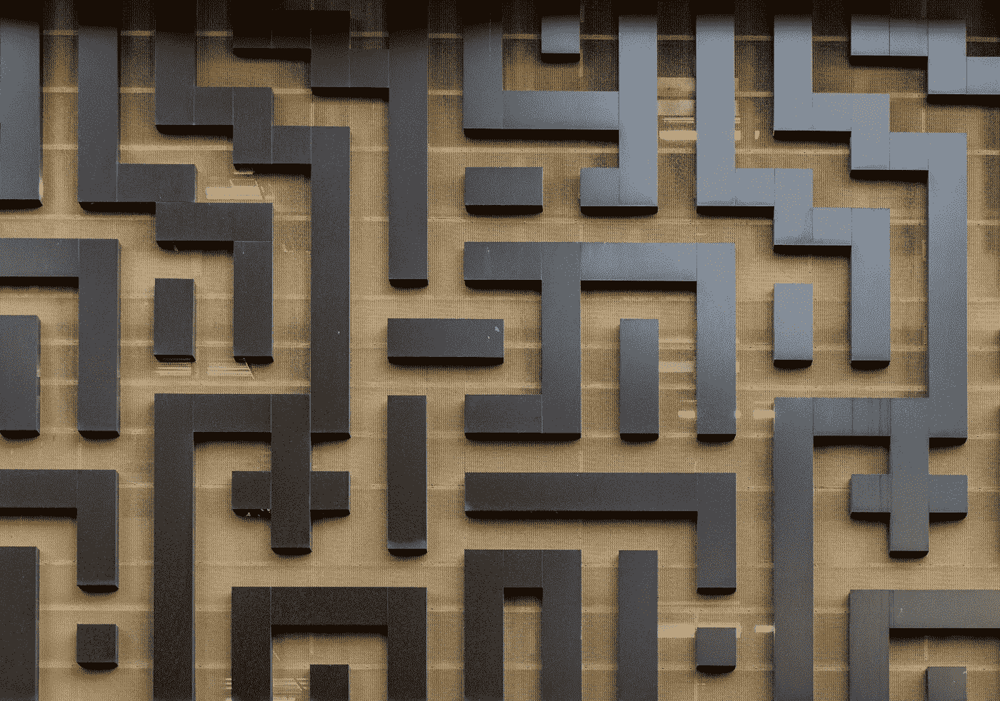
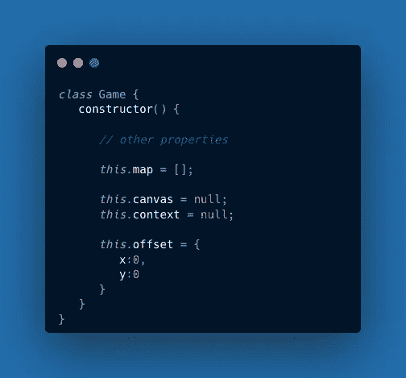
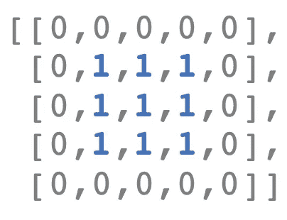
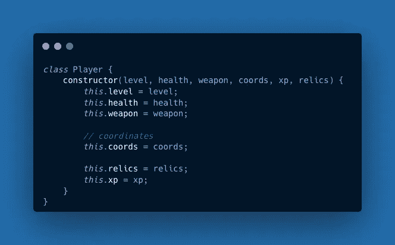
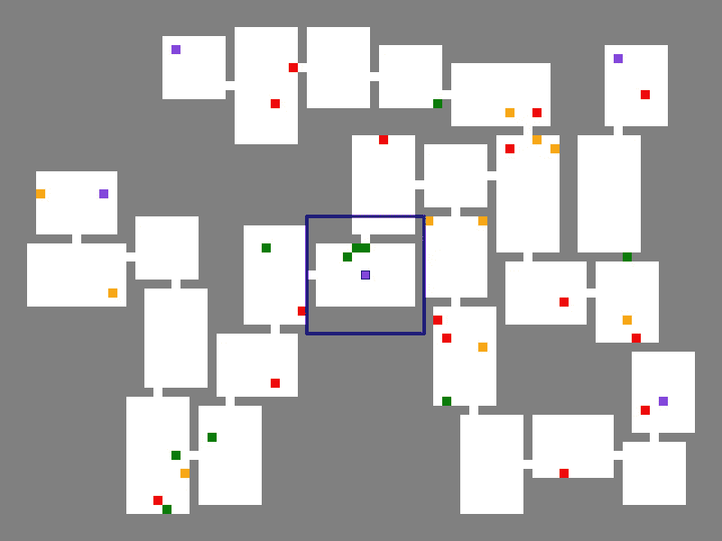

# 如何制作一个 JavaScript Roguelike 卷轴

> 原文：<https://javascript.plainenglish.io/how-to-add-scrolling-to-a-javascript-roguelike-c9f835d10537?source=collection_archive---------14----------------------->



Photo by [Mitchell Luo](https://unsplash.com/@mitchel3uo?utm_source=unsplash&utm_medium=referral&utm_content=creditCopyText) on [Unsplash](https://unsplash.com/s/photos/maze?utm_source=unsplash&utm_medium=referral&utm_content=creditCopyText)

当你不知道拐角处有什么的时候，地牢会更有趣。在本教程中，我们将为一种叫做 *roguelike* 的游戏添加滚动，这种游戏有机器生成的关卡。下面是[初始游戏](https://gregarious-paletas-7a58d5.netlify.app/project/index.html)的一个动画，展示了完整的地下城地图。

The initial game without scrolling

下面是一张[成品版](https://gregarious-paletas-7a58d5.netlify.app/phase-3-solution/index.html)的动画，带有一个滚动的小显示屏。

The finished solution with scrolling.

我们将分三个阶段添加我们的滚动逻辑。

*   1)让游戏一直滚动。
*   2)只有当玩家离中心足够远时，才使游戏滚动。
*   3)让游戏只显示部分地图。

# 入门指南

要构建这个特性，请从 [Github](https://github.com/nevkatz/js-roguelike-scroll) 下载[项目压缩文件](https://github.com/nevkatz/js-roguelike-scroll/archive/refs/heads/main.zip)。在解压之后，您会发现一个`project`目录和每个阶段的解决方案目录。

```
js-roguelike-scroll
  |
  *--project
  |
  *--phase-1-solution
  |
  *--phase-2-solution
  |
  *--phase-3-solution
  |
  *--challenge-solution
  |
  *--js
  |
  *--css
```

`css`和`js`目录下有所有游戏版本使用的文件，比如`game.js`。

在`project`目录中有一个显示游戏的`index.html`和一个用于工作的`script.js`文件。

```
project
  |
  *--index.html
  |
  *--script.js
```

让我们看看与新的滚动特性相关的两个类:`game`类和`player`类。

## 游戏课

从`game.js`中的[游戏类](https://gist.github.com/nevkatz/9329f6f243effbd801a21d5d661920bb#file-roguelike-game-with-offset-js)创建的全局对象存储游戏的属性——包括用于滚动的`offset`属性。`canvas`属性引用了`<canvas>`元素，而`context`存储了一组绘图方法。



A partial depiction of the game class.

游戏的`map`属性将地牢地图存储在一个 2D 数组中。如果一个 3x3 的房间位于一个 5x5 地图的中心，那么`map`阵列将类似于下图。



A simple 2D map array.

## 玩家阶层

`script.js`中的[播放器类](https://gist.github.com/nevkatz/7058f2903e955e79a29b2a5a96b7dfcd#file-roguelike-player-with-relics-js)用于创建一个`player`对象。一个`coords`属性存储了决定玩家位置的`x`和`y`坐标。



The player class

现在我们已经复习了这些课程，让我们开始第一阶段。随着您的进展，您可以检查每个已完成阶段的[演示](https://roguelike-scroll.netlify.app/)。

# 阶段 1:一直滚动

我们的工作将在`project`目录的`script.js`中进行。让我们先来看看玩家移动是如何工作的，并添加一些基本的滚动。

## 开始游戏

在`script,js`中，`init`函数准备好了`<canvas>`元素并添加了一个键盘监听器。侦听器被绑定到一个名为`checkDirection`的事件处理程序。

The init function

## 移动玩家

在`checkDirection`开始时，我们将玩家的坐标存储在两个`x`和`y`变量中。

```
function checkDirection(e) { e.preventDefault(); **let {x, y} = player.coords;**
```

然后，使用下面的`switch`块，我们根据按下的键的代码调整`x`或`y`变量。

Basic switch statement.

如果玩家最终移动，它的`coords`属性会根据这些`x`和`y`坐标进行更新。

## 添加滚动行为

好了，我们开始工作吧。为了支持滚动，让我们在玩家每次移动时更改游戏的`offset`属性。在`checkDirection`中，初始化`x`和`y`后，我们将声明一个临时的`offset`变量。

The start to checkDirection with the offset variable added.

在我们的`switch`语句中，我们将在每种情况下调整`offset`,这样游戏地图就会向玩家移动的相反方向移动。

在`switch`块下面，让我们添加两行，如果玩家移动，它们将调整游戏的`offset`。

Adding offset logic

## 绘制地图

一个名为`movePlayer`的函数处理碰撞和玩家移动。在`movePlayer`结束时，一个名为`drawMap`的函数只重新渲染玩家磁贴及其周围的 48。


The end of movePlayer.

因为游戏现在滚动了，所以让我们换一个`drawMap`调用来重绘地图上的每一个方块。

```
// drawMap(left, top, right, bot);**drawMap(0, 0, COLS, ROWS);**
```

现在，当玩家移动时，地图应该完全重新渲染。

为了渲染滚动效果，我们需要改变地图的绘制方式。当`drawMap`被调用时，它使用一个嵌套循环来遍历瓦片。

The drawMap function.

你可以在上面看到，每次重新渲染一个图块，都会调用`drawObject`，在`<canvas>`元素上绘制一个图块。

The drawObject function.

让我们调整`drawObject`,以便在绘制每个图块时考虑游戏对象的`offset`。

Our object drawing function with offset logic added.

此时，您应该已经有了基本的滚动功能。请随意将其与[第一阶段解决方案](https://roguelike-scroll.netlify.app/phase-1-solution/index.html)和下面的动画进行比较。

Solution 1 with basic scrolling.

# 阶段 2:条件滚动

通常没有必要让游戏一直滚动，所以让它只在玩家离画布中心足够远的时候滚动。换句话说，如果玩家正在触摸下面蓝框代表的区域的边界，游戏就会滚动；否则玩家移动，地图保持不动。



在`script.js`的顶部，让我们添加一个名为`CENTER_BOX`的常量，它将指定这个盒子的尺寸。

```
const CENTER_BOX = {
    x: 12,
    y: 12
}
```

我们需要知道玩家相对于地图上显示部分的假想方块的位置。所以回到`checkDirection`，让我们添加一个名为`absPos`的新 temp 对象，它捕获玩家在`<canvas>`元素上的绝对位置。

```
let {x, y} = player.coords;let offset = {
    x: 0,
    y: 0
};**let absPos = {
     x: x + game.offset.x,
     y: y + game.offset.y
};**
```

在向左移动的情况下，让我们将中心框的左边缘存储在一个`leftBounds`常量中。

```
case 37:
  x--;
 **const leftBounds = (COLS - CENTER_BOX.x) / 2;**
```

当玩家向左移动时，只有当玩家在`leftBounds`时，让游戏向右移动。

```
case 37:
    x--;const leftBounds = (COLS - CENTER_BOX.x) / 2; **   if (absPos.x <= leftBounds) {**
         offset.x = 1;
   ** }**break;
```

让我们为玩家用一个`upperBounds`常量上移时添加类似的逻辑。

```
case 38: // up
    y--; const upperBounds = (HEIGHT - CENTER_BOX.y) / 2; if (absPos.y <= upperBounds) {
         offset.y = 1;
    }
break;
```

让我们加上当玩家向右移动时的等价条件。

```
case 37: // left
   x--; const rightBounds = (COLS + CENTER_BOX.x) / 2; if (absPos.x >= rightBounds) {
       offset.x = -1;
   }
break;
```

最后，让我们来处理玩家向下移动。

```
case 40: // down y++; const lowerBounds = (ROWS + CENTER_BOX.y) / 2; if (absPos.y >= lowerBounds) {
           offset.y = -1;
  }break;
```

## 移动玩家

在`movePlayer`中，让我们添加一些控制地图更新方式的条件。

如果偏移量有变化，那就意味着地图在滚动，所以我们要重画整个地图。

```
if (offset.x != 0 || offset.y != 0) {
     drawMap(0, 0, COLS, ROWS);
}
```

如果偏移量没有变化，我们就不滚动，所以我们只需要重画靠近玩家的瓷砖。

```
else {
    let left = oldX - 1;
    let top = oldY - 1;
    let right = x + 2;
    let bot = y + 2;
    drawMap(left, top, right, bot); 
}
```

现在你的游戏应该只在玩家离游戏中心足够远的时候滚动。继续将它与[第二阶段解决方案](https://roguelike-scroll.netlify.app/phase-2-solution/index.html)和下面的动画进行比较。

Solution 2 with conditional scrolling.

# 阶段 3:改变游戏尺寸

我们现在的目标是只显示地图的一部分——所以在`script.js`的顶部，让我们用两个常量指定可见部分的宽度和高度。

```
const WIDTH = 50;
const HEIGHT = 30;
```

为了使可见部分具有这些尺寸，我们将在`createDOM`函数中用`WIDTH`替换`COLS`，用`HEIGHT`替换`ROWS`，在这里我们设置`<canvas>`尺寸。

```
canvas.height = **HEIGHT** * TILE_DIM;
canvas.width = **WIDTH** * TILE_DIM;
```

在`checkDirection`中，我们将把`WIDTH`或`HEIGHT`换入`switch`语句的每个案例中。例如，在下面的`left`案例中，我们换入`WIDTH`。

```
case 37: // left
let leftBounds = (**WIDTH** - STATIC_DIM.x) / 2;

if (absPos.x <= leftBounds) {
    offset.x = 1;
}
break;
```

继续并在`up`、`right`和`down`情况下交换`WIDTH`或`HEIGHT`。

## 以玩家为中心

因为当我们开始时，玩家可能在我们的可视区域之外，所以让我们在开始时移动地图的位置，这样玩家就从显示的中心开始。

The function for centering the player at the game’s outset.

然后我们可以在我们的`startGame`函数中调用`centerPlayer`。

The startGame function with centerPlayer.

现在显示屏应该比游戏地图小了。请随意将您的工作与[第三阶段解决方案](https://roguelike-scroll.netlify.app/phase-3-solution/index.html)和下面的动画进行比较。

The phase 3 solution with a smaller display and conditional scrolling.

想继续吗？下一步可能是添加[挑战解决方案](https://roguelike-scroll.netlify.app/challenge-solution/index.html)中的“切换阴影”功能，将可见地牢限制在玩家周围的一个小方块内。

我希望你喜欢这个教程。欢迎在下面提问，祝你愉快。

[](/how-to-add-collectible-items-in-a-javascript-roguelike-93d934b499b8) [## 如何在 JavaScript Roguelike 中添加遗迹

### 让我们用策略性放置的物品来鼓励探索吧！

javascript.plainenglish.io](/how-to-add-collectible-items-in-a-javascript-roguelike-93d934b499b8) 

*更多内容请看*[***plain English . io***](https://plainenglish.io/)*。报名参加我们的* [***免费周报***](http://newsletter.plainenglish.io/) *。关注我们关于*[***Twitter***](https://twitter.com/inPlainEngHQ)*和*[***LinkedIn***](https://www.linkedin.com/company/inplainenglish/)*。查看我们的* [***社区不和谐***](https://discord.gg/GtDtUAvyhW) *加入我们的* [***人才集体***](https://inplainenglish.pallet.com/talent/welcome) *。考虑加入* [***介质***](https://medium.com/@nevkatz/membership) *。*